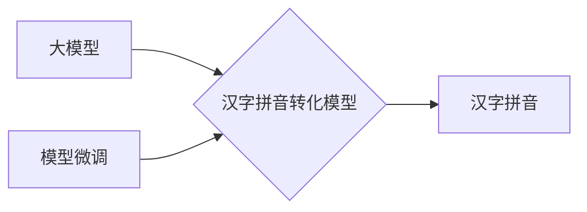

# 从零开始大模型开发与微调：汉字拼音转化模型的确定

作者：禅与计算机程序设计艺术

## 1. 背景介绍

### 1.1 汉字拼音转化的重要性

汉字作为世界上使用人数最多的文字之一，其拼音方案对于中文信息处理、语音识别、机器翻译等领域具有至关重要的作用。汉字拼音转化是将汉字转换为其对应的拼音表示，是中文信息处理的基础工作之一。

### 1.2 大模型时代的拼音转化

近年来，随着深度学习技术的快速发展，大规模预训练语言模型（简称“大模型”）在自然语言处理领域取得了显著的成果。大模型通过海量文本数据的训练，能够学习到丰富的语言知识，并具备强大的泛化能力。将大模型应用于汉字拼音转化任务，可以有效提升拼音转化的准确率和效率。

### 1.3 本文目标

本文旨在介绍如何从零开始开发和微调一个基于大模型的汉字拼音转化模型。文章将涵盖以下内容：

* 核心概念与联系
* 核心算法原理及操作步骤
* 数学模型和公式详细讲解
* 项目实践：代码实例和详细解释
* 实际应用场景
* 工具和资源推荐
* 总结：未来发展趋势与挑战
* 附录：常见问题与解答

## 2. 核心概念与联系

### 2.1 大模型

大模型是指基于深度学习技术训练的、包含大量参数的语言模型。这些模型通常在海量文本数据上进行训练，能够学习到丰富的语言知识，并具备强大的泛化能力。常见的预训练语言模型包括 BERT、GPT-3、XLNet 等。

### 2.2 汉字拼音

汉字拼音是汉字的拉丁字母拼写方案，用于标注汉字的读音。常见的汉语拼音方案包括：

* 汉语拼音方案（Hanyu Pinyin）：中国大陆的标准拼音方案
* 通用拼音（Tongyong Pinyin）：台湾地区的拼音方案
* 威妥玛拼音（Wade-Giles）：历史上常用的拼音方案

### 2.3 模型微调

模型微调是指在预训练模型的基础上，针对特定任务进行进一步训练的过程。通过微调，可以将预训练模型的知识迁移到特定任务中，提升模型的性能。

### 2.4 核心概念联系图



## 3. 核心算法原理具体操作步骤

### 3.1 数据准备

#### 3.1.1 数据集选择

选择合适的汉字拼音数据集是模型训练的关键。常用的数据集包括：

* **THCHS30**: 清华大学语音与语言技术中心发布的中文语音数据集，包含约30小时的语音数据及对应的文本标注。
* **AISHELL-1**: 上海交通大学发布的中文语音数据集，包含约178小时的语音数据及对应的文本标注。
* **Mozilla Common Voice**: Mozilla 基金会发布的开源语音数据集，包含多种语言的语音数据及对应的文本标注。

#### 3.1.2 数据预处理

对原始数据进行预处理，包括：

* **文本清洗**: 去除文本中的特殊字符、标点符号等。
* **分词**: 将文本切分成单个词语。
* **拼音标注**: 为每个汉字标注其对应的拼音。
* **数据划分**: 将数据集划分为训练集、验证集和测试集。

### 3.2 模型选择

#### 3.2.1 预训练模型选择

选择合适的预训练模型作为基础模型，例如 BERT、GPT-2 等。

#### 3.2.2 模型结构调整

根据任务需求，对预训练模型的结构进行调整，例如添加新的层、修改激活函数等。

### 3.3 模型训练

#### 3.3.1 损失函数选择

选择合适的损失函数来衡量模型预测结果与真实标签之间的差异，例如交叉熵损失函数。

#### 3.3.2 优化器选择

选择合适的优化器来更新模型参数，例如 Adam 优化器。

#### 3.3.3 训练参数设置

设置训练参数，例如学习率、批大小、训练轮数等。

### 3.4 模型评估

#### 3.4.1 评估指标选择

选择合适的评估指标来衡量模型性能，例如准确率、召回率、F1 值等。

#### 3.4.2 模型测试

使用测试集对训练好的模型进行测试，评估模型的泛化能力。

### 3.5 模型微调

#### 3.5.1 数据增强

使用数据增强技术扩充训练数据集，例如同义词替换、随机插入、随机删除等。

#### 3.5.2 超参数调整

调整模型的超参数，例如学习率、批大小等，以提升模型性能。

## 4. 数学模型和公式详细讲解举例说明

### 4.1  Transformer 模型

Transformer 模型是近年来自然语言处理领域最成功的模型之一，其核心是自注意力机制。自注意力机制能够捕捉句子中不同位置词语之间的依赖关系，从而提升模型对句子语义的理解能力。

#### 4.1.1 自注意力机制

自注意力机制的计算公式如下：

$$
Attention(Q, K, V) = softmax(\frac{QK^T}{\sqrt{d_k}})V
$$

其中：

* $Q$：查询矩阵
* $K$：键矩阵
* $V$：值矩阵
* $d_k$：键矩阵的维度

#### 4.1.2 Transformer 模型结构

Transformer 模型由编码器和解码器组成，编码器负责将输入序列编码成隐藏状态，解码器负责根据隐藏状态生成输出序列。

### 4.2  BERT 模型

BERT 模型是一种基于 Transformer 的预训练语言模型，其在自然语言处理任务中取得了显著的成果。

#### 4.2.1 BERT 模型结构

BERT 模型的编码器由多个 Transformer 编码器层堆叠而成，每个编码器层包含自注意力机制和前馈神经网络。

#### 4.2.2 BERT 模型预训练任务

BERT 模型的预训练任务包括：

* **掩码语言模型（Masked Language Model，MLM）**: 随机掩盖输入序列中的一部分词语，并训练模型预测被掩盖的词语。
* **下一句预测（Next Sentence Prediction，NSP）**: 训练模型判断两个句子是否是连续的。

## 5. 项目实践：代码实例和详细解释说明

### 5.1  环境搭建

#### 5.1.1 Python 环境安装

安装 Python 3.7 或更高版本。

#### 5.1.2  相关库安装

```python
pip install transformers datasets
```

### 5.2 数据加载

```python
from datasets import load_dataset

# 加载 THCHS30 数据集
dataset = load_dataset("thchs30")
```

### 5.3 模型构建

```python
from transformers import AutoModelForSeq2SeqLM

# 加载预训练模型
model = AutoModelForSeq2SeqLM.from_pretrained("bert-base-chinese")
```

### 5.4 模型训练

```python
from transformers import Seq2SeqTrainer, Seq2SeqTrainingArguments

# 定义训练参数
training_args = Seq2SeqTrainingArguments(
    output_dir="./results",
    per_device_train_batch_size=8,
    per_device_eval_batch_size=8,
    learning_rate=2e-5,
    num_train_epochs=3,
)

# 创建训练器
trainer = Seq2SeqTrainer(
    model=model,
    args=training_args,
    train_dataset=dataset["train"],
    eval_dataset=dataset["validation"],
)

# 开始训练
trainer.train()
```

### 5.5 模型评估

```python
# 使用测试集评估模型
results = trainer.evaluate(dataset["test"])

# 打印评估结果
print(results)
```

## 6. 实际应用场景

### 6.1 语音识别

汉字拼音转化模型可以用于语音识别系统的声学模型，将语音信号转换为对应的拼音序列。

### 6.2 机器翻译

汉字拼音转化模型可以用于机器翻译系统的预处理步骤，将源语言的汉字转换为拼音，以便于后续的翻译过程。

### 6.3 中文信息处理

汉字拼音转化模型可以用于中文信息处理的各个环节，例如中文分词、词性标注、命名实体识别等。

## 7. 工具和资源推荐

### 7.1 Hugging Face Transformers

Hugging Face Transformers 是一个开源的自然语言处理库，提供了丰富的预训练模型和工具，可以方便地进行模型训练和微调。

### 7.2 Datasets

Datasets 是一个开源的 Python 库，提供了方便的数据集加载和处理功能。

## 8. 总结：未来发展趋势与挑战

### 8.1 未来发展趋势

* **更大规模的预训练模型**: 随着计算能力的提升，未来将会出现更大规模的预训练模型，这些模型能够学习到更丰富的语言知识，并具备更强大的泛化能力。
* **多模态预训练**: 将文本、语音、图像等多种模态数据融合到预训练模型中，可以提升模型对语言的理解能力和生成能力。
* **个性化定制**:  根据用户需求，定制个性化的汉字拼音转化模型，以满足不同场景下的应用需求。

### 8.2 面临的挑战

* **数据稀缺**: 汉字拼音转化任务需要大量的标注数据，而高质量的标注数据获取成本较高。
* **模型泛化能力**:  模型的泛化能力是衡量其性能的重要指标，如何提升模型的泛化能力是未来研究的重点。
* **计算资源限制**:  大规模预训练模型的训练需要大量的计算资源，如何高效地利用计算资源是未来研究的挑战。


## 9. 附录：常见问题与解答

### 9.1  如何选择合适的预训练模型？

选择预训练模型需要考虑以下因素：

* **任务需求**:  不同的预训练模型适用于不同的任务，例如 BERT 模型适用于文本分类、问答等任务，GPT-2 模型适用于文本生成任务。
* **模型规模**:  模型规模越大，其学习到的语言知识越丰富，但训练成本也越高。
* **计算资源**:  选择与可用计算资源相匹配的预训练模型。

### 9.2  如何提升模型的泛化能力？

提升模型泛化能力的方法包括：

* **数据增强**:  使用数据增强技术扩充训练数据集，例如同义词替换、随机插入、随机删除等。
* **正则化**:  使用正则化技术防止模型过拟合，例如 L1 正则化、L2 正则化等。
* **Dropout**:  在训练过程中随机丢弃一部分神经元，可以提升模型的鲁棒性。

### 9.3  如何解决数据稀缺问题？

解决数据稀缺问题的方法包括：

* **数据合成**:  使用规则或模型生成人工数据，例如使用拼音输入法生成拼音标注数据。
* **迁移学习**:  将其他任务上的标注数据迁移到汉字拼音转化任务中。
* **主动学习**:  利用模型主动选择需要标注的数据，以提升标注效率。 
