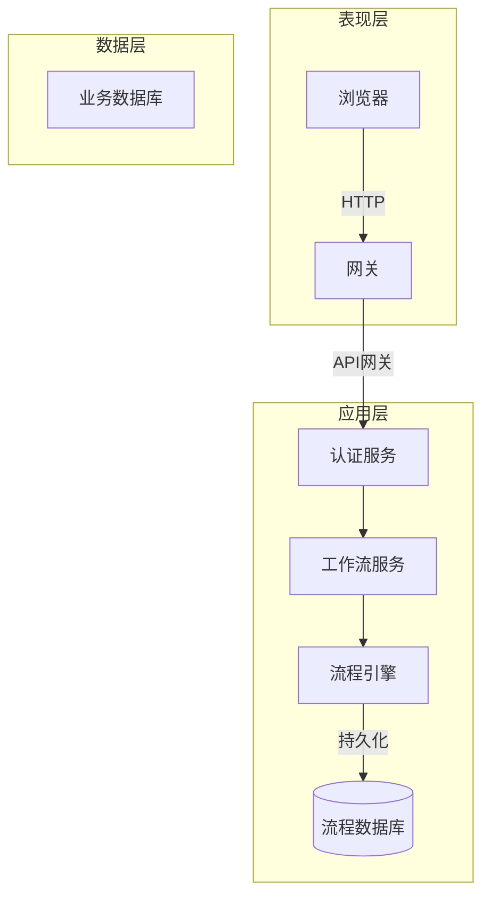

# 企业网上办公自动化系统的设计与实现

## 1.背景介绍

### 1.1 企业网上办公自动化系统的需求

在当今快节奏的商业环境中，企业需要高效、流畅的工作流程来提高生产力和竞争力。传统的纸质办公模式已经无法满足现代企业的需求,网上办公自动化系统应运而生。网上办公自动化系统使企业能够实现无纸化办公,提高工作效率,降低运营成本,优化业务流程。

### 1.2 系统目标

企业网上办公自动化系统的主要目标包括:

- 实现办公自动化,消除重复性手工劳动
- 实现信息流转电子化,无纸化办公
- 构建统一的企业信息平台
- 提高工作效率,降低运营成本 
- 实现业务流程的优化和标准化
- 加强企业内部的沟通与协作

## 2.核心概念与联系

### 2.1 办公自动化(OA)

办公自动化是指应用现代信息技术手段,自动化处理各种事务性工作,实现无纸化办公的过程。OA系统集成了文件管理、流程管理、协同办公等功能模块。

### 2.2 工作流(Workflow)

工作流指在计算机网络环境下,将构成一个业务过程的分散活动按某种预定规则自动传递的技术。工作流是OA系统的核心,规定了文件在组织中的传递路线。

### 2.3 协同办公(Groupware)

协同办公是多人利用计算机网络共同处理某些工作的手段和方法。它为分散的工作小组提供协作平台,实现信息共享和交互式通信。

### 2.4 系统架构

企业OA系统一般采用B/S或C/S架构,其中:

- B/S: 浏览器/服务器模式,用户通过网络浏览器访问
- C/S: 客户端/服务器模式,需安装专用客户端软件

## 3.核心算法原理具体操作步骤  

### 3.1 工作流引擎

工作流引擎是OA系统的核心部分,负责执行和控制工作流程。它的主要功能包括:

1. **流程定义**: 根据企业业务需求,设计工作流程模型
2. **流程实例化**: 根据流程模型启动具体的工作流实例
3. **任务分派**: 将工作流程中的活动分派给执行者
4. **跟踪监控**: 跟踪流程实例的执行状况,监控流程数据
5. **流程干预**: 支持对运行中的流程实例进行干预,如终止、回退等

工作流引擎一般采用下列算法处理工作流:

1. **状态机模型**
    - 将流程定义为有限状态机
    - 节点表示状态,边表示状态转移条件
    - 根据当前状态和事件决定下一状态
2. **基于规则的推理**
    - 将流程规则形式化为规则库 
    - 通过规则推理决定下一步执行流程
3. **Petri网模型**
    - 使用Petri网对工作流建模
    - 利用Petri网执行语义执行流程

### 3.2 工作流模型

工作流模型定义了业务活动在组织内的传递路线。常用的工作流模型包括:

1. **序列模型**: 活动按顺序执行
2. **并行模型**: 并行分支执行多个活动
3. **条件模型**: 根据条件决定执行路径
4. **循环模型**: 循环执行某个活动
5. **网状模型**: 组合以上多种模型

### 3.3 工作流实例化

工作流实例化过程如下:

1. 发起者提交申请,创建新的流程实例
2. 工作流引擎获取流程定义
3. 根据流程定义,为第一个活动分派任务
4. 分派给执行者,等待其响应
5. 执行者完成任务,引擎更新状态
6. 重复3-5,直至流程完成

## 4. 数学模型和公式详细讲解举例说明

在工作流模型和执行中,经常需要使用数学模型对流程进行形式化描述、验证和优化。

### 4.1 Petri网模型

Petri网是一种数学模型,广泛用于对系统进行建模和分析。对于工作流,Petri网能够自然描述并行、选择、同步和资源共享等控制流特征。

Petri网由四元组组成: 

$$
PN = (P, T, F, W)
$$

其中:

- $P$ 是有限置换集合
- $T$ 是有限转换集合 
- $F \subseteq (P \times T) \cup (T \times P)$ 是流关系
- $W: F \rightarrow \{1,2,3,...\}$ 是权函数

用数学语言描述Petri网的动态特性:

- 可触发: $\bullet t = \{p | (p,t) \in F\}$
- 后置: $t \bullet = \{p | (t,p) \in F\}$
- 标识: $M: P \rightarrow \mathbb{N}$

转换发射规则:

$$
M' = M - \bullet t + t \bullet, \quad \text{iff } \forall p \in \bullet t, M(p) \geq W(p,t)
$$

通过构造合适的Petri网模型,并对其进行分析,可以验证工作流的正确性和无阻塞性。

### 4.2 时间网模型

为了对工作流的时间特性进行建模,可以使用时间Petri网或时间工作流网。在这些模型中,每个节点和弧都关联有时间属性,用以描述持续时间和时间限制。

设$PN = (P, T, F, W, \phi)$是时间Petri网,其中$\phi$是时间映射函数:

- $\forall t \in T, \phi(t) = [\alpha, \beta]$表示最小和最大服务时间
- $\forall p \in P, \phi(p) = \gamma$表示在p处的最长等待时间

在这个模型下,可以进行时间分析,计算关键路径、周期时间等,用于工作流的时间约束验证和优化调度。

### 4.3 资源模型

工作流中的活动需要消耗资源,如人力、设备等。资源管理对于优化资源利用、缩短流程时间至关重要。

设$R = \{r_1, r_2, ..., r_n\}$是资源集合,每个$r_i$有对应的可用数量。令$\rho: T \rightarrow 2^R$为资源分配函数,对每个$t \in T$分配所需资源。

在执行时,转换$t$只有当$\forall r \in \rho(t), available(r) > 0$时才能发射。发射后,对应资源数量将更新。

通过对资源模型的分析,可以发现资源冲突、瓶颈等问题,从而优化资源分配策略。

## 4. 项目实践:代码实例和详细解释说明

为了展示企业OA系统的实现细节,这里给出一个使用Java Spring框架开发的简单OA系统示例。

### 4.1 系统架构



系统采用微服务架构,包括:

- 网关层: 统一入口,处理HTTP请求
- 认证服务: 实现用户认证和权限管理
- 工作流服务: 处理工作流相关功能
- 流程引擎: 工作流核心,执行流程实例
- 数据层: 流程数据和业务数据存储

### 4.2 工作流引擎实现

```java
// 流程定义
@Data
public class ProcessDefinition {
    private String id;
    private List<ActivityDefinition> activities;
    // ...
}

// 活动定义
@Data
public class ActivityDefinition {
    private String id;
    private ActivityType type; 
    private List<TransitionDefinition> transitions;
    // ...
}

// 流程实例
@Data
public class ProcessInstance {
    private String id;
    private ProcessDefinition definition;
    private List<ActivityInstance> activities;
    // ...
}

// 活动实例 
@Data
public class ActivityInstance {
    private String id;
    private ActivityDefinition definition;
    private ActivityStatus status;
    // ...
}

// 流程引擎
@Service
public class ProcessEngine {

    public ProcessInstance startProcess(ProcessDefinition def) {
        ProcessInstance instance = new ProcessInstance(def);
        ActivityInstance startNode = createActivityInstance(def.getStartActivity());
        instance.addActivity(startNode);
        return instance;
    }
    
    public void completeActivity(ActivityInstance activity) {
        ProcessInstance instance = activity.getProcessInstance();
        List<TransitionDefinition> transitions = activity.getDefinition().getTransitions();
        for(TransitionDefinition t : transitions) {
            if(t.getCondition().evaluate(instance.getContext())) {
                ActivityInstance nextActivity = createActivityInstance(t.getTarget());
                instance.addActivity(nextActivity);
            }
        }
    }
    
    // ...
}
```

上面是流程引擎的核心代码,包括:

- `ProcessDefinition`: 流程定义模型
- `ActivityDefinition`: 活动定义模型
- `ProcessInstance`: 流程实例
- `ActivityInstance`: 活动实例
- `ProcessEngine`: 负责流程实例化、执行控制等

在`startProcess`中创建新流程实例,并为起始节点创建活动实例。`completeActivity`根据流程定义和上下文决定下一步活动。

### 4.3 工作流服务

```java
@Service
public class WorkflowService {

    @Autowired
    private ProcessEngine engine;
    
    @Autowired 
    private ProcessRepository repository;

    public String startProcess(String processId, Map<String,Object> variables) {
        ProcessDefinition def = repository.getDefinition(processId);
        ProcessInstance instance = engine.startProcess(def);
        instance.setVariables(variables);
        repository.saveInstance(instance);
        return instance.getId();
    }
    
    public void completeTask(String taskId, Map<String,Object> variables) {
        ProcessInstance instance = repository.getInstance(taskId);
        ActivityInstance activity = instance.getActiveActivities().get(0);
        activity.setVariables(variables);
        engine.completeActivity(activity);
        repository.updateInstance(instance);
    }

    // ...
}
```

`WorkflowService`封装了对流程引擎的操作,如启动流程、完成任务等,并与持久层进行交互。

### 4.4 持久层

```java
@Repository 
public class ProcessRepository {
    
    @Autowired
    private ProcessDefinitionMapper defMapper;
    
    @Autowired 
    private ProcessInstanceMapper instanceMapper;
    
    public ProcessDefinition getDefinition(String id) {
        return defMapper.selectById(id);
    }
    
    public void saveInstance(ProcessInstance instance) {
        instanceMapper.insert(instance);
    }
    
    public ProcessInstance getInstance(String id) {
        return instanceMapper.selectById(id);
    }
    
    public void updateInstance(ProcessInstance instance) {
        instanceMapper.update(instance);
    }
}
```

`ProcessRepository`通过数据访问层将流程定义和实例持久化到数据库中。

上面只是系统的一个非常简单的实现示例,真实的企业OA系统会更加复杂,需要处理各种边缘案例和非功能性需求。但总体上,其架构和核心模块都会类似于这个例子。

## 5. 实际应用场景

企业网上办公自动化系统可以应用于各种场景,下面列举几个典型例子:

### 5.1 审批流程自动化

包括费用报销、请假审批、采购审批等各类审批流程,这些传统上依赖手工处理的流程通过OA系统可以自动化完成,提高效率。

### 5.2 文件管理自动化 

包括合同、报告等各类文件的编制、审核、归档等流程,都可以通过OA系统自动化完成,实现文件的规范化管理。

### 5.3 客户服务自动化

客户咨询、投诉处理等服务流程,OA系统可以自动分派任务、监控进度、确保服务质量。

### 5.4 项目管理自动化

对于各类项目,OA系统可以自动化项目流程,统一管理任务、进度、资源等,实现可视化的项目管控。

### 5.5 知识管理自动化

OA系统可以作为知识库,存储和管理企业的各类知识资产,并对知识流转流程进行自动化。

### 5.6 供应链协同自动化

跨企业的采购、物流等供应链环节,OA系统可以实现相关流程的自动化,提高跨企业协作效率。

## 