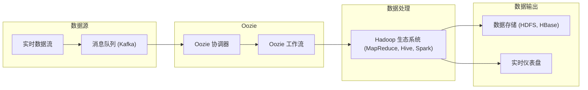

# 使用Oozie处理实时数据流

作者：禅与计算机程序设计艺术

## 1. 背景介绍

### 1.1 大数据时代的实时数据处理需求

随着互联网和物联网的快速发展，数据量呈爆炸式增长，实时数据处理需求也日益迫切。实时数据处理是指在数据产生的同时进行处理，以便及时获取有价值的信息，并做出快速反应。例如，实时监控系统需要实时分析传感器数据，以便及时发现异常情况；在线广告系统需要实时分析用户行为，以便精准投放广告。

### 1.2 Oozie在大数据生态系统中的角色

Apache Oozie是一个工作流调度系统，用于管理Hadoop生态系统中的工作流。Oozie可以用XML语言定义工作流，并将其提交到Hadoop集群中执行。Oozie支持多种工作流类型，包括MapReduce、Pig、Hive、Sqoop等，可以满足各种数据处理需求。

### 1.3 Oozie处理实时数据流的优势

Oozie可以有效地处理实时数据流，主要优势包括：

* **可靠性:** Oozie工作流运行在Hadoop集群中，具有高可靠性和容错性。
* **可扩展性:** Oozie可以轻松扩展以处理大量数据。
* **灵活性:** Oozie支持多种工作流类型，可以满足各种数据处理需求。
* **易用性:** Oozie使用XML语言定义工作流，易于理解和维护。

## 2. 核心概念与联系

### 2.1 Oozie工作流

Oozie工作流是一个由多个动作组成的有向无环图（DAG）。每个动作代表一个数据处理任务，例如MapReduce作业、Hive查询或Shell脚本。动作之间通过控制流节点连接，例如决策节点、并行节点和连接节点。

### 2.2 Oozie协调器

Oozie协调器用于定期触发工作流。协调器可以根据时间或数据可用性触发工作流。例如，可以配置协调器每天运行一次工作流，或者在某个目录中出现新数据文件时触发工作流。

### 2.3 Oozie Bundle

Oozie Bundle用于将多个协调器组合在一起。Bundle可以定义协调器之间的依赖关系，并控制它们的执行顺序。例如，可以定义一个Bundle，其中包含每天运行的协调器和每周运行的协调器，并指定每天运行的协调器必须在每周运行的协调器之前完成。

## 3. 核心算法原理具体操作步骤

### 3.1 使用Oozie处理实时数据流的步骤

使用Oozie处理实时数据流的步骤如下：

1. **定义工作流:** 使用XML语言定义工作流，包括数据输入、数据处理和数据输出。
2. **配置协调器:** 配置协调器，以定期触发工作流。
3. **创建Bundle:** (可选) 创建Bundle，以组合多个协调器。
4. **提交工作流:** 将工作流提交到Oozie服务器。
5. **监控工作流:** 监控工作流的执行情况，并根据需要进行调整。

### 3.2 实时数据流处理的典型架构

实时数据流处理的典型架构如下：



* 数据源: 实时数据流可以来自各种来源，例如传感器、日志文件和社交媒体。
* 消息队列: 消息队列用于缓冲实时数据流，并将其传递给Oozie工作流。
* Oozie: Oozie协调器定期触发工作流，Oozie工作流执行数据处理任务。
* 数据处理: Hadoop生态系统提供了各种数据处理工具，例如MapReduce、Hive和Spark。
* 数据输出: 处理后的数据可以存储在HDFS、HBase等数据存储中，或者显示在实时仪表盘上。

## 4. 数学模型和公式详细讲解举例说明

### 4.1 数据流速率

数据流速率是指单位时间内处理的数据量。数据流速率可以用以下公式计算：

```
数据流速率 = 数据量 / 时间
```

例如，如果一个数据流每秒钟产生1000条记录，则数据流速率为1000条记录/秒。

### 4.2 数据延迟

数据延迟是指数据从产生到被处理的时间间隔。数据延迟可以用以下公式计算：

```
数据延迟 = 处理时间 - 产生时间
```

例如，如果一条记录在10:00:00产生，并在10:00:05被处理，则数据延迟为5秒。

### 4.3 数据吞吐量

数据吞吐量是指单位时间内处理的数据量。数据吞吐量可以用以下公式计算：

```
数据吞吐量 = 数据量 / 处理时间
```

例如，如果一个工作流在1分钟内处理了100万条记录，则数据吞吐量为100万条记录/分钟。

## 5. 项目实践：代码实例和详细解释说明

### 5.1 示例工作流

以下是一个使用Oozie处理实时数据流的示例工作流：

```xml
<workflow-app name="real-time-data-processing" xmlns="uri:oozie:workflow:0.1">
    <start to="fork"/>
    <fork name="fork">
        <path start="kafka-to-hdfs"/>
        <path start="hdfs-to-hive"/>
    </fork>
    <action name="kafka-to-hdfs">
        <java>
            <job-tracker>${jobTracker}</job-tracker>
            <name-node>${nameNode}</name-node>
            <main-class>com.example.KafkaToHdfs</main-class>
            <arg>${kafkaBroker}</arg>
            <arg>${kafkaTopic}</arg>
            <arg>${hdfsPath}</arg>
        </java>
        <ok to="join"/>
        <error to="fail"/>
    </action>
    <action name="hdfs-to-hive">
        <hive>
            <job-tracker>${jobTracker}</job-tracker>
            <name-node>${nameNode}</name-node>
            <script>${hiveScript}</script>
        </hive>
        <ok to="join"/>
        <error to="fail"/>
    </action>
    <join name="join" to="end"/>
    <kill name="fail">
        <message>Workflow failed, error message[${wf:errorMessage(wf:lastErrorNode())}]</message>
    </kill>
    <end name="end"/>
</workflow-app>
```

该工作流包含两个动作：

* `kafka-to-hdfs`: 该动作从Kafka主题读取数据，并将其写入HDFS。
* `hdfs-to-hive`: 该动作从HDFS读取数据，并将其加载到Hive表中。

### 5.2 代码解释

* `workflow-app`: 定义工作流的根元素。
* `start`: 定义工作流的起始节点。
* `fork`: 定义并行执行路径的节点。
* `action`: 定义数据处理任务的节点。
* `java`: 执行Java程序的动作。
* `hive`: 执行Hive脚本的动作。
* `join`: 合并并行执行路径的节点。
* `kill`: 终止工作流的节点。
* `end`: 定义工作流的结束节点。

## 6. 实际应用场景

### 6.1 实时日志分析

Oozie可以用于实时分析日志数据，以便及时发现系统问题和安全威胁。例如，可以使用Oozie工作流从Kafka主题读取日志数据，并将其写入HDFS。然后，可以使用Hive查询分析日志数据，并生成实时仪表盘。

### 6.2 实时欺诈检测

Oozie可以用于实时检测欺诈行为，以便及时采取措施防止损失。例如，可以使用Oozie工作流从Kafka主题读取交易数据，并将其写入HDFS。然后，可以使用机器学习算法分析交易数据，并识别潜在的欺诈行为。

### 6.3 实时推荐系统

Oozie可以用于构建实时推荐系统，以便为用户提供个性化推荐。例如，可以使用Oozie工作流从Kafka主题读取用户行为数据，并将其写入HDFS。然后，可以使用协同过滤算法分析用户行为数据，并生成实时推荐列表。

## 7. 工具和资源推荐

### 7.1 Apache Oozie

Apache Oozie是官方的Oozie网站，提供了Oozie的文档、下载和支持信息。

### 7.2 Cloudera Manager

Cloudera Manager是一个Hadoop集群管理工具，可以简化Oozie的部署和管理。

### 7.3 Hortonworks Data Platform

Hortonworks Data Platform (HDP)是一个Hadoop发行版，包含Oozie和其他大数据工具。

## 8. 总结：未来发展趋势与挑战

### 8.1 未来发展趋势

* **云原生 Oozie:** 将Oozie迁移到云平台，以利用云计算的优势，例如弹性和按需定价。
* **容器化 Oozie:** 使用容器技术部署和管理Oozie，以提高可移植性和可扩展性。
* **机器学习与 Oozie 的集成:** 将机器学习算法集成到Oozie工作流中，以实现更智能的数据处理。

### 8.2 挑战

* **实时数据处理的复杂性:** 实时数据处理涉及多个组件，需要仔细协调和管理。
* **数据质量和一致性:** 确保实时数据流的质量和一致性至关重要。
* **安全性:** 保护实时数据流的安全性至关重要。

## 9. 附录：常见问题与解答

### 9.1 如何配置 Oozie 协调器？

可以使用XML文件配置Oozie协调器。协调器配置文件包含以下信息：

* 工作流名称
* 触发频率
* 数据可用性检查
* 其他参数

### 9.2 如何监控 Oozie 工作流？

可以使用Oozie Web UI或命令行工具监控Oozie工作流。Oozie Web UI提供了一个图形界面，可以查看工作流的执行状态、日志和统计信息。命令行工具可以用于查询工作流的状态、提交工作流和终止工作流。

### 9.3 如何解决 Oozie 工作流错误？

Oozie工作流错误的常见原因包括：

* 配置错误
* 代码错误
* 数据错误

可以使用Oozie Web UI或命令行工具查看工作流日志，以确定错误原因。然后，可以修改工作流配置或代码以解决错误。
