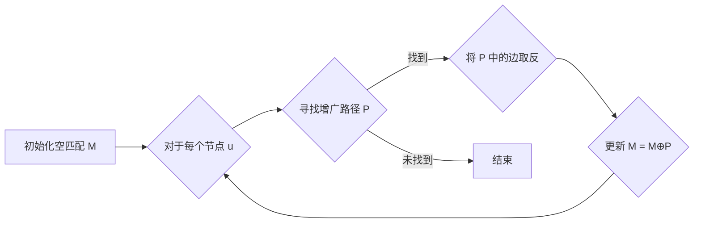
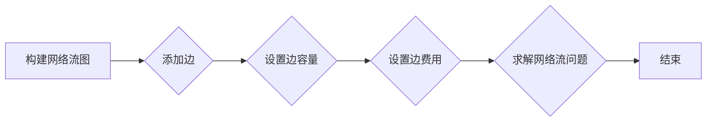

## 1. 背景介绍

### 1.1 匹配问题的本质

匹配问题是计算机科学和运筹学中的经典问题之一，其本质是将两个集合中的元素以最优的方式进行配对。这个问题在现实生活中有着广泛的应用，例如：

* **人员分配:** 将员工分配到不同的项目或任务，以最大化整体效率。
* **资源调度:** 将有限的资源（如服务器、带宽、车辆）分配给不同的任务，以满足需求并优化资源利用率。
* **约会网站:** 将用户根据其偏好和特点进行匹配，以提高配对成功率。
* **物流运输:** 将货物与运输工具进行匹配，以最小化运输成本和时间。

### 1.2 匹配问题的分类

根据问题的具体约束条件和目标函数，匹配问题可以分为多种类型，例如：

* **二分图匹配:** 两个集合中的元素只能进行一对一匹配，例如人员分配问题。
* **多重匹配:** 两个集合中的元素可以进行多对多匹配，例如资源调度问题。
* **带权匹配:** 每个匹配对都有一个权重，目标是找到权重总和最大或最小的匹配方案，例如约会网站的匹配问题。

### 1.3 匹配问题解决方法

解决匹配问题的方法有很多种，其中最常用的方法包括：

* **匈牙利算法:** 用于解决二分图匹配问题，时间复杂度为 $O(n^3)$，其中 n 为节点数量。
* **网络流算法:** 用于解决更一般的匹配问题，包括多重匹配和带权匹配，时间复杂度取决于具体的算法和网络结构。
* **线性规划:** 可以将匹配问题转化为线性规划问题，并使用线性规划求解器进行求解。

## 2. 核心概念与联系

### 2.1 二分图

二分图是指可以将图中的节点分成两个不相交的集合，且集合内部的节点之间没有边连接的图。在匹配问题中，二分图通常用于表示两个需要进行匹配的集合。

### 2.2 匹配

匹配是指二分图中边的集合，且该集合中的边没有公共节点。也就是说，每个节点最多只能与另一集合中的一个节点相连。

### 2.3 最大匹配

最大匹配是指二分图中包含边数最多的匹配。最大匹配问题旨在找到二分图中的最大匹配。

### 2.4 完备匹配

完备匹配是指二分图中每个节点都参与匹配的匹配。完备匹配问题旨在判断二分图是否存在完备匹配，以及如何找到完备匹配。

### 2.5 权重

在带权匹配问题中，每个匹配对都有一个权重，表示该匹配的成本或收益。目标是找到权重总和最大或最小的匹配方案。

## 3. 核心算法原理具体操作步骤

### 3.1 匈牙利算法

匈牙利算法是解决二分图最大匹配问题的经典算法，其基本思想是不断寻找增广路径，并通过增广路径来扩大匹配规模。

**算法步骤:**

1. 初始化一个空匹配 M。
2. 对于二分图中的每个节点 u，执行以下操作：
    * 寻找一条从 u 出发的增广路径 P。
    * 如果找到增广路径 P，则将 P 中的边取反，并将 M 更新为 M⊕P，其中 ⊕ 表示异或操作。
3. 重复步骤 2，直到找不到增广路径为止。

**增广路径:**

增广路径是指一条从非匹配点出发，经过非匹配边和匹配边交替连接，最终到达另一个非匹配点的路径。

**算法流程图:**



### 3.2 网络流算法

网络流算法可以用于解决更一般的匹配问题，包括多重匹配和带权匹配。其基本思想是将匹配问题转化为网络流问题，并使用网络流算法求解。

**算法步骤:**

1. 构建一个网络流图，其中源点 s 连接二分图左侧集合中的所有节点，汇点 t 连接二分图右侧集合中的所有节点。
2. 对于二分图中的每条边 (u, v)，在网络流图中添加一条从 u 到 v 的边，容量为 1。
3. 对于带权匹配问题，将边的权重作为网络流图中边的费用。
4. 使用最大流算法或最小费用最大流算法求解网络流问题。
5. 网络流图中的最大流或最小费用最大流对应匹配问题的最大匹配或最小权重最大匹配。

**算法流程图:**



## 4. 数学模型和公式详细讲解举例说明

### 4.1 二分图最大匹配的数学模型

二分图最大匹配问题可以表示为以下整数线性规划问题：

$$
\begin{aligned}
\max & \sum_{e \in E} x_e \\
\text{s.t.} & \sum_{e \in \delta(v)} x_e \leq 1, \forall v \in V \\
& x_e \in \{0, 1\}, \forall e \in E
\end{aligned}
$$

其中：

* $E$ 表示二分图的边集。
* $V$ 表示二分图的节点集。
* $x_e$ 表示边 $e$ 是否被选中，取值为 0 或 1。
* $\delta(v)$ 表示与节点 $v$ 相邻的边的集合。

### 4.2 匈牙利算法的数学原理

匈牙利算法的数学原理基于以下定理：

**Berge's Theorem:**

二分图中存在一个匹配 M 是最大匹配，当且仅当图中不存在 M 的增广路径。

### 4.3 举例说明

**问题:** 

假设有 4 个工人和 4 个任务，每个工人只能完成一项任务，每个任务只能由一个工人完成。工人与任务之间的匹配关系如下表所示：

| 工人 | 任务 |
|---|---|
| A | 1, 2 |
| B | 2, 3 |
| C | 3, 4 |
| D | 4 |

**求解:**

1. 构建二分图，左侧节点表示工人，右侧节点表示任务，边表示工人可以完成的任务。

2. 使用匈牙利算法求解最大匹配。

3. 最大匹配结果为 {(A, 1), (B, 3), (C, 4), (D, 2)}。

## 5. 项目实践：代码实例和详细解释说明

### 5.1 Python 代码实现匈牙利算法

```python
def hungarian_algorithm(graph):
    """
    匈牙利算法求解二分图最大匹配

    Args:
        graph: 二分图，表示为邻接矩阵

    Returns:
        匹配结果，表示为边的列表
    """
    n = len(graph)
    match = [-1] * n
    visited = [False] * n

    def dfs(u):
        """
        深度优先搜索寻找增广路径

        Args:
            u: 当前节点

        Returns:
            是否存在增广路径
        """
        visited[u] = True
        for v in range(n):
            if graph[u][v] and not visited[v]:
                visited[v] = True
                if match[v] == -1 or dfs(match[v]):
                    match[v] = u
                    return True
        return False

    for i in range(n):
        visited = [False] * n
        dfs(i)

    matching = []
    for i in range(n):
        if match[i] != -1:
            matching.append((match[i], i))

    return matching
```

### 5.2 代码解释

* `hungarian_algorithm(graph)` 函数接收一个二分图的邻接矩阵作为输入，返回最大匹配结果。
* `match` 列表存储每个节点的匹配节点，初始值为 -1，表示未匹配。
* `visited` 列表用于标记节点是否被访问过，避免重复搜索。
* `dfs(u)` 函数使用深度优先搜索寻找增广路径，如果找到增广路径，则返回 True，否则返回 False。
* 循环遍历所有节点，调用 `dfs(i)` 函数寻找增广路径，并更新 `match` 列表。
* 最后，根据 `match` 列表构建匹配结果，并返回。

## 6. 实际应用场景

### 6.1 人员分配

在企业管理中，人员分配是一个常见的应用场景。例如，将员工分配到不同的项目或任务，以最大化整体效率。可以使用匈牙利算法或网络流算法来解决人员分配问题。

**示例:**

假设一家公司有 5 名员工和 5 个项目，每个员工只能参与一个项目，每个项目只能由一个员工负责。员工与项目之间的匹配关系如下表所示：

| 员工 | 项目 |
|---|---|
| A | 1, 2 |
| B | 2, 3 |
| C | 3, 4 |
| D | 4, 5 |
| E | 5 |

可以使用匈牙利算法找到最大匹配，将员工分配到合适的项目中。

### 6.2 资源调度

在云计算、物流运输等领域，资源调度也是一个重要的应用场景。例如，将有限的服务器、带宽、车辆等资源分配给不同的任务，以满足需求并优化资源利用率。可以使用网络流算法来解决资源调度问题。

**示例:**

假设一个物流公司有 3 辆卡车和 5 个货物，每个货物只能由一辆卡车运输，每辆卡车可以运输多个货物。货物与卡车之间的匹配关系如下表所示：

| 货物 | 卡车 |
|---|---|
| 1 | A, B |
| 2 | B, C |
| 3 | A, C |
| 4 | B |
| 5 | C |

可以使用网络流算法找到最大匹配，将货物分配到合适的卡车上。

## 7. 工具和资源推荐

### 7.1 NetworkX

NetworkX 是一个 Python 库，用于创建、操作和研究复杂网络的结构、动态和功能。它提供了丰富的函数用于处理图和网络，包括二分图匹配和网络流算法。

### 7.2 Google OR-Tools

Google OR-Tools 是一个用于解决组合优化问题的开源软件套件，包括线性规划、整数规划、约束编程等。它提供了高效的求解器，可以用于解决匹配问题。

## 8. 总结：未来发展趋势与挑战

### 8.1 趋势

* **大规模匹配问题:** 随着数据规模的不断增长，匹配问题的规模也越来越大，需要更高效的算法和工具来解决。
* **在线匹配问题:** 在实时应用场景中，需要在线解决匹配问题，例如在线广告投放、实时交通调度等。
* **个性化匹配问题:** 为了提高匹配质量，需要考虑用户的个性化需求，例如偏好、历史行为等。

### 8.2 挑战

* **算法效率:** 对于大规模匹配问题，需要开发更高效的算法来降低计算复杂度。
* **数据质量:** 匹配结果的质量取决于数据的准确性和完整性，需要有效的数据清洗和预处理方法。
* **模型解释性:** 对于复杂匹配问题，需要提高模型的可解释性，以便用户理解匹配结果的依据。

## 9. 附录：常见问题与解答

### 9.1 什么是增广路径？

增广路径是指一条从非匹配点出发，经过非匹配边和匹配边交替连接，最终到达另一个非匹配点的路径。

### 9.2 匈牙利算法的时间复杂度是多少？

匈牙利算法的时间复杂度为 $O(n^3)$，其中 n 为节点数量。

### 9.3 网络流算法可以解决哪些类型的匹配问题？

网络流算法可以解决更一般的匹配问题，包括多重匹配和带权匹配。

### 9.4 如何选择合适的匹配算法？

选择合适的匹配算法取决于问题的具体约束条件和目标函数。对于二分图最大匹配问题，可以使用匈牙利算法；对于更一般的匹配问题，可以使用网络流算法或线性规划。
