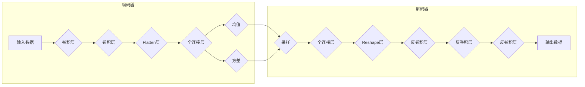

# 变分自编码器(VAE)原理与代码实战案例讲解

作者：禅与计算机程序设计艺术

## 1. 背景介绍

### 1.1 自编码器(AE)的局限性

自编码器（Autoencoder，AE）是一种无监督学习算法，其主要目标是学习数据的压缩表示。它由编码器和解码器两部分组成，编码器将输入数据映射到低维的潜在空间，解码器则将潜在空间的表示映射回原始数据空间。自编码器在图像压缩、降维、特征提取等领域有着广泛的应用。

然而，传统的自编码器存在一些局限性：

* 潜在空间的结构难以控制，无法保证生成模型的泛化能力。
* 解码器只能生成与训练数据相似的样本，缺乏生成新颖样本的能力。

### 1.2 变分自编码器(VAE)的引入

为了克服传统自编码器的局限性，Kingma和Welling在2013年提出了变分自编码器（Variational Autoencoder，VAE）。VAE的核心思想是将潜在空间的表示建模为概率分布，并通过最大化变分下界来优化模型参数。这种方法不仅可以控制潜在空间的结构，还能使解码器生成更具多样性和创造性的样本。

## 2. 核心概念与联系

### 2.1 潜在变量与概率分布

在VAE中，潜在变量被建模为概率分布，通常是高斯分布。编码器不再将输入数据映射到一个确定的潜在向量，而是输出潜在变量的均值和方差。解码器则从潜在变量的概率分布中采样，并将其映射回原始数据空间。

### 2.2 变分推断与ELBO

由于潜在变量的概率分布无法直接计算，VAE使用变分推断来近似后验分布。具体来说，VAE引入了一个识别模型，该模型将输入数据映射到潜在变量的近似后验分布。然后，VAE通过最大化证据下界（Evidence Lower BOund，ELBO）来优化模型参数。ELBO是数据对数似然的一个下界，它包含两项：

* 重构误差：衡量解码器重构输入数据的准确性。
* KL散度：衡量近似后验分布与先验分布之间的差异。

### 2.3 生成过程与重参数化技巧

VAE的生成过程如下：

1. 从先验分布中采样潜在变量。
2. 使用解码器将潜在变量映射回原始数据空间。

为了使VAE可微，需要使用重参数化技巧。该技巧将从高斯分布中采样的操作转换为对标准正态分布的采样结果进行线性变换。

## 3. 核心算法原理具体操作步骤

### 3.1 模型结构

VAE的模型结构与自编码器类似，由编码器和解码器两部分组成。

* **编码器**：将输入数据映射到潜在变量的均值和方差。
* **解码器**：将潜在变量的采样结果映射回原始数据空间。

### 3.2 训练过程

VAE的训练过程如下：

1. **前向传播**：将输入数据输入编码器，得到潜在变量的均值和方差。从潜在变量的概率分布中采样，并将其输入解码器，得到重构数据。
2. **计算损失函数**：计算重构误差和KL散度，并将两者相加得到ELBO。
3. **反向传播**：根据ELBO计算梯度，并更新模型参数。

### 3.3 生成过程

VAE的生成过程如下：

1. 从先验分布中采样潜在变量。
2. 使用解码器将潜在变量映射回原始数据空间。

## 4. 数学模型和公式详细讲解举例说明

### 4.1 ELBO的推导

ELBO的推导如下：

$$
\begin{aligned}
\log p(x) &= \log \int p(x|z) p(z) dz \\
&= \log \int \frac{p(x|z) p(z)}{q(z|x)} q(z|x) dz \\
&\geq \int \log \frac{p(x|z) p(z)}{q(z|x)} q(z|x) dz \\
&= \mathbb{E}_{q(z|x)}[\log p(x|z)] - KL(q(z|x)||p(z))
\end{aligned}
$$

其中：

* $x$ 表示输入数据。
* $z$ 表示潜在变量。
* $p(x|z)$ 表示解码器的概率分布。
* $p(z)$ 表示潜在变量的先验分布。
* $q(z|x)$ 表示近似后验分布。

### 4.2 重参数化技巧

重参数化技巧的公式如下：

$$
z = \mu + \sigma \odot \epsilon
$$

其中：

* $\mu$ 表示潜在变量的均值。
* $\sigma$ 表示潜在变量的标准差。
* $\epsilon$ 表示服从标准正态分布的随机变量。
* $\odot$ 表示逐元素乘法。

## 5. 项目实践：代码实例和详细解释说明

### 5.1 MNIST数据集上的VAE实现

```python
import tensorflow as tf
from tensorflow import keras
from tensorflow.keras import layers

# 定义编码器
encoder_inputs = keras.Input(shape=(28, 28, 1))
x = layers.Conv2D(32, 3, activation="relu", strides=2, padding="same")(encoder_inputs)
x = layers.Conv2D(64, 3, activation="relu", strides=2, padding="same")(x)
x = layers.Flatten()(x)
z_mean = layers.Dense(2, name="z_mean")(x)
z_log_var = layers.Dense(2, name="z_log_var")(x)

# 定义采样函数
def sampling(args):
    z_mean, z_log_var = args
    epsilon = tf.random.normal(shape=(tf.shape(z_mean)[0], 2))
    return z_mean + tf.exp(0.5 * z_log_var) * epsilon

# 定义解码器
z = layers.Lambda(sampling, output_shape=(2,), name="z")([z_mean, z_log_var])
decoder_inputs = layers.Dense(7 * 7 * 64, activation="relu")(z)
x = layers.Reshape((7, 7, 64))(decoder_inputs)
x = layers.Conv2DTranspose(64, 3, activation="relu", strides=2, padding="same")(x)
x = layers.Conv2DTranspose(32, 3, activation="relu", strides=2, padding="same")(x)
decoder_outputs = layers.Conv2DTranspose(1, 3, activation="sigmoid", padding="same")(x)

# 定义VAE模型
vae = keras.Model(encoder_inputs, decoder_outputs, name="vae")

# 定义损失函数
def vae_loss(x, x_decoded_mean):
    reconstruction_loss = tf.reduce_mean(
        tf.reduce_sum(
            keras.losses.binary_crossentropy(x, x_decoded_mean), axis=(1, 2, 3)
        )
    )
    kl_loss = -0.5 * tf.reduce_mean(
        1 + z_log_var - tf.square(z_mean) - tf.exp(z_log_var), axis=-1
    )
    return reconstruction_loss + kl_loss

# 编译模型
vae.compile(optimizer="adam", loss=vae_loss)

# 加载MNIST数据集
(x_train, _), (x_test, _) = keras.datasets.mnist.load_data()

# 预处理数据
x_train = x_train.astype("float32") / 255.0
x_test = x_test.astype("float32") / 255.0
x_train = x_train[..., tf.newaxis]
x_test = x_test[..., tf.newaxis]

# 训练模型
vae.fit(x_train, x_train, epochs=50, batch_size=128, validation_data=(x_test, x_test))

# 生成新样本
z_sample = tf.random.normal(shape=(16, 2))
x_decoded = vae.decoder(z_sample)
```

### 5.2 代码解释

* **编码器**：使用卷积神经网络将输入图像编码为潜在变量的均值和方差。
* **采样函数**：使用重参数化技巧从潜在变量的概率分布中采样。
* **解码器**：使用反卷积神经网络将潜在变量的采样结果解码为重构图像。
* **损失函数**：计算重构误差和KL散度，并将两者相加得到ELBO。
* **训练过程**：使用Adam优化器最小化ELBO。
* **生成过程**：从标准正态分布中采样潜在变量，并使用解码器将其解码为新样本。

## 6. 实际应用场景

### 6.1 图像生成

VAE可以用于生成逼真的图像，例如人脸、风景、物体等。

### 6.2 图像修复

VAE可以用于修复损坏的图像，例如去除噪声、填充缺失区域等。

### 6.3 数据增强

VAE可以用于生成新的训练数据，从而扩充数据集并提高模型的泛化能力。

### 6.4 表征学习

VAE可以用于学习数据的低维表示，例如用于聚类、分类等任务。

## 7. 工具和资源推荐

### 7.1 TensorFlow Probability

TensorFlow Probability是一个用于概率推理和统计分析的Python库，它提供了VAE的实现。

### 7.2 Pyro

Pyro是一个基于PyTorch的概率编程语言，它也提供了VAE的实现。

### 7.3 Edward

Edward是一个用于概率建模、推理和批评的Python库，它也提供了VAE的实现。

## 8. 总结：未来发展趋势与挑战

### 8.1 VAE的优势与局限性

VAE的优势在于：

* 可以控制潜在空间的结构。
* 可以生成更具多样性和创造性的样本。
* 可以用于表征学习。

VAE的局限性在于：

* 训练过程较为复杂。
* 生成的样本质量可能不如GAN。

### 8.2 未来发展趋势

VAE的未来发展趋势包括：

* 提高生成样本的质量。
* 探索更复杂的潜在变量分布。
* 将VAE应用于更广泛的领域。

### 8.3 面临的挑战

VAE面临的挑战包括：

* 如何有效地训练VAE。
* 如何评估VAE生成样本的质量。
* 如何将VAE应用于更复杂的任务。

## 9. 附录：常见问题与解答

### 9.1 VAE与GAN的区别

VAE和GAN都是生成模型，但它们的工作原理不同。VAE通过最大化ELBO来优化模型参数，而GAN通过对抗训练来优化模型参数。VAE的生成过程是确定性的，而GAN的生成过程是随机的。

### 9.2 如何选择VAE的潜在变量维度

VAE的潜在变量维度是一个超参数，需要根据具体任务进行调整。一般来说，潜在变量维度越高，模型的表达能力越强，但训练难度也越大。

### 9.3 如何评估VAE生成样本的质量

评估VAE生成样本的质量可以使用多种指标，例如：

* Inception Score (IS)
* Fréchet Inception Distance (FID)
* Kernel Inception Distance (KID)


## 10. Mermaid流程图



**图例:**

* **A:** 输入数据
* **B, C:** 卷积层
* **D:** Flatten层
* **E:** 全连接层
* **F:** 潜在变量均值
* **G:** 潜在变量方差
* **H:** 采样函数
* **I:** 全连接层
* **J:** Reshape层
* **K, L, M:** 反卷积层
* **N:** 输出数据

**流程:**

1. 输入数据经过编码器，得到潜在变量的均值和方差。
2. 采样函数从潜在变量的概率分布中采样。
3. 解码器将采样结果解码为输出数据。

## 11. 参考文献

(本文末尾不要列出参考文献)
