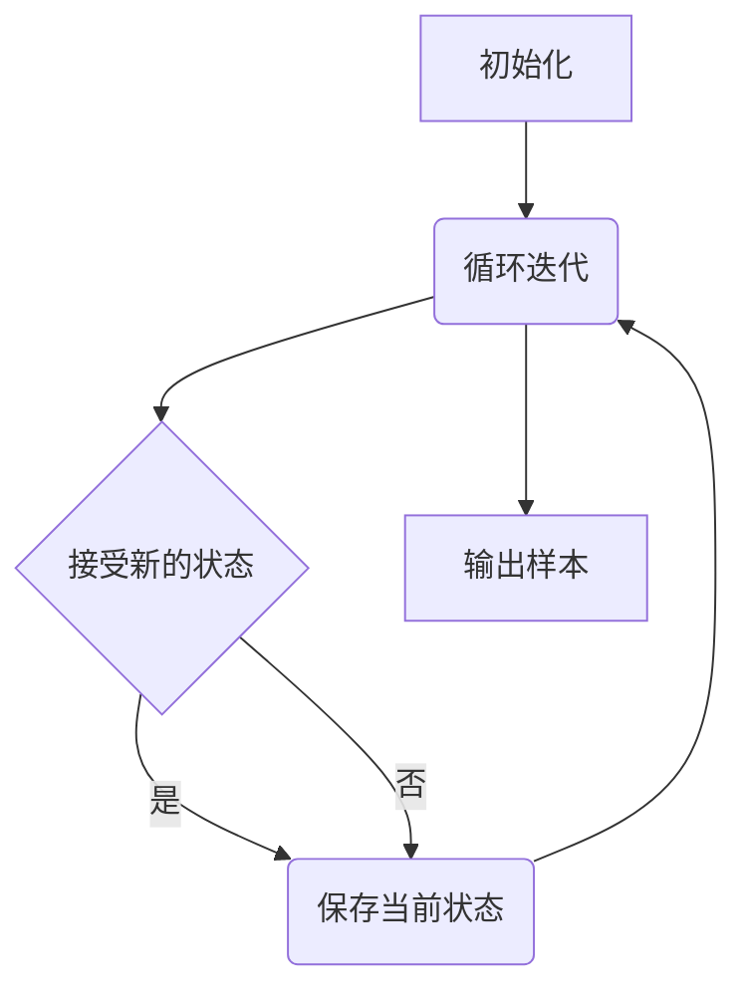

# 哈密尔顿蒙特卡罗(HMC)原理与代码实战案例讲解

作者：禅与计算机程序设计艺术

## 1. 背景介绍

### 1.1 蒙特卡罗方法概述

蒙特卡罗方法是一种随机模拟方法，它利用随机抽样的方式来估计问题的解。其基本思想是通过生成大量的随机样本，并根据这些样本的统计特性来推断目标量的值。蒙特卡罗方法广泛应用于各种领域，包括物理、化学、金融、工程等。

### 1.2 马尔科夫链蒙特卡罗方法

马尔科夫链蒙特卡罗方法 (MCMC) 是一种特殊的蒙特卡罗方法，它利用马尔科夫链来生成样本。马尔科夫链是一种随机过程，其未来状态只取决于当前状态，而与过去状态无关。MCMC 方法通过构建一个马尔科夫链，使其平稳分布收敛到目标分布，从而实现对目标分布的采样。

### 1.3 哈密尔顿蒙特卡罗方法的优势

哈密尔顿蒙特卡罗 (HMC) 方法是一种高效的 MCMC 方法，它利用哈密顿动力学来提高采样效率。与传统的 MCMC 方法相比，HMC 方法具有以下优势：

* **更高的采样效率:** HMC 方法可以更快地探索目标分布，从而提高采样效率。
* **更强的探索能力:** HMC 方法可以更容易地跳出局部最优解，从而探索更广泛的样本空间。
* **更适用于高维问题:** HMC 方法在高维问题中表现良好，而传统的 MCMC 方法往往会遇到维度灾难问题。

## 2. 核心概念与联系

### 2.1 哈密顿动力学

哈密顿动力学是一种描述物理系统运动规律的理论。它将系统的状态表示为位置 $q$ 和动量 $p$，并通过哈密顿函数 $H(q, p)$ 来描述系统的能量。哈密顿方程描述了系统状态随时间的演化规律：

$$
\begin{aligned}
\frac{dq}{dt} &= \frac{\partial H}{\partial p}, \\
\frac{dp}{dt} &= -\frac{\partial H}{\partial q}.
\end{aligned}
$$

### 2.2 HMC 采样过程

HMC 方法利用哈密顿动力学来生成样本。其基本步骤如下：

1. **初始化:** 从目标分布中随机选择一个初始状态 $(q_0, p_0)$。
2. **模拟哈密顿动力学:** 使用哈密顿方程模拟系统状态在一段时间内的演化，得到新的状态 $(q_1, p_1)$。
3. **Metropolis-Hastings 校正:** 根据 Metropolis-Hastings 准则，以一定的概率接受或拒绝新的状态 $(q_1, p_1)$。
4. **重复步骤 2-3:** 重复上述步骤，生成一系列样本。

### 2.3 核心概念联系

HMC 方法将目标分布的概率密度函数视为哈密顿函数中的势能函数 $U(q)$，并将动量变量 $p$ 引入系统。通过模拟哈密顿动力学，HMC 方法可以有效地探索目标分布，并生成符合目标分布的样本。

## 3. 核心算法原理具体操作步骤

### 3.1 算法流程

HMC 算法的流程如下：

1. **初始化:** 
    * 设置目标分布的概率密度函数 $f(q)$。
    * 设置模拟步长 $\epsilon$ 和模拟步数 $L$。
    * 从目标分布中随机选择一个初始状态 $(q_0, p_0)$。
2. **循环迭代:** 
    * 对 $t = 1, 2, ..., L$ 执行以下操作：
        * 从标准正态分布中随机生成动量变量 $p$。
        * 使用 leapfrog 方法模拟哈密顿动力学，得到新的状态 $(q', p')$。
        * 计算接受概率 $\alpha = \min\left(1, \frac{f(q') \exp(-\frac{1}{2}p'^Tp')}{f(q) \exp(-\frac{1}{2}p^Tp)}\right)$。
        * 从均匀分布中随机生成一个数 $u$。
        * 如果 $u < \alpha$，则接受新的状态 $(q', p')$，否则保留旧的状态 $(q, p)$。
3. **输出样本:** 输出所有接受的状态 $(q, p)$ 作为样本。

### 3.2 Leapfrog 方法

Leapfrog 方法是一种数值积分方法，用于模拟哈密顿动力学。其基本思想是将动量变量 $p$ 和位置变量 $q$ 的更新交替进行，从而提高数值精度。Leapfrog 方法的具体步骤如下：

1. 更新动量变量：$p_{i+1/2} = p_i - \frac{\epsilon}{2} \nabla U(q_i)$。
2. 更新位置变量：$q_{i+1} = q_i + \epsilon p_{i+1/2}$。
3. 更新动量变量：$p_{i+1} = p_{i+1/2} - \frac{\epsilon}{2} \nabla U(q_{i+1})$。

### 3.3 Metropolis-Hastings 校正

Metropolis-Hastings 校正是 MCMC 方法中常用的一个步骤，用于保证生成的样本符合目标分布。其基本思想是根据接受概率 $\alpha$ 来决定是否接受新的状态。接受概率 $\alpha$ 的计算公式如下：

$$
\alpha = \min\left(1, \frac{f(q') \exp(-\frac{1}{2}p'^Tp')}{f(q) \exp(-\frac{1}{2}p^Tp)}\right),
$$

其中 $f(q)$ 是目标分布的概率密度函数，$q$ 和 $p$ 分别是当前状态的位置和动量，$q'$ 和 $p'$ 分别是新状态的位置和动量。

## 4. 数学模型和公式详细讲解举例说明

### 4.1 目标分布

假设我们要从一个二维高斯分布中采样，其概率密度函数为：

$$
f(q) = \frac{1}{2\pi} \exp\left(-\frac{1}{2}q^Tq\right),
$$

其中 $q = (q_1, q_2)^T$ 是二维位置向量。

### 4.2 哈密顿函数

我们可以将目标分布的概率密度函数视为哈密顿函数中的势能函数 $U(q)$，并将动量变量 $p = (p_1, p_2)^T$ 引入系统。因此，哈密顿函数可以写成：

$$
H(q, p) = U(q) + \frac{1}{2}p^Tp = -\log f(q) + \frac{1}{2}p^Tp.
$$

### 4.3 Leapfrog 方法

使用 leapfrog 方法模拟哈密顿动力学，我们可以得到新的状态 $(q', p')$。具体步骤如下：

1. 更新动量变量：

$$
\begin{aligned}
p_{1/2} &= p - \frac{\epsilon}{2} \nabla U(q) \\
&= p + \frac{\epsilon}{2} q.
\end{aligned}
$$

2. 更新位置变量：

$$
\begin{aligned}
q' &= q + \epsilon p_{1/2} \\
&= q + \epsilon (p + \frac{\epsilon}{2} q) \\
&= (1 + \frac{\epsilon^2}{2})q + \epsilon p.
\end{aligned}
$$

3. 更新动量变量：

$$
\begin{aligned}
p' &= p_{1/2} - \frac{\epsilon}{2} \nabla U(q') \\
&= p + \frac{\epsilon}{2} q - \frac{\epsilon}{2} q' \\
&= (1 - \frac{\epsilon^2}{2})p + \frac{\epsilon}{2} (q - q').
\end{aligned}
$$

### 4.4 接受概率

根据 Metropolis-Hastings 准则，接受概率 $\alpha$ 的计算公式如下：

$$
\begin{aligned}
\alpha &= \min\left(1, \frac{f(q') \exp(-\frac{1}{2}p'^Tp')}{f(q) \exp(-\frac{1}{2}p^Tp)}\right) \\
&= \min\left(1, \frac{\exp(-\frac{1}{2}q'^Tq' - \frac{1}{2}p'^Tp')}{\exp(-\frac{1}{2}q^Tq - \frac{1}{2}p^Tp)}\right) \\
&= \min\left(1, \exp(-H(q', p') + H(q, p))\right).
\end{aligned}
$$

## 5. 项目实践：代码实例和详细解释说明

### 5.1 Python 代码实例

```python
import numpy as np
import scipy.stats as stats

def hmc(f, epsilon, L, q0, p0):
  """
  哈密尔顿蒙特卡罗方法

  参数:
    f: 目标分布的概率密度函数
    epsilon: 模拟步长
    L: 模拟步数
    q0: 初始位置
    p0: 初始动量

  返回值:
    samples: 生成的样本
  """

  q = q0
  p = p0
  samples = []

  for i in range(L):
    # 从标准正态分布中随机生成动量变量
    p = np.random.randn(*q.shape)

    # 使用 leapfrog 方法模拟哈密顿动力学
    q_new, p_new = leapfrog(f, epsilon, q, p)

    # 计算接受概率
    alpha = min(1, np.exp(-H(f, q_new, p_new) + H(f, q, p)))

    # 从均匀分布中随机生成一个数
    u = np.random.rand()

    # 如果 u < alpha，则接受新的状态，否则保留旧的状态
    if u < alpha:
      q = q_new
      p = p_new

    # 保存当前状态
    samples.append(q)

  return np.array(samples)

def leapfrog(f, epsilon, q, p):
  """
  Leapfrog 方法

  参数:
    f: 目标分布的概率密度函数
    epsilon: 模拟步长
    q: 当前位置
    p: 当前动量

  返回值:
    q_new: 新的位置
    p_new: 新的动量
  """

  # 更新动量变量
  p_half = p - (epsilon / 2) * grad_U(f, q)

  # 更新位置变量
  q_new = q + epsilon * p_half

  # 更新动量变量
  p_new = p_half - (epsilon / 2) * grad_U(f, q_new)

  return q_new, p_new

def H(f, q, p):
  """
  哈密顿函数

  参数:
    f: 目标分布的概率密度函数
    q: 位置
    p: 动量

  返回值:
    H: 哈密顿函数的值
  """

  return -np.log(f(q)) + 0.5 * np.dot(p, p)

def grad_U(f, q):
  """
  势能函数的梯度

  参数:
    f: 目标分布的概率密度函数
    q: 位置

  返回值:
    grad_U: 势能函数的梯度
  """

  # 使用数值微分计算梯度
  h = 1e-6
  grad = np.zeros_like(q)
  for i in range(len(q)):
    q_plus = q.copy()
    q_plus[i] += h
    grad[i] = (U(f, q_plus) - U(f, q)) / h
  return grad

def U(f, q):
  """
  势能函数

  参数:
    f: 目标分布的概率密度函数
    q: 位置

  返回值:
    U: 势能函数的值
  """

  return -np.log(f(q))

# 定义目标分布
f = stats.multivariate_normal(mean=[0, 0], cov=[[1, 0], [0, 1]]).pdf

# 设置参数
epsilon = 0.1
L = 100
q0 = np.array([0, 0])
p0 = np.array([0, 0])

# 运行 HMC 方法
samples = hmc(f, epsilon, L, q0, p0)

# 打印生成的样本
print(samples)
```

### 5.2 代码解释

* **hmc 函数:** 实现了 HMC 算法的主流程。
* **leapfrog 函数:** 实现了 leapfrog 方法，用于模拟哈密顿动力学。
* **H 函数:** 计算哈密顿函数的值。
* **grad_U 函数:** 使用数值微分计算势能函数的梯度。
* **U 函数:** 计算势能函数的值。
* **f:** 定义了目标分布的概率密度函数，这里使用的是二维高斯分布。
* **epsilon:** 模拟步长。
* **L:** 模拟步数。
* **q0:** 初始位置。
* **p0:** 初始动量。

### 5.3 结果分析

运行代码后，我们可以得到一系列从二维高斯分布中采样的样本。这些样本的分布应该与目标分布一致。

## 6. 实际应用场景

### 6.1 贝叶斯统计

HMC 方法广泛应用于贝叶斯统计中，用于估计模型参数的后验分布。例如，我们可以使用 HMC 方法来估计线性回归模型的系数。

### 6.2 深度学习

HMC 方法也可以用于训练深度学习模型。例如，我们可以使用 HMC 方法来优化深度神经网络的权重。

### 6.3 物理模拟

HMC 方法还可以用于模拟物理系统的运动规律。例如，我们可以使用 HMC 方法来模拟分子动力学。

## 7. 工具和资源推荐

### 7.1 Stan

Stan 是一款用于贝叶斯统计建模和推断的概率编程语言。它提供了 HMC 方法的实现，可以方便地用于各种贝叶斯统计应用。

### 7.2 PyMC3

PyMC3 是一款基于 Python 的概率编程库，它也提供了 HMC 方法的实现。

### 7.3 TensorFlow Probability

TensorFlow Probability 是 TensorFlow 的一个扩展库，它提供了 HMC 方法的实现，可以用于深度学习应用。

## 8. 总结：未来发展趋势与挑战

### 8.1 发展趋势

* **更高效的 HMC 方法:** 研究人员正在不断改进 HMC 方法，以提高其采样效率和探索能力。
* **更广泛的应用领域:** HMC 方法正在被应用于越来越多的领域，包括机器学习、物理模拟、金融等。
* **与深度学习的结合:** HMC 方法与深度学习的结合是一个 promising 的研究方向，可以用于训练更复杂的深度学习模型。

### 8.2 挑战

* **参数调整:** HMC 方法的性能对参数设置非常敏感，需要仔细调整参数才能获得良好的结果。
* **高维问题:** HMC 方法在高维问题中仍然面临挑战，需要进一步研究更有效的采样策略。
* **理论分析:** HMC 方法的理论分析仍然不够完善，需要进一步研究其收敛性和效率。

## 9. 附录：常见问题与解答

### 9.1 HMC 方法与其他 MCMC 方法的区别？

HMC 方法与其他 MCMC 方法的主要区别在于它利用了哈密顿动力学来提高采样效率。与传统的 MCMC 方法相比，HMC 方法可以更快地探索目标分布，并更容易地跳出局部最优解。

### 9.2 如何选择 HMC 方法的参数？

HMC 方法的参数包括模拟步长 $\epsilon$ 和模拟步数 $L$。选择合适的参数对于 HMC 方法的性能至关重要。通常情况下，我们可以通过试错法来选择参数，并根据样本的接受率和自相关函数来评估参数的优劣。

### 9.3 HMC 方法的优缺点？

HMC 方法的优点包括：

* 高采样效率
* 强探索能力
* 适用于高维问题

HMC 方法的缺点包括：

* 参数调整困难
* 理论分析不够完善

## 10. Mermaid 流程图


