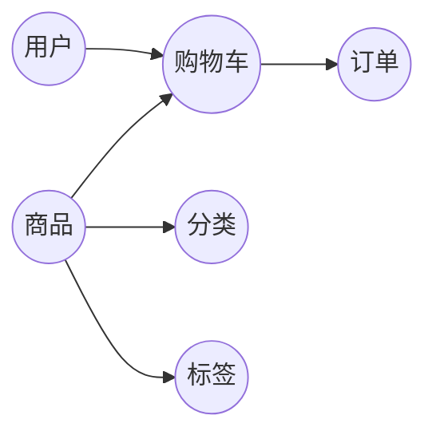

## 1. 背景介绍

### 1.1 电商行业的蓬勃发展与在线花卉市场的崛起

近年来，随着互联网技术的快速发展和人们消费习惯的转变，电子商务行业蓬勃发展，在线购物已成为人们日常生活中不可或缺的一部分。在众多电商细分领域中，在线花卉市场展现出巨大的发展潜力和市场空间。鲜花作为一种特殊的商品，具有时效性强、易损耗、配送要求高等特点，传统线下花店模式难以满足消费者日益增长的个性化、便捷化需求。而在线花卉销售平台通过整合供应链资源、提供便捷的购物体验和高效的物流配送服务，有效解决了传统花卉销售模式的痛点，为消费者带来更优质的购物体验。

### 1.2 在线花卉销售系统的优势和价值

在线花卉销售系统相比传统线下模式，具有以下显著优势：

* **更广泛的市场覆盖范围**: 在线平台打破了地域限制，可以将产品销售到全国乃至全球各地，扩大市场份额。
* **更便捷的购物体验**: 消费者足不出户，即可在线浏览商品、下单购买、支付结算，省时省力。
* **更丰富的商品选择**: 在线平台可以整合来自不同供应商的商品，提供更丰富的品种和规格选择，满足消费者多样化需求。
* **更透明的价格体系**: 在线平台的价格公开透明，消费者可以方便地进行价格比较，选择性价比更高的商品。
* **更完善的售后服务**: 在线平台提供在线客服、退换货等售后服务，保障消费者权益。

在线花卉销售系统的价值在于：

* **提升花卉产业效率**: 通过优化供应链管理、降低运营成本，提高花卉产业的整体效率。
* **促进花卉消费升级**: 提供更便捷、优质的购物体验，刺激花卉消费需求，促进产业升级。
* **推动花卉行业数字化转型**: 利用互联网技术，推动花卉行业向数字化、智能化方向发展。

### 1.3 本文目标和结构

本文旨在介绍在线花卉销售系统的详细设计方案和具体代码实现，帮助读者了解该系统的架构、功能模块、技术实现细节以及实际应用场景。

本文结构如下：

* 第一部分：背景介绍，阐述在线花卉销售系统的背景和意义。
* 第二部分：核心概念与联系，介绍系统涉及的关键概念和它们之间的关系。
* 第三部分：核心算法原理具体操作步骤，详细阐述系统核心算法的设计思路和实现步骤。
* 第四部分：数学模型和公式详细讲解举例说明，运用数学模型对系统进行建模分析，并结合实例进行讲解。
* 第五部分：项目实践：代码实例和详细解释说明，提供系统核心功能的代码实现，并进行详细解释说明。
* 第六部分：实际应用场景，介绍在线花卉销售系统在不同场景下的应用案例。
* 第七部分：工具和资源推荐，推荐一些与系统开发相关的工具和资源。
* 第八部分：总结：未来发展趋势与挑战，总结系统的设计理念和技术实现，展望未来发展趋势和挑战。
* 第九部分：附录：常见问题与解答，解答一些与系统相关常见问题。

## 2. 核心概念与联系

### 2.1 用户

* **普通用户**: 注册用户，可以浏览商品、下单购买、支付结算、查看订单、评价商品等。
* **管理员**: 拥有系统管理权限，可以管理商品、用户、订单、数据统计等。

### 2.2 商品

* **花卉**: 系统销售的核心商品，包含名称、图片、价格、库存、描述等信息。
* **分类**: 对花卉进行分类管理，方便用户查找商品。
* **标签**: 为花卉添加标签，方便用户筛选商品。

### 2.3 订单

* **订单状态**: 包括待付款、待发货、已发货、已完成、已取消等。
* **支付方式**: 支持多种支付方式，如支付宝、微信支付、银行卡等。
* **配送方式**: 支持多种配送方式，如快递、同城配送等。

### 2.4 购物车

* **商品列表**: 用户添加的待购买商品列表。
* **数量**: 每个商品的数量。
* **总价**: 购物车中所有商品的总价格。

### 2.5 核心概念联系图



## 3. 核心算法原理具体操作步骤

### 3.1 商品推荐算法

* **基于内容的推荐**: 根据用户的历史购买记录和浏览记录，推荐与用户兴趣相似的商品。
* **协同过滤推荐**: 根据其他用户的购买记录和评价数据，推荐用户可能感兴趣的商品。
* **混合推荐**: 结合多种推荐算法，提高推荐效果。

### 3.2 订单处理流程

1. 用户将商品加入购物车。
2. 用户确认订单信息，选择支付方式和配送方式。
3. 系统生成订单，并扣除商品库存。
4. 用户完成支付。
5. 系统通知商家发货。
6. 物流公司配送商品。
7. 用户确认收货。

### 3.3 数据统计分析

* **销售数据**: 统计商品销量、销售额、订单数量等数据。
* **用户行为数据**: 统计用户浏览记录、购买记录、评价数据等。
* **市场趋势数据**: 统计行业发展趋势、竞争对手情况等数据。

## 4. 数学模型和公式详细讲解举例说明

### 4.1 库存管理模型

假设某商品的初始库存为 $Q_0$，每天的销售量服从均值为 $\mu$，标准差为 $\sigma$ 的正态分布，则 $t$ 天后的库存量 $Q_t$ 可以表示为：

$$Q_t = Q_0 - \sum_{i=1}^{t} X_i$$

其中 $X_i$ 表示第 $i$ 天的销售量，服从正态分布 $N(\mu, \sigma^2)$。

**举例说明**:

假设某花卉的初始库存为 100 件，每天的平均销售量为 10 件，标准差为 2 件。则 5 天后的库存量可以计算为：

$$Q_5 = 100 - (X_1 + X_2 + X_3 + X_4 + X_5)$$

其中 $X_1, X_2, X_3, X_4, X_5$ 均服从正态分布 $N(10, 2^2)$。

### 4.2 用户评分模型

假设用户对商品的评分服从均值为 $\mu$，标准差为 $\sigma$ 的正态分布，则商品的平均评分 $\bar{x}$ 可以表示为：

$$\bar{x} = \frac{1}{n} \sum_{i=1}^{n} x_i$$

其中 $x_i$ 表示第 $i$ 个用户的评分，服从正态分布 $N(\mu, \sigma^2)$，$n$ 表示评分用户数量。

**举例说明**:

假设某花卉的平均评分为 4.5 分，标准差为 0.5 分。则该花卉的评分分布情况如下：

```python
import numpy as np
import matplotlib.pyplot as plt

mu = 4.5
sigma = 0.5
x = np.linspace(mu - 3*sigma, mu + 3*sigma, 100)
y = 1/(sigma * np.sqrt(2 * np.pi)) * np.exp( - (x - mu)**2 / (2 * sigma**2) )

plt.plot(x, y)
plt.title('User Rating Distribution')
plt.xlabel('Rating')
plt.ylabel('Probability Density')
plt.show()
```

## 5. 项目实践：代码实例和详细解释说明

### 5.1 技术选型

* **后端**: Python + Django
* **前端**: Vue.js
* **数据库**: MySQL
* **缓存**: Redis
* **消息队列**: RabbitMQ

### 5.2 代码实例

#### 5.2.1 商品模型

```python
from django.db import models

class Category(models.Model):
    name = models.CharField(max_length=255)

class Tag(models.Model):
    name = models.CharField(max_length=255)

class Product(models.Model):
    name = models.CharField(max_length=255)
    image = models.ImageField(upload_to='products/')
    price = models.DecimalField(max_digits=10, decimal_places=2)
    stock = models.IntegerField()
    description = models.TextField()
    category = models.ForeignKey(Category, on_delete=models.CASCADE)
    tags = models.ManyToManyField(Tag)
```

#### 5.2.2 订单模型

```python
from django.db import models
from django.contrib.auth.models import User

class Order(models.Model):
    STATUS_CHOICES = (
        ('pending', '待付款'),
        ('processing', '待发货'),
        ('shipped', '已发货'),
        ('completed', '已完成'),
        ('cancelled', '已取消'),
    )

    user = models.ForeignKey(User, on_delete=models.CASCADE)
    products = models.ManyToManyField(Product, through='OrderItem')
    total_price = models.DecimalField(max_digits=10, decimal_places=2)
    status = models.CharField(max_length=20, choices=STATUS_CHOICES, default='pending')
    created_at = models.DateTimeField(auto_now_add=True)

class OrderItem(models.Model):
    order = models.ForeignKey(Order, on_delete=models.CASCADE)
    product = models.ForeignKey(Product, on_delete=models.CASCADE)
    quantity = models.IntegerField()
```

### 5.3 代码解释说明

* 商品模型定义了商品的基本信息，包括名称、图片、价格、库存、描述、分类和标签。
* 订单模型定义了订单的基本信息，包括用户、商品、总价、状态和创建时间。
* OrderItem 模型定义了订单和商品之间的关系，包括订单、商品和数量。

## 6. 实际应用场景

### 6.1 鲜花电商平台

在线花卉销售系统可以用于搭建鲜花电商平台，为消费者提供便捷的在线购花体验。

### 6.2 花店线上销售

传统线下花店可以利用在线花卉销售系统拓展线上销售渠道，扩大市场覆盖范围。

### 6.3 企业礼品定制

企业用户可以利用在线花卉销售系统定制企业礼品，如商务鲜花、节日礼品等。

## 7. 工具和资源推荐

* **Django**: Python Web 框架
* **Vue.js**: 前端框架
* **MySQL**: 关系型数据库
* **Redis**: 缓存数据库
* **RabbitMQ**: 消息队列

## 8. 总结：未来发展趋势与挑战

### 8.1 未来发展趋势

* **个性化推荐**: 利用大数据和人工智能技术，为用户提供更精准的个性化商品推荐。
* **智能客服**: 利用自然语言处理技术，为用户提供更智能的客服服务。
* **无人配送**: 利用无人机、无人车等技术，实现更高效的商品配送。

### 8.2 面临的挑战

* **数据安全**: 保护用户隐私和数据安全。
* **物流配送**: 提高物流配送效率，降低配送成本。
* **市场竞争**: 面对激烈的市场竞争，不断提升产品和服务质量。

## 9. 附录：常见问题与解答

### 9.1 如何注册账号？

用户可以通过网站或手机 APP 注册账号。

### 9.2 如何支付订单？

系统支持多种支付方式，如支付宝、微信支付、银行卡等。

### 9.3 如何申请退款？

用户可以在订单详情页面申请退款。

### 9.4 如何联系客服？

用户可以通过网站或手机 APP 联系在线客服。
