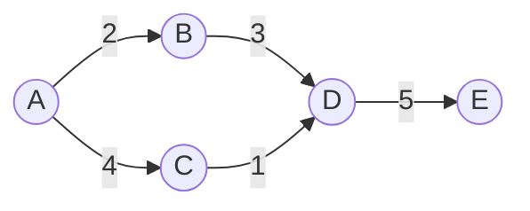

## 1. 背景介绍

### 1.1 鲜花电商行业的现状与发展趋势

近年来，随着互联网技术的快速发展和人们消费观念的转变，鲜花电商行业蓬勃发展。在线鲜花销售平台如雨后春笋般涌现，为消费者提供了更加便捷、高效的购花体验。 

鲜花电商行业呈现出以下发展趋势：

* **市场规模持续扩大：** 随着人们生活水平的提高和对生活品质的追求，鲜花消费需求不断增长，推动鲜花电商市场规模持续扩大。
* **移动端消费占比提升：** 移动互联网的普及使得消费者可以通过手机随时随地浏览和购买鲜花，移动端消费占比不断提升。
* **个性化需求日益突出：** 消费者对鲜花产品的个性化需求日益突出，例如定制花束、主题花篮等，要求电商平台提供更加灵活多样的产品和服务。
* **供应链效率亟待提升：** 鲜花产品易损耗、物流配送难度大，对供应链效率提出了更高的要求。

### 1.2 在线鲜花销售系统的优势

相比传统的线下鲜花销售模式，在线鲜花销售系统具有以下优势：

* **便捷高效：** 消费者可以随时随地在线浏览和购买鲜花，无需亲自前往花店。
* **品类丰富：** 在线平台可以提供来自全国各地、各种品类的鲜花产品，满足消费者多样化的需求。
* **价格透明：** 在线平台的价格更加透明，消费者可以方便地进行比较和选择。
* **服务周到：** 在线平台可以提供送货上门、售后服务等周到服务，提升消费者购物体验。

### 1.3 系统设计目标

本在线鲜花销售系统旨在构建一个功能完善、用户体验良好的电商平台，为消费者提供便捷、高效、个性化的鲜花购物体验，同时帮助花店提升运营效率和销售额。

## 2. 核心概念与联系

### 2.1 系统用户角色

本系统涉及以下用户角色：

* **消费者：** 注册用户，可以浏览商品、下单购买、查看订单、评价商品等。
* **花店：** 注册商家，可以发布商品、管理订单、处理售后等。
* **管理员：** 负责系统管理、用户管理、数据统计等。

### 2.2 系统核心功能模块

本系统包含以下核心功能模块：

* **商品管理：** 包括商品分类管理、商品信息管理、商品图片管理等。
* **订单管理：** 包括订单生成、订单支付、订单配送、订单查询、订单评价等。
* **用户管理：** 包括用户注册、用户登录、用户信息修改、用户积分管理等。
* **数据统计：** 包括销售数据统计、用户行为数据统计等。

### 2.3 功能模块之间的联系

各功能模块之间相互联系，共同构成完整的系统功能。例如，消费者在下单购买商品时，会生成订单信息，订单信息会关联到商品信息和用户信息，同时也会记录到销售数据统计模块中。

## 3. 核心算法原理具体操作步骤

### 3.1 商品推荐算法

为了提升用户购物体验，本系统采用协同过滤算法进行商品推荐。

**协同过滤算法原理：**

协同过滤算法是一种基于用户历史行为数据的推荐算法，其基本原理是：

1. 收集用户的历史行为数据，例如购买记录、浏览记录等。
2. 计算用户之间的相似度，例如根据共同购买的商品数量、共同浏览的商品类别等。
3. 找到与目标用户相似的用户群体。
4. 将相似用户群体购买或浏览过的商品推荐给目标用户。

**具体操作步骤：**

1. 收集用户的历史购买记录和浏览记录。
2. 使用余弦相似度计算用户之间的相似度。
3. 找到与目标用户最相似的 K 个用户。
4. 将这 K 个用户购买或浏览过的商品推荐给目标用户。

### 3.2 订单配送路径规划算法

为了提升配送效率，本系统采用 Dijkstra 算法进行订单配送路径规划。

**Dijkstra 算法原理：**

Dijkstra 算法是一种用于寻找图中节点之间最短路径的算法。其基本原理是：

1. 从起始节点出发，初始化所有节点的距离为无穷大，起始节点的距离为 0。
2. 遍历所有未访问的节点，找到距离起始节点最近的节点。
3. 更新该节点的邻居节点的距离，如果通过该节点可以找到更短的路径，则更新邻居节点的距离。
4. 重复步骤 2 和 3，直到找到目标节点。

**具体操作步骤：**

1. 将配送区域抽象成一个图，节点代表配送地址，边代表道路。
2. 使用 Dijkstra 算法计算花店到所有配送地址的最短路径。
3. 根据订单的配送地址，选择最短路径进行配送。

## 4. 数学模型和公式详细讲解举例说明

### 4.1 余弦相似度

余弦相似度是一种用于计算两个向量之间相似度的指标，其取值范围为 [-1, 1]，值越大表示相似度越高。

**公式：**

$$
\cos(\theta) = \frac{\mathbf{A} \cdot \mathbf{B}}{\|\mathbf{A}\| \|\mathbf{B}\|}
$$

其中，$\mathbf{A}$ 和 $\mathbf{B}$ 分别代表两个向量，$\cdot$ 代表向量点积，$\|\|$ 代表向量模长。

**举例说明：**

假设用户 A 购买了商品 1 和商品 2，用户 B 购买了商品 2 和商品 3，则用户 A 和用户 B 的商品购买向量分别为：

$$
\mathbf{A} = [1, 1, 0]
$$

$$
\mathbf{B} = [0, 1, 1]
$$

则用户 A 和用户 B 之间的余弦相似度为：

$$
\cos(\theta) = \frac{[1, 1, 0] \cdot [0, 1, 1]}{\|[1, 1, 0]\| \|[0, 1, 1]\|} = \frac{1}{\sqrt{2} \sqrt{2}} = 0.5
$$

### 4.2 Dijkstra 算法

Dijkstra 算法是一种用于寻找图中节点之间最短路径的算法。

**算法步骤：**

1. 初始化所有节点的距离为无穷大，起始节点的距离为 0。
2. 遍历所有未访问的节点，找到距离起始节点最近的节点。
3. 更新该节点的邻居节点的距离，如果通过该节点可以找到更短的路径，则更新邻居节点的距离。
4. 重复步骤 2 和 3，直到找到目标节点。

**举例说明：**

假设配送区域如下图所示，花店位于节点 A，需要配送到节点 E。



使用 Dijkstra 算法计算花店到节点 E 的最短路径：

1. 初始化所有节点的距离为无穷大，节点 A 的距离为 0。
2. 找到距离节点 A 最近的节点 C，距离为 4。
3. 更新节点 C 的邻居节点 D 的距离为 5 (4 + 1)。
4. 找到距离节点 A 最近的节点 B，距离为 2。
5. 更新节点 B 的邻居节点 D 的距离为 5 (2 + 3)。
6. 找到距离节点 A 最近的节点 D，距离为 5。
7. 更新节点 D 的邻居节点 E 的距离为 10 (5 + 5)。
8. 找到目标节点 E，距离为 10。

因此，花店到节点 E 的最短路径为 A -> C -> D -> E，距离为 10。

## 5. 项目实践：代码实例和详细解释说明

### 5.1 技术选型

本项目采用以下技术栈：

* **后端：** Spring Boot
* **数据库：** MySQL
* **前端：** Vue.js
* **缓存：** Redis

### 5.2 数据库设计

**商品表：**

| 字段 | 类型 | 说明 |
|---|---|---|
| id | int | 商品 ID |
| name | varchar | 商品名称 |
| category_id | int | 商品分类 ID |
| price | decimal | 商品价格 |
| description | text | 商品描述 |
| image_url | varchar | 商品图片 URL |

**订单表：**

| 字段 | 类型 | 说明 |
|---|---|---|
| id | int | 订单 ID |
| user_id | int | 用户 ID |
| order_time | datetime | 下单时间 |
| total_price | decimal | 订单总价 |
| status | int | 订单状态 |

**用户表：**

| 字段 | 类型 | 说明 |
|---|---|---|
| id | int | 用户 ID |
| username | varchar | 用户名 |
| password | varchar | 密码 |
| email | varchar | 邮箱 |
| phone | varchar | 电话 |

### 5.3 代码示例

**商品推荐算法实现：**

```java
// 计算用户之间的余弦相似度
public double cosineSimilarity(List<Integer> user1, List<Integer> user2) {
    // ...
}

// 获取与目标用户最相似的 K 个用户
public List<Integer> getSimilarUsers(int userId, int k) {
    // ...
}

// 商品推荐
public List<Integer> recommendProducts(int userId) {
    // 获取与目标用户最相似的 K 个用户
    List<Integer> similarUsers = getSimilarUsers(userId, 10);

    // 获取相似用户购买或浏览过的商品
    Set<Integer> productIds = new HashSet<>();
    for (int similarUserId : similarUsers) {
        // ...
    }

    // 返回推荐商品列表
    return new ArrayList<>(productIds);
}
```

**订单配送路径规划算法实现：**

```java
// 计算花店到所有配送地址的最短路径
public Map<Integer, Integer> dijkstra(int startNodeId) {
    // ...
}

// 订单配送路径规划
public List<Integer> planDeliveryRoute(int orderId) {
    // 获取订单的配送地址
    int deliveryAddressId = getOrderDeliveryAddressId(orderId);

    // 计算花店到所有配送地址的最短路径
    Map<Integer, Integer> shortestPaths = dijkstra(flowerShopNodeId);

    // 获取花店到配送地址的最短路径
    List<Integer> route = new ArrayList<>();
    int currentNodeId = deliveryAddressId;
    while (currentNodeId != flowerShopNodeId) {
        route.add(currentNodeId);
        currentNodeId = shortestPaths.get(currentNodeId);
    }
    route.add(flowerShopNodeId);

    // 返回配送路径
    Collections.reverse(route);
    return route;
}
```

## 6. 实际应用场景

在线鲜花销售系统可以应用于以下场景：

* **鲜花零售：** 为消费者提供在线鲜花购买服务。
* **鲜花批发：** 为花店提供鲜花批发服务。
* **鲜花订阅：** 为消费者提供定期鲜花配送服务。
* **企业用花：** 为企业提供会议用花、庆典用花等服务。

## 7. 工具和资源推荐

### 7.1 开发工具

* **IDE：** IntelliJ IDEA、Eclipse
* **版本控制工具：** Git
* **数据库管理工具：** MySQL Workbench、DataGrip

### 7.2 学习资源

* **Spring Boot 官方文档：** https://spring.io/projects/spring-boot
* **Vue.js 官方文档：** https://vuejs.org/
* **MySQL 官方文档：** https://dev.mysql.com/doc/
* **Redis 官方文档：** https://redis.io/documentation

## 8. 总结：未来发展趋势与挑战

### 8.1 未来发展趋势

* **人工智能技术应用：** 利用人工智能技术进行个性化推荐、智能客服等。
* **大数据分析：** 利用大数据分析技术优化供应链、提升运营效率。
* **移动支付普及：** 移动支付的普及将进一步提升在线鲜花销售的便捷性。

### 8.2 面临的挑战

* **物流配送效率：** 鲜花产品易损耗、物流配送难度大，需要不断提升物流配送效率。
* **产品质量控制：** 鲜花产品质量参差不齐，需要加强产品质量控制。
* **市场竞争激烈：** 鲜花电商行业竞争激烈，需要不断提升产品和服务质量，才能在市场竞争中脱颖而出。

## 9. 附录：常见问题与解答

### 9.1 如何注册成为用户？

点击网站首页的“注册”按钮，填写相关信息即可完成注册。

### 9.2 如何下单购买商品？

浏览商品页面，选择心仪的商品，点击“加入购物车”按钮，然后进入购物车页面，点击“结算”按钮，填写收货信息和支付方式，即可完成下单。

### 9.3 如何查看订单状态？

登录账号后，点击“我的订单”菜单，即可查看所有订单的状态。

### 9.4 如何联系客服？

点击网站首页的“联系客服”按钮，即可联系在线客服。
