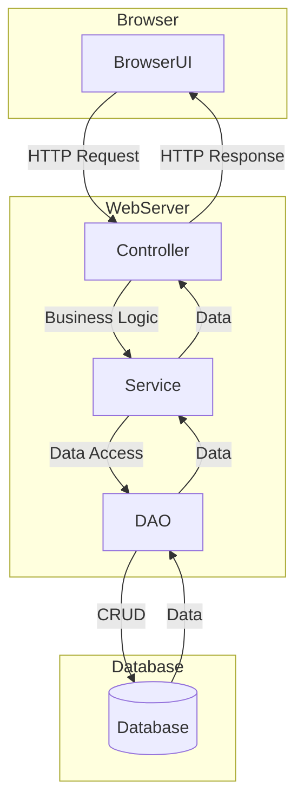

# 基于BS结构的工艺品销售系统详细设计与具体代码实现

## 1.背景介绍

### 1.1 工艺品销售行业现状

工艺品行业是一个传统而又充满活力的行业,凝聚了民族文化的精髓。随着人们生活水平的提高和文化意识的增强,工艺品市场需求与日俱增。然而,传统的线下销售模式受场地、人力等因素的限制,难以满足消费者日益增长的需求。因此,构建一个高效、便捷的在线工艺品销售平台刻不容缓。

### 1.2 BS架构简介

BS架构(Browser/Server架构)是一种经典的客户端/服务器模式,其中浏览器作为客户端,Web服务器作为服务器端。BS架构具有跨平台、开发和部署简单、易于维护等优点,非常适合构建工艺品销售系统。

## 2.核心概念与联系

### 2.1 BS架构核心组件

BS架构主要由以下三个核心组件组成:

1. **浏览器(Browser)**: 作为客户端,负责发送HTTP请求、接收和展示服务器响应数据。
2. **Web服务器(Web Server)**: 负责处理客户端请求,并返回相应的资源(HTML、CSS、JS等)。
3. **数据库服务器(Database Server)**: 用于存储系统所需的各种数据,如商品信息、订单记录等。

### 2.2 BS架构工作流程

BS架构的工作流程如下:

1. 用户通过浏览器发送HTTP请求到Web服务器。
2. Web服务器接收请求,并根据请求的URL及参数从数据库获取相应数据。
3. Web服务器将数据组装成HTML、CSS、JS等资源,作为HTTP响应返回给浏览器。
4. 浏览器解析响应数据,并将其渲染展示给用户。

### 2.3 BS架构优缺点

优点:

- 跨平台性强,只需浏览器即可访问。
- 开发和部署简单,无需安装客户端程序。
- 易于维护和升级,服务器端更新即可。

缺点:  

- 完全依赖网络环境,网络条件差会影响用户体验。
- 对服务器资源消耗较大,需要良好的服务器配置。
- 浏览器安全性和性能限制,无法实现某些复杂功能。

## 3.核心算法原理具体操作步骤

### 3.1 会话管理

由于HTTP协议是无状态的,需要通过会话管理来维护用户状态。常用的会话管理方式有:

1. **Cookie**: 将会话ID存储在客户端Cookie中,每次请求时携带该Cookie。
2. **Session**: 在服务器端维护一个存储Session信息的结构(如HashMap),以SessionID为键存储用户数据。

会话管理算法步骤:

1. 用户首次访问时,服务器为其创建Session,生成唯一的SessionID。
2. 将SessionID通过Cookie或URL重写等方式传递给客户端。
3. 客户端后续每次请求时携带SessionID。
4. 服务器根据SessionID获取对应的Session数据,维护用户状态。

### 3.2 购物车管理

购物车是电商系统的核心功能之一,其算法步骤如下:

1. 用户查看商品详情,选择加入购物车。
2. 服务器根据SessionID获取用户的购物车数据(初始为空)。
3. 将商品信息添加到购物车数据中。
4. 更新Session中的购物车数据。
5. 用户查看购物车时,从Session中获取购物车数据并展示。

### 3.3 订单处理

订单处理是电商系统的核心环节,算法步骤如下:

1. 用户从购物车中选择商品,提交订单。
2. 服务器验证商品库存,生成订单信息(订单号、商品明细、总价等)。
3. 将订单信息存储到数据库中。
4. 减少相应商品库存数量。
5. 清空用户购物车。
6. 返回订单提交成功信息。

## 4.数学模型和公式详细讲解举例说明

在工艺品销售系统中,我们可以使用一些数学模型和公式来优化系统性能和用户体验。

### 4.1 商品推荐算法

为了提高销售额,我们可以为用户推荐感兴趣的商品。常用的推荐算法有:

1. **协同过滤算法(Collaborative Filtering)**

该算法基于用户的历史行为数据,找到与目标用户有相似兴趣的其他用户,并推荐这些用户喜欢的商品。

相似度计算公式:

$$sim(u,v)=\frac{\sum\limits_{i\in I_{uv}}(r_{ui}-\overline{r_u})(r_{vi}-\overline{r_v})}{\sqrt{\sum\limits_{i\in I_u}(r_{ui}-\overline{r_u})^2}\sqrt{\sum\limits_{i\in I_v}(r_{vi}-\overline{r_v})^2}}$$

其中:
- $sim(u,v)$表示用户u和用户v的相似度
- $I_u$和$I_v$分别表示用户u和用户v曾经评分过的商品集合
- $r_{ui}$表示用户u对商品i的评分
- $\overline{r_u}$表示用户u的平均评分

2. **基于内容的推荐算法(Content-based)**

该算法根据用户过去喜欢的商品特征,推荐具有相似特征的其他商品。

相似度计算公式:

$$sim(i,j)=\frac{\sum\limits_{k\in F}w_k\cdot f_{ik}\cdot f_{jk}}{\sqrt{\sum\limits_{k\in F}w_k\cdot f_{ik}^2}\cdot\sqrt{\sum\limits_{k\in F}w_k\cdot f_{jk}^2}}$$

其中:
- $sim(i,j)$表示商品i和商品j的相似度
- $F$表示所有特征的集合
- $f_{ik}$表示商品i在特征k上的值(0或1)
- $w_k$表示特征k的权重

### 4.2 库存管理模型

为了有效管理库存,避免库存过剩或缺货,我们可以使用经典的经济订货模型(Economic Order Quantity Model)。

该模型旨在找到最优订货量,使得每单位时间的总成本(订购成本+存储成本)最小。

最优订货量公式:

$$EOQ=\sqrt{\frac{2DK}{H}}$$

其中:
- $EOQ$表示最优订货量
- $D$表示年度需求量
- $K$表示每次订货的固定成本
- $H$表示每单位商品的年存储成本

## 5.项目实践:代码实例和详细解释说明

为了更好地理解BS架构的工作原理,我们来看一个基于Java Web的工艺品销售系统的实现示例。

### 5.1 系统架构



该系统采用经典的MVC架构,主要包括以下几个核心组件:

- **Controller**: 处理HTTP请求,调用Service层完成业务逻辑,并将结果返回给浏览器。
- **Service**: 实现系统的业务逻辑,如商品查询、购物车管理、订单处理等。
- **DAO(Data Access Object)**: 负责与数据库进行交互,执行数据的增删改查操作。
- **Database**: 存储系统所需的各种数据,如商品信息、订单记录等。

### 5.2 Controller示例

下面是一个处理商品列表请求的Controller示例:

```java
@RequestMapping("/products")
public String listProducts(Model model) {
    List<Product> products = productService.getAllProducts();
    model.addAttribute("products", products);
    return "product-list";
}
```

1. `@RequestMapping`注解指定该方法处理`/products`请求。
2. 调用`productService.getAllProducts()`获取所有商品信息。
3. 将商品列表添加到Model中,供视图页面展示。
4. 返回视图名称`product-list`。

### 5.3 Service示例

下面是一个实现购物车功能的Service示例:

```java
@Service
public class ShoppingCartServiceImpl implements ShoppingCartService {
    private Map<String, ShoppingCart> carts = new HashMap<>();

    public void addToCart(String sessionId, Product product, int quantity) {
        ShoppingCart cart = carts.get(sessionId);
        if (cart == null) {
            cart = new ShoppingCart();
            carts.put(sessionId, cart);
        }
        cart.addItem(product, quantity);
    }

    public ShoppingCart getCart(String sessionId) {
        return carts.get(sessionId);
    }
}
```

1. 使用`Map`存储所有用户的购物车,以SessionID为键。
2. `addToCart`方法根据SessionID获取用户的购物车,若不存在则创建新的购物车,并将商品添加到购物车中。
3. `getCart`方法根据SessionID返回用户的购物车。

### 5.4 DAO示例

下面是一个实现商品数据访问的DAO示例:

```java
@Repository
public class ProductDAOImpl implements ProductDAO {
    private JdbcTemplate jdbcTemplate;

    public List<Product> getAllProducts() {
        String sql = "SELECT * FROM products";
        return jdbcTemplate.query(sql, new ProductRowMapper());
    }

    public Product getProductById(int id) {
        String sql = "SELECT * FROM products WHERE id = ?";
        return jdbcTemplate.queryForObject(sql, new Object[]{id}, new ProductRowMapper());
    }
}
```

1. 使用Spring的`JdbcTemplate`简化JDBC操作。
2. `getAllProducts`方法执行SQL查询,获取所有商品信息。
3. `getProductById`方法根据商品ID查询单个商品信息。
4. `ProductRowMapper`是一个自定义的行映射器,用于将结果集映射为Product对象。

## 6.实际应用场景

工艺品销售系统可以广泛应用于以下场景:

1. **工艺品电商平台**: 为工艺品生产商和个人手工艺人提供在线销售渠道,方便消费者选购。
2. **博物馆/纪念品商店**: 博物馆和景点可以在线销售纪念品和文创产品,扩大销售渠道。
3. **手工艺人工作室**: 个人手工艺人可以通过该系统销售自己的作品,实现网上开店。
4. **非遗传承与推广**: 将非物质文化遗产制品在线销售,有助于保护和传播传统工艺。

## 7.工具和资源推荐

以下是一些有助于构建工艺品销售系统的工具和资源:

1. **Java Web框架**: Spring Boot、Spring MVC等框架可以简化Web应用开发。
2. **前端框架**: React、Vue、Angular等前端框架可以构建现代化的用户界面。
3. **数据库**: MySQL、PostgreSQL等关系型数据库,或MongoDB等NoSQL数据库。
4. **云服务**: 使用AWS、Azure或阿里云等云服务可以快速部署和扩展应用。
5. **在线支付**: 集成支付宝、微信支付等第三方支付平台,实现在线支付功能。
6. **物流系统**: 对接顺丰、圆通等快递公司的物流系统,实现订单跟踪。
7. **开源项目**: 参考像Shopizer、Broadleaf等开源电商系统的设计和实现。

## 8.总结:未来发展趋势与挑战

随着互联网和移动互联网的不断发展,工艺品销售系统也将面临新的发展趋势和挑战:

### 8.1 发展趋势

1. **移动优先**: 移动端将成为主要的购物渠道,需要优化移动端用户体验。
2. **人工智能应用**: 利用AI技术(如计算机视觉、自然语言处理等)提升产品推荐、客户服务等功能。
3. **社交电商**: 将社交媒体与电商相结合,提高用户粘性和营销效果。
4. **体验式购物**: 通过AR/VR等技术为用户提供沉浸式的虚拟购物体验。

### 8.2 挑战

1. **数据安全与隐私保护**: 如何保护用户的个人信息和交易数据,防止泄露和滥用。
2. **供应链优化**: 如何优化供应链管理,提高物流效率,降低运营成本。
3. **跨境电商**: 如何应对不同国家和地区的法律法规、支付方式、物流等差异。
4. **可持