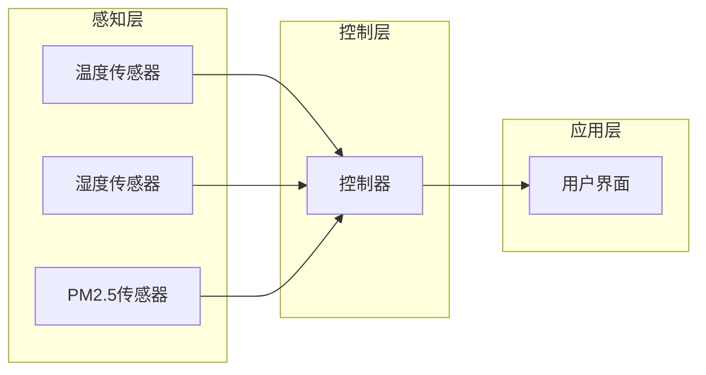

## 1. 背景介绍

### 1.1 智能家居的兴起与发展趋势

近年来，随着物联网、人工智能等技术的快速发展，智能家居的概念逐渐走入大众视野，并迅速成为科技领域的热点话题。智能家居旨在通过将家居设备连接到互联网，实现家居环境的智能化管理和控制，为用户提供更加便捷、舒适、安全的居住体验。

### 1.2 实时气候控制系统的意义

在智能家居系统中，实时气候控制系统扮演着至关重要的角色。它通过实时监测室内外温度、湿度、空气质量等环境参数，并根据用户设定的目标值，自动调节空调、加湿器、空气净化器等设备的运行状态，从而创造舒适健康的室内环境。

### 1.3 Java语言在智能家居系统开发中的优势

Java作为一种成熟、稳定、跨平台的编程语言，在智能家居系统开发中具有以下优势：

* **跨平台性:** Java程序可以在不同的操作系统和硬件平台上运行，无需修改代码，方便系统部署和维护。
* **丰富的类库:** Java拥有丰富的类库，涵盖了网络编程、数据库操作、图形界面设计等各个方面，为智能家居系统开发提供了强大的支持。
* **成熟的生态系统:** Java拥有庞大的开发者社区和丰富的开源资源，可以帮助开发者快速解决技术难题，提高开发效率。


## 2. 核心概念与联系

### 2.1 系统架构

本系统采用典型的三层架构设计，包括：

* **感知层:** 负责采集室内外环境数据，例如温度、湿度、光照强度、空气质量等。
* **控制层:** 负责接收感知层的数据，根据预设的规则和用户指令，控制空调、加湿器、空气净化器等设备的运行状态。
* **应用层:** 为用户提供友好的交互界面，方便用户查看环境数据、设置目标值、控制设备等。

### 2.2 核心组件

* **传感器:** 用于采集环境数据，例如温度传感器、湿度传感器、光照传感器、PM2.5传感器等。
* **执行器:** 用于控制设备的运行状态，例如空调控制器、加湿器控制器、空气净化器控制器等。
* **控制器:** 负责接收传感器数据和用户指令，根据预设的规则，控制执行器的运行状态。
* **用户界面:** 为用户提供友好的交互界面，方便用户查看环境数据、设置目标值、控制设备等。

### 2.3 组件间联系

* **传感器** 将采集到的环境数据发送给 **控制器**。
* **控制器** 根据预设的规则和用户指令，控制 **执行器** 的运行状态。
* **用户界面** 将用户指令发送给 **控制器**，并接收 **控制器** 发送的环境数据和设备状态信息。


## 3. 核心算法原理具体操作步骤

### 3.1 数据采集

* 传感器定期采集环境数据，并将其发送给控制器。
* 控制器接收传感器数据，并将其存储到数据库中。

### 3.2 规则引擎

* 控制器根据预设的规则，判断当前环境是否符合用户设定的目标值。
* 规则可以根据用户的需求进行自定义，例如：
    * 当室内温度高于 28 度时，开启空调制冷模式。
    * 当室内湿度低于 40% 时，开启加湿器。
    * 当室内 PM2.5 浓度高于 75 时，开启空气净化器。

### 3.3 设备控制

* 控制器根据规则引擎的判断结果，控制执行器的运行状态。
* 例如，如果规则引擎判断需要开启空调制冷模式，控制器会向空调控制器发送指令，开启空调制冷模式。

### 3.4 用户交互

* 用户可以通过用户界面查看环境数据、设置目标值、控制设备等。
* 用户界面将用户指令发送给控制器，并接收控制器发送的环境数据和设备状态信息。


## 4. 数学模型和公式详细讲解举例说明

### 4.1 PID 控制算法

PID 控制算法是一种经典的控制算法，被广泛应用于工业控制领域。PID 控制器通过计算误差值、积分值和微分值，来调整控制器的输出，从而使被控对象的输出达到目标值。

**PID 控制算法的公式如下:**

$$
u(t) = K_p e(t) + K_i \int_0^t e(\tau) d\tau + K_d \frac{de(t)}{dt}
$$

**其中:**

* $u(t)$ 为控制器的输出。
* $e(t)$ 为误差值，即目标值与实际值之差。
* $K_p$ 为比例系数。
* $K_i$ 为积分系数。
* $K_d$ 为微分系数。

**PID 控制算法的原理:**

* **比例控制:** 根据当前误差值的大小，调整控制器的输出。
* **积分控制:** 消除稳态误差，使被控对象的输出稳定在目标值。
* **微分控制:** 抑制超调，提高系统的响应速度。

**举例说明:**

假设我们要控制室内温度稳定在 25 度。

* 当室内温度低于 25 度时，误差值为负数，PID 控制器会增加输出，开启空调制热模式。
* 当室内温度高于 25 度时，误差值为正数，PID 控制器会减少输出，开启空调制冷模式。
* 通过调整 PID 参数，可以使室内温度稳定在 25 度，并保持较快的响应速度。


## 5. 项目实践：代码实例和详细解释说明

### 5.1 系统架构图



### 5.2 代码实例

**控制器代码:**

```java
import java.util.List;

public class Controller {

    private List<Sensor> sensors;
    private List<Actuator> actuators;
    private RuleEngine ruleEngine;

    public Controller(List<Sensor> sensors, List<Actuator> actuators, RuleEngine ruleEngine) {
        this.sensors = sensors;
        this.actuators = actuators;
        this.ruleEngine = ruleEngine;
    }

    public void run() {
        while (true) {
            // 采集传感器数据
            List<SensorData> sensorDataList = collectSensorData();

            // 应用规则引擎
            List<ControlCommand> controlCommandList = ruleEngine.applyRules(sensorDataList);

            // 控制执行器
            executeControlCommands(controlCommandList);

            // 等待一段时间
            Thread.sleep(1000);
        }
    }

    private List<SensorData> collectSensorData() {
        // 从传感器采集数据
        // ...
    }

    private void executeControlCommands(List<ControlCommand> controlCommandList) {
        // 控制执行器
        // ...
    }
}
```

**规则引擎代码:**

```java
import java.util.List;

public class RuleEngine {

    private List<Rule> rules;

    public RuleEngine(List<Rule> rules) {
        this.rules = rules;
    }

    public List<ControlCommand> applyRules(List<SensorData> sensorDataList) {
        // 应用规则
        // ...
    }
}
```

**规则代码:**

```java
public class Rule {

    private Condition condition;
    private Action action;

    public Rule(Condition condition, Action action) {
        this.condition = condition;
        this.action = action;
    }

    public boolean evaluate(List<SensorData> sensorDataList) {
        // 判断条件是否满足
        // ...
    }

    public ControlCommand getAction() {
        // 返回控制指令
        // ...
    }
}
```

### 5.3 代码解释

* **控制器:** 控制器是系统的核心组件，负责接收传感器数据、应用规则引擎、控制执行器。
* **规则引擎:** 规则引擎根据预设的规则，判断当前环境是否符合用户设定的目标值，并生成控制指令。
* **规则:** 规则由条件和动作组成，当条件满足时，执行相应的动作。
* **传感器:** 传感器负责采集环境数据，例如温度、湿度、PM2.5 浓度等。
* **执行器:** 执行器负责控制设备的运行状态，例如空调、加湿器、空气净化器等。


## 6. 实际应用场景

### 6.1 家庭住宅

* **自动调节室内温度:** 根据用户设定的目标温度，自动调节空调的运行状态，保持室内温度舒适。
* **自动调节室内湿度:** 根据用户设定的目标湿度，自动调节加湿器的运行状态，保持室内湿度适宜。
* **自动净化室内空气:** 根据用户设定的目标 PM2.5 浓度，自动调节空气净化器的运行状态，保持室内空气清新。

### 6.2 办公场所

* **自动调节会议室温度:** 根据会议室的使用情况，自动调节空调的运行状态，保持会议室温度舒适。
* **自动调节办公室空气质量:** 根据办公室的 PM2.5 浓度，自动调节空气净化器的运行状态，保持办公室空气清新。

### 6.3 商业场所

* **自动调节商场温度:** 根据商场的客流量，自动调节空调的运行状态，保持商场温度舒适。
* **自动调节超市冷藏柜温度:** 根据超市冷藏柜的温度，自动调节冷藏柜的运行状态，保持食品新鲜。


## 7. 工具和资源推荐

### 7.1 Java 开发工具

* **Eclipse:** 一款功能强大的 Java 集成开发环境。
* **IntelliJ IDEA:** 另一款优秀的 Java 集成开发环境。
* **NetBeans:** 一款免费的 Java 集成开发环境。

### 7.2 物联网平台

* **阿里云 IoT 平台:** 提供物联网设备接入、数据存储、数据分析等服务。
* **腾讯云 IoT 平台:** 提供物联网设备接入、数据存储、数据分析等服务。
* **华为云 IoT 平台:** 提供物联网设备接入、数据存储、数据分析等服务。

### 7.3 传感器和执行器

* **DHT11 温度湿度传感器:** 一款常用的温度湿度传感器。
* **SDS011 PM2.5 传感器:** 一款常用的 PM2.5 传感器。
* **继电器:** 用于控制设备的开关状态。


## 8. 总结：未来发展趋势与挑战

### 8.1 未来发展趋势

* **更加智能化:** 随着人工智能技术的不断发展，智能家居系统将会变得更加智能化，能够根据用户的行为习惯和环境变化，自动调整设备的运行状态，提供更加个性化的服务。
* **更加个性化:** 智能家居系统将会更加注重用户的个性化需求，提供更加灵活的定制化服务，满足不同用户的需求。
* **更加互联化:** 智能家居系统将会与其他智能设备更加紧密地互联，例如智能音箱、智能电视等，构建更加完整的智能家居生态系统。

### 8.2 挑战

* **数据安全:** 智能家居系统采集了大量的用户数据，如何保障用户数据的安全是一个重要的挑战。
* **系统稳定性:** 智能家居系统需要长期稳定运行，如何保障系统的稳定性是一个重要的挑战。
* **成本控制:** 智能家居系统的成本较高，如何降低系统的成本是一个重要的挑战。


## 9. 附录：常见问题与解答

### 9.1 如何连接传感器和执行器?

传感器和执行器可以通过各种通信协议连接到控制器，例如串口通信、I2C 通信、SPI 通信等。具体的连接方式取决于所使用的传感器和执行器的型号。

### 9.2 如何设置规则?

规则可以通过用户界面进行设置，用户可以根据自己的需求自定义规则。规则可以根据时间、环境条件、用户指令等触发，并执行相应的动作。

### 9.3 如何保障系统安全?

保障系统安全可以从以下几个方面入手:

* **使用安全的通信协议:** 使用 HTTPS 等安全的通信协议，防止数据泄露。
* **对用户数据进行加密:** 对用户数据进行加密存储，防止数据被窃取。
* **定期更新系统:** 定期更新系统，修复安全漏洞。

### 9.4 如何降低系统成本?

降低系统成本可以从以下几个方面入手:

* **选择性价比高的硬件设备:** 选择性价比高的传感器、执行器和控制器，降低硬件成本。
* **优化系统架构:** 优化系统架构，减少硬件设备的使用量，降低硬件成本。
* **使用开源软件:** 使用开源软件，降低软件成本。
