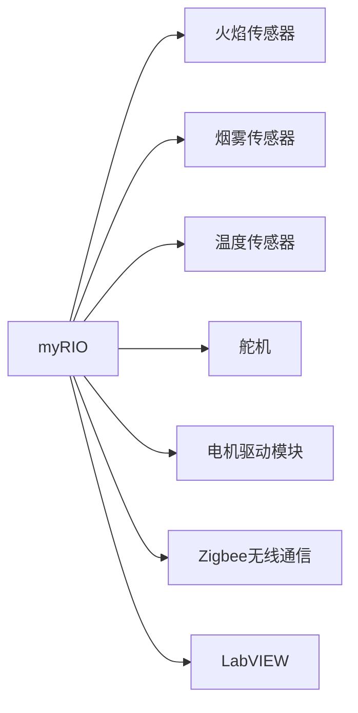

## 基于myRIO的仓库火灾检测智能车

作者：禅与计算机程序设计艺术

## 1. 背景介绍

### 1.1 仓库火灾的危害

仓库是储存大量物资的重要场所，一旦发生火灾，后果不堪设想。火灾不仅会造成巨大的经济损失，还会危及人员生命安全。近年来，随着仓库规模的不断扩大和储存物品种类的日益增多，仓库火灾事故发生的频率也呈上升趋势。

### 1.2 传统火灾检测方法的局限性

传统的仓库火灾检测方法主要依靠人工巡检和固定式传感器，存在以下局限性：

* **人工巡检效率低下且容易出错:** 依赖人工进行巡检，效率低下且容易受到人为因素的影响，难以做到全天候实时监控。
* **固定式传感器覆盖范围有限:** 固定式传感器只能监测其所在位置的火灾情况，难以覆盖整个仓库区域。
* **火灾预警不及时:** 传统方法往往在火灾发生后才能发出警报，错失了最佳灭火时机。

### 1.3 智能火灾检测技术的优势

为了克服传统方法的局限性，近年来智能火灾检测技术得到了快速发展。智能火灾检测技术利用物联网、人工智能等技术，能够实现仓库火灾的实时监测、自动预警和快速响应，有效提高火灾防控能力。

## 2. 核心概念与联系

### 2.1 myRIO嵌入式系统

myRIO是一款由美国国家仪器公司（NI）推出的嵌入式系统，它集成了FPGA、实时处理器和各种输入输出接口，非常适合用于开发智能控制系统。

### 2.2 火焰传感器

火焰传感器是一种能够感知火焰的传感器，它可以将火焰信号转换为电信号，从而实现火灾的检测。常见的火焰传感器有紫外线火焰传感器和红外线火焰传感器。

### 2.3 烟雾传感器

烟雾传感器是一种能够感知烟雾的传感器，它可以将烟雾信号转换为电信号，从而实现火灾的检测。常见的烟雾传感器有光电式烟雾传感器和离子式烟雾传感器。

### 2.4 温度传感器

温度传感器是一种能够感知温度的传感器，它可以将温度信号转换为电信号，从而实现火灾的检测。常见的温度传感器有热敏电阻和热电偶。

### 2.5 舵机

舵机是一种能够精确控制角度的电机，它可以用于控制智能车的转向。

### 2.6 电机驱动模块

电机驱动模块是一种用于控制电机转速和方向的电路模块，它可以用于控制智能车的运动。

### 2.7 Zigbee无线通信

Zigbee是一种低功耗、低成本的无线通信技术，它可以用于实现智能车与上位机之间的无线数据传输。

### 2.8 LabVIEW图形化编程环境

LabVIEW是一款由NI公司推出的图形化编程环境，它非常适合用于开发myRIO嵌入式系统。

### 2.9 概念联系图



## 3. 核心算法原理及操作步骤

### 3.1 火灾检测算法

智能车的火灾检测算法主要包括以下步骤：

1. **数据采集:**  myRIO通过火焰传感器、烟雾传感器和温度传感器采集环境数据。
2. **数据预处理:** 对采集到的数据进行滤波、校准等预处理操作，以消除噪声和误差。
3. **特征提取:** 从预处理后的数据中提取火灾特征，例如火焰强度、烟雾浓度和温度变化率。
4. **火灾判定:**  根据提取的火灾特征，利用预设的阈值或机器学习模型判断是否发生火灾。

### 3.2 智能车控制算法

智能车的控制算法主要包括以下步骤：

1. **路径规划:** 根据仓库地图和火灾发生位置，规划智能车的行驶路径。
2. **运动控制:** 控制智能车的电机和舵机，使其按照规划的路径行驶。
3. **避障:** 利用超声波传感器或其他传感器，检测智能车行驶路径上的障碍物，并进行避障操作。

### 3.3 操作步骤

1. **搭建硬件平台:** 将myRIO、传感器、电机、舵机等硬件设备组装成智能车。
2. **编写程序:** 使用LabVIEW编写智能车的火灾检测算法和控制算法。
3. **调试程序:** 将编写好的程序下载到myRIO中，并进行调试，确保智能车能够正常工作。
4. **进行测试:** 在模拟仓库环境中测试智能车的火灾检测和控制功能，验证其性能指标。

## 4. 数学模型和公式详细讲解举例说明

### 4.1 火焰传感器模型

火焰传感器输出的电压信号与火焰强度成正比，其数学模型可以表示为：

$$
V = k \cdot I
$$

其中，V表示火焰传感器输出的电压信号，I表示火焰强度，k表示比例系数。

**举例说明:**

假设火焰传感器输出的电压信号为2V，比例系数为0.5，则火焰强度为：

$$
I = \frac{V}{k} = \frac{2}{0.5} = 4
$$

### 4.2 烟雾传感器模型

烟雾传感器输出的电压信号与烟雾浓度成正比，其数学模型可以表示为：

$$
V = k \cdot C
$$

其中，V表示烟雾传感器输出的电压信号，C表示烟雾浓度，k表示比例系数。

**举例说明:**

假设烟雾传感器输出的电压信号为1V，比例系数为0.2，则烟雾浓度为：

$$
C = \frac{V}{k} = \frac{1}{0.2} = 5
$$

### 4.3 温度传感器模型

温度传感器输出的电压信号与温度成线性关系，其数学模型可以表示为：

$$
V = a \cdot T + b
$$

其中，V表示温度传感器输出的电压信号，T表示温度，a表示斜率，b表示截距。

**举例说明:**

假设温度传感器输出的电压信号为3V，斜率为0.1，截距为1，则温度为：

$$
T = \frac{V - b}{a} = \frac{3 - 1}{0.1} = 20
$$

## 5. 项目实践：代码实例和详细解释说明

### 5.1 myRIO程序代码

```labview
// 火焰传感器数据采集
Flame Sensor Value = Read Analog Input (Flame Sensor Channel);

// 烟雾传感器数据采集
Smoke Sensor Value = Read Analog Input (Smoke Sensor Channel);

// 温度传感器数据采集
Temperature Sensor Value = Read Analog Input (Temperature Sensor Channel);

// 火灾判定
if (Flame Sensor Value > Flame Threshold) or (Smoke Sensor Value > Smoke Threshold) or (Temperature Sensor Value > Temperature Threshold) then
    // 火灾警报
    Set Digital Output (Alarm LED Channel, True);

    // 控制智能车前往火灾地点
    Control Smart Car (Fire Location);
end if
```

**代码解释:**

* `Read Analog Input`函数用于读取模拟输入通道的值。
* `Set Digital Output`函数用于设置数字输出通道的值。
* `Control Smart Car`函数用于控制智能车的运动。
* `Flame Threshold`、`Smoke Threshold`和`Temperature Threshold`分别表示火焰强度、烟雾浓度和温度的阈值。

### 5.2 智能车控制程序代码

```labview
// 路径规划
Path = Plan Path (Start Location, Fire Location);

// 运动控制
for i = 1 to Length(Path) do
    // 获取当前路径点
    Current Point = Path[i];

    // 控制智能车前往当前路径点
    Control Smart Car (Current Point);

    // 避障
    if (Obstacle Detected) then
        // 避障操作
        Avoid Obstacle;
    end if
end for
```

**代码解释:**

* `Plan Path`函数用于规划智能车的行驶路径。
* `Length`函数用于获取数组的长度。
* `Control Smart Car`函数用于控制智能车的运动。
* `Obstacle Detected`表示是否检测到障碍物。
* `Avoid Obstacle`函数用于执行避障操作。

## 6. 实际应用场景

### 6.1 仓库火灾监测

智能火灾检测车可以部署在仓库中，实时监测火灾情况。一旦发生火灾，智能车能够及时发出警报，并引导消防人员前往火灾地点进行灭火。

### 6.2 危险化学品仓库监测

危险化学品仓库储存着易燃、易爆、有毒等危险化学品，火灾风险极高。智能火灾检测车可以用于监测危险化学品仓库的火灾情况，预防火灾事故的发生。

### 6.3 森林火灾监测

智能火灾检测车可以用于监测森林火灾情况，及时发现火情，并引导消防人员前往火灾地点进行灭火。

## 7. 总结：未来发展趋势与挑战

### 7.1 未来发展趋势

* **多传感器融合:** 未来智能火灾检测车将融合多种传感器，例如摄像头、气体传感器等，以提高火灾检测的准确性和可靠性。
* **人工智能技术应用:** 人工智能技术将被广泛应用于智能火灾检测车，例如图像识别、机器学习等，以实现更智能化的火灾检测和控制。
* **无人化:** 未来智能火灾检测车将朝着无人化的方向发展，以降低人工成本和提高工作效率。

### 7.2 面临的挑战

* **环境适应性:** 智能火灾检测车需要适应各种复杂的环境，例如高温、高湿、粉尘等。
* **可靠性:** 智能火灾检测车需要具备高可靠性，以确保在火灾发生时能够及时发出警报。
* **成本控制:** 智能火灾检测车的成本需要控制在合理的范围内，以使其能够得到广泛应用。

## 8. 附录：常见问题与解答

### 8.1 智能车如何避障？

智能车可以通过超声波传感器或其他传感器检测障碍物，并根据障碍物的位置和距离，调整行驶路径或停止行驶。

### 8.2 智能车如何与上位机通信？

智能车可以通过Zigbee无线通信或其他无线通信技术与上位机进行通信，传输火灾检测数据和控制指令。

### 8.3 如何提高智能车的火灾检测准确性？

可以通过以下方法提高智能车的火灾检测准确性：

* **使用高精度传感器:** 选择精度更高的火焰传感器、烟雾传感器和温度传感器。
* **优化算法:** 对火灾检测算法进行优化，提高其抗干扰能力和鲁棒性。
* **多传感器融合:** 融合多种传感器的数据，提高火灾检测的可靠性。
