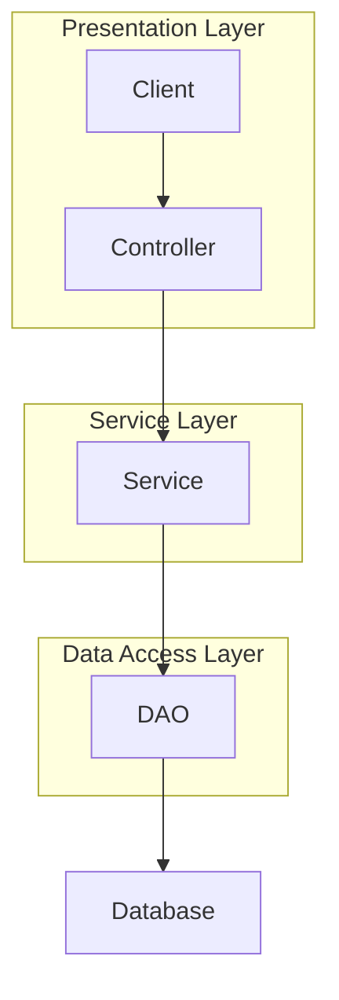

## 1. 背景介绍

### 1.1 高校奖学金管理现状

随着我国高等教育的蓬勃发展，高校学生规模不断扩大，奖学金评定工作也变得日益繁重。传统的奖学金管理方式主要依靠人工操作，存在着效率低下、容易出错、信息不透明等问题。为了提高奖学金评定的效率和公平性，越来越多的高校开始采用信息化手段进行管理。

### 1.2 SSM框架的优势

SSM框架是Spring、Spring MVC和MyBatis三个开源框架的整合，它具有以下优势：

* **轻量级框架:** SSM框架的组件都是轻量级的，易于学习和使用。
* **松耦合:** SSM框架的各个组件之间松耦合，可以灵活地进行组合和替换。
* **易于测试:** SSM框架支持单元测试和集成测试，方便进行代码质量控制。
* **强大的功能:** SSM框架提供了丰富的功能，可以满足各种应用场景的需求。

### 1.3 本系统的目标

本系统旨在利用SSM框架开发一套高校奖学金管理系统，实现以下目标：

* **提高奖学金评定效率:** 通过自动化流程，减少人工操作，提高工作效率。
* **保证奖学金评定公平公正:** 通过科学的评价体系和严格的审核机制，保证奖学金评定的公平公正。
* **提高信息透明度:** 通过系统公开奖学金评定标准、流程和结果，提高信息透明度。

## 2. 核心概念与联系

### 2.1 系统用户角色

本系统包含以下用户角色：

* **学生:** 申请奖学金、查看评审结果。
* **教师:** 提交学生成绩、参与奖学金评审。
* **管理员:** 管理系统用户、设置奖学金评定标准、审核奖学金评定结果。

### 2.2 奖学金类型

本系统支持多种奖学金类型，例如：

* **国家奖学金:** 由国家设立，奖励品学兼优的学生。
* **校级奖学金:** 由学校设立，奖励学习成绩优秀、综合素质突出的学生。
* **院系级奖学金:** 由院系设立，奖励学习成绩优秀的学生。

### 2.3 奖学金评定流程

本系统的奖学金评定流程如下：

1. 学生提交奖学金申请。
2. 教师提交学生成绩。
3. 系统根据预设的评定标准，自动计算学生得分。
4. 评审委员会对学生进行综合评审。
5. 管理员审核评审结果。
6. 系统公布评审结果。

## 3. 核心算法原理具体操作步骤

### 3.1 奖学金评分算法

本系统采用加权平均法计算学生得分，具体步骤如下：

1. 确定各项评价指标的权重。
2. 收集学生各项评价指标的得分。
3. 将各项得分乘以对应的权重，然后求和，得到学生的总得分。

### 3.2 评审委员会评审流程

评审委员会由多名教师组成，负责对学生进行综合评审。评审流程如下：

1. 评审委员会成员独立对学生进行评分。
2. 系统计算各成员评分的平均值。
3. 评审委员会成员进行讨论，最终确定学生的综合得分。

### 3.3 审核流程

管理员负责审核评审结果，审核流程如下：

1. 管理员查看学生的综合得分和评审委员会的评审意见。
2. 管理员对评审结果进行审核，确认无误后进行确认。

## 4. 数学模型和公式详细讲解举例说明

### 4.1 加权平均法公式

加权平均法的公式如下：

$$
\bar{x} = \frac{\sum_{i=1}^{n} w_i x_i}{\sum_{i=1}^{n} w_i}
$$

其中：

* $\bar{x}$ 表示加权平均值。
* $w_i$ 表示第 $i$ 个评价指标的权重。
* $x_i$ 表示第 $i$ 个评价指标的得分。
* $n$ 表示评价指标的个数。

### 4.2 举例说明

假设某奖学金的评价指标包括学习成绩、社会实践和综合素质，权重分别为 0.6、0.2 和 0.2。某学生的学习成绩为 90 分，社会实践得分为 85 分，综合素质得分为 80 分，则该学生的总得分计算如下：

$$
\bar{x} = \frac{0.6 \times 90 + 0.2 \times 85 + 0.2 \times 80}{0.6 + 0.2 + 0.2} = 87
$$

## 5. 项目实践：代码实例和详细解释说明

### 5.1 系统架构图



### 5.2 代码实例

#### 5.2.1 奖学金评分算法

```java
public class ScholarshipScoreCalculator {

    public double calculateScore(Student student, List<EvaluationIndicator> indicators) {
        double totalScore = 0;
        double totalWeight = 0;
        for (EvaluationIndicator indicator : indicators) {
            double score = getScore(student, indicator);
            double weight = indicator.getWeight();
            totalScore += score * weight;
            totalWeight += weight;
        }
        return totalScore / totalWeight;
    }

    private double getScore(Student student, EvaluationIndicator indicator) {
        // 根据评价指标获取学生得分
        // ...
    }
}
```

#### 5.2.2 评审委员会评审流程

```java
public class ReviewCommittee {

    public double review(Student student, List<Teacher> teachers) {
        List<Double> scores = new ArrayList<>();
        for (Teacher teacher : teachers) {
            double score = teacher.evaluate(student);
            scores.add(score);
        }
        double averageScore = calculateAverageScore(scores);
        // 评审委员会成员进行讨论，最终确定学生的综合得分
        // ...
        return finalScore;
    }

    private double calculateAverageScore(List<Double> scores) {
        double sum = 0;
        for (double score : scores) {
            sum += score;
        }
        return sum / scores.size();
    }
}
```

#### 5.2.3 审核流程

```java
public class Administrator {

    public void review(Student student, double finalScore, String reviewOpinion) {
        // 查看学生的综合得分和评审委员会的评审意见
        // ...
        // 对评审结果进行审核，确认无误后进行确认
        // ...
    }
}
```

## 6. 实际应用场景

### 6.1 高校奖学金评定

本系统可以应用于高校奖学金评定，提高评定效率和公平性。

### 6.2 企业人才选拔

本系统可以应用于企业人才选拔，帮助企业快速高效地选拔优秀人才。

### 6.3 其他评审场景

本系统可以应用于其他需要进行评审的场景，例如项目评审、论文评审等。

## 7. 工具和资源推荐

### 7.1 开发工具

* **Eclipse:** Java集成开发环境。
* **IntelliJ IDEA:** Java集成开发环境。
* **Maven:** 项目管理工具。
* **Git:** 版本控制工具。

### 7.2 数据库

* **MySQL:** 关系型数据库管理系统。
* **Oracle:** 关系型数据库管理系统。

### 7.3 学习资源

* **Spring官网:** https://spring.io/
* **MyBatis官网:** https://mybatis.org/

## 8. 总结：未来发展趋势与挑战

### 8.1 未来发展趋势

* **人工智能技术:** 将人工智能技术应用于奖学金评定，例如使用机器学习算法预测学生未来发展潜力。
* **大数据技术:** 利用大数据技术分析学生数据，为奖学金评定提供更科学的依据。
* **云计算技术:** 将系统部署到云平台，提高系统的可扩展性和可靠性。

### 8.2 面临的挑战

* **数据安全:** 保证学生数据的安全性和隐私性。
* **系统性能:** 随着学生规模的扩大，系统性能面临挑战。
* **用户体验:** 不断优化系统用户体验，提高用户满意度。

## 9. 附录：常见问题与解答

### 9.1 如何申请奖学金？

学生登录系统后，点击“申请奖学金”按钮，填写相关信息并提交即可。

### 9.2 如何查看评审结果？

学生登录系统后，点击“查看评审结果”按钮，即可查看自己的评审结果。

### 9.3 如何修改个人信息？

学生登录系统后，点击“个人中心”按钮，即可修改个人信息。
