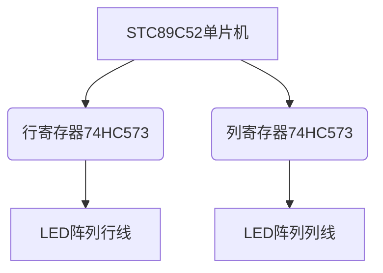

# 基于单片机的LED广告牌设计

## 1. 背景介绍

### 1.1 LED广告牌的重要性

在当今快节奏的商业社会中,有效的广告宣传对于企业的成功至关重要。传统的广告牌虽然仍然存在,但它们的局限性日益显现。相比之下,LED广告牌凭借其亮度高、显示效果好、可编程性强等优势,逐渐成为城市景观中不可或缺的一部分。

### 1.2 单片机在LED广告牌中的应用

LED广告牌的核心是对大量LED像素进行实时控制,这对传统PC来说是一个巨大的挑战。而单片机作为一种专用的微控制器,其体积小、成本低、实时性好、抗干扰能力强等特点,使其成为LED广告牌控制系统的不二之选。

## 2. 核心概念与联系 

### 2.1 LED显示原理

LED(发光二极管)是一种能够将电能转换为可见光的固态器件。通过控制LED两端的正反向电压,可以实现点亮和熄灭。将大量LED按一定规则排列,就可以构成像素阵列,进而显示文字、图像等。

### 2.2 单片机工作原理

单片机是一种集成了CPU、RAM、ROM、I/O接口等在一个芯片上的微型计算机系统。它可以独立运行,读取指令、处理数据并控制外围设备。通过对单片机进行编程,就可以实现各种控制和计算功能。

### 2.3 LED控制方法

常见的LED控制方法有:

1. 直接控制:单片机直接控制每个LED的开关状态
2.动态扫描:利用视觉残影原理,通过快速扫描点亮不同LED达到显示效果
3.驱动芯片:利用专门的LED驱动芯片,由单片机发送显示数据

## 3. 核心算法原理具体操作步骤

### 3.1 动态扫描原理

动态扫描是LED控制的一种常用方法。它的核心思想是利用视觉残影原理,通过快速扫描点亮不同LED,人眼会感知为持续的显示效果。

具体步骤如下:

1. 将LED阵列分为行和列
2. 设置行和列寄存器,分别控制行和列的状态
3. 从第一行开始,将行寄存器置1,列寄存器根据需要点亮的像素置1或0
4. 暂停一个很短的时间后,将行寄存器清0,转至下一行
5. 重复步骤3和4,循环扫描所有行
6. 扫描完一次后,根据需要刷新显示数据

该算法的优点是硬件开销小,控制相对简单。缺点是刷新频率有限,可能出现闪烁。

### 3.2 驱动芯片控制原理

采用专门的LED驱动芯片可以大幅减轻单片机的负担。常见的驱动芯片有:

- 常规静态驱动芯片:如74HC595等,通过移位寄存器控制LED状态
- 智能驱动芯片:如HT1632C等,内置显示RAM和多种显示模式

使用驱动芯片的基本步骤:

1. 初始化驱动芯片
2. 向驱动芯片发送显示数据
3. 设置驱动芯片工作模式
4. 定期刷新显示数据

相比动态扫描,驱动芯片控制更加灵活,可实现更高的刷新频率和更复杂的显示效果。

### 3.3 单片机编程流程

单片机编程的一般流程是:

1. 分析需求,规划硬件电路和软件结构
2. 绘制硬件原理图,选择合适的单片机和外围器件
3. 设计软件流程,编写单片机程序
4. 连接硬件电路,下载并调试程序
5. 测试并修正BUG

## 4. 数学模型和公式详细讲解举例说明

### 4.1 LED亮度控制公式

LED的亮度主要由通过它的电流决定,可以用下面的公式近似描述:

$$L = kI^n$$

其中:
- $L$表示LED的亮度
- $I$表示通过LED的电流
- $k$和$n$是与LED材料和结构有关的常数

我们可以通过改变LED两端的电压,从而控制通过电流,进而控制亮度。

### 4.2 视觉残影时间计算

动态扫描算法利用了视觉残影原理。人眼对图像的感知并非瞬时的,而是有一个积分过程。如果两幅图像的时间间隔小于一个临界值,人眼就会把它们积分为一幅图像。

这个临界值就是视觉残影时间$\tau$,通常认为$\tau \approx 0.1s$。

为了使动态扫描的显示效果没有明显的闪烁,需要满足:

$$\frac{1}{f_{scan}} < \tau$$

其中$f_{scan}$是扫描频率,也就是单位时间内重复扫描所有行的次数。

例如,如果LED阵列有64行,我们希望扫描频率至少为200Hz,那么单片机至少要以12800次/秒的频率驱动LED,从而避免闪烁。

## 4. 项目实践:代码实例和详细解释说明

### 4.1 硬件设计

假设我们使用单片机STC89C52控制一个16x16的LED点阵,并采用动态扫描的方式。硬件电路如下:



其中74HC573是一种八位锁存器,用于分别控制LED阵列的行和列。单片机的并行端口P0连接行锁存器,P2连接列锁存器。

### 4.2 软件设计

我们可以编写一个简单的动态扫描程序,实现对LED阵列的基本控制。

```c
#include <reg52.h>

//行列锁存器端口定义
sbit LATCH_ROW = P3^2;  
sbit LATCH_COL = P3^3;

//扫描显示缓冲区
unsigned char RowData[16];  

//延时函数
void DelayMs(unsigned int ms)
{
    unsigned int x,y; 
    for(x=ms;x>0;x--)
        for(y=100;y>0;y--);
}

//主程序
void main()
{    
    unsigned char i;

    while(1)
    {
        //扫描所有行
        for(i=0;i<16;i++)
        {
            //设置行锁存器
            LATCH_ROW = 1;
            P0 = ~(0x0001<<i);  
            LATCH_ROW = 0;

            //设置列锁存器
            LATCH_COL = 1;  
            P2 = RowData[i];
            LATCH_COL = 0;

            //延时
            DelayMs(1);
        }
    }
}
```

该程序的工作流程是:

1. 定义行列锁存器的端口,以及显示缓冲区
2. 进入死循环,不断扫描所有行
3. 对于每一行,首先设置行锁存器以选中该行
4. 然后设置列锁存器,根据显示缓冲区点亮对应的列
5. 延时一小段时间,防止行切换过快导致视觉残影消失
6. 重复3-5,完成一次完整的扫描

通过修改RowData数组的内容,我们就可以显示不同的图案。

## 5. 实际应用场景

LED广告牌的应用场景非常广泛,包括:

1. 商场、超市、车站等公共场所的商业广告
2. 体育场馆的显示屏和记分牌 
3. 交通指示牌和电子路牌
4. 户外大型显示屏
5. 艺术装置和建筑装饰

除了广告宣传外,LED显示屏还可用于信息发布、警示标识、交通引导等多种用途。

## 6. 工具和资源推荐

对于单片机LED控制项目,有以下常用的工具和资源可供参考:

- 单片机开发工具:Keil,IAR等IDE
- 单片机仿真器:Proteus等
- 在线文档:单片机手册、编程指南等
- 技术论坛:如单片机论坛、电子发烧友论坛等
- 开源硬件平台:Arduino、Raspberry Pi等

这些资源可以帮助开发者快速入门,提高开发效率。

## 7. 总结:未来发展趋势与挑战

LED广告牌作为一种新兴的显示载体,未来仍有很大的发展空间。

- 显示技术将朝着更高分辨率、更大尺寸、更真实色彩等方向发展
- 控制系统将向更智能化、更节能的方向发展
- 互联网技术的融合,将使LED广告牌具备更强的交互性和个性化能力

但同时,LED广告牌在能耗、视觉污染、光污染等方面也面临一些挑战,需要相关技术的不断改进。

## 8. 附录:常见问题与解答  

1. 单片机与LED阵列如何连接?

   单片机的并行端口通常连接到LED阵列的行列锁存器电路。每个端口位控制一行或一列。

2. 动态扫描为什么会出现闪烁?

   动态扫描利用视觉残影原理,如果扫描频率过低,人眼就会感知到闪烁。

3. 如何提高动态扫描的刷新频率?

   可以采用更高频率的单片机,或在程序中插入等待延时来加快扫描速度。

4. 驱动芯片的优缺点是什么?

   优点是控制更灵活,刷新频率更高。缺点是增加了硬件成本和复杂度。

5. LED广告牌的发展趋势是什么?

   未来将朝着更高分辨率、更大尺寸、节能环保以及智能交互的方向发展。

以上就是关于基于单片机的LED广告牌设计的全部内容。如有任何疑问,欢迎随时询问。