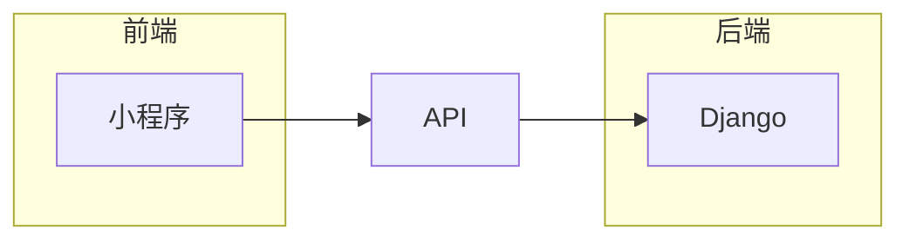

## 1. 背景介绍

### 1.1 花卉市场的现状与挑战

随着人们生活水平的提高，对生活品质的追求也越来越高，花卉作为一种能够美化环境、陶冶情操的商品，其市场需求日益增长。然而，传统的花卉销售模式存在着诸多弊端，例如：

* **信息不对称：**消费者难以获取到全面的花卉信息，包括品种、价格、养护知识等。
* **交易效率低下：**传统的线下交易方式，需要消费者亲自到店挑选，耗费时间和精力。
* **库存管理困难：**花卉作为一种生鲜商品，保鲜期短，库存管理难度大，容易造成浪费。

### 1.2 微信小程序的优势

微信小程序作为一种轻量级的应用程序，具有以下优势：

* **无需下载安装：**用户无需下载安装APP，即可直接在微信内使用小程序，方便快捷。
* **开发成本低：**相比于传统的APP开发，小程序的开发成本更低，开发周期更短。
* **用户基数大：**微信拥有庞大的用户群体，小程序可以借助微信平台快速触达目标用户。

### 1.3 基于微信小程序的花卉销售管理系统的意义

基于微信小程序的花卉销售管理系统，可以有效解决传统花卉销售模式的弊端，提升交易效率，降低运营成本，为消费者提供更便捷、优质的服务。

## 2. 核心概念与联系

### 2.1 系统架构

本系统采用前后端分离的架构，前端使用微信小程序，后端使用 Python 的 Django 框架。



### 2.2 功能模块

本系统主要包含以下功能模块：

* **用户模块：**用户注册、登录、个人信息管理、订单管理等。
* **商品模块：**商品分类、商品列表、商品详情、购物车、下单等。
* **支付模块：**微信支付、支付宝支付等。
* **物流模块：**物流信息查询、配送状态跟踪等。
* **后台管理模块：**商品管理、订单管理、用户管理、数据统计等。

### 2.3 数据模型

本系统主要涉及以下数据模型：

* **用户：**包含用户ID、用户名、密码、昵称、头像、手机号、地址等信息。
* **商品：**包含商品ID、商品名称、商品分类、商品图片、商品价格、商品库存、商品描述等信息。
* **订单：**包含订单ID、用户ID、商品ID、订单金额、订单状态、创建时间、支付时间、发货时间等信息。

## 3. 核心算法原理具体操作步骤

### 3.1 商品推荐算法

本系统采用基于内容的推荐算法，根据用户的浏览历史、购买记录等信息，推荐用户可能感兴趣的商品。

**具体操作步骤：**

1. 收集用户的浏览历史、购买记录等数据。
2. 对商品进行特征提取，例如商品分类、商品标签等。
3. 计算用户与商品之间的相似度，例如余弦相似度。
4. 根据相似度排序，推荐相似度最高的商品。

### 3.2 库存管理算法

本系统采用先进先出（FIFO）的库存管理算法，确保商品的新鲜度。

**具体操作步骤：**

1. 当有新商品入库时，将其添加到库存列表的末尾。
2. 当用户下单时，从库存列表的头部取出商品。
3. 当商品库存不足时，及时提醒管理员补充库存。

## 4. 数学模型和公式详细讲解举例说明

### 4.1 余弦相似度

余弦相似度是一种常用的计算文本相似度的算法，其公式如下：

$$
\cos(\theta) = \frac{A \cdot B}{||A|| ||B||}
$$

其中，$A$ 和 $B$ 分别表示两个向量，$||A||$ 和 $||B||$ 分别表示向量 $A$ 和 $B$ 的模。

**举例说明：**

假设用户 A 购买了商品 1 和商品 2，用户 B 购买了商品 2 和商品 3，则用户 A 和用户 B 的商品向量分别为：

$$
A = (1, 1, 0)
$$

$$
B = (0, 1, 1)
$$

则用户 A 和用户 B 的余弦相似度为：

$$
\cos(\theta) = \frac{(1, 1, 0) \cdot (0, 1, 1)}{||(1, 1, 0)|| ||(0, 1, 1)||} = \frac{1}{\sqrt{2} \sqrt{2}} = \frac{1}{2}
$$

### 4.2 先进先出（FIFO）

先进先出（FIFO）是一种常用的库存管理算法，其原理是先入库的商品先出库。

**举例说明：**

假设仓库中有 3 件商品，入库顺序分别为 A、B、C，则出库顺序为 A、B、C。

## 5. 项目实践：代码实例和详细解释说明

### 5.1 前端代码

```javascript
// 商品列表页面

Page({
   {
    goodsList: [], // 商品列表
  },

  onLoad: function () {
    // 获取商品列表数据
    wx.request({
      url: 'https://api.example.com/goods',
      success: res => {
        this.setData({
          goodsList: res.data,
        });
      },
    });
  },

  // 点击商品跳转到商品详情页面
  onGoodsTap: function (e) {
    const goodsId = e.currentTarget.dataset.id;
    wx.navigateTo({
      url: `/pages/goodsDetail/goodsDetail?id=${goodsId}`,
    });
  },
});
```

### 5.2 后端代码

```python
# 商品模型

class Goods(models.Model):
    name = models.CharField(max_length=100)
    category = models.CharField(max_length=50)
    image = models.ImageField(upload_to='goods')
    price = models.DecimalField(max_digits=10, decimal_places=2)
    stock = models.IntegerField()
    description = models.TextField()

# 获取商品列表接口

@api_view(['GET'])
def get_goods_list(request):
    goods = Goods.objects.all()
    serializer = GoodsSerializer(goods, many=True)
    return Response(serializer.data)
```

## 6. 实际应用场景

基于微信小程序的花卉销售管理系统可以应用于以下场景：

* **花店：**提升花店的线上销售能力，扩大销售范围。
* **花卉市场：**为花卉市场提供线上交易平台，方便消费者选购。
* **花卉种植基地：**直接面向消费者销售花卉，减少中间环节。

## 7. 总结：未来发展趋势与挑战

随着移动互联网技术的不断发展，基于微信小程序的花卉销售管理系统将会得到更广泛的应用。未来，该系统将朝着以下方向发展：

* **个性化推荐：**利用大数据和人工智能技术，为用户提供更精准的商品推荐服务。
* **智能客服：**利用自然语言处理技术，为用户提供智能客服服务，解答用户疑问。
* **供应链金融：**为花卉企业提供供应链金融服务，解决资金周转问题。

然而，该系统也面临着一些挑战：

* **数据安全：**如何保障用户数据的安全，防止数据泄露。
* **竞争压力：**随着越来越多的企业进入花卉电商领域，市场竞争将会更加激烈。
* **技术更新：**移动互联网技术更新迭代速度快，需要不断学习和掌握新技术。

## 8. 附录：常见问题与解答

### 8.1 如何注册账号？

在小程序首页点击“我的”，然后点击“注册”，输入手机号、验证码、密码即可完成注册。

### 8.2 如何下单？

在商品详情页面点击“加入购物车”，然后进入购物车页面，选择要购买的商品，点击“结算”，选择支付方式，完成支付即可下单成功。

### 8.3 如何查看订单？

在小程序首页点击“我的”，然后点击“我的订单”，即可查看所有订单。