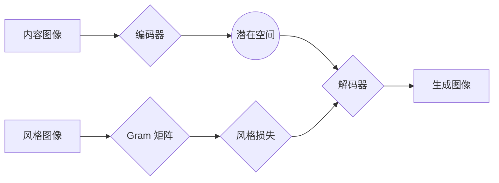

# 基于生成对抗网络的图像风格迁移效果评价体系研究

作者：禅与计算机程序设计艺术

## 1. 背景介绍

### 1.1 图像风格迁移技术的兴起

近年来，随着深度学习技术的快速发展，图像风格迁移技术取得了显著的进步。这项技术能够将一幅图像的艺术风格迁移到另一幅图像上，生成全新的、具有艺术感染力的图像作品。从最初的基于传统图像处理方法的风格迁移，到基于神经网络的风格迁移算法，再到如今基于生成对抗网络 (GAN) 的风格迁移技术，图像风格迁移技术不断革新，生成的图像质量也不断提高。

### 1.2 风格迁移效果评价的必要性

然而，随着风格迁移技术的蓬勃发展，如何客观、准确地评价风格迁移效果成为了一个亟待解决的问题。传统的图像质量评价指标，如峰值信噪比 (PSNR) 和结构相似性 (SSIM)，往往难以准确地反映风格迁移图像的艺术价值和视觉效果。因此，建立一套专门针对风格迁移效果的评价体系显得尤为重要。

### 1.3 本文研究目标

本文旨在研究基于生成对抗网络的图像风格迁移效果评价体系，以期为风格迁移技术的进一步发展提供参考和指导。

## 2. 核心概念与联系

### 2.1 生成对抗网络 (GAN)

生成对抗网络 (GAN) 是一种深度学习模型，由生成器 (Generator) 和判别器 (Discriminator) 组成。生成器负责生成逼真的图像，而判别器则负责判断图像是真实的还是生成的。生成器和判别器相互对抗，不断提升各自的能力，最终生成高质量的图像。

### 2.2 图像风格迁移

图像风格迁移是指将一幅图像的艺术风格迁移到另一幅图像上，生成全新的、具有艺术感染力的图像作品。基于 GAN 的风格迁移算法通常采用两个生成器，分别用于生成内容图像和风格图像，然后将两者融合生成最终的风格迁移图像。

### 2.3 图像质量评价

图像质量评价是指对图像的视觉效果进行客观评价，常用的指标包括峰值信噪比 (PSNR)、结构相似性 (SSIM) 等。

## 3. 核心算法原理具体操作步骤

### 3.1 基于 GAN 的风格迁移算法

#### 3.1.1 CycleGAN

CycleGAN 是一种基于循环一致性的 GAN 模型，用于实现无监督的图像风格迁移。它包含两个生成器和两个判别器，分别用于将图像从源域转换到目标域，以及将图像从目标域转换回源域。通过循环一致性损失函数，CycleGAN 能够确保生成的图像保持内容图像的语义信息，同时迁移目标图像的风格特征。

#### 3.1.2  DualGAN

DualGAN 与 CycleGAN 类似，也采用了循环一致性损失函数，但它使用两个独立的 GAN 模型进行训练，分别用于生成内容图像和风格图像。

#### 3.1.3  UNIT

UNIT (Unsupervised Image-to-Image Translation Networks) 是一种基于共享潜在空间的 GAN 模型，用于实现跨域图像转换。它假设源域和目标域的图像共享相同的潜在空间，并通过编码器-解码器结构将图像映射到该潜在空间。

### 3.2 风格迁移效果评价指标

#### 3.2.1 基于内容的评价指标

- **内容相似度 (Content Similarity)**：用于衡量生成图像与内容图像之间的相似度，可以使用 PSNR、SSIM 等指标进行计算。
- **语义一致性 (Semantic Consistency)**：用于衡量生成图像是否保留了内容图像的语义信息，可以使用语义分割、目标检测等方法进行评估。

#### 3.2.2  基于风格的评价指标

- **风格相似度 (Style Similarity)**：用于衡量生成图像与风格图像之间的相似度，可以使用 Gram 矩阵等方法进行计算。
- **风格迁移度 (Style Transferability)**：用于衡量生成图像是否成功地迁移了风格图像的艺术风格，可以使用主观评价、风格分类等方法进行评估。

## 4. 数学模型和公式详细讲解举例说明

### 4.1 CycleGAN 的数学模型

CycleGAN 的目标函数包含三个部分：对抗性损失、循环一致性损失和身份损失。

**对抗性损失**：用于鼓励生成器生成逼真的图像，其公式如下：

$$
\begin{aligned}
L_{GAN}(G, D_Y, X, Y) &= \mathbb{E}_{y\sim p_{data}(y)}[\log D_Y(y)] \\
&+ \mathbb{E}_{x\sim p_{data}(x)}[\log(1 - D_Y(G(x)))]
\end{aligned}
$$

其中，$G$ 表示生成器，$D_Y$ 表示目标域的判别器，$X$ 表示源域的数据，$Y$ 表示目标域的数据。

**循环一致性损失**：用于确保生成图像保持内容图像的语义信息，其公式如下：

$$
\begin{aligned}
L_{cyc}(G, F) &= \mathbb{E}_{x\sim p_{data}(x)}[\|F(G(x)) - x\|_1] \\
&+ \mathbb{E}_{y\sim p_{data}(y)}[\|G(F(y)) - y\|_1]
\end{aligned}
$$

其中，$F$ 表示将图像从目标域转换回源域的生成器。

**身份损失**：用于鼓励生成器在输入图像与输出图像相同时保持一致性，其公式如下：

$$
\begin{aligned}
L_{identity}(G, F) &= \mathbb{E}_{x\sim p_{data}(x)}[\|G(x) - x\|_1] \\
&+ \mathbb{E}_{y\sim p_{data}(y)}[\|F(y) - y\|_1]
\end{aligned}
$$

### 4.2 Gram 矩阵

Gram 矩阵用于计算图像的风格特征，其公式如下：

$$
G_{ij} = \sum_k F_{ik}F_{jk}
$$

其中，$F$ 表示图像的特征图，$i$ 和 $j$ 表示特征图的通道索引。

## 5. 项目实践：代码实例和详细解释说明

### 5.1 使用 PyTorch 实现 CycleGAN

```python
import torch
import torch.nn as nn

class Generator(nn.Module):
    def __init__(self):
        super(Generator, self).__init__()
        # 定义生成器的网络结构

    def forward(self, x):
        # 定义生成器的 forward 函数

class Discriminator(nn.Module):
    def __init__(self):
        super(Discriminator, self).__init__()
        # 定义判别器的网络结构

    def forward(self, x):
        # 定义判别器的 forward 函数

# 定义 CycleGAN 模型
class CycleGAN(nn.Module):
    def __init__(self):
        super(CycleGAN, self).__init__()
        self.G_XtoY = Generator()
        self.G_YtoX = Generator()
        self.D_X = Discriminator()
        self.D_Y = Discriminator()

    def forward(self, x, y):
        # 定义 CycleGAN 的 forward 函数

# 定义损失函数
gan_loss = nn.BCELoss()
cycle_loss = nn.L1Loss()
identity_loss = nn.L1Loss()

# 定义优化器
optimizer_G = torch.optim.Adam(list(cyclegan.G_XtoY.parameters()) + list(cyclegan.G_YtoX.parameters()))
optimizer_D = torch.optim.Adam(list(cyclegan.D_X.parameters()) + list(cyclegan.D_Y.parameters()))

# 训练 CycleGAN 模型
for epoch in range(num_epochs):
    for x, y in dataloader:
        # 训练判别器
        optimizer_D.zero_grad()
        # 计算判别器损失
        # ...
        D_loss.backward()
        optimizer_D.step()

        # 训练生成器
        optimizer_G.zero_grad()
        # 计算生成器损失
        # ...
        G_loss.backward()
        optimizer_G.step()
```

### 5.2 使用 Gram 矩阵计算风格相似度

```python
import torch

def gram_matrix(x):
    # 计算 Gram 矩阵
    b, c, h, w = x.size()
    features = x.view(b * c, h * w)
    G = torch.mm(features, features.t())
    return G.div(h * w)

# 计算风格相似度
style_similarity = torch.mean(torch.abs(gram_matrix(style_features) - gram_matrix(generated_features)))
```

## 6. 实际应用场景

### 6.1 艺术创作

图像风格迁移技术可以应用于艺术创作，例如将名画的风格迁移到照片上，生成全新的艺术作品。

### 6.2 照片编辑

图像风格迁移技术可以用于照片编辑，例如将照片转换为卡通风格、油画风格等。

### 6.3 视频游戏

图像风格迁移技术可以用于视频游戏，例如将游戏场景转换为不同的艺术风格。

## 7. 工具和资源推荐

### 7.1 PyTorch

PyTorch 是一种流行的深度学习框架，提供了丰富的工具和资源，方便用户实现和训练 GAN 模型。

### 7.2 TensorFlow

TensorFlow 也是一种流行的深度学习框架，同样提供了丰富的工具和资源，方便用户实现和训练 GAN 模型。

### 7.3 PapersWithCode

PapersWithCode 是一个收集了大量机器学习论文和代码的网站，用户可以在这里找到最新的 GAN 模型和代码实现。

## 8. 总结：未来发展趋势与挑战

### 8.1 未来发展趋势

- **更高质量的风格迁移**: 随着 GAN 模型的不断发展，未来将会出现更高质量的风格迁移算法，生成更加逼真、更具艺术感染力的图像。
- **更广泛的应用场景**: 图像风格迁移技术将会应用于更广泛的领域，例如虚拟现实、增强现实、医疗影像等。
- **更客观的评价体系**: 未来将会出现更加客观的风格迁移效果评价体系，能够更加准确地反映风格迁移图像的艺术价值和视觉效果。

### 8.2  挑战

- **风格迁移的控制**: 如何更加精细地控制风格迁移的效果，例如调整风格的强度、迁移特定的风格元素等，仍然是一个挑战。
- **风格迁移的泛化能力**: 如何提高风格迁移算法的泛化能力，使其能够适应不同的图像内容和风格，也是一个挑战。
- **评价体系的完善**: 如何建立更加完善的风格迁移效果评价体系，能够更加全面地评价风格迁移图像的质量，仍然是一个挑战。

## 9. 附录：常见问题与解答

### 9.1  问：什么是 Gram 矩阵？

答：Gram 矩阵用于计算图像的风格特征，它反映了图像不同特征通道之间的相关性。

### 9.2  问：如何评价风格迁移的效果？

答：可以使用内容相似度、语义一致性、风格相似度、风格迁移度等指标来评价风格迁移的效果。

### 9.3  问：图像风格迁移有哪些应用场景？

答：图像风格迁移可以应用于艺术创作、照片编辑、视频游戏等领域。


## 10. 核心概念原理和架构的 Mermaid流程图



**图 1：基于 GAN 的图像风格迁移算法流程图**

该流程图展示了基于 GAN 的图像风格迁移算法的基本流程。首先，内容图像被编码器映射到潜在空间，然后解码器将潜在空间的特征解码成生成图像。同时，风格图像的 Gram 矩阵被用来计算风格损失，并用于指导解码器生成具有特定风格的图像。
