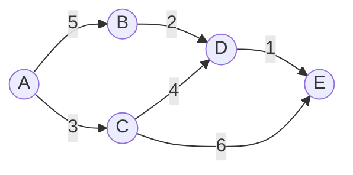

## 1. 背景介绍

### 1.1 交通拥堵的挑战

现代社会，城市化进程不断加快，交通拥堵已成为全球各大城市面临的共同难题。交通拥堵不仅浪费时间和能源，也加剧了环境污染，降低了城市生活质量。如何有效缓解交通拥堵，提高交通效率，已成为城市规划和交通管理的重要课题。

### 1.2 智能交通系统的崛起

近年来，随着物联网、云计算、大数据、人工智能等技术的快速发展，智能交通系统 (ITS) 应运而生。ITS 通过整合先进技术手段，对交通流量进行实时监控、分析和预测，并根据交通状况动态调整交通信号灯配时、优化路线规划等，从而提高交通效率，缓解交通拥堵。

### 1.3 遗传算法在路线优化中的应用

遗传算法 (GA) 是一种模拟生物进化过程的优化算法，具有全局搜索能力强、鲁棒性好等优点，在解决复杂优化问题方面表现出色。将遗传算法应用于交通路线优化，可以有效地搜索出最优或近似最优的路线方案，为缓解交通拥堵提供新的思路和方法。

## 2. 核心概念与联系

### 2.1 遗传算法

#### 2.1.1 概述

遗传算法是一种模拟自然选择和遗传机制的优化算法，通过模拟生物进化过程，在解空间中搜索最优解。其基本思想是将问题的解编码为染色体，通过选择、交叉、变异等操作，不断迭代进化，最终得到最优解或近似最优解。

#### 2.1.2 关键步骤

1. **初始化种群:** 随机生成一组初始解，称为种群。
2. **评估适应度:**  根据目标函数评估每个个体的适应度，即解的优劣程度。
3. **选择:**  根据适应度选择优良个体，淘汰劣质个体。
4. **交叉:**  将选出的两个父代个体进行基因交叉，产生新的子代个体。
5. **变异:**  对子代个体进行随机变异，增加种群多样性。
6. **终止条件:**  当满足终止条件时，算法停止迭代，输出最优解。

### 2.2 路线优化问题

#### 2.2.1 定义

路线优化问题是指在给定的路网中，寻找一条从起点到终点的最优路径，满足一定的约束条件，例如最短时间、最短距离、最低成本等。

#### 2.2.2 约束条件

* **路网拓扑结构:**  路网的节点和边信息，包括道路长度、通行能力、限速等。
* **交通状况:**  实时交通流量、道路拥堵情况等。
* **用户需求:**  起点、终点、出发时间、交通工具等。

### 2.3 遗传算法与路线优化的联系

遗传算法可以有效地解决路线优化问题，其优势在于：

* **全局搜索能力强:**  遗传算法不受局部最优解的限制，能够在整个解空间中搜索最优解。
* **鲁棒性好:**  遗传算法对初始解和参数设置不敏感，能够适应不同的路网环境和交通状况。
* **易于并行化:**  遗传算法的各个步骤可以并行执行，提高计算效率。

## 3. 核心算法原理具体操作步骤

### 3.1 染色体编码

#### 3.1.1 概述

将路线表示为染色体，每个基因代表路段或节点。

#### 3.1.2 编码方式

* **二进制编码:**  使用 0 和 1 表示路段是否被选中。
* **整数编码:**  使用整数表示节点序号。
* **实数编码:**  使用实数表示节点坐标。

### 3.2 适应度函数

#### 3.2.1 概述

评估路线优劣的指标，例如时间、距离、成本等。

#### 3.2.2 计算方法

* **基于时间:**  计算路线总行驶时间。
* **基于距离:**  计算路线总行驶距离。
* **基于成本:**  综合考虑时间、距离、油耗等因素计算路线总成本。

### 3.3 选择操作

#### 3.3.1 概述

根据适应度选择优良个体，淘汰劣质个体。

#### 3.3.2 选择方法

* **轮盘赌选择:**  根据适应度比例选择个体。
* **锦标赛选择:**  随机选择多个个体，选出适应度最高的个体。

### 3.4 交叉操作

#### 3.4.1 概述

将两个父代个体进行基因交叉，产生新的子代个体。

#### 3.4.2 交叉方法

* **单点交叉:**  随机选择一个交叉点，交换两个父代个体交叉点之后的基因。
* **多点交叉:**  随机选择多个交叉点，交换两个父代个体交叉点之间的基因。

### 3.5 变异操作

#### 3.5.1 概述

对子代个体进行随机变异，增加种群多样性。

#### 3.5.2 变异方法

* **位翻转:**  随机选择一个基因，将其值取反。
* **基因交换:**  随机选择两个基因，交换它们的值。

## 4. 数学模型和公式详细讲解举例说明

### 4.1 路网模型

假设路网是一个无向图 $G = (V, E)$，其中:

* $V$ 表示节点集合，代表路口或地点。
* $E$ 表示边集合，代表道路。

每条边 $e \in E$ 都有一个权重 $w_e$，代表该路段的长度、通行时间或成本。

### 4.2 路线表示

一条路线可以用一个节点序列表示，例如：$r = (v_1, v_2, ..., v_n)$，其中 $v_i \in V$。

### 4.3 适应度函数

#### 4.3.1 基于时间的适应度函数

$$
f_t(r) = \sum_{i=1}^{n-1} w_{(v_i, v_{i+1})}
$$

其中 $w_{(v_i, v_{i+1})}$ 表示路段 $(v_i, v_{i+1})$ 的通行时间。

#### 4.3.2 基于距离的适应度函数

$$
f_d(r) = \sum_{i=1}^{n-1} d_{(v_i, v_{i+1})}
$$

其中 $d_{(v_i, v_{i+1})}$ 表示路段 $(v_i, v_{i+1})$ 的长度。

#### 4.3.3 基于成本的适应度函数

$$
f_c(r) = \sum_{i=1}^{n-1} c_{(v_i, v_{i+1})}
$$

其中 $c_{(v_i, v_{i+1})}$ 表示路段 $(v_i, v_{i+1})$ 的成本，可以综合考虑时间、距离、油耗等因素。

### 4.4 举例说明

假设有一个简单的路网，包含 5 个节点和 6 条边，如下图所示：



假设起点为 A，终点为 E，使用基于时间的适应度函数，则路线 (A, B, D, E) 的适应度为：

$$
f_t((A, B, D, E)) = 5 + 2 + 1 = 8
$$

## 5. 项目实践：代码实例和详细解释说明

### 5.1 Python 代码实现

```python
import random

# 定义路网
graph = {
    'A': {'B': 5, 'C': 3},
    'B': {'D': 2},
    'C': {'D': 4, 'E': 6},
    'D': {'E': 1},
    'E': {}
}

# 定义遗传算法参数
population_size = 100
generations = 100
mutation_rate = 0.1

# 定义染色体编码方式
def encode_chromosome(route):
    chromosome = []
    for i in range(len(route) - 1):
        chromosome.append((route[i], route[i + 1]))
    return chromosome

# 定义适应度函数
def fitness_function(chromosome):
    total_time = 0
    for gene in chromosome:
        total_time += graph[gene[0]][gene[1]]
    return total_time

# 定义选择操作
def selection(population):
    # 使用轮盘赌选择
    fitness_values = [fitness_function(chromosome) for chromosome in population]
    total_fitness = sum(fitness_values)
    probabilities = [fitness / total_fitness for fitness in fitness_values]
    selected_indices = random.choices(range(len(population)), weights=probabilities, k=len(population))
    return [population[i] for i in selected_indices]

# 定义交叉操作
def crossover(parent1, parent2):
    # 使用单点交叉
    crossover_point = random.randint(1, len(parent1) - 1)
    child1 = parent1[:crossover_point] + parent2[crossover_point:]
    child2 = parent2[:crossover_point] + parent1[crossover_point:]
    return child1, child2

# 定义变异操作
def mutation(chromosome):
    # 使用位翻转
    if random.random() < mutation_rate:
        mutation_point = random.randint(0, len(chromosome) - 1)
        chromosome[mutation_point] = (chromosome[mutation_point][1], chromosome[mutation_point][0])
    return chromosome

# 初始化种群
population = []
for i in range(population_size):
    route = ['A']
    while route[-1] != 'E':
        neighbors = list(graph[route[-1]].keys())
        route.append(random.choice(neighbors))
    population.append(encode_chromosome(route))

# 迭代进化
for generation in range(generations):
    # 选择
    population = selection(population)
    
    # 交叉
    new_population = []
    for i in range(0, len(population), 2):
        parent1 = population[i]
        parent2 = population[i + 1]
        child1, child2 = crossover(parent1, parent2)
        new_population.extend([child1, child2])
    population = new_population
    
    # 变异
    population = [mutation(chromosome) for chromosome in population]

# 输出最优路线
best_chromosome = min(population, key=fitness_function)
best_route = ['A']
for gene in best_chromosome:
    best_route.append(gene[1])
print(f"最优路线: {best_route}")
```

### 5.2 代码解释

* **路网定义:**  使用字典 `graph` 表示路网，键为节点名称，值为字典，表示该节点的邻居节点及其对应的边权重。
* **遗传算法参数:**  定义种群大小 `population_size`、迭代次数 `generations` 和变异率 `mutation_rate`。
* **染色体编码:**  使用函数 `encode_chromosome` 将路线转换为染色体，每个基因代表路段。
* **适应度函数:**  使用函数 `fitness_function` 计算路线的总通行时间。
* **选择操作:**  使用函数 `selection` 进行轮盘赌选择，根据适应度比例选择个体。
* **交叉操作:**  使用函数 `crossover` 进行单点交叉，随机选择一个交叉点，交换两个父代个体交叉点之后的基因。
* **变异操作:**  使用函数 `mutation` 进行位翻转，随机选择一个基因，将其值取反。
* **初始化种群:**  随机生成一组初始路线，并将其编码为染色体。
* **迭代进化:**  循环执行选择、交叉、变异操作，不断迭代进化，直到达到最大迭代次数。
* **输出最优路线:**  找到适应度最高的染色体，将其解码为路线，并输出。

## 6. 实际应用场景

### 6.1 导航系统

* **实时路况导航:**  根据实时交通流量，动态规划最优路线，避免拥堵路段。
* **个性化路线推荐:**  根据用户偏好，例如时间、距离、成本等，推荐不同的路线方案。

### 6.2 物流配送

* **车辆路径规划:**  优化物流配送车辆的行驶路线，降低运输成本，提高配送效率。
* **配送顺序优化:**  根据客户位置和配送时间要求，优化配送顺序，提高客户满意度。

### 6.3 城市交通管理

* **交通信号灯配时优化:**  根据实时交通流量，动态调整交通信号灯配时，提高道路通行能力。
* **交通诱导系统:**  根据路网拥堵情况，引导车辆选择畅通路线，缓解交通压力。

## 7. 工具和资源推荐

### 7.1 遗传算法库

* **DEAP:**  Python 进化计算库，提供了丰富的遗传算法操作和工具。
* **PyGAD:**  Python 遗传算法库，易于使用，适合初学者。

### 7.2 路网数据

* **OpenStreetMap:**  免费的地理信息数据库，包含全球范围内的路网数据。
* **百度地图API:**  提供丰富的路网数据和交通流量信息。

## 8. 总结：未来发展趋势与挑战

### 8.1 未来发展趋势

* **多目标优化:**  综合考虑时间、距离、成本、环境等多个目标，规划更合理的路线方案。
* **动态路况预测:**  利用机器学习技术，预测未来路况，为路线规划提供更准确的依据。
* **车联网协同:**  通过车联网技术，实现车辆之间的信息共享，协同规划路线，提高交通效率。

### 8.2 挑战

* **数据获取和处理:**  获取准确、实时的路网数据和交通流量信息是路线优化的基础，但数据获取和处理难度较大。
* **算法效率:**  遗传算法的计算量较大，需要不断优化算法效率，才能满足实时路线规划的需求。
* **模型泛化能力:**  路网环境和交通状况复杂多变，需要提高模型的泛化能力，才能适应不同的应用场景。

## 9. 附录：常见问题与解答

### 9.1 遗传算法如何处理路网中的环路？

可以通过设置惩罚函数，对包含环路的路线进行惩罚，降低其适应度，从而避免选择包含环路的路线。

### 9.2 如何提高遗传算法的效率？

* **并行计算:**  将遗传算法的各个步骤并行执行，提高计算效率。
* **算法优化:**  采用更有效的选择、交叉、变异操作，提高算法收敛速度。

### 9.3 如何评估路线优化算法的性能？

可以使用多个指标评估路线优化算法的性能，例如：

* **最优解质量:**  评估算法找到的最优解与真实最优解的差距。
* **收敛速度:**  评估算法找到最优解所需的时间或迭代次数。
* **鲁棒性:**  评估算法对初始解和参数设置的敏感程度。