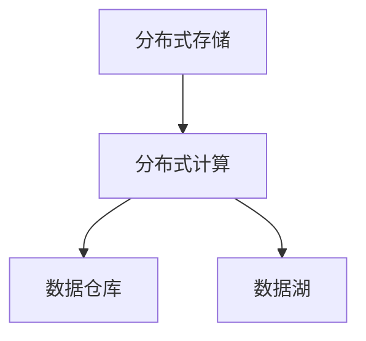

## 1. 背景介绍

### 1.1 信息爆炸与数据洪流

21世纪，互联网和移动设备的普及引发了信息爆炸式的增长。每天，海量的数据被创造出来，包括社交媒体帖子、电子商务交易、传感器数据、医疗记录等等。这些数据蕴藏着巨大的价值，但传统的数据库和分析工具已经无法有效地处理如此庞大的数据集。

### 1.2 大数据的定义和特征

大数据通常被定义为具有以下特征的数据集：

* **规模 (Volume):** 数据量巨大，通常以TB、PB甚至ZB级别计量。
* **速度 (Velocity):** 数据生成和处理速度极快，例如实时传感器数据流。
* **多样性 (Variety):** 数据类型多样，包括结构化、半结构化和非结构化数据。
* **真实性 (Veracity):** 数据质量可能参差不齐，需要进行清洗和验证。
* **价值 (Value):** 从大数据中提取有意义的信息和洞察具有巨大的商业价值。

### 1.3 大数据带来的机遇和挑战

大数据为各行各业带来了前所未有的机遇，例如：

* **商业智能:** 通过分析客户数据，企业可以优化产品、提高客户满意度和增加收入。
* **科学研究:** 大数据分析可以帮助科学家发现新的规律、开发新的药物和治疗方法。
* **社会治理:** 政府可以使用大数据改善公共服务、提高效率和应对社会挑战。

然而，大数据也带来了一系列挑战，包括：

* **数据存储和处理:** 如何高效地存储和处理海量数据是一个巨大的挑战。
* **数据分析和挖掘:** 如何从大数据中提取有价值的信息是一个难题。
* **数据隐私和安全:** 如何保护大数据的隐私和安全至关重要。

## 2. 核心概念与联系

### 2.1 分布式存储

为了存储海量数据，大数据系统通常采用分布式存储技术，将数据分布存储在多台服务器上。常见的分布式存储系统包括：

* **Hadoop分布式文件系统 (HDFS):** 一个开源的分布式文件系统，专为存储大型数据集而设计。
* **Amazon S3:** Amazon提供的云对象存储服务，可扩展到PB級存储容量。
* **Google Cloud Storage:** Google提供的云对象存储服务，提供高可用性和可扩展性。

### 2.2 分布式计算

为了处理海量数据，大数据系统需要采用分布式计算技术，将计算任务分配给多台服务器并行执行。常见的分布式计算框架包括：

* **Hadoop MapReduce:** 一个开源的分布式计算框架，用于处理大型数据集。
* **Apache Spark:** 一个快速、通用的集群计算系统，支持批处理、流处理和机器学习。
* **Apache Flink:** 一个分布式流处理框架，用于处理高吞吐量、低延迟的数据流。

### 2.3 数据仓库和数据湖

* **数据仓库 (Data Warehouse):** 一个集成的、面向主题的、非易失的、随时间变化的数据集合，用于支持管理决策。数据仓库通常存储结构化数据，并使用关系型数据库管理系统 (RDBMS)。
* **数据湖 (Data Lake):** 一个集中式存储库，用于存储各种类型的数据，包括结构化、半结构化和非结构化数据。数据湖通常使用分布式文件系统存储数据，并支持多种数据分析工具。

### 2.4 核心概念联系图



## 3. 核心算法原理具体操作步骤

### 3.1 MapReduce 算法

MapReduce是一种用于处理大型数据集的分布式计算模型。它包含两个主要步骤：

1. **Map:** 将输入数据划分成多个独立的子任务，每个子任务由一个Map函数处理。Map函数将输入数据转换为键值对。
2. **Reduce:** 将Map阶段生成的键值对按照键分组，每个组由一个Reduce函数处理。Reduce函数将键值对聚合为最终结果。

#### 3.1.1 MapReduce 算法操作步骤

1. **输入数据划分:** 将输入数据划分成多个大小相等的块，每个块分配给一个Map任务。
2. **Map 任务执行:** 每个Map任务读取分配的输入数据块，并应用Map函数生成键值对。
3. **Shuffle 和排序:** 将所有Map任务生成的键值对按照键分组，并排序。
4. **Reduce 任务执行:** 每个Reduce任务读取分配的键值对组，并应用Reduce函数聚合结果。
5. **输出结果:** 将所有Reduce任务生成的最终结果合并成一个输出文件。

### 3.2 PageRank 算法

PageRank是一种用于衡量网页重要性的算法。它基于以下假设：

* **链接投票:** 如果一个网页被其他网页链接，则该网页更重要。
* **重要性传递:** 一个网页的重要性可以通过链接传递给其他网页。

#### 3.2.1 PageRank 算法操作步骤

1. **初始化:** 为每个网页分配一个初始 PageRank 值，例如 1/N，其中 N 是网页总数。
2. **迭代计算:** 迭代更新每个网页的 PageRank 值，直到收敛。
    * **计算出站链接:** 对于每个网页，计算其出站链接的 PageRank 值之和。
    * **更新 PageRank 值:** 将每个网页的 PageRank 值更新为 (1-d)/N + d * (出站链接 PageRank 值之和)，其中 d 是阻尼系数，通常设置为 0.85。
3. **输出结果:** 输出每个网页的最终 PageRank 值。

## 4. 数学模型和公式详细讲解举例说明

### 4.1 TF-IDF 模型

TF-IDF（Term Frequency-Inverse Document Frequency）是一种用于衡量词语在文档集合中重要性的统计方法。它由两部分组成：

* **词频 (TF):** 词语在文档中出现的次数。
* **逆文档频率 (IDF):** 词语在文档集合中出现的文档数量的倒数的对数。

#### 4.1.1 TF-IDF 公式

$$
TF-IDF(t, d, D) = TF(t, d) \times IDF(t, D)
$$

其中：

* $t$ 表示词语
* $d$ 表示文档
* $D$ 表示文档集合
* $TF(t, d)$ 表示词语 $t$ 在文档 $d$ 中出现的次数
* $IDF(t, D)$ 表示词语 $t$ 在文档集合 $D$ 中出现的文档数量的倒数的对数

#### 4.1.2 TF-IDF 举例说明

假设我们有一个包含三个文档的文档集合：

* 文档 1: "大数据分析"
* 文档 2: "机器学习算法"
* 文档 3: "大数据应用"

我们想要计算词语 "大数据" 在文档 1 中的 TF-IDF 值。

首先，计算词语 "大数据" 在文档 1 中的词频：

$$
TF("大数据", 文档 1) = 1
$$

然后，计算词语 "大数据" 在文档集合中的逆文档频率：

$$
IDF("大数据", D) = log \frac{3}{2} = 0.405
$$

最后，计算词语 "大数据" 在文档 1 中的 TF-IDF 值：

$$
TF-IDF("大数据", 文档 1, D) = 1 \times 0.405 = 0.405
$$

### 4.2 K-Means 聚类算法

K-Means 是一种常用的聚类算法，它将数据点划分成 K 个簇，使得每个簇内的点彼此相似，而不同簇之间的点彼此不同。

#### 4.2.1 K-Means 算法操作步骤

1. **初始化:** 随机选择 K 个点作为初始聚类中心。
2. **分配数据点:** 将每个数据点分配到距离其最近的聚类中心所在的簇。
3. **更新聚类中心:** 重新计算每个簇的聚类中心，使其位于簇内所有数据点的平均位置。
4. **重复步骤 2 和 3:** 直到聚类中心不再发生变化。

#### 4.2.2 K-Means 算法公式

K-Means 算法的目标是最小化簇内平方误差和 (WCSS):

$$
WCSS = \sum_{i=1}^{K} \sum_{x \in C_i} ||x - \mu_i||^2
$$

其中：

* $K$ 表示簇的数量
* $C_i$ 表示第 $i$ 个簇
* $x$ 表示簇 $C_i$ 中的一个数据点
* $\mu_i$ 表示簇 $C_i$ 的聚类中心

## 5. 项目实践：代码实例和详细解释说明

### 5.1 使用 Python 分析 Twitter 数据

#### 5.1.1 项目目标

本项目旨在使用 Python 分析 Twitter 数据，识别热门话题和用户情绪。

#### 5.1.2 项目步骤

1. **安装必要的库:**
```python
pip install tweepy textblob matplotlib
```
2. **获取 Twitter API 凭证:**
* 创建一个 Twitter 开发者账户。
* 创建一个应用程序并获取 API 密钥和访问令牌。
3. **连接到 Twitter API:**
```python
import tweepy

# 设置 API 凭证
consumer_key = "YOUR_CONSUMER_KEY"
consumer_secret = "YOUR_CONSUMER_SECRET"
access_token = "YOUR_ACCESS_TOKEN"
access_token_secret = "YOUR_ACCESS_TOKEN_SECRET"

# 创建 API 对象
auth = tweepy.OAuthHandler(consumer_key, consumer_secret)
auth.set_access_token(access_token, access_token_secret)
api = tweepy.API(auth)
```
4. **搜索推文:**
```python
# 搜索关键词
query = "#BigData"

# 获取推文
tweets = api.search_tweets(q=query, count=100)
```
5. **分析推文:**
* **识别热门话题:** 使用 `collections.Counter` 统计推文中出现频率最高的词语。
* **分析用户情绪:** 使用 `textblob` 库分析推文的情感极性（正面、负面或中性）。
6. **可视化结果:** 使用 `matplotlib` 库创建图表，可视化热门话题和用户情绪。

#### 5.1.3 代码实例

```python
import tweepy
from textblob import TextBlob
from collections import Counter
import matplotlib.pyplot as plt

# 设置 API 凭证
# ...

# 搜索推文
# ...

# 识别热门话题
words = []
for tweet in tweets:
    words.extend(tweet.text.split())
word_counts = Counter(words)
top_words = word_counts.most_common(10)

# 分析用户情绪
sentiments = []
for tweet in tweets:
    analysis = TextBlob(tweet.text)
    sentiments.append(analysis.sentiment.polarity)

# 可视化结果
# ...
```

## 6. 实际应用场景

### 6.1 商业智能

* **客户关系管理 (CRM):** 分析客户数据以了解客户行为、偏好和需求，从而提高客户满意度和忠诚度。
* **市场营销:** 分析市场趋势、竞争对手和客户行为，以制定有效的营销策略。
* **风险管理:** 分析交易数据以识别欺诈行为和风险因素。

### 6.2 科学研究

* **基因组学:** 分析基因组数据以了解疾病的遗传基础。
* **气候科学:** 分析气候数据以预测气候变化。
* **天文学:** 分析天文数据以探索宇宙的奥秘。

### 6.3 社会治理

* **公共安全:** 分析犯罪数据以预测犯罪热点和预防犯罪。
* **交通管理:** 分析交通数据以优化交通流量和减少拥堵。
* **医疗保健:** 分析医疗数据以提高医疗质量和效率。

## 7. 工具和资源推荐

### 7.1 大数据平台

* **Hadoop:** 一个开源的分布式计算框架，用于存储和处理大型数据集。
* **Apache Spark:** 一个快速、通用的集群计算系统，支持批处理、流处理和机器学习。
* **Apache Flink:** 一个分布式流处理框架，用于处理高吞吐量、低延迟的数据流。

### 7.2 数据可视化工具

* **Tableau:** 一个商业智能和数据可视化工具，用于创建交互式仪表板和报告。
* **Power BI:** Microsoft提供的商业智能和数据可视化工具，用于创建交互式仪表板和报告。
* **Google Data Studio:** Google提供的免费数据可视化工具，用于创建交互式仪表板和报告。

### 7.3 学习资源

* **Coursera:** 提供各种大数据相关课程，包括 Hadoop、Spark 和机器学习。
* **edX:** 提供各种大数据相关课程，包括 Hadoop、Spark 和数据科学。
* **Udacity:** 提供各种大数据相关课程，包括数据工程、数据分析和机器学习。

## 8. 总结：未来发展趋势与挑战

### 8.1 未来发展趋势

* **人工智能 (AI) 和机器学习 (ML):** AI 和 ML 将在从大数据中提取洞察方面发挥越来越重要的作用。
* **边缘计算:** 边缘计算将使数据处理更接近数据源，从而减少延迟和带宽需求。
* **数据安全和隐私:** 随着大数据应用的普及，数据安全和隐私将变得越来越重要。

### 8.2 面临的挑战

* **数据孤岛:** 不同部门和组织之间的数据共享和集成仍然是一个挑战。
* **数据质量:** 确保大数据的质量和可靠性至关重要。
* **技能差距:** 缺乏合格的大数据专业人才是一个重大挑战。

## 9. 附录：常见问题与解答

### 9.1 什么是大数据？

大数据是指具有以下特征的数据集：规模、速度、多样性、真实性和价值。

### 9.2 大数据有哪些应用场景？

大数据应用于各种领域，包括商业智能、科学研究和社会治理。

### 9.3 如何学习大数据？

您可以通过参加在线课程、阅读书籍和参加行业活动来学习大数据。

### 9.4 大数据面临哪些挑战？

大数据面临着数据孤岛、数据质量和技能差距等挑战。
