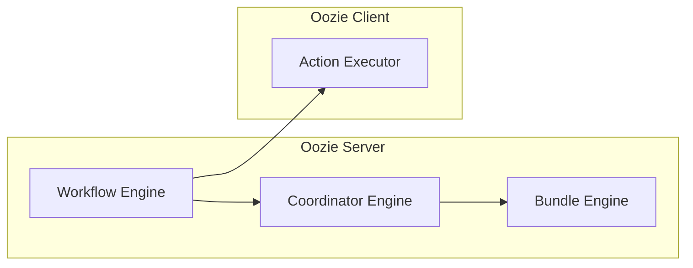

# 大数据时代,为什么需要Oozie?

作者：禅与计算机程序设计艺术

## 1. 背景介绍

### 1.1 大数据时代的挑战

随着互联网、物联网、移动互联网的快速发展，全球数据量呈爆炸式增长，我们正式步入了大数据时代。大数据技术的出现为各行各业带来了前所未有的机遇，但也带来了前所未有的挑战。海量数据的处理、存储、分析和应用，需要强大的计算能力、高效的存储架构和智能化的分析工具。

### 1.2 Hadoop生态系统的兴起

为了应对大数据带来的挑战，Hadoop生态系统应运而生。Hadoop是一个开源的分布式计算框架，它可以高效地处理海量数据。Hadoop生态系统包含了许多组件，例如HDFS、MapReduce、Hive、Pig、HBase等，这些组件共同构成了一个完整的大数据处理平台。

### 1.3 工作流调度工具的需求

在大数据处理过程中，我们经常需要执行一系列相互依赖的任务，例如数据采集、数据清洗、数据转换、数据分析等。这些任务通常需要按照特定的顺序执行，并且需要满足一定的依赖关系。为了简化大数据工作流的管理和调度，我们需要一个专门的工作流调度工具。

## 2. 核心概念与联系

### 2.1 Oozie简介

Oozie是一个基于Hadoop的开源工作流调度系统，它可以用来管理和调度Hadoop生态系统中的各种任务。Oozie工作流定义为Directed Acyclic Graphs (DAGs)，其中节点表示工作流中的各个任务，边表示任务之间的依赖关系。Oozie支持多种类型的任务，包括Hadoop MapReduce、Pig、Hive、Java程序、Shell脚本等。

### 2.2 Oozie架构

Oozie采用Master-Slave架构，其中Oozie Server作为Master节点，负责管理和调度工作流，Oozie Client作为Slave节点，负责执行工作流中的各个任务。Oozie Server和Oozie Client之间通过RPC协议进行通信。



### 2.3 Oozie工作流类型

Oozie支持两种类型的工作流：

* **Workflow:** 由多个Action组成，Action之间可以存在依赖关系，Workflow按照DAG的顺序执行。
* **Coordinator:** 用于周期性地调度Workflow，例如每天执行一次、每周执行一次等。

## 3. 核心算法原理具体操作步骤

### 3.1 Workflow定义

Oozie Workflow使用hPDL (Hadoop Process Definition Language)来定义，hPDL是一种XML-based的语言，它定义了Workflow的结构和执行逻辑。

**hPDL示例:**

```xml
<workflow-app name="my-workflow" xmlns="uri:oozie:workflow:0.1">
  <start to="mapreduce-action"/>
  <action name="mapreduce-action">
    <map-reduce>
      <job-tracker>${jobTracker}</job-tracker>
      <name-node>${nameNode}</name-node>
      <configuration>
        <property>
          <name>mapred.mapper.class</name>
          <value>com.example.MyMapper</value>
        </property>
      </configuration>
    </map-reduce>
    <ok to="end"/>
    <error to="fail"/>
  </action>
  <kill name="fail">
    <message>Workflow failed, error message[${wf:errorMessage(wf:lastErrorNode())}]</message>
  </kill>
  <end name="end"/>
</workflow-app>
```

### 3.2 Workflow提交

Oozie Workflow可以通过Oozie命令行工具或者Oozie Web UI提交。

**Oozie命令行工具:**

```bash
oozie job -oozie http://oozie-server:11000/oozie -config workflow.xml -run
```

**Oozie Web UI:**

Oozie Web UI提供了一个图形化的界面，可以用来提交、监控和管理Oozie Workflow。

### 3.3 Workflow执行

Oozie Server接收到Workflow提交请求后，会解析Workflow定义文件，并根据Workflow的DAG图创建一系列任务。Oozie Server会将这些任务分配给Oozie Client执行，Oozie Client执行完任务后会将结果返回给Oozie Server。Oozie Server会根据任务的执行结果决定下一步的执行流程。

## 4. 数学模型和公式详细讲解举例说明

Oozie本身并不涉及复杂的数学模型和公式，其核心在于工作流的DAG图表示和任务调度算法。

**DAG图:**

DAG图是一种有向无环图，它可以用来表示工作流中各个任务之间的依赖关系。DAG图中的节点表示任务，边表示任务之间的依赖关系。

**任务调度算法:**

Oozie采用基于优先级的任务调度算法，它会根据任务的优先级、依赖关系和资源可用性来决定任务的执行顺序。

## 5. 项目实践：代码实例和详细解释说明

### 5.1 示例场景

假设我们需要构建一个数据分析工作流，该工作流包含以下几个步骤：

1. 从数据库中导出数据
2. 对数据进行清洗和转换
3. 使用Hive进行数据分析
4. 将分析结果存储到HBase中

### 5.2 Oozie Workflow定义

```xml
<workflow-app name="data-analysis-workflow" xmlns="uri:oozie:workflow:0.1">
  <start to="export-data"/>
  <action name="export-data">
    <shell>
      <job-tracker>${jobTracker}</job-tracker>
      <name-node>${nameNode}</name-node>
      <exec>export_data.sh</exec>
    </shell>
    <ok to="clean-data"/>
    <error to="fail"/>
  </action>
  <action name="clean-data">
    <pig>
      <job-tracker>${jobTracker}</job-tracker>
      <name-node>${nameNode}</name-node>
      <script>clean_data.pig</script>
    </pig>
    <ok to="analyze-data"/>
    <error to="fail"/>
  </action>
  <action name="analyze-data">
    <hive>
      <job-tracker>${jobTracker}</job-tracker>
      <name-node>${nameNode}</name-node>
      <script>analyze_data.hql</script>
    </hive>
    <ok to="store-results"/>
    <error to="fail"/>
  </action>
  <action name="store-results">
    <java>
      <job-tracker>${jobTracker}</job-tracker>
      <name-node>${nameNode}</name-node>
      <main-class>com.example.StoreResults</main-class>
    </java>
    <ok to="end"/>
    <error to="fail"/>
  </action>
  <kill name="fail">
    <message>Workflow failed, error message[${wf:errorMessage(wf:lastErrorNode())}]</message>
  </kill>
  <end name="end"/>
</workflow-app>
```

### 5.3 代码解释

* **export-** 使用Shell脚本从数据库中导出数据。
* **clean-** 使用Pig脚本对数据进行清洗和转换。
* **analyze-** 使用Hive脚本进行数据分析。
* **store-results:** 使用Java程序将分析结果存储到HBase中。

## 6. 实际应用场景

Oozie广泛应用于各种大数据处理场景，例如：

* **ETL (Extract, Transform, Load):** Oozie可以用来调度ETL工作流，将数据从不同的数据源提取、转换并加载到目标数据仓库中。
* **数据分析:** Oozie可以用来调度数据分析工作流，对数据进行清洗、转换、分析和可视化。
* **机器学习:** Oozie可以用来调度机器学习工作流，训练模型、评估模型和部署模型。

## 7. 工具和资源推荐

### 7.1 Oozie官方文档

Oozie官方文档提供了详细的Oozie使用方法和API文档，是学习Oozie的最佳资源。

### 7.2 Apache Hadoop

Apache Hadoop是Oozie所依赖的底层平台，学习Hadoop可以帮助我们更好地理解Oozie的工作原理。

### 7.3 Cloudera Manager

Cloudera Manager是一个Hadoop集群管理工具，它可以用来管理和监控Oozie。

## 8. 总结：未来发展趋势与挑战

Oozie作为Hadoop生态系统中的重要一员，在未来将会继续发展和完善。

### 8.1 未来发展趋势

* **云原生支持:** Oozie将会提供更好的云原生支持，例如支持Kubernetes、Docker等。
* **机器学习支持:** Oozie将会提供更好的机器学习支持，例如支持TensorFlow、PyTorch等。
* **易用性提升:** Oozie将会提供更加易用的界面和API，简化工作流的定义和管理。

### 8.2 面临的挑战

* **性能优化:** 随着数据量的不断增长，Oozie需要不断优化其性能，以满足大规模数据处理的需求。
* **安全性增强:** Oozie需要增强其安全性，以保护用户数据和系统安全。
* **生态系统整合:** Oozie需要与其他大数据工具和平台更好地整合，以提供更完整的大数据解决方案。

## 9. 附录：常见问题与解答

### 9.1 Oozie与Azkaban的区别

Oozie和Azkaban都是开源的工作流调度工具，它们的主要区别在于：

* **架构:** Oozie采用Master-Slave架构，Azkaban采用分布式架构。
* **工作流定义语言:** Oozie使用hPDL，Azkaban使用Web UI或者YAML文件。
* **功能:** Oozie支持更丰富的功能，例如Coordinator、Bundle等。

### 9.2 如何解决Oozie Workflow执行失败的问题

Oozie Workflow执行失败的原因有很多，例如：

* **代码错误:** Workflow中存在代码错误。
* **环境问题:** Hadoop集群环境配置错误。
* **资源不足:** Hadoop集群资源不足。

解决Oozie Workflow执行失败问题的方法包括：

* **查看Oozie日志:** Oozie日志中包含了Workflow执行的详细信息，可以帮助我们定位问题。
* **检查Hadoop集群环境:** 确保Hadoop集群环境配置正确。
* **增加Hadoop集群资源:** 如果Hadoop集群资源不足，可以增加集群节点或者调整资源配置。