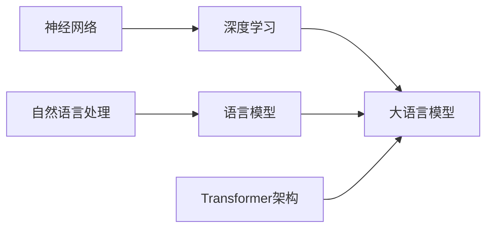

# 大语言模型原理基础与前沿 涌现能力

作者：禅与计算机程序设计艺术

## 1. 背景介绍

### 1.1 人工智能的演进与语言模型的崛起

人工智能 (AI) 作为计算机科学的一个重要分支，其目标是使机器能够像人类一样思考、学习和解决问题。自 20 世纪 50 年代诞生以来，人工智能经历了符号主义、连接主义等多个发展阶段，取得了长足的进步。近年来，随着深度学习技术的突破和计算能力的提升，人工智能迎来了新的发展浪潮，其中大语言模型 (Large Language Model, LLM) 作为一项重要的技术突破，引起了广泛关注。

### 1.2 大语言模型的定义与特征

大语言模型是指基于深度学习技术训练的、包含海量参数的语言模型。与传统的统计语言模型相比，大语言模型具有以下显著特征：

* **规模庞大:**  大语言模型通常包含数十亿甚至数千亿个参数，能够捕捉语言的复杂结构和语义信息。
* **泛化能力强:**  大语言模型在训练过程中学习了大量的文本数据，能够在各种语言任务上表现出色，例如文本生成、机器翻译、问答系统等。
* **涌现能力:**  大语言模型在规模达到一定程度后，会展现出一些传统模型不具备的涌现能力，例如逻辑推理、代码生成、多轮对话等。

### 1.3 大语言模型的应用与影响

大语言模型的出现，为人工智能领域带来了新的发展机遇，其应用场景涵盖了自然语言处理、计算机视觉、语音识别等多个领域。例如，ChatGPT 和 Bard 等聊天机器人，能够与用户进行自然流畅的对话，提供信息查询、娱乐互动等服务；GitHub Copilot 等代码生成工具，能够辅助程序员编写代码，提高开发效率；DALL-E 2 和 Stable Diffusion 等图像生成模型，能够根据文本描述生成逼真的图像。

## 2. 核心概念与联系

### 2.1 神经网络与深度学习

大语言模型的核心是深度学习技术，而深度学习的基础是神经网络。神经网络是一种模拟人脑神经元结构的计算模型，由多个神经元层级联组成。每个神经元接收来自其他神经元的输入信号，经过加权求和和非线性变换后，输出新的信号。通过调整神经元之间的连接权重，神经网络可以学习输入数据的特征，并进行预测或分类。

### 2.2 自然语言处理与语言模型

自然语言处理 (Natural Language Processing, NLP) 是人工智能领域的一个重要分支，其目标是使计算机能够理解和处理人类语言。语言模型是自然语言处理中的一个重要概念，它用于描述语言的概率分布，例如单词序列出现的概率。传统的统计语言模型基于统计方法，通过统计词频等信息来构建语言模型。而大语言模型基于深度学习技术，能够捕捉语言的更深层次的语义信息。

### 2.3 Transformer 架构

Transformer 是一种基于自注意力机制的神经网络架构，在自然语言处理领域取得了巨大成功。与传统的循环神经网络 (RNN) 相比，Transformer 具有以下优势：

* **并行计算:**  Transformer 可以并行处理序列数据，训练速度更快。
* **长距离依赖:**  Transformer 的自注意力机制能够捕捉序列中长距离的依赖关系。
* **可解释性:**  Transformer 的注意力权重可以用于解释模型的预测结果。

### 2.4 核心概念联系图



## 3. 核心算法原理具体操作步骤

### 3.1 数据预处理

大语言模型的训练需要大量的文本数据，数据预处理是训练过程中的重要环节。数据预处理的目的是将原始文本数据转换成模型可以处理的形式，主要包括以下步骤：

* **分词:** 将文本数据分割成单词或字符序列。
* **编码:** 将单词或字符映射成数字表示，例如 one-hot 编码或词嵌入。
* **填充:**  将不同长度的序列填充到相同的长度，以便于模型处理。

### 3.2 模型训练

大语言模型的训练过程是指利用大量的文本数据，调整模型参数，使其能够准确地预测语言的概率分布。训练过程通常采用随机梯度下降 (Stochastic Gradient Descent, SGD) 等优化算法，通过最小化损失函数来更新模型参数。

### 3.3 模型评估

模型训练完成后，需要评估其性能。常用的评估指标包括困惑度 (Perplexity) 和 BLEU 分数等。困惑度用于衡量模型对语言的预测能力，BLEU 分数用于衡量模型生成的文本与参考文本之间的相似度。

### 3.4 模型推理

模型推理是指利用训练好的模型，对新的文本数据进行预测。例如，利用大语言模型进行文本生成、机器翻译、问答系统等任务。

### 3.5 核心算法流程图


## 4. 数学模型和公式详细讲解举例说明

### 4.1 语言模型的概率表示

语言模型的本质是描述语言的概率分布，可以用以下公式表示：

$$
P(w_1, w_2, ..., w_n) = \prod_{i=1}^n P(w_i | w_1, w_2, ..., w_{i-1})
$$

其中，$w_1, w_2, ..., w_n$ 表示一个单词序列，$P(w_i | w_1, w_2, ..., w_{i-1})$ 表示在已知前面 $i-1$ 个单词的情况下，第 $i$ 个单词出现的概率。

### 4.2 Transformer 的自注意力机制

Transformer 的自注意力机制是其核心组成部分，用于计算序列中不同位置之间的依赖关系。自注意力机制可以用以下公式表示：

$$
Attention(Q, K, V) = softmax(\frac{QK^T}{\sqrt{d_k}})V
$$

其中，$Q$、$K$、$V$ 分别表示查询矩阵、键矩阵和值矩阵，$d_k$ 表示键矩阵的维度。

### 4.3 举例说明

假设有一个句子 "The quick brown fox jumps over the lazy dog"，我们想利用大语言模型预测下一个单词。首先，需要将句子进行分词和编码，例如将每个单词映射成一个数字。然后，将编码后的句子输入到大语言模型中，模型会计算每个单词的概率分布。最后，选择概率最高的单词作为预测结果。

## 5. 项目实践：代码实例和详细解释说明

### 5.1 使用 Hugging Face Transformers 库构建大语言模型

Hugging Face Transformers 是一个开源的自然语言处理库，提供了各种预训练的大语言模型，例如 BERT、GPT-2、RoBERTa 等。以下代码示例展示了如何使用 Transformers 库构建一个基于 GPT-2 的文本生成模型：

```python
from transformers import pipeline

# 初始化文本生成模型
generator = pipeline('text-generation', model='gpt2')

# 生成文本
text = generator("The quick brown fox jumps over the", max_length=50, num_return_sequences=3)

# 打印生成的文本
print(text)
```

### 5.2 代码解释

* `pipeline` 函数用于创建自然语言处理流水线，`text-generation` 表示文本生成任务，`model='gpt2'` 表示使用 GPT-2 模型。
* `generator` 函数用于生成文本，`max_length=50` 表示生成的最大长度为 50 个单词，`num_return_sequences=3` 表示生成 3 个不同的文本序列。

## 6. 实际应用场景

### 6.1 聊天机器人

大语言模型可以用于构建聊天机器人，例如 ChatGPT 和 Bard 等。聊天机器人可以与用户进行自然流畅的对话，提供信息查询、娱乐互动等服务。

### 6.2 代码生成

大语言模型可以用于辅助程序员编写代码，例如 GitHub Copilot 等。代码生成工具可以根据程序员的输入，生成代码片段或完整的函数，提高开发效率。

### 6.3 图像生成

大语言模型可以用于根据文本描述生成逼真的图像，例如 DALL-E 2 和 Stable Diffusion 等。图像生成模型可以用于艺术创作、广告设计等领域。

## 7. 总结：未来发展趋势与挑战

### 7.1 发展趋势

* **模型规模不断扩大:**  未来，大语言模型的规模将继续扩大，参数数量将达到数万亿甚至更高。
* **多模态融合:**  大语言模型将与其他模态的数据进行融合，例如图像、视频、音频等，实现更丰富的应用场景。
* **个性化定制:**  大语言模型将根据用户的需求进行个性化定制，提供更精准的服务。

### 7.2 挑战

* **计算资源需求高:**  大语言模型的训练和推理需要大量的计算资源，这对硬件设备提出了更高的要求。
* **数据安全与隐私:**  大语言模型的训练需要大量的文本数据，数据安全与隐私问题需要得到重视。
* **伦理与社会影响:**  大语言模型的应用可能会带来伦理和社会影响，例如就业问题、信息茧房等。

## 8. 附录：常见问题与解答

### 8.1 什么是涌现能力？

涌现能力是指大语言模型在规模达到一定程度后，展现出一些传统模型不具备的能力，例如逻辑推理、代码生成、多轮对话等。

### 8.2 大语言模型的局限性是什么？

大语言模型仍然存在一些局限性，例如：

* **缺乏常识推理能力:**  大语言模型的推理能力仍然有限，缺乏常识推理能力。
* **容易生成虚假信息:**  大语言模型可能会生成虚假信息，需要进行事实验证。
* **可解释性不足:**  大语言模型的预测结果可解释性不足，难以理解其决策过程。

### 8.3 如何选择合适的大语言模型？

选择合适的大语言模型需要考虑以下因素：

* **应用场景:**  不同的应用场景对模型的要求不同，例如聊天机器人需要模型具备对话能力，代码生成工具需要模型具备代码生成能力。
* **模型规模:**  模型规模越大，性能越好，但计算资源需求也越高。
* **预训练数据:**  预训练数据对模型的性能有很大影响，需要选择与应用场景相关的预训练数据。
