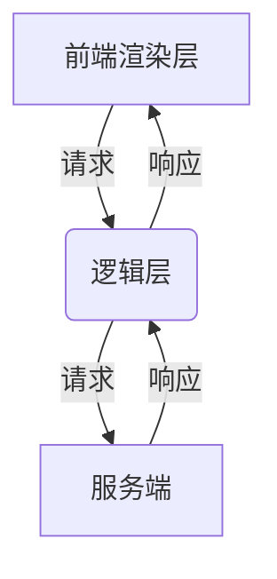
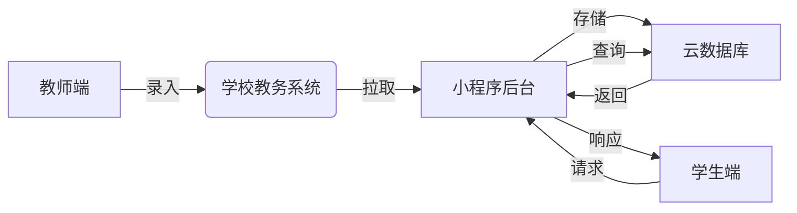
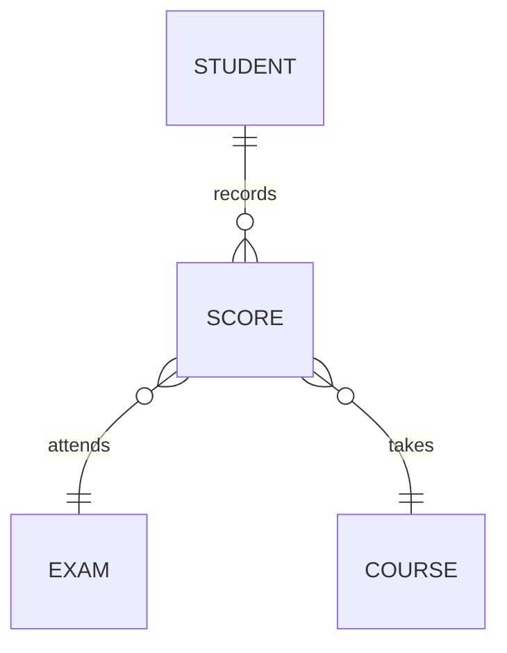

# 学生学习情况考试查询小程序

## 1.背景介绍

### 1.1 教育数据化的重要性

在当今信息时代,教育数据化已经成为教育现代化的重要组成部分。通过采集和分析学生的学习数据,教育工作者可以更好地了解学生的学习情况,制定个性化的教学策略,提高教学质量。同时,学生和家长也可以及时了解学习进度,发现问题并采取相应的措施。因此,开发一款高效便捷的学生学习情况查询小程序,对于提升教育质量和学习效率具有重要意义。

### 1.2 移动端应用优势

随着智能手机的普及,移动端应用逐渐成为人们获取信息和服务的主要渠道。相比于传统的网页端应用,移动端应用具有更好的用户体验、离线可用、推送通知等优势。因此,开发一款移动端的学习情况查询小程序,可以让学生和家长随时随地查询学习数据,提高使用便利性。

### 1.3 小程序技术优势  

小程序是一种全新的连接用户与服务的技术方式,它可以避免麻烦的安装、卸载步骤,无需占用过多手机存储空间。同时,小程序的开发周期较短,上线审核流程简单,可以快速迭代更新。因此,基于小程序开发一款学习情况查询应用,可以充分利用这些优势。

## 2.核心概念与联系

### 2.1 小程序架构

小程序采用了前端渲染、逻辑层、服务端三端分离的架构模式。前端渲染层使用Vue或React等框架,负责页面渲染和交互逻辑;逻辑层使用Node.js编写,负责数据处理和服务调用;服务端则部署在云平台上,负责存储和计算。



### 2.2 数据流程

学生学习情况查询小程序的核心数据流程包括:

1. 教师端录入学生考试成绩数据到学校教务系统
2. 小程序后台定期从教务系统拉取最新成绩数据,存储到云数据库
3. 学生端通过小程序前端向后台发起数据查询请求
4. 后台从云数据库读取相关数据并返回给前端
5. 前端渲染展示成绩数据界面



### 2.3 关键技术

- 小程序开发框架: 微信/百度/支付宝等提供的小程序开发SDK和工具
- 前端框架: Vue/React等构建用户界面
- Node.js: 用于编写小程序逻辑层
- 云服务: 提供云数据库、云存储、云函数等服务
- 自动化部署: CI/CD流程,实现小程序的自动化持续集成和部署

## 3.核心算法原理具体操作步骤 

### 3.1 数据模型设计

学生学习情况数据模型包括以下几个关键实体:

- 学生(Student): 学号、姓名、年级、班级等基本信息
- 课程(Course): 课程编号、名称、学分等信息  
- 考试(Exam): 考试编号、科目、时间、类型(期中/期末)等
- 成绩(Score): 学生、课程、考试、分数等信息

它们之间的关系如下:



### 3.2 数据查询算法

为了高效查询学生的考试成绩数据,我们可以使用以下算法:

#### 3.2.1 索引优化

在云数据库中,对学号、课程编号、考试编号等字段建立复合索引,以提高查询效率。

```javascript
db.scores.createIndex(
    {studentId: 1, courseId: 1, examId: 1},
    {unique: true}
)
```

#### 3.2.2 查询算法步骤

1. 前端收集查询条件:学号、课程、考试类型等
2. 将查询条件拼接成复合查询语句
3. 调用云函数,传入查询语句,查询数据库
4. 云函数返回查询结果到前端
5. 前端渲染展示成绩数据

```javascript
// 云函数伪代码
const getScores = async (query) => {
    const scores = await db.scores.find(query)
    return scores
}

// 前端示例
const queryScores = async () => {
    const query = {
        studentId,
        courseId,
        examType
    }
    const res = await callCloudFunction('getScores', query)
    renderData(res.data)  
}
```

#### 3.2.3 分页和缓存

- 对于大量数据查询,可以在云函数中实现分页查询,减小单次传输数据量
- 对于高频查询,可以在云函数中实现缓存,降低数据库压力

### 3.3 数据更新算法

为了确保成绩数据的实时性,需要定期从教务系统拉取最新数据并更新到数据库。

#### 3.3.1 增量更新

1. 在云数据库中维护一个lastUpdateTime字段,记录上次更新时间
2. 调度云函数,从教务系统获取自lastUpdateTime之后的新数据
3. 对新数据进行去重、合并处理,插入到数据库
4. 更新lastUpdateTime为当前时间

```javascript
// 云函数伪代码
const updateScores = async () => {
    const lastUpdate = await getLastUpdateTime()
    const newScores = await fetchFromSys(lastUpdate)
    await mergeAndInsert(newScores)
    await updateLastUpdateTime()
}
```

#### 3.3.2 定期调度

可以使用云服务提供的定时任务功能,按照设定的时间间隔(例如每天凌晨)自动触发云函数,执行数据更新操作。

```javascript
// 设置定时任务
const schedule = require('node-schedule')
schedule.scheduleJob('0 0 * * *', updateScores)
```

## 4.数学模型和公式详细讲解举例说明

在学生成绩数据分析过程中,我们可能需要计算一些统计学指标,比如平均分、标准差等,以量化和比较不同学生的学习表现。

### 4.1 平均分

平均分(Mean)是一个非常基础和常用的统计量,它描述了一组数据的中心位置。对于学生的某门课程考试成绩$x_1, x_2, ..., x_n$,平均分$\bar{x}$的计算公式为:

$$\bar{x} = \frac{1}{n}\sum_{i=1}^{n}x_i$$

例如,某个班级10名学生的数学考试成绩分别为: 80, 75, 92, 66, 89, 72, 95, 81, 63, 78。那么平均分为:

$$\bar{x} = \frac{1}{10}(80 + 75 + 92 + 66 + 89 + 72 + 95 + 81 + 63 + 78) = 79.1$$

### 4.2 标准差

标准差(Standard Deviation)是衡量一组数据分散程度的指标。标准差越大,表示数据越分散;反之则数据越集中。对于数据集$x_1, x_2, ..., x_n$,标准差$s$的计算公式为:

$$s = \sqrt{\frac{1}{n}\sum_{i=1}^{n}(x_i - \bar{x})^2}$$

其中$\bar{x}$为平均值。

以上面的数学考试成绩为例,标准差为:

$$\begin{aligned}
s &= \sqrt{\frac{1}{10}\Big[(80 - 79.1)^2 + (75 - 79.1)^2 + ... + (78 - 79.1)^2\Big]} \\
  &= 9.94
\end{aligned}$$

通过计算得知,这个班级学生的数学成绩标准差较大,成绩分布较分散。

### 4.3 正态分布

在成绩分析中,我们常常假设分数服从正态分布(Normal Distribution),即钟形曲线分布。对于均值为$\mu$,标准差为$\sigma$的正态分布,其概率密度函数为:

$$f(x) = \frac{1}{\sigma\sqrt{2\pi}}e^{-\frac{1}{2}(\frac{x-\mu}{\sigma})^2}$$

根据正态分布,我们可以计算某个分数区间的概率,或者给定一个概率计算相应的分数分割点,对学生成绩进行分级等。

例如,某次考试的平均分为70分,标准差为10分。如果按照正态分布,分数高于80分的学生占总人数的15.9%。

## 4.项目实践:代码实例和详细解释说明

### 4.1 小程序前端

我们使用Vue.js作为小程序前端框架,以页面为单位构建用户界面。主要页面包括:

- 登录页: 通过微信授权获取用户信息
- 课程列表页: 展示学生所选修的课程列表
- 成绩查询页: 根据课程和考试类型查询对应的成绩
- 成绩分析页: 展示某门课程的成绩分布、统计数据等

```html
<!-- 课程列表页面 -->
<template>
  <view>
    <view v-for="course in courseList">
      {{ course.name }}
    </view>
  </view>
</template>

<script>
export default {
  data() {
    return {
      courseList: []
    }
  },
  onLoad() {
    this.getCourseList()
  },
  methods: {
    async getCourseList() {
      // 调用云函数获取课程列表
      const res = await wx.cloud.callFunction({
        name: 'getCourseList',
        data: { ... }
      })
      this.courseList = res.data
    }
  }
}
</script>
```

### 4.2 小程序后端

小程序后端使用Node.js编写,部署为云函数。下面是获取课程列表的云函数示例:

```javascript
// 云函数入口文件
const cloud = require('wx-server-sdk')
cloud.init()
const db = cloud.database()

// 获取课程列表云函数
exports.main = async (event, context) => {
  const { studentId } = event

  // 从数据库查询课程列表
  const courseList = await db.collection('courses')
    .where({
      students: db.command.elemMatch(studentId)  
    })
    .get()

  return courseList.data
}
```

### 4.3 云数据库设计

在云开发控制台,我们可以创建以下几个集合(Collection):

- students: 存储学生基本信息
- courses: 存储课程信息,包含学生列表字段
- exams: 存储考试信息
- scores: 存储学生的考试成绩

这些集合的数据结构大致如下:

```javascript
// students集合示例
{
  _id: '...',
  studentId: '2020010101', 
  name: '张三',
  ...
}

// courses集合示例 
{
  _id: '...', 
  courseId: '01008',
  name: '计算机网络',
  students: ['2020010101', '2020010102', ...],
  ...
}

// exams集合示例
{
  _id: '...',
  examId: '010082022',  
  courseId: '01008',
  name: '期末考试',
  type: 'final',
  ...
}

// scores集合示例
{
  _id: '...', 
  studentId: '2020010101',
  courseId: '01008', 
  examId: '010082022',
  score: 92
}
```

## 5.实际应用场景

学生学习情况查询小程序可以广泛应用于中小学、大学等教育机构,为学生、家长和教师提供便利的查询渠道。具体应用场景包括但不限于:

### 5.1 学生自主查询

学生可以使用小程序随时查看自己的各门课程考试成绩,了解学习进度,发现问题并及时采取措施。

### 5.2 家长远程监控 

家长可以通过小程序了解孩子的学习状况,及时掌握孩子的学习动态,为孩子的学习提供指导和帮助。

### 5.3 教师教学分析

教师可以使用小程序分析全班学生的考试成绩分布情况,评估教学效果,并针对性地制定教学策略和辅导措施。

### 5.4 教务管理应用