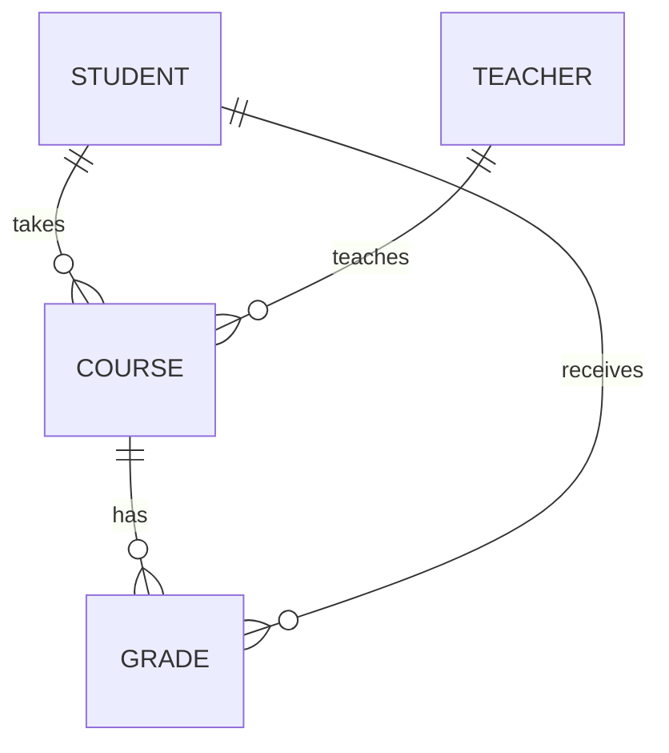

## 1. 背景介绍

### 1.1 高校教务管理系统的核心组成部分

学生选课系统是高校教务管理系统的核心组成部分之一，它连接着学生、教师和教务管理人员，是实现课程安排、学生选课、成绩管理等教务工作的重要工具。随着信息技术的快速发展，传统的纸质化选课方式已经无法满足现代高校的教学需求，学生选课系统应运而生，并逐渐成为高校信息化建设的重要内容。

### 1.2 学生选课系统的设计目标

学生选课系统的设计目标是为学生提供便捷、高效、公平的选课服务，为教务管理人员提供科学、规范、自动化的管理手段。具体来说，学生选课系统应满足以下要求：

* **易用性**: 系统界面友好，操作简便，学生容易上手。
* **高效性**: 系统运行速度快，能够快速响应用户的操作请求。
* **公平性**: 系统保证所有学生在公平、公正的环境下进行选课。
* **安全性**: 系统能够有效保护学生信息和课程信息的安全性。
* **可扩展性**: 系统能够方便地进行功能扩展和升级，以适应未来发展需求。

## 2. 核心概念与联系

### 2.1 系统用户角色

学生选课系统涉及到多种用户角色，包括：

* **学生**: 选课操作的主要执行者，可以浏览课程信息、选择课程、查看选课结果等。
* **教师**: 负责课程的创建、管理和授课，可以查看学生选课情况、录入成绩等。
* **教务管理员**: 负责系统参数设置、课程安排、选课规则制定等系统管理工作。

### 2.2 核心数据实体

学生选课系统包含以下核心数据实体：

* **学生信息**: 包括学号、姓名、性别、专业等基本信息。
* **教师信息**: 包括工号、姓名、职称、所属学院等基本信息。
* **课程信息**: 包括课程编号、课程名称、课程类型、学分、授课教师、上课时间、上课地点等信息。
* **选课信息**: 包括学生选择的课程、选课时间等信息。
* **成绩信息**: 包括学生的课程成绩、绩点等信息。

### 2.3 实体关系图



## 3. 核心算法原理具体操作步骤

### 3.1 选课算法

学生选课系统一般采用先到先得的选课算法，即在选课开始时间后，学生按照时间顺序进行选课，先提交选课请求的学生优先获得课程名额。为了保证公平性，系统需要设置选课时间段，并限制每个学生在同一时间段内只能选择一门课程。

### 3.2 选课流程

学生选课的具体操作步骤如下：

1. **登录系统**: 学生使用学号和密码登录系统。
2. **浏览课程**: 学生可以根据课程名称、授课教师、上课时间等条件筛选课程，并查看课程的详细信息。
3. **选择课程**: 学生选择想要学习的课程，并将课程添加到选课篮中。
4. **提交选课**: 学生确认选课篮中的课程，并提交选课请求。
5. **查看选课结果**: 系统根据选课算法处理选课请求，并将选课结果反馈给学生。

### 3.3 退课流程

学生退课的具体操作步骤如下：

1. **登录系统**: 学生使用学号和密码登录系统。
2. **查看已选课程**: 学生查看自己已选的课程列表。
3. **选择退课**: 学生选择要退掉的课程。
4. **确认退课**: 学生确认退课操作，系统将课程从学生的选课列表中移除。

## 4. 数学模型和公式详细讲解举例说明

### 4.1 课程容量限制模型

为了保证教学质量，每门课程都有容量限制，即最多允许多少学生选择该课程。课程容量限制模型可以使用以下公式表示：

$$C = S * R$$

其中，$C$ 表示课程容量，$S$ 表示教室座位数，$R$ 表示教室利用率。

**举例说明**: 假设某教室有 100 个座位，教室利用率为 80%，则该教室的课程容量为 $100 * 0.8 = 80$ 人。

### 4.2 选课冲突检测模型

选课冲突是指学生选择的课程时间冲突，例如两门课程在同一时间段上课。选课冲突检测模型可以使用以下公式表示：

$$C_{i,j} = \begin{cases} 1, & \text{if } T_i \cap T_j \neq \emptyset \\ 0, & \text{otherwise} \end{cases}$$

其中，$C_{i,j}$ 表示课程 $i$ 和课程 $j$ 是否时间冲突，$T_i$ 表示课程 $i$ 的上课时间段，$T_j$ 表示课程 $j$ 的上课时间段。

**举例说明**: 假设课程 A 的上课时间段为周一 8:00-10:00，课程 B 的上课时间段为周一 9:00-11:00，则课程 A 和课程 B 时间冲突，$C_{A,B} = 1$。

## 5. 项目实践：代码实例和详细解释说明

### 5.1 技术选型

本项目采用 Java 语言开发，使用 Spring Boot 框架构建 RESTful API，数据库采用 MySQL，前端使用 Vue.js 框架开发。

### 5.2 代码实例

**学生实体类**

```java
public class Student {

    private Long id;
    private String studentId;
    private String name;
    private String gender;
    private String major;

    // getter and setter methods
}
```

**课程实体类**

```java
public class Course {

    private Long id;
    private String courseId;
    private String name;
    private String type;
    private Integer credits;
    private Teacher teacher;
    private String time;
    private String location;
    private Integer capacity;

    // getter and setter methods
}
```

**选课控制器**

```java
@RestController
@RequestMapping("/api/courses")
public class CourseController {

    @Autowired
    private CourseService courseService;

    @PostMapping("/{courseId}/enroll")
    public ResponseEntity<String> enrollCourse(@PathVariable String courseId, @RequestBody Student student) {
        try {
            courseService.enrollCourse(courseId, student);
            return ResponseEntity.ok("选课成功");
        } catch (CourseFullException e) {
            return ResponseEntity.badRequest().body("课程已满");
        } catch (CourseConflictException e) {
            return ResponseEntity.badRequest().body("课程时间冲突");
        }
    }
}
```

### 5.3 代码解释

* `Student` 类和 `Course` 类分别表示学生和课程实体，包含了相应的属性和 getter/setter 方法。
* `CourseController` 类是选课控制器，负责处理学生选课请求。
* `enrollCourse` 方法处理学生选课请求，根据课程编号和学生信息进行选课操作。
* `CourseFullException` 和 `CourseConflictException` 是自定义异常类，分别表示课程已满和课程时间冲突的情况。

## 6. 实际应用场景

学生选课系统广泛应用于各类高校，例如：

* **本科院校**: 用于本科生选课、退课、查询成绩等。
* **研究生院**: 用于研究生选课、退课、查询成绩等。
* **继续教育学院**: 用于成人教育学生选课、退课、查询成绩等。

## 7. 工具和资源推荐

* **Spring Boot**: https://spring.io/projects/spring-boot
* **MySQL**: https://www.mysql.com/
* **Vue.js**: https://vuejs.org/

## 8. 总结：未来发展趋势与挑战

### 8.1 未来发展趋势

随着人工智能、大数据等技术的不断发展，学生选课系统未来将更加智能化、个性化和便捷化。例如：

* **智能推荐**: 系统可以根据学生的兴趣爱好、学习能力等因素推荐合适的课程。
* **个性化定制**: 学生可以根据自己的需求定制选课方案。
* **移动化**: 学生可以使用手机等移动设备进行选课操作。

### 8.2 面临的挑战

学生选课系统在未来发展过程中也面临着一些挑战，例如：

* **数据安全**: 如何保障学生信息和课程信息的安全性。
* **系统性能**: 如何提高系统的运行效率，应对大量学生同时选课的情况。
* **用户体验**: 如何提升系统的易用性和用户体验。

## 9. 附录：常见问题与解答

### 9.1 问：选课时提示课程已满怎么办？

答：课程已满表示该课程的容量已达到上限，无法再进行选课。您可以选择其他时间段的课程，或者联系教务管理人员咨询。

### 9.2 问：选课时提示课程时间冲突怎么办？

答：课程时间冲突表示您选择的课程与已选课程上课时间重叠。您需要调整选课方案，选择时间不冲突的课程。

### 9.3 问：如何查看我的选课结果？

答：您可以在系统中查看您的选课结果，包括已选课程、课程时间、授课教师等信息。