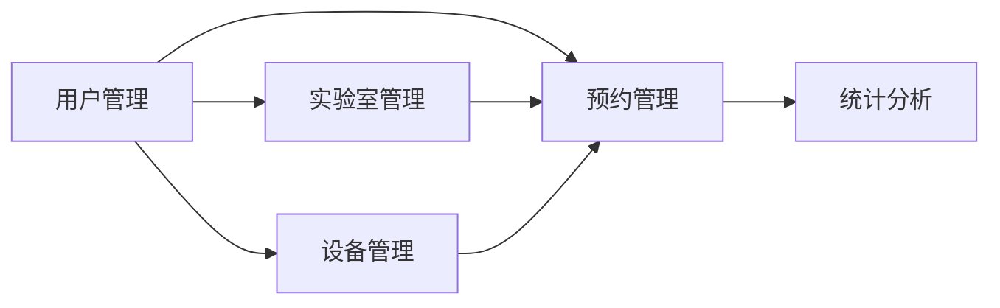

## 1. 背景介绍

### 1.1 高校实验室管理现状

高校实验室是科研和教学的重要场所，其管理效率直接关系到科研项目的进展和教学质量的提升。然而，传统的实验室管理模式存在诸多弊端：

* **资源分配不均:**  实验室资源有限，手动分配容易出现分配不均、资源浪费等问题。
* **预约流程繁琐:**  传统的预约方式通常需要填写纸质申请表，审批流程冗长，效率低下。
* **信息不透明:**  实验室的使用情况、设备状态等信息缺乏透明度，难以进行有效的监管和统计分析。

### 1.2 实验室预约系统的意义

为了解决上述问题，开发一套高效、便捷、智能的实验室预约系统势在必行。实验室预约系统可以实现：

* **资源的合理分配:**  系统可以根据实验室的容量、设备情况等因素，自动分配实验室资源，提高资源利用率。
* **预约流程的简化:**  用户可以通过系统在线提交预约申请，系统自动进行审批，简化预约流程，提高效率。
* **信息的透明化:**  系统可以实时记录实验室的使用情况、设备状态等信息，方便管理人员进行监管和统计分析。

## 2. 核心概念与联系

### 2.1 系统用户角色

实验室预约系统涉及的用户角色主要包括：

* **管理员:**  负责系统的维护和管理，包括用户管理、实验室管理、设备管理、预约管理等。
* **教师:**  可以预约实验室进行科研或教学活动。
* **学生:**  可以预约实验室进行实验课程或科研项目。

### 2.2 核心功能模块

实验室预约系统主要包括以下功能模块：

* **用户管理:**  包括用户注册、登录、信息修改、权限管理等功能。
* **实验室管理:**  包括实验室信息添加、修改、删除、查询等功能。
* **设备管理:**  包括设备信息添加、修改、删除、查询等功能。
* **预约管理:**  包括预约申请、审批、取消、查询等功能。
* **统计分析:**  提供实验室使用情况、设备使用情况等统计分析功能。

### 2.3 核心概念联系图



## 3. 核心算法原理具体操作步骤

### 3.1 预约算法

实验室预约系统的核心算法是预约算法，其主要功能是根据用户的预约申请和实验室的可用时间段，自动分配实验室资源。常用的预约算法包括：

* **先到先得:**  按照预约申请的提交时间顺序进行分配，先提交的申请优先获得实验室资源。
* **时间片轮转:**  将实验室的可用时间段划分为多个时间片，用户可以预约任意时间片，系统按照时间片轮转的方式分配实验室资源。
* **优先级调度:**  根据用户的身份、预约目的等因素，设置不同的优先级，优先级高的用户优先获得实验室资源。

### 3.2 预约流程

用户提交预约申请后，系统会自动进行以下操作：

1. **检查用户权限:**  验证用户是否具有预约该实验室的权限。
2. **检查时间冲突:**  检查预约时间段是否与其他预约冲突。
3. **分配实验室资源:**  根据预约算法分配实验室资源。
4. **发送通知:**  向用户发送预约结果通知。

## 4. 数学模型和公式详细讲解举例说明

### 4.1 预约冲突检测

假设实验室的可用时间段为 $[T_1, T_2]$，用户的预约申请时间段为 $[t_1, t_2]$，则预约冲突的条件为：

$$
t_1 < T_2 \land t_2 > T_1
$$

### 4.2 实验室利用率计算

实验室利用率是指实验室实际使用时间占总可用时间的比例，其计算公式为：

$$
利用率 = \frac{实际使用时间}{总可用时间}
$$

## 5. 项目实践：代码实例和详细解释说明

### 5.1 技术选型

本项目采用 Python 语言和 Django 框架进行开发，数据库采用 MySQL。

### 5.2 代码实例

#### 5.2.1 预约模型

```python
from django.db import models

class Reservation(models.Model):
    user = models.ForeignKey(User, on_delete=models.CASCADE)
    lab = models.ForeignKey(Lab, on_delete=models.CASCADE)
    start_time = models.DateTimeField()
    end_time = models.DateTimeField()
    status = models.CharField(max_length=10, choices=(
        ('pending', '待审批'),
        ('approved', '已批准'),
        ('rejected', '已拒绝'),
    ), default='pending')
```

#### 5.2.2 预约视图

```python
from django.shortcuts import render, redirect
from .models import Reservation

def create_reservation(request):
    if request.method == 'POST':
        # 获取表单数据
        # ...

        # 创建预约对象
        reservation = Reservation(
            user=request.user,
            lab=lab,
            start_time=start_time,
            end_time=end_time,
        )
        reservation.save()

        # 发送通知
        # ...

        return redirect('reservation_list')
    else:
        # ...
        return render(request, 'create_reservation.html', context)
```

## 6. 实际应用场景

### 6.1 高校实验室管理

实验室预约系统可以应用于高校实验室管理，提高实验室资源利用率，简化预约流程，提高管理效率。

### 6.2 企业研发实验室管理

企业研发实验室也需要进行有效的管理，实验室预约系统可以帮助企业管理实验室资源，提高研发效率。

## 7. 工具和资源推荐

### 7.1 Django 框架

Django 是一个高级 Python Web 框架，可以快速开发安全和可维护的网站。

### 7.2 MySQL 数据库

MySQL 是一个流行的关系型数据库管理系统，性能优越，易于使用。

## 8. 总结：未来发展趋势与挑战

### 8.1 智能化

未来实验室预约系统将更加智能化，例如：

* 利用人工智能技术实现预约申请的自动审批。
* 根据用户的历史预约记录，推荐合适的实验室资源。

### 8.2 集成化

实验室预约系统将与其他系统集成，例如：

* 与门禁系统集成，实现预约用户的自动出入管理。
* 与设备管理系统集成，实现实验室设备的自动化管理。

## 9. 附录：常见问题与解答

### 9.1 如何修改预约信息？

用户可以通过系统提供的预约查询功能找到需要修改的预约，然后点击“修改”按钮进行修改。

### 9.2 如何取消预约？

用户可以通过系统提供的预约查询功能找到需要取消的预约，然后点击“取消”按钮进行取消。


## 10.  展望

实验室预约系统是实验室管理信息化的重要组成部分，随着技术的不断发展，实验室预约系统将不断完善和优化，为科研和教学提供更加高效、便捷的服务。 
