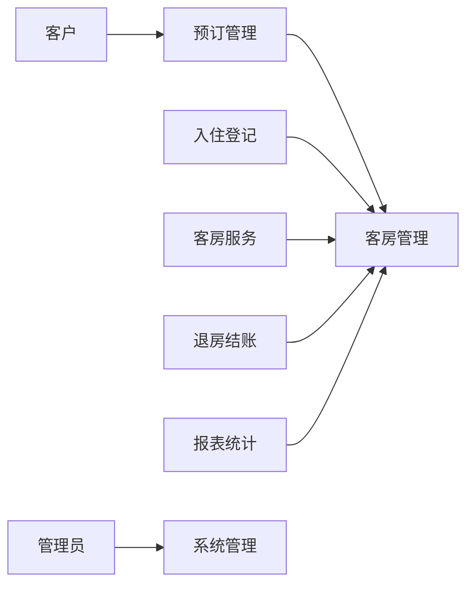

## 1. 背景介绍

### 1.1 酒店行业的信息化趋势

随着信息技术的飞速发展和互联网的普及，酒店行业也迎来了信息化浪潮。传统的酒店管理模式已经无法满足日益增长的客户需求和市场竞争压力。为了提高运营效率、提升客户满意度、增强市场竞争力，酒店纷纷开始引入信息化管理系统，其中客房管理系统是酒店信息化建设的核心组成部分。

### 1.2 客房管理系统的重要性

客房管理系统是酒店运营管理的核心系统，它涵盖了客房预订、入住登记、客房服务、退房结账等各个环节。高效的客房管理系统可以帮助酒店：

* **提高客房入住率和收入**: 通过在线预订、实时房态查询等功能，酒店可以更好地掌握客房资源，优化客房分配，提高客房入住率和收入。
* **提升客户满意度**:  便捷的入住登记、客房服务、退房结账流程，可以提升客户入住体验和满意度。
* **优化运营管理**:  客房管理系统可以帮助酒店实时监控客房状态、统计运营数据，为酒店管理决策提供数据支持。
* **降低运营成本**:  自动化流程可以减少人工操作，降低运营成本。

### 1.3 本文目的

本文将从技术角度详细介绍宾馆客房管理系统的设计与实现，包括系统需求分析、系统架构设计、数据库设计、核心功能模块实现、系统测试与部署等方面，旨在为酒店信息化建设提供参考和借鉴。

## 2. 核心概念与联系

### 2.1 系统用户角色

宾馆客房管理系统涉及多个用户角色，包括：

* **管理员**: 负责系统管理、用户管理、权限管理等。
* **前台接待**: 负责客房预订、入住登记、退房结账等。
* **客房服务**: 负责客房清洁、维修等。
* **客户**:  通过在线平台或电话预订客房。

### 2.2 系统功能模块

宾馆客房管理系统主要功能模块包括：

* **客房管理**:  包括客房类型管理、客房状态管理、客房价格管理等。
* **预订管理**:  包括在线预订、电话预订、预订查询、预订取消等。
* **入住登记**:  包括客户信息登记、客房分配、押金管理等。
* **客房服务**:  包括客房清洁、客房维修、迷你吧消费等。
* **退房结账**:  包括费用结算、发票打印等。
* **报表统计**:  包括客房入住率统计、收入统计等。
* **系统管理**:  包括用户管理、权限管理、系统设置等。

### 2.3 核心概念联系

下图展示了宾馆客房管理系统核心概念之间的联系：



## 3. 核心算法原理具体操作步骤

### 3.1 客房预订算法

客房预订算法是客房管理系统的核心算法之一，其目的是在满足客户预订需求的同时，最大化酒店客房入住率和收入。常见的客房预订算法包括：

* **FIFO (First In First Out)**: 按照预订时间顺序分配客房，先预订的客户优先分配客房。
* **最短路径优先**: 优先分配距离客户目的地最近的客房。
* **最高价格优先**: 优先分配价格最高的客房。
* **综合评分**:  根据客房类型、位置、价格等因素对客房进行评分，优先分配评分最高的客房。

### 3.2 客房分配算法

客房分配算法是在客户办理入住登记时，根据客户需求和酒店客房状态，为客户分配最合适的客房。常见的客房分配算法包括：

* **随机分配**:  随机选择符合客户需求的空闲客房。
* **楼层优先**:  优先分配同一楼层的客房。
* **房间类型优先**:  优先分配客户预订的房间类型。

### 3.3 费用结算算法

费用结算算法是在客户退房时，根据客户入住时间、客房价格、客房服务消费等信息，计算客户应付费用。常见的费用结算算法包括：

* **按天计费**:  根据客户入住天数计算房费。
* **按小时计费**:  根据客户入住小时数计算房费。
* **套餐计费**:  根据客户选择的套餐计算费用。

## 4. 数学模型和公式详细讲解举例说明

### 4.1 客房入住率模型

客房入住率是指酒店已出租客房数占酒店总客房数的比例，是衡量酒店经营状况的重要指标。客房入住率的计算公式如下：

$$
客房入住率 = \frac{已出租客房数}{酒店总客房数} \times 100\%
$$

**举例说明**:

某酒店共有 100 间客房，某天已出租 80 间客房，则该酒店当天的客房入住率为：

$$
客房入住率 = \frac{80}{100} \times 100\% = 80\%
$$

### 4.2 客房收入模型

客房收入是指酒店通过出租客房获得的收入。客房收入的计算公式如下：

$$
客房收入 = 已出租客房数 \times 平均房价
$$

**举例说明**:

某酒店共有 100 间客房，某天已出租 80 间客房，平均房价为 500 元/间，则该酒店当天的客房收入为：

$$
客房收入 = 80 \times 500 = 40000 元
$$

## 5. 项目实践：代码实例和详细解释说明

### 5.1 技术选型

* **编程语言**: Java
* **数据库**: MySQL
* **Web框架**: Spring Boot
* **前端框架**: React

### 5.2 代码示例

**客房实体类**:

```java
public class Room {

    private Long id; // 客房ID
    private String roomNumber; // 客房号
    private String roomType; // 客房类型
    private Double price; // 客房价格
    private String status; // 客房状态

    // getter和setter方法

}
```

**客房预订接口**:

```java
@RestController
@RequestMapping("/api/rooms")
public class RoomController {

    @Autowired
    private RoomService roomService;

    @PostMapping("/book")
    public ResponseEntity<Room> bookRoom(@RequestBody RoomBookingRequest request) {
        Room room = roomService.bookRoom(request);
        return ResponseEntity.ok(room);
    }

}
```

### 5.3 代码解释说明

* **客房实体类**:  定义了客房的基本信息，包括客房ID、客房号、客房类型、客房价格、客房状态等。
* **客房预订接口**:  提供了客房预订功能，接收客房预订请求，调用客房服务进行预订处理，并返回预订结果。

## 6. 实际应用场景

宾馆客房管理系统适用于各种类型的酒店，包括：

* **星级酒店**:  星级酒店客房数量多、服务项目多、客户需求多样化，需要功能完善、性能稳定的客房管理系统。
* **经济型酒店**:  经济型酒店客房数量少、服务项目简单、客户需求相对单一，可以选择功能精简、价格便宜的客房管理系统。
* **民宿**:  民宿客房数量少、服务个性化，可以选择功能灵活、易于定制的客房管理系统。

## 7. 工具和资源推荐

### 7.1 酒店管理系统软件

* **携程酒店管理系统**:  国内领先的酒店管理系统软件，功能全面，性能稳定。
* **美团酒店管理系统**:  美团旗下的酒店管理系统软件，价格便宜，操作简单。
* **绿云酒店管理系统**:  国内知名的酒店管理系统软件，功能强大，定制化程度高。

### 7.2 在线学习资源

* **慕课网**:  提供丰富的酒店管理系统开发课程，适合初学者学习。
* **网易云课堂**:  提供专业的酒店管理系统开发课程，适合有一定基础的开发者学习。
* **CSDN**:  提供大量的酒店管理系统开发技术博客，适合开发者参考学习。

## 8. 总结：未来发展趋势与挑战

### 8.1 未来发展趋势

* **智能化**:  随着人工智能技术的不断发展，客房管理系统将更加智能化，例如智能客房分配、智能客房服务、智能报表分析等。
* **移动化**:  移动互联网的普及，客房管理系统将更加移动化，例如手机APP预订、手机APP办理入住登记等。
* **个性化**:  客户需求越来越个性化，客房管理系统将更加个性化，例如根据客户喜好推荐客房、提供个性化客房服务等。

### 8.2 面临的挑战

* **数据安全**:  酒店客房管理系统存储了大量的客户个人信息，数据安全问题至关重要。
* **系统集成**:  酒店信息化建设需要集成多个系统，系统集成难度大。
* **成本控制**:  酒店信息化建设需要投入大量的资金，成本控制是酒店需要面对的挑战。

## 9. 附录：常见问题与解答

### 9.1 如何选择合适的客房管理系统？

选择客房管理系统需要考虑酒店规模、客户需求、预算等因素。

### 9.2 如何保障客房管理系统的数据安全？

* **加强用户权限管理**:  设置不同用户角色的权限，限制用户对数据的访问。
* **数据加密**:  对敏感数据进行加密存储，防止数据泄露。
* **定期备份**:  定期备份系统数据，防止数据丢失。

### 9.3 如何降低客房管理系统的成本？

* **选择云端部署**:  云端部署可以节省硬件成本和维护成本。
* **选择开源软件**:  开源软件可以节省软件成本。
* **选择功能精简的系统**:  功能精简的系统可以降低开发成本和维护成本。
