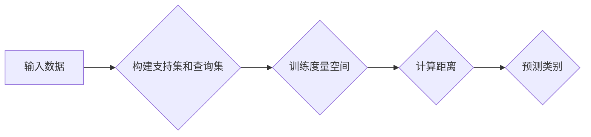
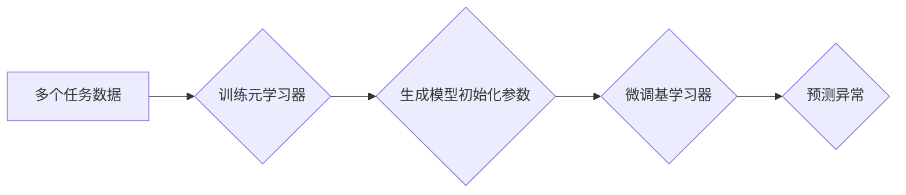

# 异常检测中的元学习:如何利用先验任务知识加速训练?

作者：禅与计算机程序设计艺术

## 1. 背景介绍

### 1.1 异常检测的挑战

异常检测，也被称为离群点检测，是指识别与大多数数据点显著不同的数据点的过程。这些异常点通常代表着系统中的错误、欺诈、入侵或其他值得关注的事件。然而，异常检测任务面临着诸多挑战：

* **数据稀缺性:** 异常事件通常较为罕见，导致标记的异常数据样本数量有限。
* **噪声数据:** 正常数据中可能存在噪声，这会干扰异常检测算法的准确性。
* **概念漂移:** 异常模式可能会随着时间推移而发生变化，导致模型性能下降。

### 1.2 元学习的引入

为了应对这些挑战，近年来，元学习被引入到异常检测领域。元学习，也称为“学习如何学习”，旨在通过学习多个相关任务的经验来提高模型在新任务上的学习效率。在异常检测中，元学习可以利用先前任务中学习到的知识来加速新任务的训练过程，并提高检测精度。

### 1.3 本文目标

本文将深入探讨元学习在异常检测中的应用，重点关注如何利用先验任务知识来加速训练过程。我们将介绍几种主流的元学习方法，并通过实际案例和代码演示来阐述其工作原理。

## 2. 核心概念与联系

### 2.1 元学习

元学习的核心思想是**从多个任务中学习一个通用的学习算法，使其能够快速适应新的任务**。元学习算法通常包含两个层次：

* **元学习器:** 负责学习不同任务之间的共同特征和模式，并生成一个通用的学习算法。
* **基学习器:** 使用元学习器生成的学习算法，在特定任务上进行训练和预测。

### 2.2 异常检测

异常检测的目标是识别与正常数据模式显著不同的数据点。常见的异常检测方法包括：

* **基于统计的方法:** 使用统计模型来描述正常数据的分布，并识别偏离该分布的点。
* **基于机器学习的方法:** 训练一个模型来区分正常数据和异常数据。
* **基于深度学习的方法:** 使用深度神经网络来学习数据的复杂模式，并识别异常点。

### 2.3 元学习与异常检测的联系

元学习可以应用于各种异常检测方法中，以提高其性能。例如，元学习可以用于：

* **快速适应新的异常模式:** 通过学习先前任务的经验，元学习可以使模型快速适应新的异常模式，而无需大量标记数据。
* **提高泛化能力:** 元学习可以帮助模型学习更通用的特征表示，从而提高其在不同数据集上的泛化能力。
* **减少训练时间:** 元学习可以利用先验任务知识来加速新任务的训练过程。

## 3. 核心算法原理具体操作步骤

### 3.1 基于度量的元学习

基于度量的元学习方法通过学习一个度量空间，使来自同一类别的样本彼此靠近，而来自不同类别的样本彼此远离。在异常检测中，可以将正常数据视为一个类别，将异常数据视为另一个类别。

**具体操作步骤:**

1. **构建支持集和查询集:** 从每个任务中选择一部分数据作为支持集，用于训练度量空间；剩余数据作为查询集，用于评估模型性能。
2. **训练度量空间:** 使用支持集训练一个深度神经网络，该网络可以将输入数据映射到一个低维嵌入空间。
3. **计算距离:** 在嵌入空间中，计算查询样本与支持样本之间的距离。
4. **预测类别:** 根据距离，将查询样本分类为正常或异常。

**算法流程图:**



### 3.2 基于模型的元学习

基于模型的元学习方法旨在学习一个模型初始化参数，使其能够快速适应新的任务。在异常检测中，可以将模型初始化参数视为先验任务知识。

**具体操作步骤:**

1. **训练元学习器:** 使用多个任务的数据训练一个元学习器，该学习器可以生成一个模型初始化参数。
2. **微调基学习器:** 使用元学习器生成的初始化参数，在特定任务上微调一个基学习器。
3. **预测异常:** 使用微调后的基学习器预测异常。

**算法流程图:**



## 4. 数学模型和公式详细讲解举例说明

### 4.1 基于度量的元学习

以孪生网络为例，其目标是学习一个函数 $f_\theta$，该函数可以将两个输入样本映射到一个低维嵌入空间，并最小化来自同一类别的样本之间的距离，最大化来自不同类别的样本之间的距离。

损失函数定义为：

$$
\mathcal{L}(\theta) = \sum_{i=1}^{N} \sum_{j=1}^{M} y_{ij} || f_\theta(x_i) - f_\theta(x_j) ||^2 + (1 - y_{ij}) \max(0, m - || f_\theta(x_i) - f_\theta(x_j) ||^2)
$$

其中：

* $x_i$ 和 $x_j$ 分别表示来自支持集和查询集的样本。
* $y_{ij}$ 表示 $x_i$ 和 $x_j$ 是否属于同一类别，如果属于同一类别则为 1，否则为 0。
* $m$ 是一个预定义的阈值，用于控制不同类别样本之间的最小距离。

### 4.2 基于模型的元学习

以 MAML 算法为例，其目标是学习一个模型初始化参数 $\theta$，使其能够通过少量梯度下降步骤快速适应新的任务。

MAML 算法的损失函数定义为：

$$
\mathcal{L}(\theta) = \sum_{i=1}^{N} \mathcal{L}_i(\theta')
$$

其中：

* $\theta'$ 表示在任务 $i$ 上微调后的模型参数。
* $\mathcal{L}_i$ 表示任务 $i$ 的损失函数。

MAML 算法通过计算 $\mathcal{L}(\theta)$ 对 $\theta$ 的二阶导数来更新模型参数，从而使模型能够快速适应新的任务。

## 5. 项目实践：代码实例和详细解释说明

### 5.1 基于度量的元学习

```python
import torch
import torch.nn as nn

class SiameseNetwork(nn.Module):
    def __init__(self):
        super(SiameseNetwork, self).__init__()
        self.conv = nn.Sequential(
            nn.Conv2d(1, 64, kernel_size=3, padding=1),
            nn.ReLU(),
            nn.MaxPool2d(kernel_size=2),
            nn.Conv2d(64, 128, kernel_size=3, padding=1),
            nn.ReLU(),
            nn.MaxPool2d(kernel_size=2),
        )
        self.fc = nn.Sequential(
            nn.Linear(128 * 7 * 7, 1024),
            nn.ReLU(),
            nn.Linear(1024, 128),
        )

    def forward_one(self, x):
        x = self.conv(x)
        x = x.view(x.size(0), -1)
        x = self.fc(x)
        return x

    def forward(self, input1, input2):
        output1 = self.forward_one(input1)
        output2 = self.forward_one(input2)
        return output1, output2

# 定义损失函数
criterion = nn.CosineEmbeddingLoss()

# 构建模型
model = SiameseNetwork()

# 定义优化器
optimizer = torch.optim.Adam(model.parameters())

# 训练模型
for epoch in range(num_epochs):
    # 构建支持集和查询集
    support_images, support_labels = ...
    query_images, query_labels = ...

    # 前向传播
    support_outputs, query_outputs = model(support_images, query_images)

    # 计算损失
    loss = criterion(support_outputs, query_outputs, support_labels)

    # 反向传播和优化
    optimizer.zero_grad()
    loss.backward()
    optimizer.step()
```

### 5.2 基于模型的元学习

```python
import torch
import torch.nn as nn
from torchmeta.utils.gradient_based import gradient_update_parameters

class Model(nn.Module):
    def __init__(self):
        super(Model, self).__init__()
        self.conv = nn.Sequential(
            nn.Conv2d(1, 64, kernel_size=3, padding=1),
            nn.ReLU(),
            nn.MaxPool2d(kernel_size=2),
            nn.Conv2d(64, 128, kernel_size=3, padding=1),
            nn.ReLU(),
            nn.MaxPool2d(kernel_size=2),
        )
        self.fc = nn.Sequential(
            nn.Linear(128 * 7 * 7, 1024),
            nn.ReLU(),
            nn.Linear(1024, 10),
        )

    def forward(self, x):
        x = self.conv(x)
        x = x.view(x.size(0), -1)
        x = self.fc(x)
        return x

# 定义损失函数
criterion = nn.CrossEntropyLoss()

# 构建模型
model = Model()

# 定义元学习器
meta_optimizer = torch.optim.Adam(model.parameters())

# 训练元学习器
for epoch in range(num_epochs):
    # 采样多个任务
    for task in tasks:
        # 获取任务数据
        train_images, train_labels = ...
        test_images, test_labels = ...

        # 创建模型副本
        learner = Model()
        learner.load_state_dict(model.state_dict())

        # 微调模型副本
        for _ in range(num_adaptation_steps):
            # 前向传播
            train_outputs = learner(train_images)

            # 计算损失
            loss = criterion(train_outputs, train_labels)

            # 反向传播和优化
            learner.zero_grad()
            loss.backward()
            gradient_update_parameters(learner, loss, step_size=0.1, first_order=True)

        # 评估模型副本
        test_outputs = learner(test_images)
        test_loss = criterion(test_outputs, test_labels)

    # 更新元学习器参数
    meta_optimizer.zero_grad()
    test_loss.backward()
    meta_optimizer.step()
```

## 6. 实际应用场景

元学习在异常检测领域具有广泛的应用前景，例如：

* **网络入侵检测:** 利用先前的网络流量数据训练元学习模型，可以快速识别新的入侵模式。
* **欺诈检测:** 利用历史交易数据训练元学习模型，可以快速识别新的欺诈行为。
* **工业故障诊断:** 利用传感器数据训练元学习模型，可以快速识别新的设备故障。
* **医疗诊断:** 利用患者病历数据训练元学习模型，可以快速识别新的疾病模式。

## 7. 工具和资源推荐

* **PyTorch:** 深度学习框架，提供丰富的元学习工具和库。
* **Torchmeta:** 元学习库，包含各种元学习算法的实现。
* **Learn2Learn:** 元学习库，提供模块化的元学习算法和数据集。

## 8. 总结：未来发展趋势与挑战

元学习作为一种新兴的机器学习方法，在异常检测领域具有巨大潜力。未来，元学习在异常检测中的发展趋势包括：

* **更强大的元学习算法:** 研究人员将继续开发更强大、更高效的元学习算法，以应对更复杂的异常检测任务。
* **更丰富的先验任务知识:** 探索如何有效地利用更丰富的先验任务知识，例如领域知识、专家经验等，来提高元学习模型的性能。
* **更广泛的应用场景:** 将元学习应用于更广泛的异常检测场景，例如视频监控、物联网安全等。

然而，元学习在异常检测中也面临着一些挑战：

* **数据效率:** 元学习需要大量的训练数据才能达到良好的性能，这在异常检测中可能是一个挑战，因为异常数据通常较为稀缺。
* **可解释性:** 元学习模型通常比较复杂，其决策过程难以解释，这在某些应用场景中可能是一个问题。
* **鲁棒性:** 元学习模型容易受到对抗样本的攻击，因此需要提高其鲁棒性。

## 8. 附录：常见问题与解答

### 8.1 元学习与迁移学习的区别是什么？

迁移学习是指将从一个任务中学习到的知识应用于另一个相关任务。元学习则是学习如何学习，其目标是学习一个通用的学习算法，使其能够快速适应新的任务。

### 8.2 元学习在异常检测中有哪些优势？

元学习可以利用先验任务知识来加速新任务的训练过程，并提高检测精度。此外，元学习可以提高模型的泛化能力，使其能够适应新的异常模式。

### 8.3 如何选择合适的元学习算法？

选择合适的元学习算法取决于具体的异常检测任务和数据集。例如，如果异常数据较为稀缺，则可以考虑使用基于模型的元学习方法。如果数据量较大，则可以考虑使用基于度量的元学习方法。