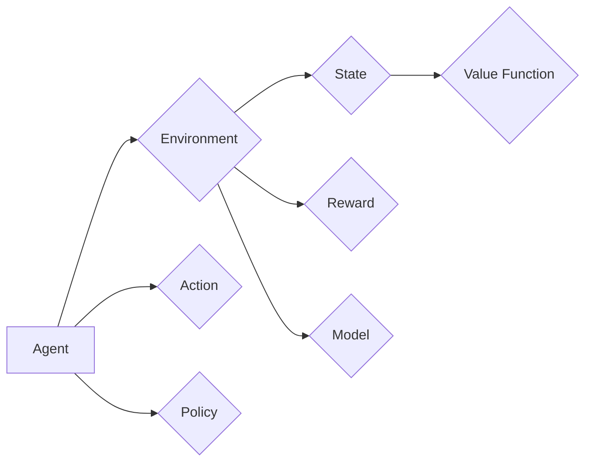

## 1. 背景介绍

### 1.1 人工智能与机器学习

人工智能 (Artificial Intelligence, AI) 是指让机器像人一样思考、学习和解决问题的技术。机器学习 (Machine Learning, ML) 是人工智能的一个重要分支，其核心思想是让计算机从数据中自动学习规律，并利用这些规律对未知数据进行预测。

### 1.2 强化学习的起源与发展

强化学习 (Reinforcement Learning, RL) 是一种机器学习方法，其灵感来自于动物学习的行为方式。在强化学习中，智能体 (Agent) 通过与环境 (Environment) 交互来学习如何做出最佳决策。智能体在环境中执行动作 (Action)，并根据环境的反馈 (Reward) 来调整其策略 (Policy)，以最大化累积奖励。

强化学习最早可以追溯到 20 世纪 50 年代，但直到近年来才取得了显著的进展。这主要得益于计算能力的提升、深度学习的兴起以及大量数据的积累。

### 1.3 强化学习的应用领域

强化学习已被广泛应用于各个领域，例如：

* 游戏：AlphaGo、AlphaStar 等游戏 AI 都是基于强化学习技术开发的。
* 机器人控制：强化学习可以用于训练机器人完成各种任务，例如抓取物体、导航等。
* 自动驾驶：强化学习可以用于训练自动驾驶汽车的决策系统。
* 金融交易：强化学习可以用于开发自动化交易策略。
* 医疗保健：强化学习可以用于辅助诊断、个性化治疗等。

## 2. 核心概念与联系

### 2.1 智能体 (Agent)

智能体是强化学习中的核心概念，它代表着学习和决策的主体。智能体通过与环境交互来收集信息，并根据这些信息来更新其策略。

### 2.2 环境 (Environment)

环境是指智能体所处的外部世界，它可以是真实的物理世界，也可以是虚拟的模拟环境。环境会根据智能体的动作给出反馈，例如奖励或惩罚。

### 2.3 状态 (State)

状态是指环境在某一时刻的具体情况，它包含了所有与环境相关的信息。例如，在围棋游戏中，状态可以表示棋盘上所有棋子的位置。

### 2.4 动作 (Action)

动作是指智能体在环境中可以执行的操作。例如，在围棋游戏中，动作可以表示在棋盘上落下一颗棋子。

### 2.5 奖励 (Reward)

奖励是环境对智能体动作的反馈，它可以是正数、负数或零。奖励的目的是引导智能体学习最佳策略。

### 2.6 策略 (Policy)

策略是指智能体根据当前状态选择动作的规则。策略可以是一个函数，也可以是一个查找表。

### 2.7 值函数 (Value Function)

值函数是指在某个状态下，根据当前策略所能获得的预期累积奖励。值函数可以用来评估策略的好坏。

### 2.8 模型 (Model)

模型是指对环境的模拟，它可以用来预测环境对智能体动作的反应。模型可以用来加速学习过程。

### 2.9 核心概念之间的联系

下图展示了强化学习中核心概念之间的联系：



## 3. 核心算法原理具体操作步骤

### 3.1 基于值的强化学习 (Value-Based RL)

基于值的强化学习方法主要关注于学习值函数，并利用值函数来选择最佳动作。常见的基于值的强化学习算法包括：

* **Q-learning**：Q-learning 是一种经典的基于值的强化学习算法，它使用 Q 函数来表示状态-动作对的价值。Q 函数的更新公式如下：

  $$Q(s, a) \leftarrow Q(s, a) + \alpha [r + \gamma \max_{a'} Q(s', a') - Q(s, a)]$$

  其中，$s$ 表示当前状态，$a$ 表示当前动作，$r$ 表示奖励，$s'$ 表示下一个状态，$a'$ 表示下一个动作，$\alpha$ 表示学习率，$\gamma$ 表示折扣因子。

* **SARSA**：SARSA 算法与 Q-learning 类似，但它使用的是在当前策略下选择的下一个动作来更新 Q 函数。SARSA 的更新公式如下：

  $$Q(s, a) \leftarrow Q(s, a) + \alpha [r + \gamma Q(s', a') - Q(s, a)]$$

### 3.2 基于策略的强化学习 (Policy-Based RL)

基于策略的强化学习方法直接学习策略，而不需要学习值函数。常见的基于策略的强化学习算法包括：

* **策略梯度 (Policy Gradient)**：策略梯度算法通过梯度上升方法来优化策略参数，以最大化预期累积奖励。

* **REINFORCE**：REINFORCE 是一种经典的策略梯度算法，它使用蒙特卡洛方法来估计策略梯度。

### 3.3 Actor-Critic 方法

Actor-Critic 方法结合了基于值和基于策略的方法，它使用一个 Actor 网络来学习策略，并使用一个 Critic 网络来学习值函数。Actor 网络根据 Critic 网络提供的价值评估来更新策略，而 Critic 网络则根据 Actor 网络的行为来更新价值评估。

## 4. 数学模型和公式详细讲解举例说明

### 4.1 马尔可夫决策过程 (Markov Decision Process, MDP)

马尔可夫决策过程是强化学习的数学基础，它是一个五元组 $(S, A, P, R, \gamma)$，其中：

* $S$ 表示状态空间，即所有可能的状态的集合。
* $A$ 表示动作空间，即所有可能的动作的集合。
* $P$ 表示状态转移概率，即在当前状态 $s$ 执行动作 $a$ 后转移到下一个状态 $s'$ 的概率。
* $R$ 表示奖励函数，即在状态 $s$ 执行动作 $a$ 后获得的奖励。
* $\gamma$ 表示折扣因子，它用于权衡未来奖励和当前奖励的重要性。

### 4.2 Bellman 方程

Bellman 方程是强化学习中的一个重要方程，它描述了值函数之间的关系。Bellman 方程的表达式如下：

$$V(s) = \max_{a} [R(s, a) + \gamma \sum_{s'} P(s'|s, a) V(s')]$$

其中，$V(s)$ 表示在状态 $s$ 下的值函数。

### 4.3 举例说明

以一个简单的迷宫游戏为例，来说明强化学习的数学模型和公式。

迷宫游戏的状态空间 $S$ 包括迷宫中的所有格子。动作空间 $A$ 包括向上、向下、向左、向右四个方向。状态转移概率 $P$ 由迷宫的布局决定。奖励函数 $R$ 定义为：到达终点时获得 +1 的奖励，其他情况下获得 0 的奖励。折扣因子 $\gamma$ 设置为 0.9。

假设智能体当前处于迷宫的起点，它可以使用 Q-learning 算法来学习最佳策略。Q 函数的初始值都设置为 0。

智能体在迷宫中随机游走，并根据 Q-learning 的更新公式来更新 Q 函数。例如，如果智能体在状态 $s$ 执行动作 $a$ 后到达状态 $s'$，并获得奖励 $r$，则 Q 函数的更新公式如下：

$$Q(s, a) \leftarrow Q(s, a) + \alpha [r + \gamma \max_{a'} Q(s', a') - Q(s, a)]$$

通过不断地更新 Q 函数，智能体最终可以学习到到达终点的最佳策略。

## 5. 项目实践：代码实例和详细解释说明

### 5.1 OpenAI Gym

OpenAI Gym 是一个用于开发和比较强化学习算法的工具包。它提供了一系列环境，例如迷宫、游戏、机器人控制等。

### 5.2 CartPole 环境

CartPole 环境是一个经典的控制问题，目标是控制一根杆子使其不倒下。

### 5.3 代码实例

```python
import gym
import numpy as np

# 创建 CartPole 环境
env = gym.make('CartPole-v1')

# 定义 Q 函数
Q = np.zeros([env.observation_space.n, env.action_space.n])

# 定义超参数
alpha = 0.1  # 学习率
gamma = 0.99  # 折扣因子
epsilon = 0.1  # 探索率

# 训练循环
for episode in range(1000):
    # 初始化状态
    state = env.reset()

    # 循环直到游戏结束
    done = False
    while not done:
        # 选择动作
        if np.random.uniform(0, 1) < epsilon:
            action = env.action_space.sample()  # 随机选择动作
        else:
            action = np.argmax(Q[state, :])  # 选择 Q 值最大的动作

        # 执行动作
        next_state, reward, done, info = env.step(action)

        # 更新 Q 函数
        Q[state, action] = Q[state, action] + alpha * (
            reward + gamma * np.max(Q[next_state, :]) - Q[state, action]
        )

        # 更新状态
        state = next_state
```

### 5.4 代码解释

* 首先，我们使用 `gym.make('CartPole-v1')` 创建 CartPole 环境。
* 然后，我们定义 Q 函数 `Q`，它是一个二维数组，用于存储状态-动作对的价值。
* 接下来，我们定义超参数 `alpha`、`gamma` 和 `epsilon`。
* 在训练循环中，我们首先初始化状态 `state`。
* 然后，我们进入一个循环，直到游戏结束。
* 在循环中，我们使用 epsilon-greedy 策略来选择动作：以 `epsilon` 的概率随机选择动作，否则选择 Q 值最大的动作。
* 执行动作后，我们获得下一个状态 `next_state`、奖励 `reward`、游戏是否结束 `done` 以及其他信息 `info`。
* 然后，我们使用 Q-learning 的更新公式来更新 Q 函数。
* 最后，我们更新状态 `state`。

## 6. 实际应用场景

### 6.1 游戏

强化学习在游戏领域取得了巨大的成功，例如 AlphaGo、AlphaStar 等游戏 AI 都是基于强化学习技术开发的。

### 6.2 机器人控制

强化学习可以用于训练机器人完成各种任务，例如抓取物体、导航等。

### 6.3 自动驾驶

强化学习可以用于训练自动驾驶汽车的决策系统。

### 6.4 金融交易

强化学习可以用于开发自动化交易策略。

### 6.5 医疗保健

强化学习可以用于辅助诊断、个性化治疗等。

## 7. 工具和资源推荐

### 7.1 OpenAI Gym

OpenAI Gym 是一个用于开发和比较强化学习算法的工具包。

### 7.2 TensorFlow

TensorFlow 是一个开源的机器学习平台，它提供了丰富的强化学习工具和库。

### 7.3 PyTorch

PyTorch 是另一个开源的机器学习平台，它也提供了丰富的强化学习工具和库。

## 8. 总结：未来发展趋势与挑战

### 8.1 未来发展趋势

* **更强大的算法**：研究人员正在努力开发更强大、更高效的强化学习算法。
* **更广泛的应用**：强化学习的应用领域将会越来越广泛，例如医疗保健、金融、教育等。
* **更智能的智能体**：未来的智能体将会更加智能，能够处理更复杂的任务。

### 8.2 挑战

* **样本效率**：强化学习算法通常需要大量的训练数据才能达到良好的性能。
* **泛化能力**：强化学习算法在训练环境之外的环境中的泛化能力仍然是一个挑战。
* **安全性**：强化学习算法的安全性是一个重要问题，特别是在自动驾驶等安全攸关的应用中。

## 9. 附录：常见问题与解答

### 9.1 什么是强化学习？

强化学习是一种机器学习方法，其灵感来自于动物学习的行为方式。在强化学习中，智能体通过与环境交互来学习如何做出最佳决策。

### 9.2 强化学习有哪些应用？

强化学习已被广泛应用于各个领域，例如游戏、机器人控制、自动驾驶、金融交易、医疗保健等。

### 9.3 强化学习有哪些挑战？

强化学习面临着一些挑战，例如样本效率、泛化能力和安全性。
