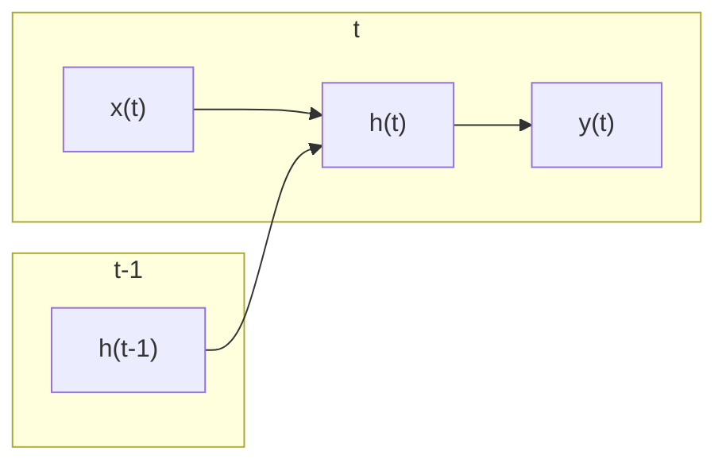

## 1. 背景介绍

### 1.1 人工智能与深度学习的崛起

近年来，人工智能（AI）技术取得了突破性进展，其中深度学习作为其重要分支，展现出强大的能力。深度学习通过构建多层神经网络，模拟人脑的学习机制，从海量数据中提取特征和规律，在图像识别、自然语言处理、语音识别等领域取得了令人瞩目的成果。

### 1.2  传统神经网络的局限性

传统的全连接神经网络（FCN）在处理序列数据时，无法有效捕捉数据之间的时序关系。例如，在自然语言处理中，一个单词的含义往往与其上下文相关联，而FCN无法学习到这种上下文信息。

### 1.3 循环神经网络的诞生

为了解决传统神经网络的局限性，循环神经网络（RNN）应运而生。RNN引入循环结构，允许信息在网络中循环流动，从而有效捕捉序列数据中的时序依赖关系。

## 2. 核心概念与联系

### 2.1 循环结构

RNN的核心在于其循环结构，如下图所示：



其中：

*   $x(t)$ 表示时刻 t 的输入数据
*   $h(t)$ 表示时刻 t 的隐藏状态，包含了历史信息的记忆
*   $y(t)$ 表示时刻 t 的输出数据

RNN的循环结构使得隐藏状态 $h(t)$ 能够记录历史信息，并将其传递给下一个时刻，从而学习到序列数据中的时序依赖关系。

### 2.2 权重共享

RNN中的权重共享是指，在不同的时间步，使用相同的权重矩阵进行计算。这使得RNN能够处理任意长度的序列数据，而无需针对不同长度的序列训练不同的模型。

### 2.3 不同类型的RNN

根据网络结构和应用场景的不同，RNN可以分为多种类型，例如：

*   **简单循环神经网络（Simple RNN）**：最基本的RNN结构，包含一个循环单元。
*   **长短期记忆网络（LSTM）**：通过引入门控机制，能够有效解决RNN中的梯度消失和梯度爆炸问题，适用于处理长序列数据。
*   **门控循环单元（GRU）**：LSTM的简化版本，参数更少，训练速度更快。

## 3. 核心算法原理具体操作步骤

### 3.1 前向传播

RNN的前向传播过程是指，根据输入数据和初始隐藏状态，逐个时间步计算网络的输出值。具体步骤如下：

1.  初始化隐藏状态 $h(0)$。
2.  对于每个时间步 t，计算：
    *   隐藏状态更新：$h(t) = f(W_{xh}x(t) + W_{hh}h(t-1) + b_h)$，其中 $f$ 为激活函数，$W_{xh}$、$W_{hh}$ 为权重矩阵，$b_h$ 为偏置向量。
    *   输出值计算：$y(t) = g(W_{hy}h(t) + b_y)$，其中 $g$ 为输出层的激活函数，$W_{hy}$ 为权重矩阵，$b_y$ 为偏置向量。

### 3.2 反向传播

RNN的反向传播过程是指，根据损失函数，计算网络中各个参数的梯度，并利用梯度下降算法更新参数。由于RNN的循环结构，其反向传播过程与传统神经网络有所不同，称为**沿时间反向传播（BPTT）**。

BPTT算法的具体步骤如下：

1.  计算每个时间步的损失函数值。
2.  从最后一个时间步开始，反向计算每个时间步的梯度。
3.  利用梯度下降算法更新网络参数。

## 4. 数学模型和公式详细讲解举例说明

### 4.1 隐藏状态更新公式

RNN中隐藏状态的更新公式为：

$$h(t) = f(W_{xh}x(t) + W_{hh}h(t-1) + b_h)$$

其中：

*   $h(t)$ 表示时刻 t 的隐藏状态
*   $x(t)$ 表示时刻 t 的输入数据
*   $W_{xh}$ 表示输入到隐藏状态的权重矩阵
*   $W_{hh}$ 表示隐藏状态到隐藏状态的权重矩阵
*   $b_h$ 表示隐藏状态的偏置向量
*   $f$ 表示激活函数，例如tanh或ReLU

### 4.2 输出值计算公式

RNN中输出值的计算公式为：

$$y(t) = g(W_{hy}h(t) + b_y)$$

其中：

*   $y(t)$ 表示时刻 t 的输出值
*   $h(t)$ 表示时刻 t 的隐藏状态
*   $W_{hy}$ 表示隐藏状态到输出的权重矩阵
*   $b_y$ 表示输出的偏置向量
*   $g$ 表示输出层的激活函数，例如sigmoid或softmax

### 4.3 举例说明

假设我们有一个简单的RNN，用于预测下一个字符。输入数据为一个字符序列，输出数据为预测的下一个字符。

*   输入数据： "hello"
*   输出数据： "o"

RNN的隐藏状态更新公式为：

$$h(t) = tanh(W_{xh}x(t) + W_{hh}h(t-1) + b_h)$$

输出值计算公式为：

$$y(t) = softmax(W_{hy}h(t) + b_y)$$

假设初始隐藏状态为 $h(0) = 0$，权重矩阵和偏置向量已知。

1.  **时间步 1:**
    *   输入数据： "h"
    *   计算隐藏状态： $h(1) = tanh(W_{xh}x(1) + W_{hh}h(0) + b_h)$
    *   计算输出值： $y(1) = softmax(W_{hy}h(1) + b_y)$
2.  **时间步 2:**
    *   输入数据： "e"
    *   计算隐藏状态： $h(2) = tanh(W_{xh}x(2) + W_{hh}h(1) + b_h)$
    *   计算输出值： $y(2) = softmax(W_{hy}h(2) + b_y)$
3.  **时间步 3:**
    *   输入数据： "l"
    *   计算隐藏状态： $h(3) = tanh(W_{xh}x(3) + W_{hh}h(2) + b_h)$
    *   计算输出值： $y(3) = softmax(W_{hy}h(3) + b_y)$
4.  **时间步 4:**
    *   输入数据： "l"
    *   计算隐藏状态： $h(4) = tanh(W_{xh}x(4) + W_{hh}h(3) + b_h)$
    *   计算输出值： $y(4) = softmax(W_{hy}h(4) + b_y)$
5.  **时间步 5:**
    *   输入数据： "o"
    *   计算隐藏状态： $h(5) = tanh(W_{xh}x(5) + W_{hh}h(4) + b_h)$
    *   计算输出值： $y(5) = softmax(W_{hy}h(5) + b_y)$

最终，$y(5)$ 的值即为预测的下一个字符 "o"。

## 5. 项目实践：代码实例和详细解释说明

### 5.1 语言模型

语言模型是指，根据已有的文本序列，预测下一个单词或字符的概率分布。RNN可以用于构建语言模型，例如：

```python
import torch
import torch.nn as nn

class RNNLanguageModel(nn.Module):
    def __init__(self, vocab_size, embedding_dim, hidden_dim):
        super(RNNLanguageModel, self).__init__()
        self.embedding = nn.Embedding(vocab_size, embedding_dim)
        self.rnn = nn.RNN(embedding_dim, hidden_dim)
        self.linear = nn.Linear(hidden_dim, vocab_size)

    def forward(self, x, h0):
        x = self.embedding(x)
        out, h = self.rnn(x, h0)
        out = self.linear(out)
        return out, h
```

该代码定义了一个简单的RNN语言模型，包含以下部分：

*   `embedding` 层：将单词或字符映射到向量空间。
*   `rnn` 层：RNN单元，用于学习序列数据中的时序依赖关系。
*   `linear` 层：将RNN的输出映射到词汇表大小的概率分布。

### 5.2 训练语言模型

训练语言模型的步骤如下：

1.  准备训练数据，例如文本语料库。
2.  将文本数据转换为数字序列，例如使用单词索引或字符索引。
3.  创建RNN语言模型实例。
4.  定义损失函数和优化器。
5.  迭代训练数据，计算损失函数值，并利用反向传播算法更新模型参数。

```python
# 定义超参数
vocab_size = 10000
embedding_dim = 128
hidden_dim = 256

# 创建模型实例
model = RNNLanguageModel(vocab_size, embedding_dim, hidden_dim)

# 定义损失函数和优化器
criterion = nn.CrossEntropyLoss()
optimizer = torch.optim.Adam(model.parameters())

# 迭代训练数据
for epoch in range(num_epochs):
    for batch in train_loader:
        # 获取输入数据和目标数据
        inputs, targets = batch

        # 初始化隐藏状态
        h0 = torch.zeros(1, batch_size, hidden_dim)

        # 前向传播
        outputs, h = model(inputs, h0)

        # 计算损失函数值
        loss = criterion(outputs.view(-1, vocab_size), targets.view(-1))

        # 反向传播
        optimizer.zero_grad()
        loss.backward()

        # 更新模型参数
        optimizer.step()
```

### 5.3 生成文本

训练完成后，可以使用语言模型生成文本。步骤如下：

1.  初始化隐藏状态。
2.  选择一个起始单词或字符。
3.  根据当前单词或字符和隐藏状态，预测下一个单词或字符的概率分布。
4.  从概率分布中采样一个单词或字符。
5.  将采样的单词或字符添加到生成的文本序列中。
6.  更新隐藏状态。
7.  重复步骤 3-6，直到生成指定长度的文本序列。

```python
# 初始化隐藏状态
h = torch.zeros(1, 1, hidden_dim)

# 选择起始单词
start_word = "the"

# 生成文本序列
for i in range(sequence_length):
    # 将单词转换为数字索引
    word_index = word_to_index[start_word]

    # 将单词索引转换为张量
    input = torch.tensor([[word_index]])

    # 前向传播
    output, h = model(input, h)

    # 获取概率分布
    probs = torch.softmax(output, dim=2)

    # 从概率分布中采样一个单词索引
    sampled_index = torch.multinomial(probs.squeeze(), num_samples=1).item()

    # 将单词索引转换为单词
    sampled_word = index_to_word[sampled_index]

    # 将采样的单词添加到生成的文本序列中
    generated_text += " " + sampled_word

    # 更新起始单词
    start_word = sampled_word
```

## 6. 实际应用场景

### 6.1 自然语言处理

RNN在自然语言处理领域有着广泛的应用，例如：

*   **机器翻译**：将一种语言的文本翻译成另一种语言的文本。
*   **文本摘要**：从一篇长文本中提取关键信息，生成简短的摘要。
*   **情感分析**：分析文本的情感倾向，例如正面、负面或中性。
*   **问答系统**：根据用户的问题，从知识库中检索相关信息，并生成答案。

### 6.2 语音识别

RNN可以用于语音识别，例如：

*   **语音转文本**：将语音信号转换为文本。
*   **语音搜索**：根据用户的语音指令，进行搜索。
*   **语音助手**：例如Siri、Alexa等，能够与用户进行语音交互。

### 6.3 时间序列分析

RNN可以用于时间序列分析，例如：

*   **股票预测**：预测股票价格的走势。
*   **天气预报**：预测未来的天气状况。
*   **交通流量预测**：预测道路上的交通流量。

## 7. 工具和资源推荐

### 7.1 深度学习框架

*   **TensorFlow**：由Google开发的开源深度学习框架。
*   **PyTorch**：由Facebook开发的开源深度学习框架。
*   **Keras**：高级神经网络API，运行在TensorFlow、Theano或CNTK之上。

### 7.2 数据集

*   **Penn Treebank**：用于自然语言处理研究的文本语料库。
*   **TIMIT**：用于语音识别研究的语音数据集。
*   **UCI Machine Learning Repository**：包含各种机器学习数据集，包括时间序列数据。

## 8. 总结：未来发展趋势与挑战

### 8.1 未来发展趋势

*   **更强大的RNN模型**：随着研究的深入，RNN模型的性能将会不断提升，例如Transformer、BERT等模型。
*   **更广泛的应用领域**：RNN的应用领域将会不断扩展，例如医疗、金融、教育等领域。
*   **与其他技术的融合**：RNN将会与其他技术融合，例如强化学习、迁移学习等，以解决更复杂的问题。

### 8.2 面临的挑战

*   **计算复杂度**：RNN的训练和推理过程需要大量的计算资源。
*   **数据依赖性**：RNN的性能高度依赖于训练数据的质量和数量。
*   **可解释性**：RNN的决策过程难以解释，这限制了其在某些领域的应用。

## 9. 附录：常见问题与解答

### 9.1 什么是梯度消失和梯度爆炸？

梯度消失是指，在RNN的反向传播过程中，梯度随着时间步的增加而逐渐减小，导致早期时间步的参数无法得到有效更新。梯度爆炸是指，梯度随着时间步的增加而逐渐增大，导致参数更新过快，模型不稳定。

### 9.2 如何解决梯度消失和梯度爆炸问题？

LSTM和GRU通过引入门控机制，能够有效解决梯度消失和梯度爆炸问题。门控机制能够控制信息的流动，防止梯度过快地衰减或增长。

### 9.3 RNN与传统神经网络的区别是什么？

RNN与传统神经网络的主要区别在于：

*   **循环结构**：RNN引入循环结构，允许信息在网络中循环流动，从而捕捉序列数据中的时序依赖关系。
*   **权重共享**：RNN中的权重共享是指，在不同的时间步，使用相同的权重矩阵进行计算。

### 9.4 如何选择合适的RNN模型？

选择合适的RNN模型需要考虑以下因素：

*   **序列数据的长度**：LSTM和GRU适用于处理长序列数据，而Simple RNN适用于处理短序列数据。
*   **应用场景**：不同的RNN模型适用于不同的应用场景，例如语言模型、机器翻译、语音识别等。
*   **计算资源**：LSTM和GRU的计算复杂度较高，需要更多的计算资源。