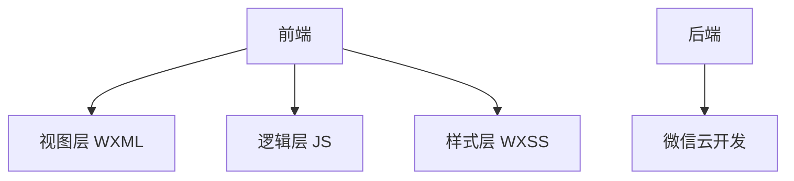
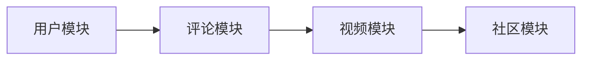
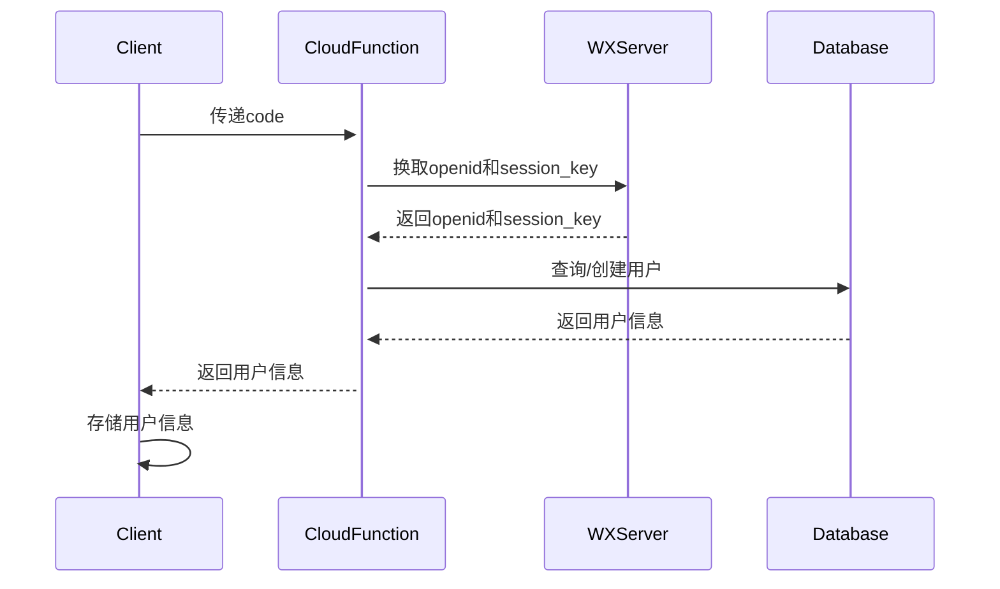

# 微信小程序的动漫视频评论系统

## 1.背景介绍

### 1.1 微信小程序概述

微信小程序是一种全新的连接用户与服务的技术手段,它可以在微信内被便捷地获取和传播,同时具有出色的体验性能。微信小程序的出现,为用户带来了极大的便利,同时也为开发者提供了一个崭新的创业机会。

### 1.2 动漫视频评论系统的需求

随着视频网站和APP的蓬勃发展,动漫视频已经成为了许多年轻人的精神食粮。然而,现有的视频网站往往缺乏针对动漫内容的专门评论系统,用户无法方便地交流分享心得。因此,开发一款微信小程序动漫视频评论系统就显得尤为必要。

### 1.3 系统目标

本文将介绍如何基于微信小程序平台,开发一款动漫视频评论系统。该系统将为动漫爱好者提供以下核心功能:

- 浏览最新动漫资讯和视频更新
- 在线观看动漫视频
- 发表对动漫剧情、人物等方面的评论
- 与其他用户互动、分享心得体会

## 2.核心概念与联系

### 2.1 微信小程序架构

微信小程序采用了前后端分离的架构设计,前端由视图层(WXML)、逻辑层(JS)和样式层(WXSS)组成,后端由微信的云开发能力提供支持。



### 2.2 评论系统核心模块

动漫视频评论系统主要由以下几个核心模块构成:

- 用户模块:实现用户注册、登录、个人中心等功能
- 视频模块:视频内容展示、播放、管理等
- 评论模块:评论的发布、回复、点赞、举报等
- 社区模块:动漫资讯、排行榜、圈子等



### 2.3 关键技术选型

- 前端框架: 微信小程序原生开发
- 后端服务: 微信云开发云函数、云数据库
- 视频播放: 微信小程序视频组件
- UI库: WeUI、Vant Weapp等

## 3.核心算法原理具体操作步骤 

### 3.1 用户认证流程

用户认证是整个系统的基础,确保用户评论行为的可追溯性。我们采用微信授权登录的方式,具体流程如下:

1. 调用wx.login()获取code
2. 将code传递给云函数,云函数调用微信接口换取openid和session_key
3. 云函数查询数据库,如果openid不存在则创建新用户
4. 将用户信息返回给小程序,存入storage完成登录



### 3.2 视频上传与管理

视频内容是系统的核心,我们需要有效的视频上传和管理机制。

1. **上传流程**
    - 小程序选择本地视频文件
    - 调用微信上传云存储API将视频上传至云存储
    - 将视频文件ID和元数据存入云数据库视频集合

2. **管理机制**
    - 设置视频审核机制,对上传的视频进行人工审核
    - 实现视频热度排行,按点赞数、评论数等维度排序
    - 提供视频搜索功能,支持标题、标签等字段搜索

### 3.3 评论系统设计

评论系统是动漫视频社区的核心,我们采用树形结构存储评论数据,支持无限级别嵌套回复。

1. **数据库设计**
    - 评论集合存储评论ID、内容、作者、视频ID、父评论ID等字段
    - 通过父评论ID字段建立索引,方便快速查询子评论

2. **功能实现**  
    - 发表评论时将数据插入评论集合,父评论ID为空
    - 回复评论时将数据插入评论集合,父评论ID为被回复评论的ID
    - 查询评论树时先查根评论,再递归查询所有子评论

3. **其他功能**
    - 点赞、举报评论
    - 个人中心查看自己的评论
    - 评论内容审核,过滤违规词汇

### 3.4 动漫社区模块

为增强用户互动和粘性,我们需要设计一个动漫社区模块。

1. **资讯模块**
    - 爬取并展示最新的动漫资讯
    - 用户可以对资讯进行点赞、评论

2. **排行榜模块**
    - 按不同维度展示视频、评论、用户的排行榜
    - 例如最热视频、最佳影评人等

3. **圈子模块** 
    - 用户可以创建和加入不同的圈子
    - 在圈子内分享动漫心得、视频等
    - 支持圈子内的互动、交流

## 4.数学模型和公式详细讲解举例说明

在视频推荐模块中,我们需要考虑用户的历史行为数据,通过协同过滤等算法为用户推荐感兴趣的视频内容。

### 4.1 用户视频评分矩阵

假设有m个用户,n个视频,我们可以构造一个m*n的用户-视频评分矩阵R:

$$
R=\begin{bmatrix}
    r_{11} & r_{12} & \cdots & r_{1n} \\
    r_{21} & r_{22} & \cdots & r_{2n} \\
    \vdots & \vdots & \ddots & \vdots \\
    r_{m1} & r_{m2} & \cdots & r_{mn}
\end{bmatrix}
$$

其中$r_{ij}$表示用户i对视频j的评分,如果用户没有评分则为空值。

### 4.2 基于用户的协同过滤

基于用户的协同过滤算法通过计算用户之间的相似度,为目标用户推荐与他相似的其他用户喜欢的视频。

1. 计算任意两个用户i和j之间的相似度:

$$sim(i,j) = \frac{\sum\limits_{l\in L}(r_{il}-\overline{r_i})(r_{jl}-\overline{r_j})}{\sqrt{\sum\limits_{l\in L}(r_{il}-\overline{r_i})^2}\sqrt{\sum\limits_{l\in L}(r_{jl}-\overline{r_j})^2}}$$

其中L为用户i和j都评分过的视频集合,$\overline{r_i}$和$\overline{r_j}$分别为用户i和j的平均评分。

2. 对于目标用户a,计算与其他用户的相似度,选取相似度最高的k个用户作为最近邻。

3. 计算目标用户a对视频p的预测评分:

$$r_{ap} = \overline{r_a} + \frac{\sum\limits_{i\in N(a,k)}sim(a,i)(r_{ip}-\overline{r_i})}{\sum\limits_{i\in N(a,k)}|sim(a,i)|}$$

其中N(a,k)为用户a的最近邻集合。

4. 根据预测评分从高到低推荐视频给用户a。

通过用户协同过滤算法,我们可以有效地为用户推荐感兴趣的视频内容。

## 5.项目实践:代码实例和详细解释说明

### 5.1 云函数示例

云函数用于实现后端业务逻辑,下面是一个获取视频列表的示例:

```javascript
// 云函数入口文件
const cloud = require('wx-server-sdk')
cloud.init()
const db = cloud.database()
const _ = db.command

// 云函数入口函数
exports.main = async (event, context) => {
  const { start, limit, orderBy = 'createTime', orderType = 'desc' } = event

  const countResult = await db.collection('videos').count()
  const total = countResult.total

  const videoList = await db.collection('videos')
    .skip(start)
    .limit(limit)
    .orderBy(orderBy, orderType)
    .get()

  return {
    total,
    videoList: videoList.data
  }
}
```

该云函数首先通过`db.collection('videos').count()`获取视频总数。然后使用`skip`和`limit`分页查询,并通过`orderBy`指定排序字段和顺序。最后将查询结果返回给小程序。

### 5.2 视频评论组件

以下是一个简单的视频评论组件示例:

```xml
<!-- 评论列表 -->
<view class="comment-list">
  <view class="comment-item" wx:for="{{commentList}}" wx:key="id">
    <view class="user-info">
      <image class="avatar" src="{{item.author.avatarUrl}}"></image>
      <view class="nickname">{{item.author.nickname}}</view>
    </view>
    <view class="comment-content">{{item.content}}</view>
    <view class="comment-meta">
      <view class="meta-item">{{item.createTime}}</view>
      <view class="meta-item" bindtap="handleReply" data-comment="{{item}}">回复</view>
    </view>
    <!-- 子评论 -->
    <view class="sub-comment-list">
      <comment-item wx:for="{{item.subComments}}" wx:key="id" comment="{{item}}"></comment-item>
    </view>
  </view>
</view>

<!-- 输入框和发送按钮 -->
<view class="comment-input">
  <input value="{{inputValue}}" bindinput="handleInput" placeholder="输入评论..." />
  <button bindtap="handleSend">发送</button>
</view>
```

该组件使用`wx:for`循环渲染评论列表,每个评论包含用户信息、评论内容和元数据。评论组件支持无限级别嵌套,通过递归方式渲染子评论。用户可以在输入框中输入评论内容并发送。

在JavaScript文件中,我们需要实现评论的增删改查等逻辑,并与云数据库交互。

### 5.3 视频播放器

微信小程序提供了原生的`video`组件用于视频播放,下面是一个简单的示例:

```xml
<video
  src="{{videoUrl}}"
  controls
  autoplay
  bindplay="handlePlay"
  binderror="handleError"
  bindended="handleEnded"
></video>
```

`src`属性指定视频源地址,可以是本地文件路径或者远程地址。`controls`属性用于显示默认播放控件,`autoplay`属性设置是否自动播放视频。

我们还可以通过事件监听器来处理视频的播放、错误、结束等事件。例如:

```javascript
handlePlay() {
  console.log('视频开始播放')
},
handleError(e) {
  console.error('视频播放错误', e)
},
handleEnded() {
  console.log('视频播放结束')
}
```

此外,我们还可以使用`wx.createVideoContext`方法获取视频上下文,从而控制视频的播放、暂停、跳转等操作。

## 6.实际应用场景

动漫视频评论系统可以广泛应用于以下领域:

1. **视频网站和APP**
   - 为现有视频网站和APP添加专门的动漫视频评论区
   - 提高用户粘性,增强社区氛围

2. **动漫网站和APP**
   - 整合视频播放和评论功能
   - 成为动漫爱好者的聚集地

3. **垂直领域小程序**
   - 针对特定动漫作品开发小程序
   - 为粉丝提供专属的互动社区

4. **商业营销与运营**
   - 通过用户行为数据进行营销分析
   - 开展动漫相关的营销活动和衍生品销售

## 7.工具和资源推荐

开发动漫视频评论系统需要使用到以下工具和资源:

1. **微信开发者工具**
   - 微信小程序的官方开发工具
   - 提供完整的开发、调试、预览和上传功能

2. **微信云开发**
   - 微信提供的一站式后端云服务
   - 包括云函数、云数据库、云存储等能力

3. **第三