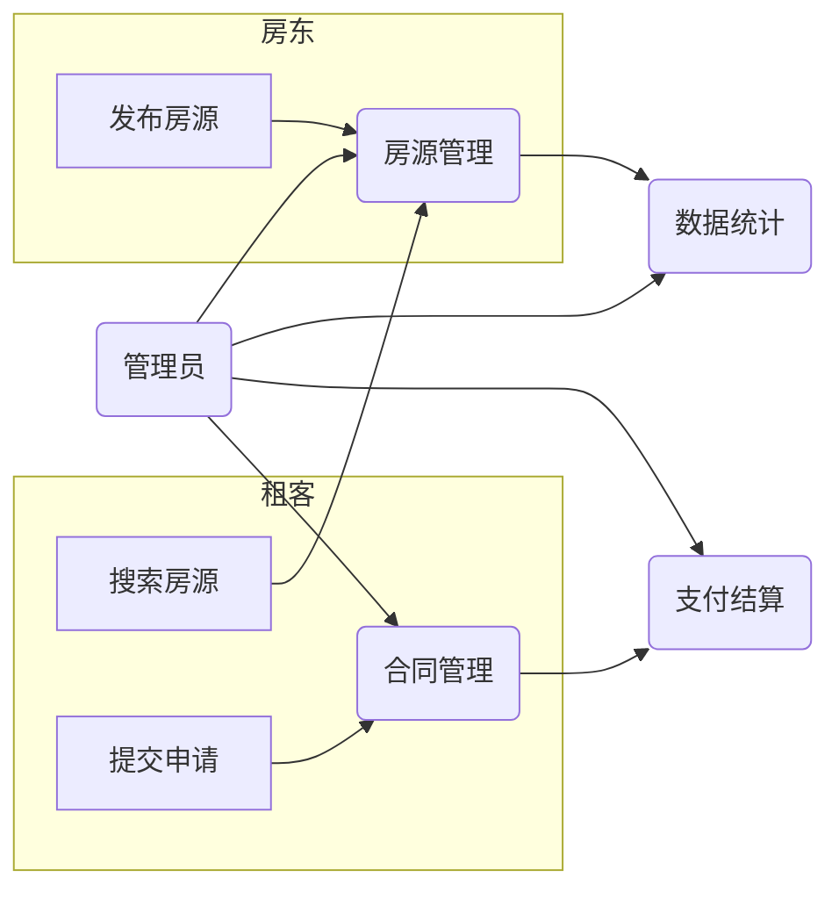

## 1. 背景介绍

### 1.1 房屋租赁市场现状与痛点

随着城市化进程的加速和人口流动性的增强，房屋租赁市场规模不断扩大。然而，传统的房屋租赁方式存在诸多弊端，例如信息不对称、交易流程繁琐、安全隐患等等。这些问题不仅给房东和租客带来不便，也制约了房屋租赁市场的健康发展。

### 1.2 信息化解决方案的必要性

为了解决上述问题，房屋租赁管理信息系统应运而生。这类系统通过信息技术手段，将房源信息、租客信息、租赁合同、支付结算等环节进行数字化管理，提高了交易效率和透明度，降低了交易成本和风险。

### 1.3 本文目标

本文旨在详细介绍房屋租赁管理信息系统的架构设计和代码实现，为相关从业人员提供参考和借鉴。

## 2. 核心概念与联系

### 2.1 系统用户角色

房屋租赁管理信息系统涉及多个用户角色，包括：

* **房东:** 发布房源信息、管理租赁合同、收取租金等。
* **租客:** 搜索房源信息、提交租赁申请、支付租金等。
* **管理员:** 审核房源信息、管理用户账号、处理投诉等。

### 2.2 核心功能模块

房屋租赁管理信息系统通常包含以下核心功能模块：

* **房源管理:**  发布、编辑、删除房源信息，包括房屋类型、面积、地址、租金等。
* **租客管理:**  注册、登录、修改个人信息，查看租赁历史等。
* **合同管理:**  生成、签署、终止租赁合同，记录租金支付情况等。
* **支付结算:**  支持多种支付方式，例如支付宝、微信支付等。
* **数据统计:**  提供房源出租率、租金收入等统计数据。

### 2.3  系统架构图



## 3. 核心算法原理具体操作步骤

### 3.1 房源推荐算法

为了帮助租客快速找到合适的房源，系统可以采用基于内容的推荐算法。该算法根据租客的搜索条件和历史浏览记录，推荐与其偏好相符的房源。

具体操作步骤如下：

1. 收集租客的搜索条件，例如房屋类型、面积、租金范围等。
2. 分析租客的历史浏览记录，提取其感兴趣的房源特征。
3. 计算所有房源与租客偏好的相似度，并按照相似度排序。
4. 将相似度最高的房源推荐给租客。

### 3.2 合同生成算法

为了简化合同签署流程，系统可以自动生成租赁合同。

具体操作步骤如下：

1. 获取房东和租客的基本信息，例如姓名、身份证号码、联系方式等。
2. 获取租赁房屋的信息，例如地址、面积、租金等。
3. 根据预设的合同模板，将上述信息填充到合同中。
4. 生成电子合同，并提供在线签署功能。

## 4. 数学模型和公式详细讲解举例说明

### 4.1 房源相似度计算

房源相似度可以使用余弦相似度公式计算：

$$
similarity(A, B) = \frac{A \cdot B}{||A|| ||B||}
$$

其中，A 和 B 分别表示两个房源的特征向量，||A|| 和 ||B|| 分别表示 A 和 B 的向量模长。

例如，假设有两个房源：

* 房源 A: 两室一厅，面积 80 平米，租金 5000 元/月。
* 房源 B: 三室一厅，面积 100 平米，租金 7000 元/月。

将这两个房源的特征向量表示为：

* A = [2, 80, 5000]
* B = [3, 100, 7000]

则它们的相似度为：

$$
similarity(A, B) = \frac{2 \times 3 + 80 \times 100 + 5000 \times 7000}{\sqrt{2^2 + 80^2 + 5000^2} \sqrt{3^2 + 100^2 + 7000^2}} \approx 0.98
$$

### 4.2 租金收益计算

房东的租金收益可以根据以下公式计算：

$$
income = rent \times (1 - tax\_rate)
$$

其中，rent 表示每月租金，tax\_rate 表示租金所得税税率。

例如，假设某房源的每月租金为 5000 元，租金所得税税率为 10%，则房东的每月租金收益为：

$$
income = 5000 \times (1 - 0.1) = 4500 元
$$

## 5. 项目实践：代码实例和详细解释说明

### 5.1 技术选型

本项目采用 Spring Boot 框架搭建后端服务，使用 MySQL 数据库存储数据，前端采用 Vue.js 框架开发用户界面。

### 5.2 代码示例

#### 5.2.1 房源实体类

```java
@Entity
@Table(name = "house")
public class House {

    @Id
    @GeneratedValue(strategy = GenerationType.IDENTITY)
    private Long id;

    @Column(nullable = false)
    private String type;

    @Column(nullable = false)
    private Double area;

    @Column(nullable = false)
    private String address;

    @Column(nullable = false)
    private Double rent;

    // 省略 getter 和 setter 方法
}
```

#### 5.2.2 房源服务接口

```java
public interface HouseService {

    List<House> findAll();

    House findById(Long id);

    House save(House house);

    void deleteById(Long id);
}
```

#### 5.2.3 房源控制器

```java
@RestController
@RequestMapping("/api/houses")
public class HouseController {

    @Autowired
    private HouseService houseService;

    @GetMapping
    public List<House> findAll() {
        return houseService.findAll();
    }

    @GetMapping("/{id}")
    public House findById(@PathVariable Long id) {
        return houseService.findById(id);
    }

    @PostMapping
    public House save(@RequestBody House house) {
        return houseService.save(house);
    }

    @DeleteMapping("/{id}")
    public void deleteById(@PathVariable Long id) {
        houseService.deleteById(id);
    }
}
```

## 6. 实际应用场景

房屋租赁管理信息系统可以应用于以下场景：

* **个人房东:**  管理自己的出租房屋，提高出租效率。
* **房屋中介:**  管理房源信息，为客户提供租赁服务。
* **房地产开发商:**  管理新建楼盘的出租情况。
* **政府部门:**  监管房屋租赁市场，保障租客权益。

## 7. 总结：未来发展趋势与挑战

### 7.1 未来发展趋势

随着人工智能、大数据等技术的不断发展，房屋租赁管理信息系统将朝着更加智能化、个性化、便捷化的方向发展。例如：

* **智能推荐:**  利用人工智能技术，为租客提供更加精准的房源推荐。
* **虚拟现实看房:**  利用虚拟现实技术，让租客足不出户就能体验真实的看房感受。
* **区块链租赁:**  利用区块链技术，提高租赁合同的安全性和透明度。

### 7.2 面临的挑战

房屋租赁管理信息系统在发展过程中也面临着一些挑战，例如：

* **数据安全:**  如何保障用户信息和交易数据的安全。
* **法律法规:**  如何遵守相关法律法规，保障各方权益。
* **用户体验:**  如何提升用户体验，提高用户满意度。

## 8. 附录：常见问题与解答

### 8.1 如何发布房源信息？

登录系统后，点击“发布房源”按钮，填写相关信息，上传房屋照片，即可发布房源信息。

### 8.2 如何签署租赁合同？

在房源详情页面，点击“签署合同”按钮，系统会自动生成电子合同，您可以在线签署合同。

### 8.3 如何支付租金？

在“我的合同”页面，选择要支付的合同，点击“支付租金”按钮，选择支付方式，即可完成租金支付。
