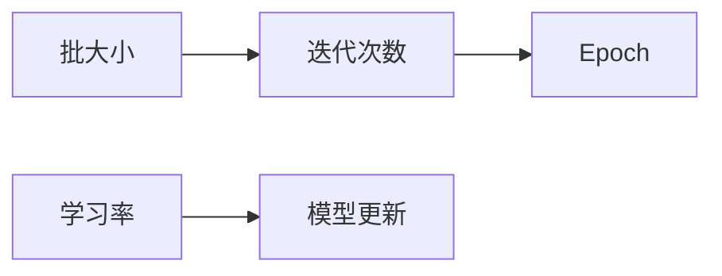

## 1. 背景介绍

### 1.1 深度学习的训练瓶颈

近年来，深度学习在各个领域取得了显著的成就，从图像识别到自然语言处理，再到自动驾驶。然而，深度学习模型的训练往往需要大量的计算资源和时间。特别是随着模型规模和数据集的不断增大，训练时间成为了制约深度学习发展的一个瓶颈。

### 1.2 批处理的概念

批处理（Batch Processing）是一种常见的优化技术，它将训练数据分成多个批次（Batch），每次迭代只使用一个批次的数据进行训练。这样做的好处是可以充分利用硬件资源，提高训练效率。

### 1.3 批处理的优势

批处理的优势主要体现在以下几个方面：

- **提高硬件利用率：** 通过将数据分成多个批次，可以充分利用GPU等硬件资源，提高并行计算能力。
- **加速训练过程：** 每次迭代只处理一小部分数据，可以减少每次迭代的时间，从而加速整个训练过程。
- **降低内存占用：**  批处理可以减少每次迭代所需的内存，从而降低对硬件的要求。

## 2. 核心概念与联系

### 2.1 批大小（Batch Size）

批大小是指每个批次中包含的样本数量。批大小的选择对训练过程的影响很大，它决定了每次迭代的计算量和内存占用。

### 2.2 迭代次数（Iteration）

迭代次数是指完成一次完整训练所需的批次数。迭代次数与数据集大小和批大小有关。

### 2.3 Epoch

Epoch是指将整个数据集遍历一遍的过程。一个Epoch包含多个Iteration。

### 2.4 学习率（Learning Rate）

学习率是指每次迭代更新模型参数的幅度。学习率的选择对模型的收敛速度和最终性能有很大影响。

### 2.5 核心概念之间的联系



## 3. 核心算法原理具体操作步骤

### 3.1 数据预处理

在进行批处理之前，需要对数据进行预处理，例如数据清洗、特征缩放等。

### 3.2 批次划分

将数据集分成多个批次，每个批次包含相同数量的样本。

### 3.3 迭代训练

每次迭代使用一个批次的数据进行训练，更新模型参数。

### 3.4 评估模型

定期评估模型在验证集上的性能，调整超参数。

### 3.5 具体操作步骤

1. 将数据集分成训练集、验证集和测试集。
2. 对训练集进行预处理，例如数据清洗、特征缩放等。
3. 根据批大小将训练集分成多个批次。
4. 初始化模型参数。
5. 迭代训练：
    - 从一个批次中随机选择样本。
    - 计算模型输出和损失函数。
    - 根据学习率更新模型参数。
6. 评估模型在验证集上的性能。
7. 根据验证集性能调整超参数。
8. 重复步骤5-7，直到模型收敛。
9. 在测试集上评估最终模型的性能。

## 4. 数学模型和公式详细讲解举例说明

### 4.1 梯度下降法

梯度下降法是一种常用的优化算法，它通过不断更新模型参数来最小化损失函数。

$$
\theta_{t+1} = \theta_t - \alpha \nabla J(\theta_t)
$$

其中，$\theta_t$ 表示第 $t$ 次迭代的模型参数，$\alpha$ 表示学习率，$\nabla J(\theta_t)$ 表示损失函数 $J(\theta_t)$ 的梯度。

### 4.2 批梯度下降法

批梯度下降法是梯度下降法的一种变体，它使用整个训练集来计算梯度。

$$
\theta_{t+1} = \theta_t - \alpha \frac{1}{m} \sum_{i=1}^{m} \nabla J_i(\theta_t)
$$

其中，$m$ 表示训练集样本数量，$J_i(\theta_t)$ 表示第 $i$ 个样本的损失函数。

### 4.3 随机梯度下降法

随机梯度下降法是梯度下降法的另一种变体，它每次迭代只使用一个样本计算梯度。

$$
\theta_{t+1} = \theta_t - \alpha \nabla J_i(\theta_t)
$$

其中，$i$ 表示随机选择的样本索引。

### 4.4 小批量梯度下降法

小批量梯度下降法是梯度下降法的一种折中方案，它每次迭代使用一个批次的样本计算梯度。

$$
\theta_{t+1} = \theta_t - \alpha \frac{1}{B} \sum_{i=1}^{B} \nabla J_i(\theta_t)
$$

其中，$B$ 表示批大小。

### 4.5 举例说明

假设我们有一个线性回归模型：

$$
y = wx + b
$$

其中，$w$ 和 $b$ 是模型参数，$x$ 是输入特征，$y$ 是目标值。

损失函数为均方误差：

$$
J(w, b) = \frac{1}{m} \sum_{i=1}^{m} (y_i - wx_i - b)^2
$$

使用小批量梯度下降法更新模型参数：

$$
w_{t+1} = w_t - \alpha \frac{1}{B} \sum_{i=1}^{B} (y_i - wx_i - b)x_i
$$

$$
b_{t+1} = b_t - \alpha \frac{1}{B} \sum_{i=1}^{B} (y_i - wx_i - b)
$$

## 5. 项目实践：代码实例和详细解释说明

### 5.1 PyTorch代码实例

```python
import torch
import torch.nn as nn
import torch.optim as optim

# 定义模型
class LinearRegression(nn.Module):
    def __init__(self):
        super(LinearRegression, self).__init__()
        self.linear = nn.Linear(1, 1)

    def forward(self, x):
        return self.linear(x)

# 创建模型实例
model = LinearRegression()

# 定义损失函数
criterion = nn.MSELoss()

# 定义优化器
optimizer = optim.SGD(model.parameters(), lr=0.01)

# 定义批大小
batch_size = 32

# 迭代训练
for epoch in range(100):
    for i in range(0, len(x_train), batch_size):
        # 获取一个批次的样本
        inputs = x_train[i:i+batch_size]
        targets = y_train[i:i+batch_size]

        # 清空梯度
        optimizer.zero_grad()

        # 前向传播
        outputs = model(inputs)

        # 计算损失
        loss = criterion(outputs, targets)

        # 反向传播
        loss.backward()

        # 更新模型参数
        optimizer.step()

# 评估模型
with torch.no_grad():
    outputs = model(x_test)
    loss = criterion(outputs, y_test)
    print('Test Loss: {:.4f}'.format(loss.item()))
```

### 5.2 代码解释

- `LinearRegression` 类定义了一个线性回归模型。
- `criterion` 定义了均方误差损失函数。
- `optimizer` 定义了随机梯度下降优化器。
- `batch_size` 定义了批大小。
- 迭代训练循环中，每次迭代使用一个批次的样本进行训练。
- `optimizer.zero_grad()` 清空梯度。
- `outputs = model(inputs)` 进行前向传播。
- `loss = criterion(outputs, targets)` 计算损失。
- `loss.backward()` 进行反向传播。
- `optimizer.step()` 更新模型参数。
- 最后，在测试集上评估模型性能。

## 6. 实际应用场景

### 6.1 图像分类

在图像分类任务中，批处理可以加速训练过程，提高模型的泛化能力。

### 6.2 自然语言处理

在自然语言处理任务中，批处理可以提高模型的训练效率，降低内存占用。

### 6.3 语音识别

在语音识别任务中，批处理可以加速训练过程，提高模型的识别精度。

## 7. 工具和资源推荐

### 7.1 PyTorch

PyTorch 是一个开源的深度学习框架，它提供了丰富的工具和资源，方便进行批处理训练。

### 7.2 TensorFlow

TensorFlow 是另一个开源的深度学习框架，它也提供了批处理训练的功能。

### 7.3 Keras

Keras 是一个高级神经网络 API，它可以运行在 TensorFlow 或 Theano 之上，提供了方便的批处理训练接口。

## 8. 总结：未来发展趋势与挑战

### 8.1 趋势

- **更大规模的批处理：** 随着硬件性能的提升，未来可以使用更大规模的批处理来加速训练过程。
- **动态批大小：** 动态调整批大小可以根据硬件资源和模型复杂度来优化训练效率。
- **分布式批处理：** 分布式批处理可以将训练任务分配到多个计算节点上，进一步加速训练过程。

### 8.2 挑战

- **批大小选择：**  选择合适的批大小对模型性能和训练效率有很大影响。
- **梯度消失/爆炸：** 在深度神经网络中，梯度消失/爆炸问题可能会影响模型的收敛速度和最终性能。
- **过拟合：**  批处理可能会导致模型过拟合训练数据，从而降低泛化能力。

## 9. 附录：常见问题与解答

### 9.1 如何选择合适的批大小？

批大小的选择需要考虑多个因素，例如数据集大小、模型复杂度、硬件资源等。一般来说，较大的批大小可以提高硬件利用率，加速训练过程，但可能会导致模型过拟合。较小的批大小可以降低内存占用，提高模型的泛化能力，但可能会降低训练效率。

### 9.2 如何解决梯度消失/爆炸问题？

梯度消失/爆炸问题可以通过梯度裁剪、权重初始化、激活函数选择等方法来解决。

### 9.3 如何防止过拟合？

过拟合可以通过正则化、Dropout、数据增强等方法来防止。
