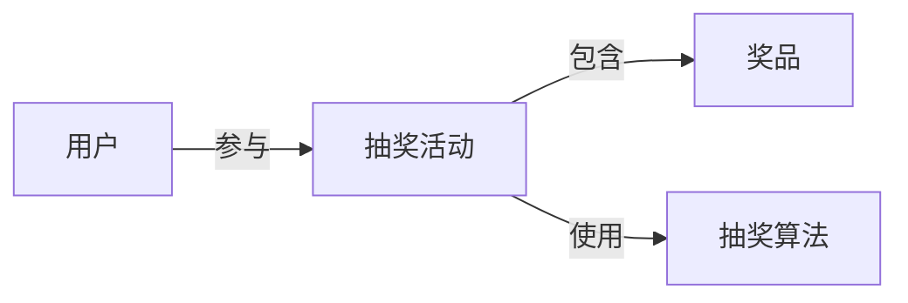

## 1. 背景介绍

### 1.1 抽奖系统的应用场景

抽奖系统是各种商业活动中常用的营销工具，其应用场景非常广泛，例如：

* **电商平台促销活动:**  例如双十一、618等大型购物节，电商平台通常会推出各种抽奖活动来吸引用户参与，提高用户活跃度和销售额。
* **线下门店促销活动:**  例如商场周年庆、品牌店开业等活动，商家也经常会通过抽奖活动来吸引顾客，提升品牌知名度和销售额。
* **游戏平台用户激励:**  游戏平台通常会设置各种抽奖活动来激励用户参与游戏，例如每日签到抽奖、充值返利抽奖等。
* **社交媒体平台用户互动:**  社交媒体平台也经常会举办抽奖活动来提升用户活跃度和互动率，例如转发抽奖、评论抽奖等。


### 1.2 抽奖系统的功能需求

一个完善的抽奖系统需要满足以下功能需求：

* **灵活的奖品配置:**  系统应该支持配置不同类型的奖品，例如实物奖品、虚拟奖品、优惠券等，并可以设置每个奖品的数量、中奖概率等参数。
* **公平公正的抽奖算法:**  抽奖算法是抽奖系统的核心，需要保证抽奖结果的公平公正，避免出现人为操控或漏洞。
* **安全的防作弊机制:**  系统需要具备防作弊机制，防止用户通过不正当手段提高中奖概率，例如使用多个账号参与抽奖、使用脚本自动抽奖等。
* **友好的用户界面:**  系统需要提供简单易用的用户界面，方便用户参与抽奖和查看中奖结果。
* **高效的数据统计分析:**  系统需要提供数据统计分析功能，方便运营人员了解抽奖活动的效果，例如参与人数、中奖人数、奖品发放情况等。

### 1.3 抽奖系统的设计目标

本篇文章将详细介绍如何设计和实现一个功能完善、安全可靠、易于维护的抽奖系统，并提供完整的代码示例。

## 2. 核心概念与联系

### 2.1 奖品

奖品是抽奖系统的核心要素之一，可以是实物奖品、虚拟奖品、优惠券等。每个奖品需要设置以下属性：

* **奖品名称:**  奖品的名称，例如“iPhone 15 Pro Max”。
* **奖品类型:**  奖品的类型，例如“实物奖品”、“虚拟奖品”、“优惠券”。
* **奖品数量:**  该奖品的数量，例如“10”。
* **中奖概率:**  该奖品的中奖概率，例如“0.01”。
* **奖品图片:**  奖品的图片，用于在用户界面展示。

### 2.2 用户

用户是参与抽奖活动的主体，需要记录以下信息：

* **用户ID:**  用户的唯一标识。
* **用户名:**  用户的昵称。
* **用户头像:**  用户的头像图片。
* **抽奖次数:**  用户参与抽奖活动的次数。
* **中奖记录:**  用户的历史中奖记录。

### 2.3 抽奖算法

抽奖算法是抽奖系统的核心，需要保证抽奖结果的公平公正，避免出现人为操控或漏洞。常用的抽奖算法包括：

* **随机数算法:**  使用随机数生成器生成随机数，根据随机数落在不同奖品概率区间内的位置来确定中奖结果。
* **权重算法:**  为每个奖品设置权重，权重越高，中奖概率越大。
* **轮盘赌算法:**  将所有奖品按照概率分布在一个圆盘上，随机转动圆盘，指针指向的奖品即为中奖结果。

### 2.4 核心概念联系

下面是抽奖系统核心概念之间的联系图：



## 3. 核心算法原理具体操作步骤

### 3.1 随机数算法

随机数算法是最常用的抽奖算法之一，其原理是使用随机数生成器生成随机数，根据随机数落在不同奖品概率区间内的位置来确定中奖结果。

具体操作步骤如下：

1. 计算所有奖品的概率总和。
2. 生成一个0到1之间的随机数。
3. 遍历所有奖品，累加每个奖品的概率，直到累加概率大于等于生成的随机数。
4. 当前遍历到的奖品即为中奖结果。

**代码示例:**

```python
import random

def random_lottery(prizes):
    """
    随机数抽奖算法

    Args:
        prizes: 奖品列表，每个奖品是一个字典，包含以下字段：
            - name: 奖品名称
            - probability: 中奖概率

    Returns:
        中奖结果，是一个字典，包含以下字段：
            - name: 奖品名称
            - probability: 中奖概率
    """

    # 计算概率总和
    total_probability = sum(prize['probability'] for prize in prizes)

    # 生成随机数
    random_number = random.uniform(0, total_probability)

    # 遍历奖品，累加概率
    cumulative_probability = 0
    for prize in prizes:
        cumulative_probability += prize['probability']
        if cumulative_probability >= random_number:
            return prize

    # 理论上不会执行到这里，如果执行到这里，说明概率计算有误
    raise ValueError('Invalid probability distribution')
```

### 3.2 权重算法

权重算法为每个奖品设置权重，权重越高，中奖概率越大。

具体操作步骤如下：

1. 计算所有奖品的权重总和。
2. 生成一个0到权重总和之间的随机数。
3. 遍历所有奖品，累加每个奖品的权重，直到累加权重大于等于生成的随机数。
4. 当前遍历到的奖品即为中奖结果。

**代码示例:**

```python
import random

def weighted_lottery(prizes):
    """
    权重抽奖算法

    Args:
        prizes: 奖品列表，每个奖品是一个字典，包含以下字段：
            - name: 奖品名称
            - weight: 权重

    Returns:
        中奖结果，是一个字典，包含以下字段：
            - name: 奖品名称
            - weight: 权重
    """

    # 计算权重总和
    total_weight = sum(prize['weight'] for prize in prizes)

    # 生成随机数
    random_number = random.uniform(0, total_weight)

    # 遍历奖品，累加权重
    cumulative_weight = 0
    for prize in prizes:
        cumulative_weight += prize['weight']
        if cumulative_weight >= random_number:
            return prize

    # 理论上不会执行到这里，如果执行到这里，说明权重计算有误
    raise ValueError('Invalid weight distribution')
```

### 3.3 轮盘赌算法

轮盘赌算法将所有奖品按照概率分布在一个圆盘上，随机转动圆盘，指针指向的奖品即为中奖结果。

具体操作步骤如下：

1. 将圆盘分成若干个扇形区域，每个扇形区域代表一个奖品，扇形区域的面积与该奖品的中奖概率成正比。
2. 生成一个0到360之间的随机数，代表指针转动的角度。
3. 计算指针指向的扇形区域，该区域对应的奖品即为中奖结果。

**代码示例:**

```python
import random

def roulette_lottery(prizes):
    """
    轮盘赌抽奖算法

    Args:
        prizes: 奖品列表，每个奖品是一个字典，包含以下字段：
            - name: 奖品名称
            - probability: 中奖概率

    Returns:
        中奖结果，是一个字典，包含以下字段：
            - name: 奖品名称
            - probability: 中奖概率
    """

    # 计算概率总和
    total_probability = sum(prize['probability'] for prize in prizes)

    # 将圆盘分成若干个扇形区域
    sectors = []
    start_angle = 0
    for prize in prizes:
        sector_angle = prize['probability'] / total_probability * 360
        sectors.append({
            'name': prize['name'],
            'probability': prize['probability'],
            'start_angle': start_angle,
            'end_angle': start_angle + sector_angle
        })
        start_angle += sector_angle

    # 生成随机角度
    random_angle = random.uniform(0, 360)

    # 计算指针指向的扇形区域
    for sector in sectors:
        if sector['start_angle'] <= random_angle < sector['end_angle']:
            return {
                'name': sector['name'],
                'probability': sector['probability']
            }

    # 理论上不会执行到这里，如果执行到这里，说明概率计算有误
    raise ValueError('Invalid probability distribution')
```

## 4. 数学模型和公式详细讲解举例说明

### 4.1 概率

概率是指一个事件发生的可能性大小，通常用0到1之间的数值表示，0表示不可能发生，1表示必然发生。

**公式:**

$$
P(A) = \frac{事件 A 发生的可能结果数}{所有可能结果数}
$$

**举例说明:**

例如，掷一次骰子，出现6点的概率为:

$$
P(6点) = \frac{1}{6}
$$

### 4.2 随机变量

随机变量是指可以取不同值的变量，其取值具有一定的概率分布。

**举例说明:**

例如，掷一次骰子，骰子的点数就是一个随机变量，其取值范围为1到6，每个点数出现的概率为1/6。

### 4.3 概率分布

概率分布是指随机变量取值的概率规律，可以用概率密度函数或概率分布函数来描述。

**举例说明:**

例如，掷一次骰子，骰子的点数的概率分布可以用以下表格表示:

| 点数 | 概率 |
|---|---|
| 1 | 1/6 |
| 2 | 1/6 |
| 3 | 1/6 |
| 4 | 1/6 |
| 5 | 1/6 |
| 6 | 1/6 |

### 4.4 数学期望

数学期望是指随机变量取值的平均值，也称为均值。

**公式:**

$$
E(X) = \sum_{i=1}^{n} x_i P(X = x_i)
$$

**举例说明:**

例如，掷一次骰子，骰子的点数的数学期望为:

$$
E(点数) = 1 \times \frac{1}{6} + 2 \times \frac{1}{6} + 3 \times \frac{1}{6} + 4 \times \frac{1}{6} + 5 \times \frac{1}{6} + 6 \times \frac{1}{6} = 3.5
$$

## 5. 项目实践：代码实例和详细解释说明

### 5.1 项目结构

本项目使用 Python 语言实现，项目结构如下:

```
lottery-system/
├── main.py  # 主程序入口
├── lottery/  # 抽奖系统模块
│   ├── __init__.py
│   ├── models.py  # 数据模型
│   ├── algorithms.py  # 抽奖算法
│   ├── services.py  # 业务逻辑
│   ├── views.py  # 用户界面
└── tests/  # 测试代码
```

### 5.2 数据模型

```python
# lottery/models.py

class Prize:
    """
    奖品模型
    """

    def __init__(self, name, type, quantity, probability, image_url):
        self.name = name
        self.type = type
        self.quantity = quantity
        self.probability = probability
        self.image_url = image_url

class User:
    """
    用户模型
    """

    def __init__(self, user_id, username, avatar_url):
        self.user_id = user_id
        self.username = username
        self.avatar_url = avatar_url
        self.lottery_count = 0
        self.winning_records = []
```

### 5.3 抽奖算法

```python
# lottery/algorithms.py

import random

def random_lottery(prizes):
    """
    随机数抽奖算法
    """
    # ...

def weighted_lottery(prizes):
    """
    权重抽奖算法
    """
    # ...

def roulette_lottery(prizes):
    """
    轮盘赌抽奖算法
    """
    # ...
```

### 5.4 业务逻辑

```python
# lottery/services.py

from .models import Prize, User
from .algorithms import random_lottery, weighted_lottery, roulette_lottery

class LotteryService:
    """
    抽奖服务
    """

    def __init__(self, prizes):
        self.prizes = prizes

    def draw(self, user, algorithm='random'):
        """
        执行抽奖操作

        Args:
            user: 用户对象
            algorithm: 抽奖算法，可选值为 'random', 'weighted', 'roulette'，默认为 'random'

        Returns:
            中奖结果，是一个字典，包含以下字段：
                - name: 奖品名称
                - type: 奖品类型
                - quantity: 奖品数量
                - probability: 中奖概率
                - image_url: 奖品图片 URL
        """

        # 选择抽奖算法
        if algorithm == 'random':
            lottery_function = random_lottery
        elif algorithm == 'weighted':
            lottery_function = weighted_lottery
        elif algorithm == 'roulette':
            lottery_function = roulette_lottery
        else:
            raise ValueError('Invalid lottery algorithm')

        # 执行抽奖
        result = lottery_function(self.prizes)

        # 更新用户抽奖次数和中奖记录
        user.lottery_count += 1
        if result:
            user.winning_records.append(result)

        return result
```

### 5.5 用户界面

```python
# lottery/views.py

from flask import Flask, render_template, request

from .models import Prize, User
from .services import LotteryService

app = Flask(__name__)

# 奖品数据
prizes = [
    Prize('iPhone 15 Pro Max', '实物奖品', 10, 0.01, 'https://example.com/iphone.jpg'),
    Prize('AirPods Pro 2', '实物奖品', 20, 0.05, 'https://example.com/airpods.jpg'),
    Prize('100元京东卡', '虚拟奖品', 100, 0.1, 'https://example.com/jdcard.jpg'),
    Prize('谢谢参与', '虚拟奖品', 1000, 0.84, 'https://example.com/thanks.jpg'),
]

# 抽奖服务
lottery_service = LotteryService(prizes)

@app.route('/')
def index():
    """
    首页
    """
    return render_template('index.html')

@app.route('/draw', methods=['POST'])
def draw():
    """
    抽奖接口
    """
    # 获取用户 ID
    user_id = request.form.get('user_id')

    # 创建用户对象
    user = User(user_id, f'user_{user_id}', '')

    # 执行抽奖操作
    result = lottery_service.draw(user)

    # 返回中奖结果
    return result
```

### 5.6 运行程序

```
$ python main.py
```

## 6. 实际应用场景

### 6.1 电商平台促销活动

在电商平台促销活动中，抽奖系统可以用于吸引用户参与活动，提高用户活跃度和销售额。例如，在双十一购物节期间，电商平台可以设置各种抽奖活动，例如：

* **每日签到抽奖:**  用户每天签到即可获得一次抽奖机会，奖品可以是优惠券、红包、积分等。
* **购物满减抽奖:**  用户购物满一定金额即可获得一次抽奖机会，奖品可以是实物奖品、虚拟奖品等。
* **限时抢购抽奖:**  用户参与限时抢购活动，成功抢购到商品即可获得一次抽奖机会，奖品可以是免单、优惠券等。

### 6.2 线下门店促销活动

在线下门店促销活动中，抽奖系统可以用于吸引顾客，提升品牌知名度和销售额。例如，在商场周年庆活动中，商家可以设置抽奖活动，顾客消费满一定金额即可获得一次抽奖机会，奖品可以是优惠券、代金券、实物奖品等。

### 6.3 游戏平台用户激励

在游戏平台中，抽奖系统可以用于激励用户参与游戏，提高用户活跃度和留存率。例如，游戏平台可以设置各种抽奖活动，例如：

* **每日签到抽奖:**  用户每天签到即可获得一次抽奖机会，奖品可以是游戏道具、虚拟货币等。
* **充值返利抽奖:**  用户充值一定金额即可获得一次抽奖机会，奖品可以是游戏道具、虚拟货币、限量版皮肤等。
* **完成任务抽奖:**