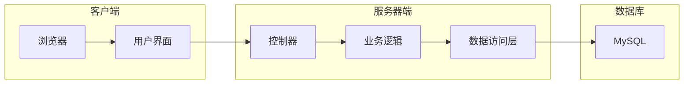

## 1. 背景介绍

### 1.1 教育信息化发展趋势

随着信息技术的快速发展和教育改革的不断深入，教育信息化已成为推动教育现代化的重要引擎。近年来，国家大力推进“互联网+教育”，积极探索信息技术与教育教学深度融合的新模式，教育信息化进入2.0时代。

### 1.2 教师办公管理现状与挑战

在教育信息化2.0时代背景下，教师办公管理面临着新的机遇和挑战。传统的人工管理模式效率低下、信息孤岛现象严重、数据分析能力不足等问题日益突出。为了提高教师办公效率、促进教育教学质量提升，迫切需要构建一个功能完善、安全可靠、易于使用的教师办公管理系统。

### 1.3 教师办公管理系统的意义

教师办公管理系统旨在通过信息化手段，实现教师日常办公事务的自动化、网络化和智能化管理，为教师提供便捷高效的办公环境，减轻教师工作负担，提高工作效率。同时，系统可以有效整合教育资源，促进信息共享和协同工作，为学校管理决策提供数据支持，推动教育教学质量的整体提升。

## 2. 核心概念与联系

### 2.1 系统架构

教师办公管理系统采用B/S架构，分为客户端、服务器端和数据库三层。

* **客户端:** 教师通过浏览器访问系统，进行各项操作。
* **服务器端:** 负责接收客户端请求，处理业务逻辑，并返回结果给客户端。
* **数据库:** 存储系统数据，包括用户信息、课程信息、教学资源等。

### 2.2 功能模块

系统主要包括以下功能模块：

* **用户管理:** 教师信息管理、角色权限管理、登录注册等。
* **课程管理:** 课程信息管理、班级管理、课表管理等。
* **教案管理:** 教案上传、下载、评审、共享等。
* **教学资源:** 资源上传、下载、分类、检索等。
* **成绩管理:** 学生成绩录入、查询、统计分析等。
* **考勤管理:** 教师考勤记录、统计分析等。
* **通知公告:** 发布通知公告、查看通知公告等。
* **个人中心:** 个人信息修改、密码修改、消息中心等。

### 2.3 核心技术

系统采用以下核心技术：

* **Spring Boot:** 轻量级的Java开发框架，简化开发流程，提高开发效率。
* **MyBatis:** 持久层框架，简化数据库操作，提高数据访问效率。
* **MySQL:** 关系型数据库，存储系统数据。
* **Vue.js:** 前端框架，构建用户界面，提供良好的用户体验。

## 3. 核心算法原理具体操作步骤

### 3.1 用户登录认证

1. 用户输入用户名和密码，提交登录请求。
2. 服务器端接收请求，查询数据库验证用户信息。
3. 如果用户信息匹配，则生成token，并将token返回给客户端。
4. 客户端将token保存到本地，用于后续请求的身份验证。

### 3.2 教案评审流程

1. 教师上传教案，提交评审申请。
2. 系统将教案分配给评审专家。
3. 评审专家对教案进行评审，给出评审意见。
4. 教师根据评审意见修改教案，重新提交评审。
5. 教案评审通过后，系统将教案发布到教案库。

### 3.3 成绩统计分析

1. 教师录入学生成绩。
2. 系统根据成绩数据生成统计报表，包括班级平均分、最高分、最低分等。
3. 系统提供数据可视化功能，将统计结果以图表的形式展示。

## 4. 数学模型和公式详细讲解举例说明

### 4.1 学生成绩分析模型

学生成绩分析模型可以用来评估学生的学习情况，并制定相应的教学计划。

#### 4.1.1 平均分

平均分是用来衡量学生整体学习水平的指标，计算公式如下：

$$
\bar{x}=\frac{\sum_{i=1}^{n}x_i}{n}
$$

其中，$\bar{x}$ 表示平均分，$x_i$ 表示第 $i$ 个学生的成绩，$n$ 表示学生总数。

#### 4.1.2 标准差

标准差是用来衡量学生成绩离散程度的指标，计算公式如下：

$$
s=\sqrt{\frac{\sum_{i=1}^{n}(x_i-\bar{x})^2}{n-1}}
$$

其中，$s$ 表示标准差，$\bar{x}$ 表示平均分，$x_i$ 表示第 $i$ 个学生的成绩，$n$ 表示学生总数。

### 4.2 例子

假设某班级有5名学生，他们的数学成绩分别为：80，85，90，95，100。

#### 4.2.1 平均分

平均分计算如下：

$$
\bar{x}=\frac{80+85+90+95+100}{5}=90
$$

#### 4.2.2 标准差

标准差计算如下：

$$
s=\sqrt{\frac{(80-90)^2+(85-90)^2+(90-90)^2+(95-90)^2+(100-90)^2}{5-1}}=7.91
$$

## 5. 项目实践：代码实例和详细解释说明

### 5.1 用户登录认证代码示例

```java
@PostMapping("/login")
public ResponseEntity<Map<String, Object>> login(@RequestBody User user) {
  // 查询数据库验证用户信息
  User dbUser = userService.findByUsername(user.getUsername());
  if (dbUser == null || !passwordEncoder.matches(user.getPassword(), dbUser.getPassword())) {
    return ResponseEntity.badRequest().body(Collections.singletonMap("message", "用户名或密码错误"));
  }

  // 生成token
  String token = jwtTokenUtil.generateToken(dbUser);

  // 返回token给客户端
  Map<String, Object> response = new HashMap<>();
  response.put("token", token);
  return ResponseEntity.ok(response);
}
```

### 5.2 代码解释

1. `@PostMapping("/login")` 注解表示这是一个处理POST请求的接口，路径为`/login`。
2. `@RequestBody User user` 注解表示将请求体中的JSON数据转换成User对象。
3. `userService.findByUsername(user.getUsername())` 查询数据库，根据用户名查找用户信息。
4. `passwordEncoder.matches(user.getPassword(), dbUser.getPassword())` 使用密码编码器验证用户输入的密码是否与数据库中的密码匹配。
5. `jwtTokenUtil.generateToken(dbUser)` 使用JWT工具类生成token。
6. `ResponseEntity.ok(response)` 将token放入Map中，并返回200状态码和token数据给客户端。

## 6. 实际应用场景

### 6.1 学校教学管理

教师办公管理系统可以用于学校教学管理，例如：

* 教师可以通过系统发布课程公告、布置作业、批改作业等。
* 学生可以通过系统查看课程公告、提交作业、查看成绩等。
* 管理员可以通过系统管理教师、学生、课程等信息。

### 6.2 教师个人办公

教师办公管理系统可以用于教师个人办公，例如：

* 教师可以通过系统管理个人信息、修改密码、查看消息等。
* 教师可以通过系统上传、下载、管理教学资源。
* 教师可以通过系统记录考勤、填写工作日志等。

## 7. 工具和资源推荐

### 7.1 开发工具

* IntelliJ IDEA: Java集成开发环境，功能强大，易于使用。
* Visual Studio Code: 轻量级代码编辑器，支持多种编程语言，插件丰富。

### 7.2 数据库

* MySQL: 开源关系型数据库，性能稳定，易于维护。
* PostgreSQL: 开源关系型数据库，功能强大，支持复杂查询。

### 7.3 前端框架

* Vue.js: 渐进式JavaScript框架，易于学习，组件化开发。
* React: JavaScript库，用于构建用户界面，组件化开发。

## 8. 总结：未来发展趋势与挑战

### 8.1 未来发展趋势

* **智能化:** 利用人工智能技术，实现教学资源的智能推荐、学生学习情况的智能分析等。
* **移动化:** 开发移动端应用，方便教师随时随地进行办公操作。
* **数据驱动:** 利用大数据技术，对教学数据进行深度挖掘，为学校管理决策提供数据支持。

### 8.2 挑战

* **数据安全:** 保护系统数据安全，防止数据泄露和滥用。
* **系统性能:** 提高系统性能，保证系统稳定运行。
* **用户体验:** 提升用户体验，使系统更易于使用。

## 9. 附录：常见问题与解答

### 9.1 如何修改密码？

1. 登录系统，进入个人中心。
2. 点击“修改密码”按钮。
3. 输入旧密码、新密码和确认密码。
4. 点击“确认修改”按钮。

### 9.2 如何上传教案？

1. 登录系统，进入教案管理模块。
2. 点击“上传教案”按钮。
3. 选择教案文件，填写教案信息。
4. 点击“确认上传”按钮。

### 9.3 如何查看学生成绩？

1. 登录系统，进入成绩管理模块。
2. 选择班级和课程。
3. 点击“查询”按钮，即可查看学生成绩列表。


## 10. 系统架构图

