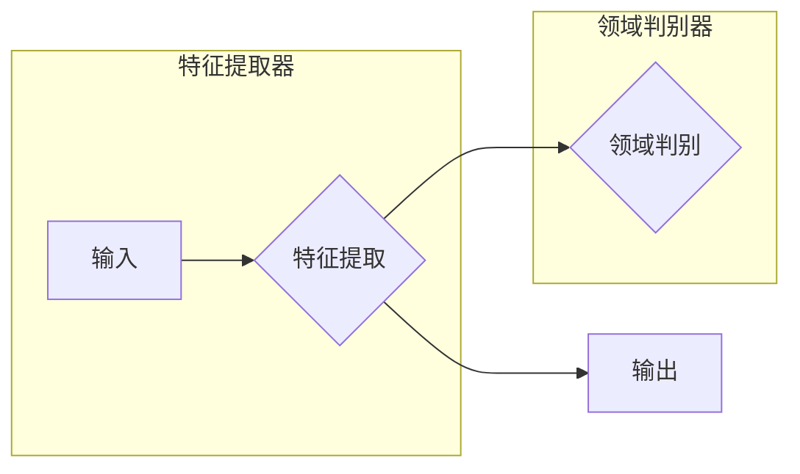
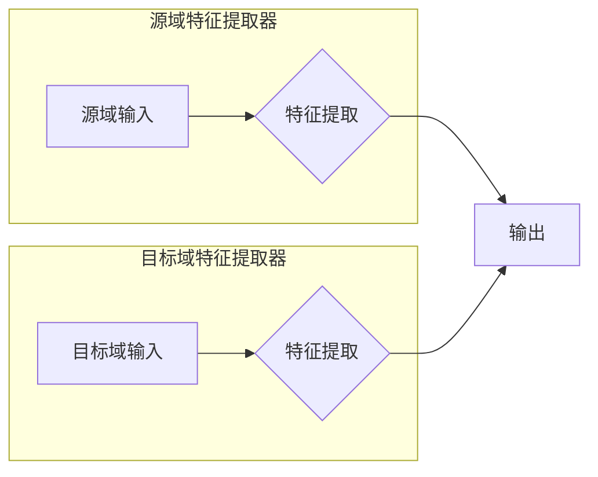

## 1. 背景介绍

### 1.1. 机器学习的局限性

近年来，机器学习在各个领域取得了巨大成功，但其发展也面临着一些瓶颈。其中一个主要问题是，传统的机器学习方法需要大量的标注数据才能获得良好的性能。然而，在许多实际应用场景中，获取大量的标注数据往往非常困难，甚至是不可能的。例如，在医疗图像分析领域，标注数据需要专业的医生进行，成本高昂且耗时。

### 1.2. 迁移学习的兴起

为了解决标注数据不足的问题，迁移学习应运而生。迁移学习的核心思想是，将从一个领域（源域）学习到的知识迁移到另一个相关但不同的领域（目标域），以提高目标域的学习效率和性能。迁移学习可以有效地利用源域的标注数据来弥补目标域标注数据的不足，从而降低对目标域标注数据的依赖。

### 1.3. 无监督迁移学习的优势

传统的迁移学习方法通常需要源域和目标域都具有标注数据。然而，在许多情况下，我们可能只有源域的标注数据，而目标域只有大量的无标注数据。在这种情况下，无监督迁移学习就显得尤为重要。无监督迁移学习的目标是从源域的标注数据和目标域的无标注数据中学习通用的知识，并将这些知识迁移到目标域的任务中，以提高目标域的性能。

## 2. 核心概念与联系

### 2.1. 领域自适应

领域自适应是无监督迁移学习的一种重要方法，其目标是通过减少源域和目标域之间的分布差异来提高目标域的性能。领域自适应方法可以分为基于特征的、基于实例的和基于模型的三种类型。

* **基于特征的领域自适应**：通过学习源域和目标域之间的共同特征表示来减少它们的分布差异。
* **基于实例的领域自适应**：通过对源域中的样本进行加权或重新采样，使其分布更接近目标域的分布。
* **基于模型的领域自适应**：通过调整模型参数，使模型能够更好地适应目标域的分布。

### 2.2. 自监督学习

自监督学习是一种利用无标注数据进行学习的方法。其核心思想是，通过设计一些辅助任务，利用数据本身的结构信息来生成伪标签，然后使用这些伪标签来训练模型。自监督学习可以帮助模型学习到更通用的特征表示，从而提高模型在目标域的性能。

### 2.3. 领域对抗训练

领域对抗训练是一种基于博弈论的领域自适应方法。其核心思想是，训练一个特征提取器和一个领域判别器，特征提取器试图学习能够欺骗领域判别器的特征表示，而领域判别器则试图区分特征来自源域还是目标域。通过这种对抗训练过程，特征提取器可以学习到更具领域不变性的特征表示。

## 3. 核心算法原理具体操作步骤

### 3.1. 基于特征的领域自适应

#### 3.1.1. 最大均值差异 (MMD)

MMD 是一种常用的基于特征的领域自适应方法。其核心思想是，通过最小化源域和目标域特征分布之间的均值差异来减少它们的分布差异。MMD 可以通过以下公式计算：

$$
MMD(X_s, X_t) = || \frac{1}{n_s} \sum_{i=1}^{n_s} \phi(x_s^i) - \frac{1}{n_t} \sum_{j=1}^{n_t} \phi(x_t^j) ||^2
$$

其中，$X_s$ 和 $X_t$ 分别表示源域和目标域的特征矩阵，$n_s$ 和 $n_t$ 分别表示源域和目标域的样本数量，$\phi(\cdot)$ 表示特征映射函数。

#### 3.1.2. 迁移成分分析 (TCA)

TCA 是一种基于特征降维的领域自适应方法。其核心思想是，通过学习一个低维特征空间，使得源域和目标域的特征分布在这个低维空间中更加相似。TCA 可以通过以下步骤实现：

1. 将源域和目标域的特征矩阵合并成一个矩阵。
2. 对合并后的矩阵进行主成分分析 (PCA)，得到一个低维特征空间。
3. 将源域和目标域的特征投影到这个低维特征空间中。

### 3.2. 基于实例的领域自适应

#### 3.2.1. 实例加权

实例加权是一种常用的基于实例的领域自适应方法。其核心思想是，根据源域样本与目标域样本的相似度，对源域样本进行加权，使权重更高的样本对目标域任务的贡献更大。实例加权可以通过以下公式计算：

$$
w_i = \frac{exp(-d(x_s^i, X_t))}{\sum_{j=1}^{n_s} exp(-d(x_s^j, X_t))}
$$

其中，$w_i$ 表示第 $i$ 个源域样本的权重，$d(\cdot, \cdot)$ 表示距离函数，$X_t$ 表示目标域的特征矩阵。

#### 3.2.2. 实例重采样

实例重采样是另一种常用的基于实例的领域自适应方法。其核心思想是，根据源域样本与目标域样本的相似度，对源域样本进行重采样，使重采样后的样本分布更接近目标域的分布。实例重采样可以通过以下步骤实现：

1. 计算每个源域样本与目标域样本的相似度。
2. 根据相似度对源域样本进行排序。
3. 从排序后的源域样本中选择一部分样本进行重采样。

### 3.3. 基于模型的领域自适应

#### 3.3.1. 领域对抗神经网络 (DANN)

DANN 是一种常用的基于模型的领域自适应方法。其核心思想是，训练一个特征提取器和一个领域判别器，特征提取器试图学习能够欺骗领域判别器的特征表示，而领域判别器则试图区分特征来自源域还是目标域。通过这种对抗训练过程，特征提取器可以学习到更具领域不变性的特征表示。DANN 的网络结构如下所示：



DANN 的训练过程可以分为以下步骤：

1. 训练特征提取器，使特征提取器能够提取出具有判别性的特征。
2. 训练领域判别器，使领域判别器能够区分特征来自源域还是目标域。
3. 将特征提取器和领域判别器进行对抗训练，使特征提取器能够学习到更具领域不变性的特征表示。

#### 3.3.2. 对抗判别域自适应 (ADDA)

ADDA 是另一种常用的基于模型的领域自适应方法。与 DANN 不同的是，ADDA 只训练源域的特征提取器，然后将源域的特征提取器固定，只训练目标域的特征提取器，使其能够提取出与源域特征提取器相似的特征表示。ADDA 的网络结构如下所示：



ADDA 的训练过程可以分为以下步骤：

1. 训练源域的特征提取器，使特征提取器能够提取出具有判别性的特征。
2. 将源域的特征提取器固定，只训练目标域的特征提取器，使其能够提取出与源域特征提取器相似的特征表示。

## 4. 数学模型和公式详细讲解举例说明

### 4.1. 最大均值差异 (MMD)

#### 4.1.1. 公式

$$
MMD(X_s, X_t) = || \frac{1}{n_s} \sum_{i=1}^{n_s} \phi(x_s^i) - \frac{1}{n_t} \sum_{j=1}^{n_t} \phi(x_t^j) ||^2
$$

其中，$X_s$ 和 $X_t$ 分别表示源域和目标域的特征矩阵，$n_s$ 和 $n_t$ 分别表示源域和目标域的样本数量，$\phi(\cdot)$ 表示特征映射函数。

#### 4.1.2. 举例说明

假设我们有两个数据集，一个是关于猫的图像数据集，另一个是关于狗的图像数据集。我们可以使用 MMD 来计算这两个数据集之间的特征分布差异。

首先，我们需要将这两个数据集的图像转换为特征向量。我们可以使用预训练的卷积神经网络 (CNN) 来提取图像特征。

然后，我们可以将提取到的特征向量代入 MMD 公式中，计算这两个数据集之间的特征分布差异。

如果 MMD 值很大，则说明这两个数据集的特征分布差异很大。反之，如果 MMD 值很小，则说明这两个数据集的特征分布差异很小。

### 4.2. 迁移成分分析 (TCA)

#### 4.2.1. 公式

TCA 的目标函数可以表示为：

$$
\min_{W} tr(W^T X L X^T W) + \lambda ||W||_F^2
$$

其中，$X$ 表示合并后的特征矩阵，$L$ 表示拉普拉斯矩阵，$W$ 表示投影矩阵，$\lambda$ 表示正则化参数。

#### 4.2.2. 举例说明

假设我们有两个数据集，一个是关于新闻文本的数据集，另一个是关于微博文本的数据集。我们可以使用 TCA 来学习一个低维特征空间，使得这两个数据集的特征分布在这个低维空间中更加相似。

首先，我们需要将这两个数据集的文本转换为特征向量。我们可以使用词袋模型 (Bag-of-Words) 或 TF-IDF 来提取文本特征。

然后，我们可以将提取到的特征向量合并成一个矩阵，并计算拉普拉斯矩阵。

最后，我们可以使用 TCA 的目标函数来学习一个投影矩阵，并将两个数据集的特征投影到这个低维特征空间中。

### 4.3. 领域对抗神经网络 (DANN)

#### 4.3.1. 公式

DANN 的损失函数可以表示为：

$$
L = L_c(f(X_s), Y_s) + L_d(g(f(X_s)), 0) + L_d(g(f(X_t)), 1)
$$

其中，$L_c$ 表示分类损失函数，$f$ 表示特征提取器，$g$ 表示领域判别器，$X_s$ 和 $X_t$ 分别表示源域和目标域的特征矩阵，$Y_s$ 表示源域的标签。

#### 4.3.2. 举例说明

假设我们有两个数据集，一个是关于产品评论的数据集，另一个是关于电影评论的数据集。我们可以使用 DANN 来学习一个领域不变的特征表示，用于情感分类任务。

首先，我们需要将这两个数据集的评论文本转换为特征向量。我们可以使用预训练的词嵌入模型 (Word Embedding) 来提取文本特征。

然后，我们可以使用 DANN 的网络结构和损失函数来训练一个特征提取器和一个领域判别器。

在训练过程中，特征提取器试图学习能够欺骗领域判别器的特征表示，而领域判别器则试图区分特征来自源域还是目标域。通过这种对抗训练过程，特征提取器可以学习到更具领域不变性的特征表示。

## 5. 项目实践：代码实例和详细解释说明

### 5.1. 基于 Python 的 DANN 实现

```python
import torch
import torch.nn as nn
import torch.optim as optim

class FeatureExtractor(nn.Module):
    def __init__(self, input_size, hidden_size, output_size):
        super(FeatureExtractor, self).__init__()
        self.fc1 = nn.Linear(input_size, hidden_size)
        self.relu = nn.ReLU()
        self.fc2 = nn.