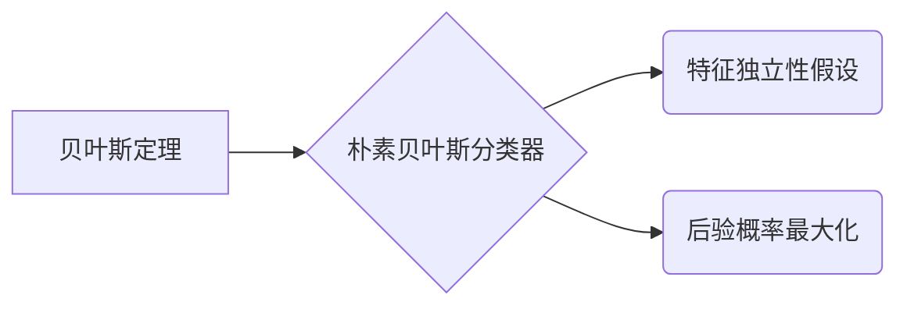

# 朴素贝叶斯 原理与代码实例讲解

作者：禅与计算机程序设计艺术

## 1. 背景介绍

### 1.1 贝叶斯定理的起源与发展

贝叶斯定理，由英国数学家托马斯·贝叶斯 (Thomas Bayes) 在 18 世纪提出，为概率论和统计学提供了一种全新的思考方式。它描述了在已知一些先验信息的情况下，如何根据新的证据更新对事件发生的信念。贝叶斯定理的核心思想是，我们对事件的认知会随着新信息的获取而不断改变。

### 1.2 朴素贝叶斯分类器的诞生

朴素贝叶斯分类器是贝叶斯定理在机器学习领域的经典应用，它是一种简单但强大的分类算法。其“朴素”之处在于假设特征之间相互独立，即一个特征的出现与否不影响其他特征的出现概率。尽管这个假设在现实世界中并不完全成立，但朴素贝叶斯分类器在许多应用中都表现出色，尤其是在文本分类、垃圾邮件过滤等领域。

### 1.3 朴素贝叶斯分类器的优势与局限

朴素贝叶斯分类器具有以下优点：

* **简单易懂:** 原理简单，易于理解和实现。
* **计算效率高:** 训练和预测速度快，适合处理大规模数据集。
* **对缺失数据不敏感:** 可以处理特征值缺失的情况。
* **在小数据集上表现良好:** 即使训练数据有限，也能取得不错的效果。

然而，朴素贝叶斯分类器也存在一些局限性：

* **特征独立性假设:**  现实世界中特征之间往往存在关联性，独立性假设可能会影响分类精度。
* **数据稀疏性问题:**  如果某些特征值在训练数据中出现次数很少，会导致概率估计不准确。
* **对输入数据敏感:** 输入数据的微小变化可能导致分类结果发生较大变化。

## 2. 核心概念与联系

### 2.1 贝叶斯定理

贝叶斯定理的数学表达式如下：

$$
P(A|B) = \frac{P(B|A)P(A)}{P(B)}
$$

其中：

* $P(A|B)$ 表示在事件 B 发生的条件下，事件 A 发生的概率，称为后验概率。
* $P(B|A)$ 表示在事件 A 发生的条件下，事件 B 发生的概率，称为似然度。
* $P(A)$ 表示事件 A 发生的概率，称为先验概率。
* $P(B)$ 表示事件 B 发生的概率，称为证据因子。

贝叶斯定理的本质是，利用先验信息和新的证据，对事件发生的信念进行更新。

### 2.2 朴素贝叶斯分类器

朴素贝叶斯分类器将贝叶斯定理应用于分类问题。假设我们有 $n$ 个特征 $X_1, X_2, ..., X_n$，以及 $k$ 个类别 $C_1, C_2, ..., C_k$。给定一个样本 $x = (x_1, x_2, ..., x_n)$，朴素贝叶斯分类器计算样本属于每个类别的后验概率：

$$
P(C_i|x) = \frac{P(x|C_i)P(C_i)}{P(x)}
$$

由于 $P(x)$ 对所有类别都是相同的，因此可以忽略。根据特征独立性假设，$P(x|C_i)$ 可以表示为：

$$
P(x|C_i) = P(x_1|C_i)P(x_2|C_i)...P(x_n|C_i)
$$

最终，朴素贝叶斯分类器将样本 $x$ 归类为后验概率最大的类别：

$$
C^* = \arg\max_{C_i} P(C_i|x)
$$

### 2.3 核心概念联系图



## 3. 核心算法原理具体操作步骤

### 3.1 数据预处理

* 将数据集划分为训练集和测试集。
* 对特征进行数值化或离散化处理。
* 处理缺失值。

### 3.2 训练阶段

1. 计算先验概率 $P(C_i)$，即每个类别在训练集中出现的频率。
2. 对于每个特征 $X_j$ 和每个类别 $C_i$，计算条件概率 $P(X_j|C_i)$，即在类别 $C_i$ 中，特征 $X_j$ 取值为 $x_j$ 的样本占类别 $C_i$ 样本总数的比例。

### 3.3 预测阶段

1. 对于待预测样本 $x = (x_1, x_2, ..., x_n)$，计算其属于每个类别 $C_i$ 的后验概率 $P(C_i|x)$。
2. 选择后验概率最大的类别 $C^*$ 作为预测结果。

## 4. 数学模型和公式详细讲解举例说明

### 4.1 垃圾邮件分类示例

假设我们有一个垃圾邮件分类数据集，包含以下特征：

* "free" 是否出现在邮件中 (0: 否, 1: 是)
* "money" 是否出现在邮件中 (0: 否, 1: 是)
* "spam" 是否出现在邮件中 (0: 否, 1: 是)

以及两个类别：

* "spam" 垃圾邮件
* "ham" 非垃圾邮件

训练集如下：

| free | money | spam | class |
|---|---|---|---|
| 1 | 0 | 1 | spam |
| 0 | 1 | 1 | spam |
| 1 | 1 | 0 | ham |
| 0 | 0 | 1 | spam |
| 1 | 0 | 0 | ham |

**训练阶段**

1. **计算先验概率:**
   * $P(spam) = 3/5$
   * $P(ham) = 2/5$

2. **计算条件概率:**
   * $P(free=1|spam) = 2/3$
   * $P(free=0|spam) = 1/3$
   * $P(money=1|spam) = 1/3$
   * $P(money=0|spam) = 2/3$
   * $P(spam=1|spam) = 1$
   * $P(spam=0|spam) = 0$
   * $P(free=1|ham) = 1/2$
   * $P(free=0|ham) = 1/2$
   * $P(money=1|ham) = 1/2$
   * $P(money=0|ham) = 1/2$
   * $P(spam=1|ham) = 0$
   * $P(spam=0|ham) = 1$

**预测阶段**

假设我们有一个待预测邮件，其特征为：

* free = 1
* money = 1
* spam = 0

**计算后验概率:**

* $P(spam|x) = P(free=1|spam)P(money=1|spam)P(spam=0|spam)P(spam) = (2/3)(1/3)(0)(3/5) = 0$
* $P(ham|x) = P(free=1|ham)P(money=1|ham)P(spam=0|ham)P(ham) = (1/2)(1/2)(1)(2/5) = 1/10$

**预测结果:**

由于 $P(ham|x) > P(spam|x)$，因此将该邮件分类为 "ham" (非垃圾邮件)。

## 5. 项目实践：代码实例和详细解释说明

### 5.1 Python 代码实现

```python
import numpy as np

class NaiveBayes:
    def __init__(self):
        self.classes = None
        self.prior_probs = None
        self.cond_probs = None

    def fit(self, X, y):
        """
        训练朴素贝叶斯分类器。

        参数：
            X: 训练数据特征，二维数组，形状为 (n_samples, n_features)。
            y: 训练数据标签，一维数组，形状为 (n_samples,)。
        """
        self.classes = np.unique(y)
        n_classes = len(self.classes)

        # 计算先验概率
        self.prior_probs = np.zeros(n_classes)
        for i, c in enumerate(self.classes):
            self.prior_probs[i] = np.sum(y == c) / len(y)

        # 计算条件概率
        self.cond_probs = {}
        for j in range(X.shape[1]):
            feature_values = np.unique(X[:, j])
            for i, c in enumerate(self.classes):
                self.cond_probs[(j, c)] = {}
                for v in feature_values:
                    self.cond_probs[(j, c)][v] = np.sum((X[:, j] == v) & (y == c)) / np.sum(y == c)

    def predict(self, X):
        """
        预测样本类别。

        参数：
            X: 待预测样本特征，二维数组，形状为 (n_samples, n_features)。

        返回：
            预测类别，一维数组，形状为 (n_samples,)。
        """
        n_samples = X.shape[0]
        y_pred = np.zeros(n_samples, dtype=self.classes.dtype)
        for i in range(n_samples):
            posterior_probs = np.zeros(len(self.classes))
            for j, c in enumerate(self.classes):
                prob = self.prior_probs[j]
                for k in range(X.shape[1]):
                    prob *= self.cond_probs[(k, c)].get(X[i, k], 1e-6)  # 处理未出现过的特征值
                posterior_probs[j] = prob
            y_pred[i] = self.classes[np.argmax(posterior_probs)]
        return y_pred

```

### 5.2 代码解释

* `__init__` 方法初始化分类器，存储类别、先验概率和条件概率。
* `fit` 方法训练分类器，计算先验概率和条件概率。
* `predict` 方法预测样本类别，计算后验概率并选择概率最大的类别。

## 6. 实际应用场景

### 6.1 文本分类

朴素贝叶斯分类器广泛应用于文本分类任务，例如：

* **垃圾邮件过滤:**  识别垃圾邮件和非垃圾邮件。
* **情感分析:** 分析文本的情感倾向，例如正面、负面或中性。
* **主题分类:** 将文本归类到不同的主题，例如体育、政治、科技等。

### 6.2 医疗诊断

朴素贝叶斯分类器可以用于辅助医疗诊断，例如：

* **疾病预测:**  根据患者的症状和病史预测疾病的可能性。
* **风险评估:**  评估患者患特定疾病的风险。
* **治疗方案推荐:**  根据患者的病情推荐合适的治疗方案。

### 6.3 其他应用

朴素贝叶斯分类器还可以应用于其他领域，例如：

* **推荐系统:**  根据用户的历史行为推荐商品或服务。
* **欺诈检测:**  识别信用卡欺诈、保险欺诈等行为。
* **图像识别:**  识别图像中的物体或场景。

## 7. 总结：未来发展趋势与挑战

### 7.1 朴素贝叶斯分类器的未来发展趋势

* **改进特征独立性假设:**  研究如何放松特征独立性假设，提高分类精度。
* **处理数据稀疏性问题:**  探索更有效的平滑技术，解决数据稀疏性问题。
* **结合深度学习:**  将朴素贝叶斯分类器与深度学习模型相结合，提升模型性能。

### 7.2 朴素贝叶斯分类器面临的