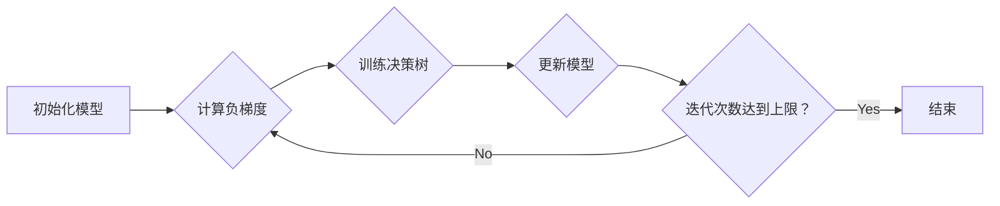

## 1. 背景介绍

### 1.1 机器学习算法的演进

机器学习算法的发展经历了从简单到复杂，从线性到非线性的过程。早期的线性模型，如线性回归和逻辑回归，在处理线性可分的数据集时表现出色，但在面对复杂非线性关系时显得力不从心。为了解决这个问题，研究者们提出了决策树、支持向量机、神经网络等非线性模型，这些模型能够捕捉数据中更复杂的模式，从而提升预测精度。

### 1.2 集成学习方法的崛起

集成学习方法是将多个弱学习器组合起来，以期获得比单个学习器更好的泛化能力。常见的集成学习方法包括 Bagging、Boosting 和 Stacking。Bagging 方法通过随机抽样构建多个训练集，并在每个训练集上训练一个弱学习器，最终将所有弱学习器的预测结果进行平均或投票，以得到最终预测结果。Boosting 方法则更加注重对错误样本的学习，它在每一轮迭代中调整样本权重，使得被错误分类的样本获得更高的权重，从而迫使弱学习器更加关注这些样本。Stacking 方法则将多个学习器的输出作为新的特征，并使用另一个学习器进行最终预测。

### 1.3 GBDT 算法的诞生

梯度提升决策树（Gradient Boosting Decision Tree，GBDT）是一种基于 Boosting 思想的集成学习算法，它使用决策树作为弱学习器，并通过梯度下降的方式优化模型参数。GBDT 算法在许多机器学习任务中都取得了优异的表现，例如分类、回归、排序等，被广泛应用于搜索引擎、推荐系统、金融风控等领域。

## 2. 核心概念与联系

### 2.1 决策树

决策树是一种树形结构，它由节点和边组成。节点表示特征或决策规则，边表示特征取值或决策结果。决策树的构建过程是一个递归的过程，它从根节点开始，根据特征选择标准选择最优特征，并将数据集划分成多个子集。然后，对每个子集递归地构建决策树，直到满足停止条件。

### 2.2 Boosting

Boosting 是一种迭代式的算法，它通过不断地训练弱学习器，并将它们组合起来，以期获得比单个学习器更好的泛化能力。Boosting 算法的核心思想是：关注被错误分类的样本，并在下一轮迭代中赋予它们更高的权重，从而迫使弱学习器更加关注这些样本。

### 2.3 梯度下降

梯度下降是一种优化算法，它通过迭代地调整模型参数，以最小化损失函数。梯度下降算法的基本思想是：沿着损失函数的负梯度方向更新模型参数，直到达到局部最小值。

### 2.4 GBDT 算法的联系

GBDT 算法将决策树和 Boosting 思想结合起来，并使用梯度下降的方式优化模型参数。GBDT 算法的基本流程如下：

1. 初始化模型，通常为一个常数。
2. 迭代训练弱学习器（决策树）。
    * 计算损失函数的负梯度。
    * 使用负梯度作为目标值，训练一个决策树。
    * 将新训练的决策树添加到模型中。
3. 重复步骤 2，直到达到预定的迭代次数或满足停止条件。

## 3. 核心算法原理具体操作步骤

### 3.1 算法流程图



### 3.2 具体操作步骤

1. **初始化模型**

   初始化模型，通常为一个常数，例如样本标签的均值。

2. **迭代训练弱学习器**

   重复以下步骤，直到达到预定的迭代次数或满足停止条件：

   * **计算损失函数的负梯度**

     计算当前模型在所有样本上的损失函数的负梯度。负梯度表示损失函数下降最快的方向。

   * **训练决策树**

     使用负梯度作为目标值，训练一个决策树。决策树的训练过程与传统的决策树训练过程类似，只是目标值不同。

   * **更新模型**

     将新训练的决策树添加到模型中。模型的更新方式通常是将新决策树的预测结果乘以一个学习率，然后加到当前模型的预测结果上。学习率是一个超参数，它控制模型更新的幅度。

3. **预测**

   使用训练好的 GBDT 模型进行预测。预测过程就是将所有决策树的预测结果加权求和。

## 4. 数学模型和公式详细讲解举例说明

### 4.1 损失函数

GBDT 算法可以使用不同的损失函数，例如平方损失函数、绝对值损失函数、对数损失函数等。损失函数的选择取决于具体的应用场景。

* **平方损失函数**

   $$L(y, \hat{y}) = (y - \hat{y})^2$$

   其中，$y$ 是真实标签，$\hat{y}$ 是模型预测值。

* **绝对值损失函数**

   $$L(y, \hat{y}) = |y - \hat{y}|$$

* **对数损失函数**

   $$L(y, \hat{y}) = -y \log(\hat{y}) - (1-y) \log(1-\hat{y})$$

### 4.2 梯度下降

GBDT 算法使用梯度下降的方式优化模型参数。梯度下降算法的基本公式如下：

$$\theta_{t+1} = \theta_t - \eta \nabla L(\theta_t)$$

其中，$\theta_t$ 是第 $t$ 轮迭代的模型参数，$\eta$ 是学习率，$\nabla L(\theta_t)$ 是损失函数在 $\theta_t$ 处的梯度。

### 4.3 举例说明

假设我们使用平方损失函数，学习率为 0.1，初始模型为 0。训练数据集中有 3 个样本，它们的真实标签和模型预测值如下表所示：

| 样本 | 真实标签 | 模型预测值 |
|---|---|---|
| 1 | 1 | 0 |
| 2 | 0 | 0 |
| 3 | 1 | 0 |

**第一轮迭代：**

* 计算负梯度：

  $$\nabla L(\theta_0) = -2(y - \hat{y}) = [-2, 0, -2]$$

* 训练决策树：

  使用负梯度作为目标值，训练一个决策树。假设决策树将样本 1 和 3 分到一个叶子节点，将样本 2 分到另一个叶子节点。

* 更新模型：

  $$\theta_1 = \theta_0 - \eta \nabla L(\theta_0) = 0 - 0.1 \times [-2, 0, -2] = [0.2, 0, 0.2]$$

  模型的预测值更新为：

  | 样本 | 真实标签 | 模型预测值 |
  |---|---|---|
  | 1 | 1 | 0.2 |
  | 2 | 0 | 0 |
  | 3 | 1 | 0.2 |

**第二轮迭代：**

* 计算负梯度：

  $$\nabla L(\theta_1) = -2(y - \hat{y}) = [-1.6, 0, -1.6]$$

* 训练决策树：

  使用负梯度作为目标值，训练一个决策树。假设决策树将样本 1 和 3 分到一个叶子节点，将样本 2 分到另一个叶子节点。

* 更新模型：

  $$\theta_2 = \theta_1 - \eta \nabla L(\theta_1) = [0.2, 0, 0.2] - 0.1 \times [-1.6, 0, -1.6] = [0.36, 0, 0.36]$$

  模型的预测值更新为：

  | 样本 | 真实标签 | 模型预测值 |
  |---|---|---|
  | 1 | 1 | 0.36 |
  | 2 | 0 | 0 |
  | 3 | 1 | 0.36 |

  重复以上步骤，直到达到预定的迭代次数或满足停止条件。

## 5. 项目实践：代码实例和详细解释说明

### 5.1 Python 代码实例

```python
from sklearn.datasets import load_boston
from sklearn.model_selection import train_test_split
from sklearn.ensemble import GradientBoostingRegressor
from sklearn.metrics import mean_squared_error

# 加载数据集
boston = load_boston()
X = boston.data
y = boston.target

# 划分训练集和测试集
X_train, X_test, y_train, y_test = train_test_split(X, y, test_size=0.2, random_state=42)

# 创建 GBDT 模型
gbdt = GradientBoostingRegressor(n_estimators=100, learning_rate=0.1, max_depth=3)

# 训练模型
gbdt.fit(X_train, y_train)

# 预测
y_pred = gbdt.predict(X_test)

# 评估模型
mse = mean_squared_error(y_test, y_pred)
print("Mean Squared Error:", mse)
```

### 5.2 代码解释

* `load_boston()` 函数加载波士顿房价数据集。
* `train_test_split()` 函数将数据集划分为训练集和测试集。
* `GradientBoostingRegressor()` 函数创建一个 GBDT 模型。
    * `n_estimators` 参数指定弱学习器的数量。
    * `learning_rate` 参数指定学习率。
    * `max_depth` 参数指定决策树的最大深度。
* `fit()` 方法训练 GBDT 模型。
* `predict()` 方法使用训练好的模型进行预测。
* `mean_squared_error()` 函数计算均方误差。

## 6. 实际应用场景

### 6.1 搜索引擎

GBDT 算法可以用于搜索引擎的排序模型。搜索引擎的排序模型需要根据用户的搜索词和网页内容，预测网页的相关性得分，并将得分最高的网页排在搜索结果的前面。GBDT 算法能够捕捉数据中复杂的非线性关系，从而提升排序模型的预测精度。

### 6.2 推荐系统

GBDT 算法可以用于推荐系统的推荐模型。推荐系统的推荐模型需要根据用户的历史行为和商品信息，预测用户对商品的兴趣度，并将兴趣度最高的商品推荐给用户。GBDT 算法能够捕捉数据中复杂的非线性关系，从而提升推荐模型的预测精度。

### 6.3 金融风控

GBDT 算法可以用于金融风控的信用评分模型。信用评分模型需要根据用户的个人信息、信用历史、消费记录等，预测用户的信用风险，并将信用风险高的用户进行风险控制。GBDT 算法能够捕捉数据中复杂的非线性关系，从而提升信用评分模型的预测精度。

## 7. 工具和资源推荐

### 7.1 Scikit-learn

Scikit-learn 是一个 Python 机器学习库，它提供了 GBDT 算法的实现。

### 7.2 XGBoost

XGBoost 是一个高效的 GBDT 算法库，它提供了 Python、R、Java、C++ 等多种语言的接口。

### 7.3 LightGBM

LightGBM 是一个轻量级的 GBDT 算法库，它具有训练速度快、内存占用低的特点。

## 8. 总结：未来发展趋势与挑战

### 8.1 未来发展趋势

* **深度学习与 GBDT 的结合**

  深度学习和 GBDT 都是强大的机器学习算法，将它们结合起来可以进一步提升模型的预测精度。

* **自动机器学习**

  自动机器学习旨在自动化机器学习模型的构建过程，包括特征工程、模型选择、超参数调优等。将自动机器学习应用于 GBDT 算法可以简化模型构建过程，并提升模型性能。

### 8.2 面临的挑战

* **可解释性**

  GBDT 算法是一个黑盒模型，它的预测结果难以解释。提高 GBDT 算法的可解释性是未来研究的一个重要方向。

* **过拟合**

  GBDT 算法容易过拟合，特别是在数据量较小的情况下。如何防止 GBDT 算法过拟合是未来研究的一个重要方向。

## 9. 附录：常见问题与解答

### 9.1 GBDT 算法与随机森林算法的区别是什么？

GBDT 算法和随机森林算法都是基于决策树的集成学习算法，但它们之间存在一些区别：

* **训练方式**

  GBDT 算法使用 Boosting 的方式训练弱学习器，而随机森林算法使用 Bagging 的方式训练弱学习器。

* **弱学习器之间的关系**

  GBDT 算法的弱学习器之间存在依赖关系，而随机森林算法的弱学习器之间相互独立。

* **过拟合**

  GBDT 算法更容易过拟合，而随机森林算法的过拟合风险相对较低。

### 9.2 如何调整 GBDT 算法的超参数？

GBDT 算法的超参数包括弱学习器的数量、学习率、决策树的最大深度等。调整 GBDT 算法的超参数可以使用网格搜索、随机搜索等方法。