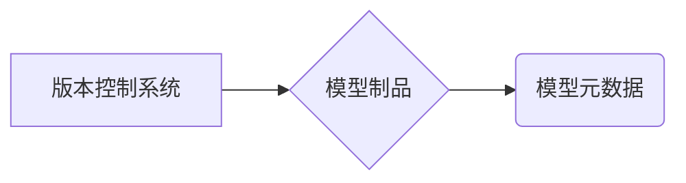

## 1. 背景介绍

### 1.1 机器学习模型的生命周期

机器学习模型的开发是一个迭代的过程，从数据收集、特征工程、模型训练、评估到部署，每个阶段都需要进行多次尝试和改进。在这个过程中，模型会不断演进，产生多个版本。如何有效地管理这些模型版本，保证模型的可追溯性、可复现性和可部署性，是机器学习工程中至关重要的一环。

### 1.2 模型版本控制的必要性

如果没有模型版本控制，我们可能会面临以下问题：

* **难以追溯模型变更历史**: 无法得知模型在不同时间点的状态，难以确定哪个版本性能最佳。
* **难以复现实验结果**: 由于代码、数据、参数等因素的变化，难以复现之前的实验结果，无法进行有效的对比分析。
* **部署错误的模型版本**:  如果没有明确的版本标识，容易将错误的模型版本部署到生产环境，造成严重后果。

### 1.3 模型版本控制的目标

模型版本控制的目标是：

* **记录模型的演变过程**: 记录模型的每一次修改，包括代码、数据、参数等，方便追溯模型的历史。
* **确保模型的可复现性**:  保证任何版本的模型都可以被复现，方便进行对比实验和问题排查。
* **简化模型部署**:  通过版本标识，可以方便地选择合适的模型版本进行部署。

## 2. 核心概念与联系

### 2.1 版本控制系统

版本控制系统 (Version Control System, VCS) 是一种用于记录文件变化的系统，它可以跟踪文件的修改历史，并允许用户回滚到任何历史版本。常见的版本控制系统包括 Git、SVN 等。

### 2.2 模型元数据

模型元数据是指描述模型的所有信息，包括模型的名称、版本、作者、创建时间、训练数据、参数配置、评估指标等。这些信息对于理解模型、复现实验结果和部署模型至关重要。

### 2.3 模型制品

模型制品是指模型训练过程中产生的所有文件，包括模型文件、代码文件、数据文件、配置文件等。这些文件共同构成了一个完整的模型版本。

### 2.4 核心概念之间的联系

版本控制系统用于管理模型制品，模型元数据用于描述模型制品，三者共同构成了模型版本控制体系。



## 3. 核心算法原理具体操作步骤

### 3.1 基于 Git 的模型版本控制

Git 是目前最流行的分布式版本控制系统，它可以用于管理任何类型的文件，包括代码、数据、模型等。以下是使用 Git 进行模型版本控制的基本步骤：

1. **初始化 Git 仓库**: 在项目根目录下执行 `git init` 命令初始化 Git 仓库。
2. **添加文件**: 使用 `git add` 命令将模型制品添加到 Git 仓库的暂存区。
3. **提交更改**: 使用 `git commit` 命令将暂存区的文件提交到 Git 仓库，并添加提交信息，例如 "feat: 添加新的模型版本 v1.0"。
4. **查看历史记录**: 使用 `git log` 命令查看模型的提交历史记录。
5. **回滚版本**: 使用 `git reset` 命令回滚到任何历史版本。

### 3.2 模型元数据管理

可以使用 YAML 文件或 JSON 文件来存储模型元数据，例如：

```yaml
name: 模型名称
version: v1.0
author: 作者姓名
created_at: 2024-05-20 04:14:01
 训练数据路径
parameters: 模型参数配置
metrics: 模型评估指标
```

将模型元数据文件与模型制品一起提交到 Git 仓库，可以方便地查看模型的信息。

### 3.3 模型制品管理

可以使用以下方法来管理模型制品：

* **将所有文件存储在 Git 仓库**: 这是最简单的方法，但如果模型文件很大，可能会导致 Git 仓库过大。
* **使用 Git LFS**: Git LFS (Large File Storage) 是 Git 的一个扩展，它可以将大文件存储在 Git 仓库之外，并在 Git 仓库中保留指向这些文件的指针。
* **使用云存储服务**: 可以将模型制品存储在云存储服务中，例如 AWS S3、Google Cloud Storage 等，并在 Git 仓库中存储指向这些文件的链接。

## 4. 数学模型和公式详细讲解举例说明

### 4.1 模型版本号

模型版本号通常采用语义化版本号 (Semantic Versioning) 规范，格式为 `MAJOR.MINOR.PATCH`，其中：

* `MAJOR`: 表示重大版本更新，例如 API 发生不兼容的更改。
* `MINOR`: 表示新增功能或改进，但不影响 API 兼容性。
* `PATCH`: 表示修复 bug 或进行小的改进。

例如，版本号 `1.0.0` 表示第一个正式版本，`1.1.0` 表示新增了一些功能，`1.1.1` 表示修复了一些 bug。

### 4.2 模型评估指标

模型评估指标用于衡量模型的性能，常见的指标包括：

* **准确率**:  $Accuracy = \frac{TP + TN}{TP + TN + FP + FN}$
* **精确率**:  $Precision = \frac{TP}{TP + FP}$
* **召回率**:  $Recall = \frac{TP}{TP + FN}$
* **F1 值**:  $F1 = 2 * \frac{Precision * Recall}{Precision + Recall}$

其中：

* TP: 真正例 (True Positive)
* TN: 真负例 (True Negative)
* FP: 假正例 (False Positive)
* FN: 假负例 (False Negative)

### 4.3 模型参数配置

模型参数配置是指模型训练过程中使用的所有参数，例如学习率、批大小、迭代次数等。这些参数对模型的性能有很大影响，需要进行仔细的调整。

## 5. 项目实践：代码实例和详细解释说明

### 5.1 使用 MLflow 进行模型版本控制

MLflow 是一个开源的机器学习生命周期管理平台，它提供了一套工具用于跟踪实验、打包代码、部署模型等。以下是如何使用 MLflow 进行模型版本控制的示例：

```python
import mlflow

# 启动 MLflow 跟踪
mlflow.start_run()

# 记录模型参数
mlflow.log_param("learning_rate", 0.01)
mlflow.log_param("batch_size", 32)
mlflow.log_param("epochs", 10)

# 训练模型
model = ...

# 记录模型评估指标
mlflow.log_metric("accuracy", 0.95)
mlflow.log_metric("precision", 0.9)
mlflow.log_metric("recall", 0.92)
mlflow.log_metric("f1", 0.91)

# 保存模型
mlflow.sklearn.log_model(model, "model")

# 结束 MLflow 跟踪
mlflow.end_run()
```

这段代码展示了如何使用 MLflow 记录模型参数、评估指标和保存模型。MLflow 会自动将这些信息存储到指定的跟踪服务器，并生成一个唯一的运行 ID，可以用于追溯模型的版本。

### 5.2 使用 DVC 进行数据版本控制

DVC (Data Version Control) 是一个用于管理大型数据集的开源工具，它可以与 Git 集成，并使用云存储服务来存储数据文件。以下是如何使用 DVC 进行数据版本控制的示例：

```bash
# 初始化 DVC
dvc init

# 添加数据文件
dvc add data.csv

# 提交更改
git add .
git commit -m "feat: 添加数据文件"

# 推送到远程仓库
dvc push
```

这段代码展示了如何使用 DVC 添加数据文件、提交更改并推送到远程仓库。DVC 会自动将数据文件存储到指定的云存储服务，并在 Git 仓库中保留指向这些文件的链接。

## 6. 实际应用场景

### 6.1 模型迭代开发

在模型迭代开发过程中，可以使用模型版本控制来跟踪模型的演变过程，方便比较不同版本的性能，并选择最佳版本进行部署。

### 6.2 模型复现

当需要复现之前的实验结果时，可以使用模型版本控制来获取特定版本的模型制品和元数据，确保实验环境的一致性。

### 6.3 模型部署

在模型部署时，可以使用模型版本控制来选择合适的模型版本进行部署，并确保部署过程的可追溯性。

## 7. 工具和资源推荐

### 7.1 版本控制系统

* **Git**: https://git-scm.com/
* **SVN**: https://subversion.apache.org/

### 7.2 模型版本控制工具

* **MLflow**: https://mlflow.org/
* **DVC**: https://dvc.org/

### 7.3 云存储服务

* **AWS S3**: https://aws.amazon.com/s3/
* **Google Cloud Storage**: https://cloud.google.com/storage/

## 8. 总结：未来发展趋势与挑战

### 8.1 模型版本控制的未来发展趋势

* **自动化模型版本控制**:  未来，模型版本控制将会更加自动化，例如自动记录模型参数、评估指标和保存模型。
* **云原生模型版本控制**:  随着云计算的普及，模型版本控制将会更加云原生，例如使用云存储服务来存储模型制品，并使用云平台提供的工具来管理模型版本。
* **模型版本控制的标准化**:  未来，模型版本控制可能会出现一些标准化的规范，例如模型元数据格式、版本号规范等，方便不同工具之间的互操作性。

### 8.2 模型版本控制的挑战

* **模型制品的大小**:  随着模型复杂度的提高，模型制品的大小可能会越来越大，对存储和传输都带来了挑战。
* **模型元数据的管理**:  模型元数据包含了大量的信息，如何有效地管理这些信息，确保其准确性和完整性，是一个挑战。
* **模型版本控制的成本**:  模型版本控制需要一定的成本，例如存储成本、计算成本等，如何降低成本是一个挑战。

## 9. 附录：常见问题与解答

### 9.1 如何选择合适的模型版本控制工具？

选择模型版本控制工具需要考虑以下因素：

* **项目规模**:  对于小型项目，可以使用 Git 来管理模型制品；对于大型项目，可以使用 MLflow 或 DVC 等工具。
* **团队协作**:  如果需要多人协作开发模型，需要选择支持团队协作的工具，例如 Git、MLflow 等。
* **成本**:  不同的工具有不同的成本，需要根据项目预算选择合适的工具。

### 9.2 如何解决模型制品过大的问题？

可以使用以下方法来解决模型制品过大的问题：

* **使用 Git LFS**:  Git LFS 可以将大文件存储在 Git 仓库之外，并在 Git 仓库中保留指向这些文件的指针。
* **使用云存储服务**:  可以将模型制品存储在云存储服务中，并在 Git 仓库中存储指向这些文件的链接。
* **压缩模型文件**:  可以使用压缩算法来压缩模型文件，例如 ZIP、GZIP 等。

### 9.3 如何确保模型元数据的准确性和完整性？

可以使用以下方法来确保模型元数据的准确性和完整性：

* **使用自动化工具**:  可以使用自动化工具来记录模型参数、评估指标和保存模型，减少人工操作的错误。
* **进行数据校验**:  可以使用数据校验工具来检查模型元数据的格式和内容，确保其准确性和完整性。
* **建立元数据管理规范**:  可以建立元数据管理规范，例如命名规范、版本号规范等，确保元数据的一致性和可维护性。
