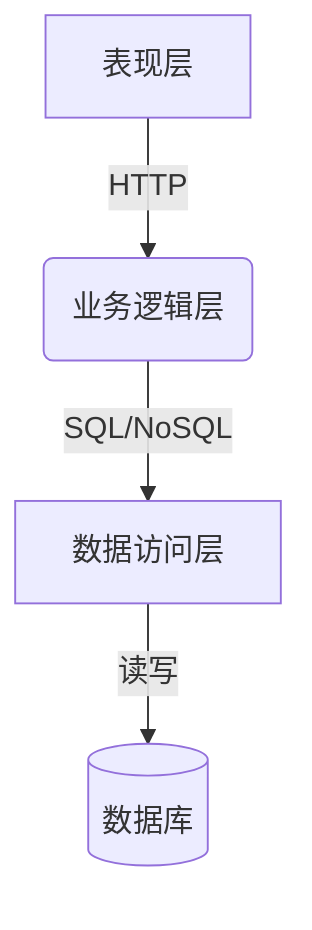

# 橡胶管理系统详细设计与具体代码实现

## 1. 背景介绍

### 1.1 橡胶行业概况

橡胶是一种重要的工业原材料,广泛应用于汽车、航空航天、建筑、电子电器等诸多领域。随着工业化进程的不断推进,橡胶的需求量也在持续增长。因此,构建高效的橡胶管理系统对于优化橡胶供应链、提高生产效率、降低运营成本至关重要。

### 1.2 橡胶管理系统的作用

橡胶管理系统旨在实现对橡胶从采购、加工、库存到销售的全流程管控。它能够帮助企业:

- 精准掌握原材料需求,优化采购策略
- 实时监控生产进度,提高工厂运营效率 
- 科学管理库存,减少资金占用
- 快速响应市场需求,提升客户满意度

### 1.3 系统设计的挑战

设计一个高质量的橡胶管理系统需要解决以下几个关键挑战:

- 多环节集成:系统需覆盖采购、生产、仓储、销售等多个环节
- 数据处理能力:能高效处理大量交易和库存数据
- 可扩展性:能适应未来业务增长的需求
- 安全性:确保系统及数据的安全可靠

## 2. 核心概念与联系 

### 2.1 系统架构概览

橡胶管理系统采用经典的三层架构设计,包括表现层(前端)、业务逻辑层(中间件)和数据访问层(后端),如下图所示:



各层职责分工明确:

- 表现层:提供界面,接收用户输入并显示处理结果
- 业务逻辑层:实现系统的核心业务流程
- 数据访问层:负责与数据库进行交互,执行数据持久化操作

### 2.2 系统核心模块

橡胶管理系统由多个核心模块组成,贯穿了橡胶从采购到销售的全流程:

- **采购模块**:管理供应商信息,完成原材料采购订单的下达和跟踪
- **生产模块**:计划和调度生产任务,监控工厂运营状况
- **仓储模块**:记录原材料和产成品入库、出库,管控库存
- **销售模块**:处理客户订单,完成产品发货和收款
- **财务模块**:记录应付、应收款项,完成付款和收款
- **报表模块**:提供多维度报表,支持业务分析和决策

### 2.3 系统核心数据模型

橡胶管理系统的核心数据模型包括以下几个方面:

- 物料信息:原材料、半成品、产成品的基本属性数据
- 供应商信息:供应商基本资料、供货种类、历史交易记录等
- 客户信息:客户基本资料、订单记录、欠款记录等
- 生产计划:车间、工序、物料消耗配比等
- 库存信息:物料批次、仓位、数量等
- 财务信息:应付、应收、付款、收款等

这些核心数据模型通过多对多、一对多等关联关系相互关联、相互作用,构成了系统的数据基础。

## 3. 核心算法原理具体操作步骤

### 3.1 物料需求计划算法

物料需求计划(Material Requirements Planning, MRP)是橡胶管理系统的一个核心算法,用于计算物料的需求量并生成采购计划。它的工作原理如下:

1. 获取产品的销售订单和现有库存量
2. 依据物料清单(BOM)计算每个产品级物料的需求量
3. 结合现有库存,计算物料的净需求量
4. 对净需求量进行分批,生成采购订单

MRP算法的数学模型可表示为:

$$
N_i = D_i + S_i - Q_i - \sum_{j \in J_i} \left \lceil \frac{N_j}{q_{ij}} \right \rceil q_{ij}
$$

其中:
- $N_i$表示物料i的净需求量
- $D_i$表示物料i的总需求量(来自销售订单)
- $S_i$表示物料i的安全库存量
- $Q_i$表示物料i的现有库存量
- $J_i$表示物料i的直接前体集合
- $q_{ij}$表示生产1单位j需要i的数量(来自BOM)

MRP算法的伪代码如下:

```python
def mrp(orders, bom, inventory):
    net_requirements = {}
    for product, quantity in orders:
        # 展开物料需求
        requirements = explode(product, quantity, bom)
        # 计算净需求量
        for material, required in requirements.items():
            on_hand = inventory.get(material, 0)
            net_requirements[material] = max(0, required - on_hand)
    
    # 生成采购订单
    orders = []
    for material, net_req in net_requirements.items():
        orders.extend(lot_sizing(material, net_req))
    return orders
```

### 3.2 车间调度算法

车间调度是生产模块的核心,其目标是最大限度地利用有限的资源(设备、人力等),实现高效生产。一种常用的调度算法是:

**蚁群优化算法**

1. 将工序视为节点,工序之间的先后制约关系视为边构建图
2. 为每个工序分配若干"蚂蚁",随机行走至下一可行工序
3. 每只蚂蚁行走时留下"信息素",能量值高的路径会留下更多信息素
4. 后续蚂蚁趋向选择信息素浓度高的路径行走
5. 迭代一定次数后,蚂蚁分布路径即为优化的生产调度方案

该算法的数学模型为:

$$
p_{ij}^k(t) = \begin{cases} \frac{[\tau_{ij}(t)]^\alpha[\eta_{ij}]^\beta}{\sum\limits_{l\in J_i^k}[\tau_{il}(t)]^\alpha[\eta_{il}]^\beta} &\text{if }j\in J_i^k\\ 0 &\text{otherwise}\end{cases}
$$

其中:

- $p_{ij}^k(t)$表示蚂蚁k在时间t从工序i转移到j的概率
- $\tau_{ij}(t)$表示时间t,工序i到j的信息素浓度
- $\eta_{ij}$表示工序i到j的启发式信息,如加工时间
- $\alpha,\beta$为控制信息素浓度和启发式信息相对重要性的参数
- $J_i^k$为蚂蚁k当前所在工序i的可行域

## 4. 数学模型和公式详细讲解举例说明

### 4.1 安全库存计算

安全库存是为了防止因供需波动而导致缺货的库存储备。适当的安全库存水平能保证供应链的稳定性,但过高的安全库存又会增加资金占用。因此,合理计算安全库存量是管理库存的关键。

**安全库存计算公式**:

$$
\text{Safety Stock} = \text{Safety Factor} \times \sqrt{\text{Lead Time Variance} + \text{Demand Variance}}
$$

其中:

- Safety Factor通常取1.65~2,对应95%~97.5%的服务水平
- Lead Time Variance是供应商交货延迟时间的方差
- Demand Variance是未来一段时间内需求量的方差

**举例**:

某种原材料A的Lead Time Variance为4天^2,历史需求量的Demand Variance为100吨^2,如果要达到95%的服务水平,则安全库存应为:

$$
\begin{align*}
\text{Safety Stock} &= 1.65 \times \sqrt{4 + 100} \\
                    &= 1.65 \times 10.2 \\
                    &\approx 17\text{(吨)}
\end{align*}
$$

### 4.2 经济订货量模型

经济订货量(Economic Order Quantity, EOQ)模型是确定最优订货量的经典模型,旨在权衡订货成本和库存成本,求得总成本最小化的订货量。

**EOQ公式**:

$$
\text{EOQ} = \sqrt{\frac{2DC_o}{C_c}}
$$

其中:
- D为年度需求量
- $C_o$为每次订货的固定成本(下单、运输等)
- $C_c$为每单位存货的年存货成本(资金成本、仓储成本等)

**举例**:

某种原材料B的年度需求量为10000吨,每次订货的固定成本为5000元,每吨存货成本为300元/年,则最优订货量为:

$$
\begin{align*}
\text{EOQ} &= \sqrt{\frac{2 \times 10000 \times 5000}{300}} \\
           &= \sqrt{333333} \\
           &\approx 577\text{(吨)}
\end{align*}
$$

因此,公司每次应订购577吨的原材料B,这样可最小化总的订货成本和存货成本。

## 4. 项目实践:代码实例和详细解释说明

本节将提供一些橡胶管理系统的核心模块代码示例,并对其进行解释说明。假设系统采用Python作为开发语言。

### 4.1 采购模块

采购模块的主要职责是根据MRP计算结果,生成采购订单并跟踪订单状态。

```python
from typing import List, Dict
from dataclasses import dataclass

@dataclass
class PurchaseOrder:
    id: str
    material: str
    quantity: int
    supplier: str
    status: str = "OPEN"

class PurchaseModule:
    
    def __init__(self):
        self.orders: Dict[str, PurchaseOrder] = {}
    
    def create_order(self, material: str, quantity: int, supplier: str) -> str:
        """创建一个新的采购订单"""
        order_id = ... # 生成订单ID
        order = PurchaseOrder(order_id, material, quantity, supplier)
        self.orders[order_id] = order
        return order_id

    def update_order(self, order_id: str, status: str) -> None:
        """更新订单状态"""
        order = self.orders.get(order_id)
        if order:
            order.status = status
        else:
            raise ValueError(f"Order {order_id} not found")

    def list_open_orders(self) -> List[PurchaseOrder]:
        """获取所有未完成的订单列表"""
        return [order for order in self.orders.values() if order.status == "OPEN"]
```

解释:

- `PurchaseOrder`是采购订单的数据模型,包含订单ID、物料名称、数量、供应商等字段
- `PurchaseModule`是采购模块的主体,提供创建订单、更新订单状态、获取未完成订单列表等功能
- `create_order`方法创建一个新的采购订单,并将其存储在`orders`字典中
- `update_order`方法用于更新订单的状态,如"OPEN"、"DELIVERED"等
- `list_open_orders`方法返回所有未完成("OPEN"状态)的订单列表

### 4.2 生产模块

生产模块负责管理生产计划,调度工厂运营。下面是一个简化的生产计划类:

```python
from typing import List, Dict
from dataclasses import dataclass

@dataclass
class WorkOrder:
    id: str
    product: str
    quantity: int
    due_date: str

@dataclass 
class ProductionPlan:
    work_orders: List[WorkOrder]
    bom: Dict[str, Dict[str, int]]  # 物料清单

    def explode(self, order: WorkOrder) -> Dict[str, int]:
        """根据BOM展开工单所需物料"""
        requirements = {}
        product = order.product
        for material, quantity in self.bom[product].items():
            requirements[material] = order.quantity * quantity
        return requirements

    def calculate_requirements(self) -> Dict[str, int]:
        """计算所有工单的物料需求量"""
        requirements = {}
        for order in self.work_orders:
            exploded = self.explode(order)
            for material, quantity in exploded.items():
                requirements[material] = requirements.get(material, 0) + quantity
        return requirements
```

解释:

- `WorkOrder`是生产工单的数据模型,包含工单ID、产品名称、数量、交货期限等字段
- `ProductionPlan`是生产计划的核心类,包含工单列表和物料清单(BOM)
- `explode`方法根据BOM展开一个工单所需的各种物料及其数量
- `calculate_requirements`方法计算所有工单的物料需求量汇总

通过这些核心代码,我们可以进一步实现生产任务的调度、跟踪等功能。

## 5. 实际应用场景

橡胶管理系统可广泛应用于橡胶行业的各个环