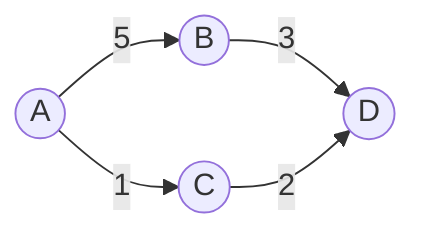

## 1. 背景介绍

### 1.1 物流行业现状与挑战

随着电子商务的蓬勃发展和全球化的深入推进，物流行业正经历着前所未有的变革与挑战。传统的物流模式已无法满足日益增长的物流需求，企业面临着效率低下、成本高昂、信息化程度不足等诸多问题。为了应对这些挑战，构建高效、智能、可持续的现代物流体系成为当务之急。

### 1.2 物流管理平台的意义

物流管理平台作为现代物流体系的核心组成部分，通过信息技术手段整合物流资源、优化物流流程、提升物流效率，为企业提供全方位的物流解决方案。其主要意义在于：

* **提高物流效率:** 通过自动化流程、智能调度、实时跟踪等功能，缩短物流周期，降低物流成本。
* **优化资源配置:** 整合仓储、运输、配送等资源，实现资源共享，提高资源利用率。
* **增强信息透明度:** 提供实时物流信息查询，提高物流过程的可视化程度，增强客户体验。
* **提升服务质量:**  通过标准化流程、精细化管理，提升物流服务质量，增强客户满意度。

### 1.3 本文目的

本文旨在介绍物流管理平台的开发系统详细设计与具体代码实现，为物流企业、软件开发者、技术爱好者提供参考和借鉴。

## 2. 核心概念与联系

### 2.1 物流管理平台架构

物流管理平台的架构通常采用多层架构，包括：

* **表现层:**  负责用户交互，提供友好的用户界面。
* **业务逻辑层:**  处理业务逻辑，实现物流管理的核心功能。
* **数据访问层:**  负责数据存储和访问，保证数据的安全性和一致性。

### 2.2 核心模块

物流管理平台的核心模块包括：

* **订单管理:**  处理订单接收、审核、分配、跟踪等功能。
* **仓储管理:**  管理仓库库存、出入库、盘点等操作。
* **运输管理:**  管理车辆调度、路线规划、运输跟踪等功能。
* **配送管理:**  管理配送人员、配送路线、配送状态等信息。
* **财务管理:**  处理物流费用结算、成本核算等功能。

### 2.3 模块间联系

物流管理平台的各个模块之间相互联系，共同完成物流管理的整体流程。例如，订单管理模块接收的订单信息会传递给仓储管理模块进行库存分配，仓储管理模块完成出库操作后会通知运输管理模块进行车辆调度，运输管理模块完成运输后会更新订单状态，并通知配送管理模块进行配送。

## 3. 核心算法原理具体操作步骤

### 3.1 路线规划算法

路线规划算法是物流管理平台的核心算法之一，用于计算最优的运输路线，降低运输成本，提高运输效率。常用的路线规划算法包括：

* **Dijkstra算法:**  用于计算单源最短路径。
* **A*算法:**  在Dijkstra算法的基础上，加入启发式函数，提高搜索效率。
* **Floyd算法:**  用于计算所有节点之间的最短路径。

### 3.2 库存管理算法

库存管理算法用于优化仓库库存，降低库存成本，提高库存周转率。常用的库存管理算法包括：

* **ABC分类法:**  将库存物品按照价值和重要程度进行分类，分别制定不同的管理策略。
* **经济订货批量模型:**  计算最佳的订货批量，以最小化库存成本。
* **物料需求计划:**  根据生产计划和物料清单，计算物料需求量，并制定采购计划。

### 3.3 调度算法

调度算法用于优化车辆调度，提高运输效率，降低运输成本。常用的调度算法包括：

* **贪心算法:**  每次选择当前最优的方案。
* **模拟退火算法:**  通过模拟高温物体冷却的过程，寻找全局最优解。
* **遗传算法:**  模拟生物进化过程，寻找最优解。

## 4. 数学模型和公式详细讲解举例说明

### 4.1 经济订货批量模型

经济订货批量模型用于计算最佳的订货批量，以最小化库存成本。其数学模型如下：

$$
Q = \sqrt{\frac{2DS}{H}}
$$

其中：

* $Q$: 经济订货批量
* $D$: 年需求量
* $S$: 每次订货成本
* $H$: 年库存持有成本

**举例说明:**

假设某公司年需求量为1000件，每次订货成本为50元，年库存持有成本为每件2元。则经济订货批量为：

$$
Q = \sqrt{\frac{2 \times 1000 \times 50}{2}} = 500
$$

即最佳订货批量为500件。

### 4.2 Dijkstra算法

Dijkstra算法用于计算单源最短路径。其算法步骤如下：

1. 初始化距离数组，将起点到自身的距离设为0，其余节点到起点的距离设为无穷大。
2. 将起点加入已访问节点集合。
3. 循环遍历未访问节点，找到距离起点最近的节点，将其加入已访问节点集合。
4. 更新距离数组，如果从起点经过当前节点到达其他节点的距离更短，则更新距离数组。
5. 重复步骤3和4，直到所有节点都被访问。

**举例说明:**

假设有如下路线图：



求A到D的最短路径。

**Dijkstra算法求解过程:**

| 步骤 | 已访问节点 | 距离数组 |
|---|---|---|
| 初始化 | {} | A: 0, B: ∞, C: ∞, D: ∞ |
| 1 | {A} | A: 0, B: 5, C: 1, D: ∞ |
| 2 | {A, C} | A: 0, B: 5, C: 1, D: 3 |
| 3 | {A, C, D} | A: 0, B: 5, C: 1, D: 3 |

因此，A到D的最短路径为A -> C -> D，路径长度为3。


## 5. 项目实践：代码实例和详细解释说明

### 5.1 开发环境搭建

* **编程语言:** Python
* **Web框架:** Django
* **数据库:** MySQL
* **前端框架:** Vue.js

### 5.2 代码实例

**订单模型:**

```python
from django.db import models

class Order(models.Model):
    order_id = models.CharField(max_length=20, primary_key=True)
    customer_name = models.CharField(max_length=50)
    customer_address = models.CharField(max_length=200)
    order_time = models.DateTimeField(auto_now_add=True)
    status = models.CharField(max_length=20, default='待处理')
```

**订单管理视图:**

```python
from django.shortcuts import render, redirect
from .models import Order

def order_list(request):
    orders = Order.objects.all()
    return render(request, 'order_list.html', {'orders': orders})

def create_order(request):
    if request.method == 'POST':
        order_id = request.POST['order_id']
        customer_name = request.POST['customer_name']
        customer_address = request.POST['customer_address']
        order = Order(
            order_id=order_id,
            customer_name=customer_name,
            customer_address=customer_address,
        )
        order.save()
        return redirect('order_list')
    return render(request, 'create_order.html')
```

### 5.3 代码解释

* **订单模型:** 定义了订单的基本信息，包括订单号、客户姓名、客户地址、下单时间和订单状态。
* **订单管理视图:** 实现了订单列表展示和创建订单的功能。

## 6. 实际应用场景

### 6.1 电商物流

电商企业可以使用物流管理平台管理订单、库存、运输和配送，提高物流效率，降低物流成本，提升客户满意度。

### 6.2 第三方物流

第三方物流企业可以使用物流管理平台为客户提供仓储、运输、配送等服务，提高服务质量，增强市场竞争力。

### 6.3 制造业物流

制造企业可以使用物流管理平台管理原材料采购、生产物流、产品配送等环节，优化物流流程，降低物流成本，提高生产效率。

## 7. 工具和资源推荐

### 7.1 开发工具

* **PyCharm:** Python集成开发环境
* **Visual Studio Code:**  代码编辑器
* **Navicat:** 数据库管理工具

### 7.2 学习资源

* **菜鸟教程:** Python教程
* **Django官方文档:** Django框架文档
* **Vue.js官方文档:** Vue.js框架文档

## 8. 总结：未来发展趋势与挑战

### 8.1 未来发展趋势

* **智能化:**  利用人工智能技术，实现物流流程自动化、智能化，提高物流效率和服务质量。
* **数字化:**  利用大数据、云计算等技术，实现物流信息数字化、可视化，提升物流管理水平。
* **绿色化:**  发展绿色物流，降低物流对环境的影响，促进物流可持续发展。

### 8.2 面临的挑战

* **数据安全:**  物流数据安全问题日益突出，需要加强数据安全防护措施。
* **人才短缺:**  物流行业缺乏高素质的技术人才，需要加强人才培养和引进。
* **标准化:**  物流行业标准化程度不高，需要制定统一的行业标准，促进物流行业健康发展。

## 9. 附录：常见问题与解答

### 9.1 如何选择合适的路线规划算法？

选择路线规划算法需要考虑以下因素：

* **数据规模:**  数据规模越大，对算法效率要求越高。
* **实时性要求:**  实时性要求越高，需要选择计算速度更快的算法。
* **数据精度:**  数据精度越高，需要选择精度更高的算法。

### 9.2 如何提高库存周转率？

提高库存周转率可以采取以下措施：

* **优化采购策略:**  合理制定采购计划，避免过度采购。
* **加强库存管理:**  定期盘点库存，及时清理积压库存。
* **提高销售预测准确性:**  准确预测销售情况，避免库存积压。

### 9.3 如何提高物流服务质量？

提高物流服务质量可以采取以下措施：

* **标准化服务流程:**  制定统一的服务标准，规范服务流程。
* **加强人员培训:**  提高员工的服务意识和服务技能。
* **建立客户反馈机制:**  及时收集客户反馈，不断改进服务质量。 
