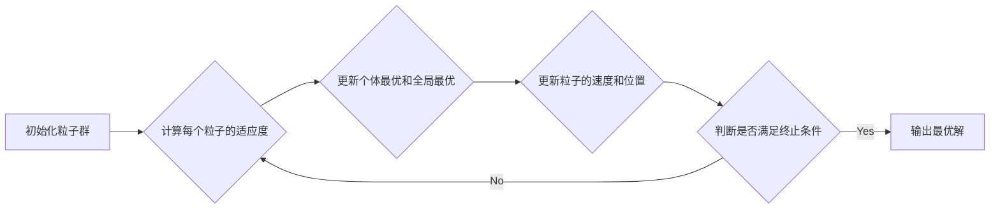

# 用粒子群算法求解非线性方程组

作者：禅与计算机程序设计艺术

## 1. 背景介绍

### 1.1 非线性方程组的求解难题

非线性方程组在科学研究和工程应用中普遍存在，例如流体力学、结构力学、化学反应动力学等领域。与线性方程组不同，非线性方程组的求解往往更加困难，主要体现在以下几个方面：

* **解的存在性与唯一性难以确定**: 非线性方程组的解可能不存在，也可能存在多个解，而确定解的存在性和唯一性往往需要复杂的数学理论和计算方法。
* **求解过程复杂**:  传统的解析方法难以求解大多数非线性方程组，需要借助数值方法进行迭代求解。然而，非线性方程组的求解过程往往是非凸的，容易陷入局部最优解。
* **计算成本高**: 非线性方程组的数值求解方法通常需要进行大量的迭代计算，计算成本较高，尤其是在高维情况下。

### 1.2 粒子群算法的优势

粒子群算法 (Particle Swarm Optimization, PSO) 是一种基于群体智能的优化算法，具有以下优点：

* **概念简单**: 粒子群算法的原理简单易懂，易于实现。
* **参数较少**: 粒子群算法的参数较少，易于调整。
* **全局搜索能力强**: 粒子群算法具有较强的全局搜索能力，能够有效地跳出局部最优解，找到全局最优解。
* **并行性好**: 粒子群算法易于并行化，可以利用多核处理器或集群进行加速计算。

### 1.3  应用领域

粒子群算法在非线性方程组求解中具有广泛的应用，例如：

* **科学研究**:  求解物理、化学、生物等领域的非线性方程组，例如流体力学中的Navier-Stokes方程、化学反应动力学中的速率方程等。
* **工程应用**: 求解工程设计中的非线性方程组，例如结构力学中的有限元分析、控制理论中的非线性系统控制等。
* **金融领域**: 求解金融模型中的非线性方程组，例如期权定价模型、风险管理模型等。

## 2. 核心概念与联系

### 2.1 粒子群算法

粒子群算法模拟鸟群或鱼群的觅食行为，将每个粒子看作是搜索空间中的一个候选解，通过粒子间的相互协作和信息共享，不断更新粒子的位置和速度，最终找到问题的最优解。

### 2.2 核心概念

* **粒子**:  搜索空间中的一个候选解，由位置和速度两个向量表示。
* **速度**: 粒子在搜索空间中的移动速度，决定了粒子的搜索方向和步长。
* **适应度**:  用于评价粒子优劣的指标，通常是目标函数的值。
* **个体最优**:  粒子自身搜索到的最优解。
* **全局最优**:  整个粒子群搜索到的最优解。
* **惯性权重**:  控制粒子速度更新过程中历史速度的影响程度。
* **学习因子**:  控制粒子向个体最优和全局最优学习的程度。

### 2.3 联系

粒子群算法通过迭代更新粒子的位置和速度，使得粒子不断向个体最优和全局最优靠近，最终找到问题的最优解。

## 3. 核心算法原理具体操作步骤

### 3.1 算法流程图



### 3.2 具体操作步骤

1. **初始化粒子群**:  随机生成一组粒子，每个粒子包含位置和速度两个向量。
2. **计算每个粒子的适应度**:  将每个粒子的位置代入目标函数，计算其适应度值。
3. **更新个体最优和全局最优**:  比较每个粒子的适应度值与其个体最优解的适应度值，如果当前解更优，则更新个体最优解；比较所有粒子的个体最优解，找到全局最优解。
4. **更新粒子的速度和位置**:  根据以下公式更新粒子的速度和位置：

$$
\begin{aligned}
v_i(t+1) &= w v_i(t) + c_1 r_1 (pbest_i - x_i(t)) + c_2 r_2 (gbest - x_i(t)) \\
x_i(t+1) &= x_i(t) + v_i(t+1)
\end{aligned}
$$

其中：

* $v_i(t)$ 表示粒子 $i$ 在 $t$ 时刻的速度。
* $x_i(t)$ 表示粒子 $i$ 在 $t$ 时刻的位置。
* $w$ 表示惯性权重。
* $c_1$ 和 $c_2$ 表示学习因子。
* $r_1$ 和 $r_2$ 表示[0, 1]之间的随机数。
* $pbest_i$ 表示粒子 $i$ 的个体最优解。
* $gbest$ 表示全局最优解。

5. **判断是否满足终止条件**:  判断是否达到最大迭代次数或目标函数值满足精度要求，如果满足则终止迭代，否则继续执行步骤2-4。
6. **输出最优解**:  输出全局最优解作为问题的解。

## 4. 数学模型和公式详细讲解举例说明

### 4.1 非线性方程组的数学模型

非线性方程组可以表示为以下形式：

$$
\begin{aligned}
f_1(x_1, x_2, ..., x_n) &= 0 \\
f_2(x_1, x_2, ..., x_n) &= 0 \\
&... \\
f_m(x_1, x_2, ..., x_n) &= 0
\end{aligned}
$$

其中：

* $f_i(x_1, x_2, ..., x_n)$ 表示第 $i$ 个非线性方程。
* $x_1, x_2, ..., x_n$ 表示 $n$ 个未知数。

### 4.2 粒子群算法求解非线性方程组的数学模型

粒子群算法求解非线性方程组时，通常将目标函数定义为所有方程的平方和：

$$
F(x_1, x_2, ..., x_n) = \sum_{i=1}^m f_i^2(x_1, x_2, ..., x_n)
$$

目标函数的值越小，说明方程组的解越接近真实解。

### 4.3 举例说明

例如，求解以下非线性方程组：

$$
\begin{aligned}
x_1^2 + x_2^2 - 1 &= 0 \\
x_1 - x_2 &= 0
\end{aligned}
$$

可以使用粒子群算法进行求解，目标函数为：

$$
F(x_1, x_2) = (x_1^2 + x_2^2 - 1)^2 + (x_1 - x_2)^2
$$

## 5. 项目实践：代码实例和详细解释说明

### 5.1 Python代码实例

```python
import numpy as np

# 定义目标函数
def objective_function(x):
    return (x[0]**2 + x[1]**2 - 1)**2 + (x[0] - x[1])**2

# 定义粒子群算法
class ParticleSwarmOptimization:
    def __init__(self, n_particles, dimensions, w, c1, c2, max_iter):
        self.n_particles = n_particles
        self.dimensions = dimensions
        self.w = w
        self.c1 = c1
        self.c2 = c2
        self.max_iter = max_iter
        self.particles = np.random.rand(n_particles, dimensions) * 2 - 1
        self.velocities = np.zeros((n_particles, dimensions))
        self.pbest = self.particles.copy()
        self.gbest = self.particles[np.argmin(objective_function(self.particles))]

    def optimize(self):
        for i in range(self.max_iter):
            # 计算每个粒子的适应度
            fitness = objective_function(self.particles)

            # 更新个体最优和全局最优
            self.pbest[fitness < objective_function(self.pbest)] = self.particles[fitness < objective_function(self.pbest)]
            self.gbest = self.pbest[np.argmin(objective_function(self.pbest))]

            # 更新粒子的速度和位置
            r1 = np.random.rand(self.n_particles, self.dimensions)
            r2 = np.random.rand(self.n_particles, self.dimensions)
            self.velocities = self.w * self.velocities + self.c1 * r1 * (self.pbest - self.particles) + self.c2 * r2 * (self.gbest - self.particles)
            self.particles = self.particles + self.velocities

        return self.gbest

# 设置参数
n_particles = 50
dimensions = 2
w = 0.5
c1 = 1.5
c2 = 1.5
max_iter = 100

# 创建粒子群算法对象
pso = ParticleSwarmOptimization(n_particles, dimensions, w, c1, c2, max_iter)

# 运行优化算法
best_solution = pso.optimize()

# 输出最优解
print("最优解:", best_solution)
print("目标函数值:", objective_function(best_solution))
```

### 5.2 代码解释

* `objective_function(x)`: 定义目标函数，输入为一个包含两个元素的数组 `x`，表示方程组的解，输出为目标函数的值。
* `ParticleSwarmOptimization` 类: 定义粒子群算法，包括初始化粒子群、更新粒子速度和位置、更新个体最优和全局最优等方法。
* `optimize()` 方法: 执行粒子群算法，迭代更新粒子群，直到满足终止条件，返回全局最优解。

## 6. 实际应用场景

### 6.1  机器人路径规划

在机器人路径规划中，可以使用粒子群算法求解非线性方程组，找到机器人从起点到终点的最优路径。

### 6.2  图像处理

在图像处理中，可以使用粒子群算法求解非线性方程组，进行图像分割、特征提取等操作。

### 6.3  机器学习

在机器学习中，可以使用粒子群算法求解非线性方程组，优化模型参数，提高模型的预测精度。


## 7. 工具和资源推荐

### 7.1 Python库

* **PySwarms**:  一个用于粒子群优化的Python库，提供了多种粒子群算法的实现，以及可视化工具。
* **SciPy**:  一个用于科学计算的Python库，提供了优化算法模块，包括粒子群算法。

### 7.2  在线资源

* **粒子群算法维基百科**:  https://en.wikipedia.org/wiki/Particle_swarm_optimization
* **粒子群算法教程**:  https://www.tutorialspoint.com/genetic_algorithms/particle_swarm_optimization_algorithm.htm


## 8. 总结：未来发展趋势与挑战

### 8.1 未来发展趋势

* **多目标优化**:  将粒子群算法应用于多目标优化问题，例如同时优化多个目标函数。
* **约束优化**:  将粒子群算法应用于约束优化问题，例如在满足约束条件的情况下找到最优解。
* **与其他算法的结合**:  将粒子群算法与其他优化算法结合，例如遗传算法、模拟退火算法等，提高算法的性能。

### 8.2  挑战

* **参数调整**:  粒子群算法的参数对算法的性能影响较大，需要根据具体问题进行调整。
* **局部最优**:  粒子群算法容易陷入局部最优解，需要采取措施跳出局部最优解，找到全局最优解。
* **计算成本**:  粒子群算法的计算成本较高，需要采取措施提高算法的效率。


## 9. 附录：常见问题与解答

### 9.1  如何选择粒子群算法的参数？

粒子群算法的参数包括惯性权重、学习因子、粒子数量、最大迭代次数等。参数的选择需要根据具体问题进行调整，可以通过实验或经验法则进行选择。

### 9.2  如何避免粒子群算法陷入局部最优？

为了避免粒子群算法陷入局部最优，可以采取以下措施：

* **增加粒子数量**:  增加粒子数量可以提高算法的搜索能力，降低陷入局部最优的概率。
* **调整惯性权重**:  降低惯性权重可以提高算法的探索能力，增加跳出局部最优的概率。
* **引入随机扰动**:  在粒子速度更新过程中引入随机扰动，可以增加算法的探索能力，跳出局部最优。

### 9.3  如何提高粒子群算法的效率？

为了提高粒子群算法的效率，可以采取以下措施：

* **并行计算**:  利用多核处理器或集群进行并行计算，可以加速算法的执行速度。
* **使用高效的数据结构**:  使用高效的数据结构，例如numpy数组，可以提高算法的计算效率。
* **简化目标函数**:  简化目标函数可以降低计算成本，提高算法的效率。
