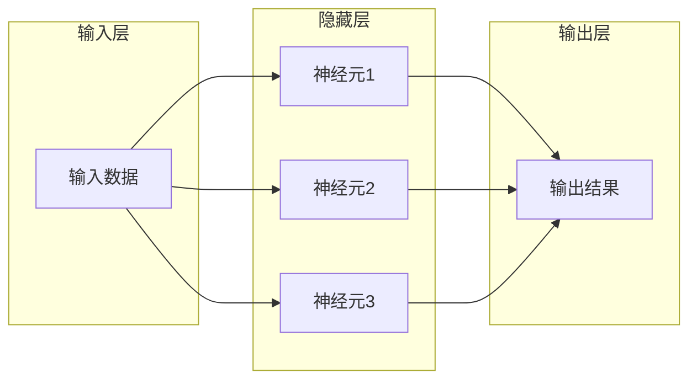

## 1. 背景介绍

### 1.1 人工智能的崛起

近年来，人工智能（AI）已经成为科技领域最热门的话题之一。从自动驾驶汽车到智能家居助手，AI 正在改变我们的生活方式，并为各行各业带来革命性的变化。而神经网络，作为 AI 的核心技术之一，扮演着至关重要的角色。

### 1.2 神经网络的灵感来源

神经网络的设计灵感来自于生物神经系统，特别是人脑的工作机制。人脑由数十亿个神经元组成，这些神经元通过突触相互连接，形成复杂的信息处理网络。神经网络试图模拟这种结构和功能，通过构建人工神经元和连接，来实现类似于人脑的学习和推理能力。

### 1.3 神经网络的发展历程

神经网络的研究可以追溯到 20 世纪 40 年代，但直到近年来才取得了突破性的进展。这主要得益于以下几个因素：

* **计算能力的提升:** 计算机硬件的快速发展为训练大型神经网络提供了必要的计算能力。
* **大数据的出现:** 海量数据的积累为神经网络的训练提供了充足的素材。
* **算法的改进:** 研究人员不断改进神经网络的算法，使其更加高效和准确。

## 2. 核心概念与联系

### 2.1 人工神经元

人工神经元是神经网络的基本单元，它模拟生物神经元的结构和功能。一个典型的人工神经元包括以下几个部分：

* **输入:** 接收来自其他神经元的信号。
* **权重:** 每个输入信号都与一个权重相关联，表示该信号对神经元输出的影响程度。
* **激活函数:** 对输入信号进行非线性变换，以引入非线性因素，增强神经网络的表达能力。
* **输出:** 神经元的输出信号，可以传递给其他神经元。

### 2.2 神经网络结构

神经网络由多个神经元相互连接组成，形成层级结构。一个典型的神经网络结构包括以下几层：

* **输入层:** 接收外部输入信号。
* **隐藏层:** 对输入信号进行处理和转换。
* **输出层:** 输出最终的结果。

### 2.3 核心概念之间的联系

人工神经元、神经网络结构、权重、激活函数等概念相互关联，共同构成了神经网络的运作机制。输入信号通过神经元之间的连接传递，权重决定了信号的影响程度，激活函数引入非线性因素，最终输出层产生预测结果。

## 3. 核心算法原理具体操作步骤

### 3.1 前向传播

前向传播是指信号从输入层传递到输出层的过程。在这个过程中，每个神经元都会根据其输入信号、权重和激活函数计算出一个输出信号，并将该信号传递给下一层的神经元。

### 3.2 反向传播

反向传播是指根据神经网络的输出误差，调整神经元权重的过程。这个过程利用梯度下降算法，通过计算误差对权重的偏导数，来更新权重，使得神经网络的输出更加接近真实值。

### 3.3 具体操作步骤

1. 初始化神经网络的权重。
2. 将输入数据输入到神经网络的输入层。
3. 通过前向传播计算神经网络的输出。
4. 计算神经网络输出与真实值之间的误差。
5. 通过反向传播调整神经网络的权重。
6. 重复步骤 2-5，直到神经网络的误差达到预设的阈值。

## 4. 数学模型和公式详细讲解举例说明

### 4.1 线性模型

最简单的  神经网络模型是线性模型，它假设神经元的输出是其输入的线性组合。例如，对于一个具有两个输入的神经元，其输出可以表示为：

$$
y = w_1 x_1 + w_2 x_2 + b
$$

其中，$y$ 是神经元的输出，$x_1$ 和 $x_2$ 是神经元的输入，$w_1$ 和 $w_2$ 是权重，$b$ 是偏置项。

### 4.2 非线性激活函数

线性模型的表达能力有限，为了增强神经网络的表达能力，需要引入非线性激活函数。常见的非线性激活函数包括：

* **Sigmoid 函数:** 
$$
\sigma(x) = \frac{1}{1 + e^{-x}}
$$

* **ReLU 函数:** 
$$
ReLU(x) = max(0, x)
$$

### 4.3 损失函数

损失函数用于衡量神经网络输出与真实值之间的差距。常见的损失函数包括：

* **均方误差 (MSE):** 
$$
MSE = \frac{1}{n} \sum_{i=1}^{n} (y_i - \hat{y}_i)^2
$$

* **交叉熵损失:** 
$$
Cross Entropy = -\sum_{i=1}^{n} y_i log(\hat{y}_i)
$$

### 4.4 梯度下降算法

梯度下降算法用于更新神经网络的权重，以最小化损失函数。梯度下降算法的基本思想是沿着损失函数的负梯度方向更新权重。

### 4.5 举例说明

假设我们要训练一个神经网络来识别 handwritten digits。我们可以使用 MNIST 数据集，该数据集包含 60,000 张训练图片和 10,000 张测试图片。每张图片都是一个 28x28 像素的灰度图像，代表一个 handwritten digit (0-9)。

我们可以构建一个具有以下结构的神经网络：

* 输入层: 784 个神经元 (28x28 像素)。
* 隐藏层: 128 个神经元。
* 输出层: 10 个神经元 (代表 10 个 digits)。

我们可以使用 ReLU 作为激活函数，使用 MSE 作为损失函数，使用梯度下降算法来训练神经网络。

## 5. 项目实践：代码实例和详细解释说明

### 5.1 使用 TensorFlow 构建神经网络

```python
import tensorflow as tf

# 定义模型
model = tf.keras.models.Sequential([
  tf.keras.layers.Flatten(input_shape=(28, 28)),
  tf.keras.layers.Dense(128, activation='relu'),
  tf.keras.layers.Dense(10)
])

# 编译模型
model.compile(optimizer='adam',
              loss=tf.keras.losses.SparseCategoricalCrossentropy(from_logits=True),
              metrics=['accuracy'])

# 加载 MNIST 数据集
(x_train, y_train), (x_test, y_test) = tf.keras.datasets.mnist.load_data()

# 训练模型
model.fit(x_train, y_train, epochs=10)

# 评估模型
test_loss, test_acc = model.evaluate(x_test,  y_test, verbose=2)
print('\nTest accuracy:', test_acc)
```

### 5.2 代码解释

* `tf.keras.models.Sequential` 用于创建一个顺序模型，该模型由一系列层组成。
* `tf.keras.layers.Flatten` 将 28x28 的输入图像转换为 784 维的向量。
* `tf.keras.layers.Dense` 创建一个全连接层，其中每个神经元都与前一层的所有神经元相连。
* `activation='relu'` 指定使用 ReLU 作为激活函数。
* `optimizer='adam'` 指定使用 Adam 优化器来训练模型。
* `loss=tf.keras.losses.SparseCategoricalCrossentropy(from_logits=True)` 指定使用交叉熵损失函数。
* `metrics=['accuracy']` 指定使用准确率作为评估指标。
* `model.fit` 用于训练模型，`epochs=10` 指定训练 10 个 epochs。
* `model.evaluate` 用于评估模型。

## 6. 实际应用场景

### 6.1 图像识别

神经网络在图像识别领域取得了巨大成功，例如：

* **人脸识别:** 用于身份验证、安全监控等。
* **物体检测:** 用于自动驾驶、机器人视觉等。
* **医学影像分析:** 用于疾病诊断、治疗方案制定等。

### 6.2 自然语言处理

神经网络也被广泛应用于自然语言处理领域，例如：

* **机器翻译:** 将一种语言翻译成另一种语言。
* **情感分析:** 分析文本的情感倾向。
* **文本摘要:** 提取文本的主要内容。

### 6.3 其他应用场景

除了图像识别和自然语言处理，神经网络还被应用于许多其他领域，例如：

* **金融预测:** 预测股票价格、汇率等。
* **推荐系统:** 推荐商品、电影等。
* **游戏 AI:** 控制游戏角色的行为。

## 7. 工具和资源推荐

### 7.1 TensorFlow

TensorFlow 是 Google 开发的开源机器学习框架，它提供了丰富的 API 用于构建和训练神经网络。

### 7.2 PyTorch

PyTorch 是 Facebook 开发的开源机器学习框架，它以其灵活性和易用性而闻名。

### 7.3 Keras

Keras 是一个高级神经网络 API，它可以运行在 TensorFlow 或 Theano 之上，提供了一种更加用户友好的方式来构建神经网络。

### 7.4 scikit-learn

scikit-learn 是一个 Python 机器学习库，它提供了各种机器学习算法，包括神经网络。

## 8. 总结：未来发展趋势与挑战

### 8.1 未来发展趋势

* **更深、更复杂的神经网络:** 研究人员正在探索更深、更复杂的神经网络架构，以提高模型的性能。
* **新的学习算法:** 研究人员正在开发新的学习算法，以提高训练效率和模型泛化能力。
* **神经网络的解释性:** 研究人员正在努力提高神经网络的可解释性，以便更好地理解模型的决策过程。

### 8.2 面临的挑战

* **数据需求:** 训练大型神经网络需要大量的标注数据，而数据的获取和标注成本高昂。
* **计算资源:** 训练大型神经网络需要大量的计算资源，这限制了其应用范围。
* **伦理问题:** 神经网络的应用引发了一些伦理问题，例如隐私、歧视等。

## 9. 附录：常见问题与解答

### 9.1 什么是神经网络？

神经网络是一种模拟生物神经系统结构和功能的计算模型。它由多个 interconnected processing units (neurons) 组成，这些 neurons 通过 weighted connections 相互连接。

### 9.2 神经网络如何工作？

神经网络通过学习输入数据和输出数据之间的关系来进行预测。它通过调整 neurons 之间的 weights 来最小化预测误差。

### 9.3 神经网络的应用有哪些？

神经网络被广泛应用于图像识别、自然语言处理、金融预测、推荐系统等领域。

### 9.4 如何构建神经网络？

可以使用 TensorFlow、PyTorch、Keras 等机器学习框架来构建神经网络。

### 9.5 神经网络的未来发展趋势是什么？

神经网络的未来发展趋势包括更深、更复杂的神经网络架构、新的学习算法以及神经网络的可解释性。


## 10. 神经网络核心概念原理和架构 Mermaid流程图



**图例:**

* **输入层:** 接收外部输入数据。
* **隐藏层:** 对输入数据进行处理和转换。
* **输出层:** 输出最终的结果。
* **箭头:** 表示数据流向。
