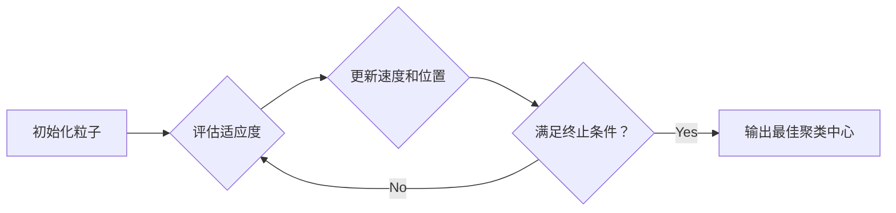

## 1. 背景介绍

### 1.1 数据聚类的重要性

在当今信息爆炸的时代，海量数据的处理和分析成为各个领域的关键。数据聚类作为一种无监督学习方法，旨在将数据集划分为不同的组，使得组内数据尽可能相似，而组间数据尽可能不同。它在许多领域都有着广泛的应用，例如：

* **客户细分**: 根据客户的购买行为、人口统计信息等将客户划分为不同的群体，以便进行精准营销。
* **图像分割**: 将图像中的像素根据颜色、纹理等特征进行分组，以便识别不同的物体。
* **异常检测**: 识别数据集中与其他数据显著不同的异常点，例如金融欺诈、网络入侵等。

### 1.2 传统聚类算法的局限性

传统的聚类算法，例如 K-means 算法，通常需要预先指定聚类数量，并且容易陷入局部最优解。此外，这些算法对数据的分布和噪声比较敏感，在处理复杂数据集时效果不佳。

### 1.3 粒子群算法的优势

粒子群算法 (Particle Swarm Optimization, PSO) 是一种基于群体智能的优化算法，其灵感来源于鸟群或鱼群的觅食行为。PSO 算法具有以下优势：

* **不需要预先指定聚类数量**: PSO 算法可以根据数据的特征自动确定最佳聚类数量。
* **全局搜索能力**: PSO 算法能够有效地探索搜索空间，避免陷入局部最优解。
* **对数据分布和噪声不敏感**: PSO 算法对数据的分布和噪声具有较强的鲁棒性。

## 2. 核心概念与联系

### 2.1 粒子群算法

PSO 算法模拟了鸟群或鱼群的觅食行为，其中每个粒子代表搜索空间中的一个潜在解。每个粒子都具有位置和速度两个属性，并根据自身的经验和群体最佳经验不断更新自己的位置。

### 2.2 数据聚类

数据聚类是将数据集划分为不同的组，使得组内数据尽可能相似，而组间数据尽可能不同的过程。聚类算法的目标是找到最佳的聚类中心，使得所有数据点到其所属聚类中心的距离之和最小。

### 2.3 粒子群算法与数据聚类的联系

PSO 算法可以用于解决数据聚类问题。通过将每个粒子的位置视为聚类中心，PSO 算法可以搜索最佳的聚类中心，从而实现数据聚类。

## 3. 核心算法原理具体操作步骤

### 3.1 初始化

* 随机初始化一群粒子，每个粒子代表一个潜在的聚类中心。
* 设置粒子的初始位置和速度。

### 3.2 评估适应度

* 对于每个粒子，计算其所代表的聚类中心的适应度值。
* 适应度函数可以是所有数据点到其所属聚类中心的距离之和，也可以是其他衡量聚类质量的指标。

### 3.3 更新速度和位置

* 每个粒子根据自身的经验和群体最佳经验更新自己的速度和位置。
* 速度更新公式: 
  $$ v_{i,d} = w \cdot v_{i,d} + c_1 \cdot rand() \cdot (pbest_{i,d} - x_{i,d}) + c_2 \cdot rand() \cdot (gbest_d - x_{i,d}) $$
  其中:
    * $v_{i,d}$ 是粒子 $i$ 在维度 $d$ 上的速度。
    * $w$ 是惯性权重，用于平衡全局搜索和局部搜索能力。
    * $c_1$ 和 $c_2$ 是学习因子，用于控制粒子向自身最佳位置和群体最佳位置学习的程度。
    * $rand()$ 是一个随机数，取值范围为 $[0, 1]$。
    * $pbest_{i,d}$ 是粒子 $i$ 在维度 $d$ 上的历史最佳位置。
    * $gbest_d$ 是所有粒子在维度 $d$ 上的历史最佳位置。
    * $x_{i,d}$ 是粒子 $i$ 在维度 $d$ 上的当前位置。
* 位置更新公式: 
  $$ x_{i,d} = x_{i,d} + v_{i,d} $$

### 3.4 重复步骤 2 和 3

* 重复步骤 2 和 3，直到满足终止条件。
* 终止条件可以是最大迭代次数、最小适应度值变化等。

## 4. 数学模型和公式详细讲解举例说明

### 4.1 适应度函数

适应度函数用于衡量聚类质量。常用的适应度函数包括：

* **平方误差和 (Sum of Squared Errors, SSE)**: 
  $$ SSE = \sum_{i=1}^{n} \sum_{j=1}^{k} ||x_i - c_j||^2 $$
  其中:
    * $n$ 是数据点的数量。
    * $k$ 是聚类的数量。
    * $x_i$ 是第 $i$ 个数据点。
    * $c_j$ 是第 $j$ 个聚类中心。
* **Davies-Bouldin 指数**: 
  $$ DB = \frac{1}{k} \sum_{i=1}^{k} \max_{j \neq i} \left( \frac{\sigma_i + \sigma_j}{||c_i - c_j||} \right) $$
  其中:
    * $\sigma_i$ 是第 $i$ 个聚类的平均距离。

### 4.2 举例说明

假设我们有一个包含 100 个二维数据点的数据集，我们想要使用 PSO 算法将这些数据点聚类成 3 类。

* 初始化 3 个粒子，每个粒子代表一个潜在的聚类中心。
* 随机初始化粒子的位置和速度。
* 使用 SSE 作为适应度函数。
* 迭代更新粒子的速度和位置，直到满足终止条件。

## 5. 项目实践：代码实例和详细解释说明

### 5.1 Python 代码实例

```python
import numpy as np

class Particle:
    def __init__(self, n_clusters, dimensions):
        self.position = np.random.rand(n_clusters, dimensions)
        self.velocity = np.zeros((n_clusters, dimensions))
        self.pbest_position = self.position
        self.pbest_fitness = float('inf')

class PSO:
    def __init__(self, n_particles, n_clusters, dimensions, w, c1, c2, max_iter):
        self.n_particles = n_particles
        self.n_clusters = n_clusters
        self.dimensions = dimensions
        self.w = w
        self.c1 = c1
        self.c2 = c2
        self.max_iter = max_iter
        self.particles = [Particle(n_clusters, dimensions) for _ in range(n_particles)]
        self.gbest_position = None
        self.gbest_fitness = float('inf')

    def fit(self, X):
        for _ in range(self.max_iter):
            for particle in self.particles:
                fitness = self.calculate_fitness(particle.position, X)
                if fitness < particle.pbest_fitness:
                    particle.pbest_position = particle.position
                    particle.pbest_fitness = fitness
                if fitness < self.gbest_fitness:
                    self.gbest_position = particle.position
                    self.gbest_fitness = fitness
            for particle in self.particles:
                r1 = np.random.rand(self.n_clusters, self.dimensions)
                r2 = np.random.rand(self.n_clusters, self.dimensions)
                particle.velocity = self.w * particle.velocity + self.c1 * r1 * (particle.pbest_position - particle.position) + self.c2 * r2 * (self.gbest_position - particle.position)
                particle.position = particle.position + particle.velocity

    def calculate_fitness(self, centers, X):
        distances = np.linalg.norm(X[:, np.newaxis, :] - centers, axis=2)
        labels = np.argmin(distances, axis=1)
        sse = np.sum((X - centers[labels]) ** 2)
        return sse

# 示例用法
X = np.random.rand(100, 2)
pso = PSO(n_particles=10, n_clusters=3, dimensions=2, w=0.5, c1=0.5, c2=0.5, max_iter=100)
pso.fit(X)
centers = pso.gbest_position
labels = np.argmin(np.linalg.norm(X[:, np.newaxis, :] - centers, axis=2), axis=1)
```

### 5.2 代码解释

* `Particle` 类表示 PSO 算法中的一个粒子，包含位置、速度、历史最佳位置和适应度值等属性。
* `PSO` 类表示 PSO 算法，包含粒子群、惯性权重、学习因子、最大迭代次数等属性。
* `fit()` 方法用于训练 PSO 算法，迭代更新粒子的速度和位置，直到满足终止条件。
* `calculate_fitness()` 方法用于计算给定聚类中心的适应度值，使用 SSE 作为适应度函数。
* 示例用法中，首先创建了一个包含 100 个二维数据点的数据集 `X`。
* 然后创建了一个 `PSO` 对象，设置了粒子数量、聚类数量、维度、惯性权重、学习因子和最大迭代次数等参数。
* 调用 `fit()` 方法训练 PSO 算法，得到最佳的聚类中心 `centers`。
* 最后，根据最佳聚类中心对数据点进行分类，得到每个数据点所属的类别标签 `labels`。

## 6. 实际应用场景

### 6.1 图像分割

PSO 算法可以用于图像分割，将图像中的像素根据颜色、纹理等特征进行分组，以便识别不同的物体。

### 6.2 异常检测

PSO 算法可以用于异常检测，识别数据集中与其他数据显著不同的异常点，例如金融欺诈、网络入侵等。

### 6.3 社交网络分析

PSO 算法可以用于社交网络分析，将社交网络中的用户根据其关系和行为进行分组，以便识别不同的社群结构。

## 7. 工具和资源推荐

### 7.1 Python 库

* **PySwarms**: 一个用于粒子群优化的 Python 库，提供了多种 PSO 算法的实现。

### 7.2 在线资源

* **Towards Data Science**: 一个数据科学博客平台，包含许多关于 PSO 算法和数据聚类的文章。

## 8. 总结：未来发展趋势与挑战

### 8.1 未来发展趋势

* **多目标优化**: 将 PSO 算法扩展到多目标优化问题，例如同时优化聚类质量和聚类数量。
* **并行计算**: 利用并行计算技术加速 PSO 算法的执行速度。
* **深度学习**: 将 PSO 算法与深度学习技术相结合，例如使用 PSO 算法优化深度神经网络的结构和参数。

### 8.2 挑战

* **参数调整**: PSO 算法的性能对参数设置比较敏感，需要进行仔细的调整才能获得最佳效果。
* **高维数据**: PSO 算法在处理高维数据时效率较低，需要开发更高效的算法。

## 9. 附录：常见问题与解答

### 9.1 PSO 算法如何避免陷入局部最优解？

PSO 算法通过引入群体最佳经验来避免陷入局部最优解。每个粒子都会参考群体最佳经验来更新自己的位置，从而跳出局部最优解。

### 9.2 如何选择 PSO 算法的参数？

PSO 算法的参数包括惯性权重、学习因子、最大迭代次数等。参数的选择取决于具体的问题和数据集。通常情况下，可以通过交叉验证等方法来选择最佳参数。

### 9.3 PSO 算法与 K-means 算法有什么区别？

PSO 算法是一种基于群体智能的优化算法，而 K-means 算法是一种基于距离的聚类算法。PSO 算法不需要预先指定聚类数量，并且能够有效地探索搜索空间，避免陷入局部最优解。


## 10. 核心概念原理和架构的 Mermaid流程图

