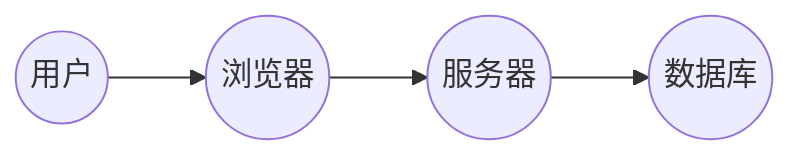

## 1. 背景介绍

### 1.1 考试系统的演变

传统的考试方式以纸笔为主，存在着诸多弊端，例如：

* **效率低下:** 试卷印刷、分发、批改耗费大量人力物力。
* **安全性不足:**  试卷容易丢失、泄露，难以保证考试公平公正。
* **数据统计困难:**  人工统计分数耗时费力，难以进行数据分析。

随着计算机技术的飞速发展，网上考试系统应运而生。它利用计算机网络技术，实现了考试的自动化、智能化，有效解决了传统考试方式的弊端。

### 1.2 网上考试系统的优势

相比传统考试方式，网上考试系统具有以下优势:

* **高效便捷:**  考生可随时随地进行考试，系统自动阅卷评分，大大提高了考试效率。
* **安全可靠:**  系统采用加密技术，保障试题和考生信息的安全性。
* **数据统计分析:**  系统自动记录考试数据，方便进行数据分析，为教学评估提供依据。
* **降低成本:**  减少了纸张、印刷等成本，节约资源。

### 1.3 网上考试系统的应用

网上考试系统已广泛应用于:

* **教育行业:**  学校、培训机构等进行入学考试、期中期末考试、资格认证考试等。
* **企事业单位:**  企业内部进行员工培训、考核、招聘等。
* **政府部门:**  公务员考试、职业资格考试等。

## 2. 核心概念与联系

### 2.1 用户角色

网上考试系统涉及到多种用户角色，主要包括:

* **管理员:**  负责系统管理、用户管理、试题管理、考试管理等。
* **教师:**  负责创建考试、发布试题、批改试卷等。
* **学生:**  参加考试、查看成绩等。

### 2.2 功能模块

网上考试系统通常包含以下功能模块:

* **用户管理:**  包括用户注册、登录、权限管理等。
* **试题管理:**  包括试题录入、编辑、分类、管理等。
* **考试管理:**  包括创建考试、设置考试时间、发布试题、阅卷评分等。
* **成绩管理:**  包括成绩查询、统计分析、导出等。
* **系统设置:**  包括系统参数设置、安全设置等。

### 2.3  系统架构

网上考试系统通常采用 B/S 架构，即浏览器/服务器架构。用户通过浏览器访问系统，服务器负责处理用户请求，并将结果返回给浏览器。



## 3. 核心算法原理具体操作步骤

### 3.1 试题随机抽取算法

为了保证考试的公平性，系统需要从题库中随机抽取试题组成试卷。常用的试题随机抽取算法包括:

* **简单随机抽样:**  从题库中随机抽取指定数量的试题。
* **分层抽样:**  将题库按照难度、知识点等进行分层，然后从每一层中随机抽取试题。

### 3.2 自动阅卷算法

系统需要根据预先设定的评分标准，对考生的答案进行自动评分。常用的自动阅卷算法包括:

* **关键词匹配:**  将考生的答案与标准答案中的关键词进行匹配，根据匹配程度进行评分。
* **语义分析:**  对考生的答案进行语义分析，判断答案的正确性。

### 3.3 成绩统计分析算法

系统需要对考试数据进行统计分析，例如:

* **平均分:**  计算所有考生得分的平均值。
* **及格率:**  计算及格考生人数占总考生人数的比例。
* **分数段分布:**  统计各个分数段的人数分布情况。

## 4. 数学模型和公式详细讲解举例说明

### 4.1  IRT 模型 (Item Response Theory)

IRT 模型是一种用于评估试题质量和考生能力的数学模型。它假设每个试题都有一个难度参数，每个考生都有一个能力参数，考生的答题情况取决于试题难度和考生能力之间的关系。

IRT 模型的公式如下:

$$
P(X_{ij} = 1|\theta_j, b_i) = \frac{e^{a_i(\theta_j - b_i)}}{1 + e^{a_i(\theta_j - b_i)}}
$$

其中:

*  $P(X_{ij} = 1|\theta_j, b_i)$ 表示考生 $j$ 答对试题 $i$ 的概率。
* $\theta_j$ 表示考生 $j$ 的能力参数。
* $b_i$ 表示试题 $i$ 的难度参数。
* $a_i$ 表示试题 $i$ 的区分度参数。

### 4.2  举例说明

假设有两个试题，难度参数分别为 -1 和 1，区分度参数都为 1。有两个考生，能力参数分别为 0 和 2。根据 IRT 模型，可以计算出每个考生答对每个试题的概率:

| 考生 | 能力参数 | 试题 | 难度参数 | 答对概率 |
|---|---|---|---|---|
| 考生 1 | 0 | 试题 1 | -1 | 0.731 |
| 考生 1 | 0 | 试题 2 | 1 | 0.269 |
| 考生 2 | 2 | 试题 1 | -1 | 0.982 |
| 考生 2 | 2 | 试题 2 | 1 | 0.731 |

## 5. 项目实践：代码实例和详细解释说明

### 5.1  技术选型

* **后端:**  Python + Django
* **前端:**  HTML + CSS + JavaScript
* **数据库:**  MySQL

### 5.2  代码实例

#### 5.2.1  用户模型

```python
from django.db import models
from django.contrib.auth.models import AbstractUser

class User(AbstractUser):
    # 用户类型
    USER_TYPE_CHOICES = (
        ('student', '学生'),
        ('teacher', '教师'),
        ('admin', '管理员'),
    )
    user_type = models.CharField(max_length=10, choices=USER_TYPE_CHOICES, default='student')
```

#### 5.2.2  试题模型

```python
class Question(models.Model):
    # 问题内容
    content = models.TextField()
    # 选项 A
    option_A = models.CharField(max_length=255)
    # 选项 B
    option_B = models.CharField(max_length=255)
    # 选项 C
    option_C = models.CharField(max_length=255)
    # 选项 D
    option_D = models.CharField(max_length=255)
    # 正确答案
    answer = models.CharField(max_length=1)
    # 难度等级
    DIFFICULTY_CHOICES = (
        ('easy', '简单'),
        ('medium', '中等'),
        ('hard', '困难'),
    )
    difficulty = models.CharField(max_length=10, choices=DIFFICULTY_CHOICES, default='medium')
    # 知识点
    knowledge_point = models.CharField(max_length=255)
```

#### 5.2.3  考试模型

```python
class Exam(models.Model):
    # 考试名称
    name = models.CharField(max_length=255)
    # 考试时间
    start_time = models.DateTimeField()
    end_time = models.DateTimeField()
    # 考试时长
    duration = models.IntegerField()
    # 试题数量
    question_num = models.IntegerField()
    # 试题难度
    difficulty = models.CharField(max_length=10, choices=Question.DIFFICULTY_CHOICES, default='medium')
    # 知识点
    knowledge_point = models.CharField(max_length=255)
```

### 5.3  详细解释说明

* **用户模型:**  继承自 Django 的 `AbstractUser`，添加了 `user_type` 字段用于区分用户角色。
* **试题模型:**  包含试题内容、选项、正确答案、难度等级、知识点等信息。
* **考试模型:**  包含考试名称、考试时间、考试时长、试题数量、试题难度、知识点等信息。

## 6. 实际应用场景

### 6.1  教育行业

* **学生入学考试:**  用于评估学生的学习基础。
* **期中期末考试:**  用于检验学生的学习成果。
* **资格认证考试:**  用于评估学生的专业技能水平。

### 6.2  企事业单位

* **员工培训考核:**  用于评估员工的培训效果。
* **招聘考试:**  用于筛选合适的候选人。
* **晋升考试:**  用于评估员工的晋升资格。

### 6.3  政府部门

* **公务员考试:**  用于选拔优秀人才进入公务员队伍。
* **职业资格考试:**  用于评估个人的职业技能水平，颁发职业资格证书。

## 7. 工具和资源推荐

### 7.1  开发工具

* **PyCharm:**  Python 集成开发环境。
* **Visual Studio Code:**  代码编辑器。
* **Navicat:**  数据库管理工具。

### 7.2  学习资源

* **Django 官方文档:**  https://docs.djangoproject.com/
* **Python 官方文档:**  https://docs.python.org/
* **W3Schools:**  https://www.w3schools.com/

## 8. 总结：未来发展趋势与挑战

### 8.1  发展趋势

* **个性化考试:**  根据考生的学习情况，提供个性化的试题和考试方案。
* **智能化阅卷:**  利用人工智能技术，实现更加精准的自动阅卷。
* **虚拟现实技术应用:**  将虚拟现实技术应用于考试，提供更加真实的考试体验。

### 8.2  挑战

* **考试安全:**  如何保障考试系统的安全性，防止作弊行为。
* **数据隐私:**  如何保护考生数据的隐私安全。
* **技术更新:**  如何应对不断更新的技术，保持系统的先进性。

## 9. 附录：常见问题与解答

### 9.1  如何防止作弊？

* **身份验证:**  采用人脸识别、指纹识别等技术进行身份验证。
* **监控摄像头:**  使用监控摄像头实时监控考生的考试过程。
* **禁止切屏:**  限制考生在考试过程中切换屏幕或打开其他应用程序。

### 9.2  如何保护考生数据隐私？

* **数据加密:**  对考生数据进行加密存储，防止数据泄露。
* **访问控制:**  限制用户对考生数据的访问权限。
* **数据脱敏:**  对敏感数据进行脱敏处理，例如将身份证号码部分数字替换为星号。
