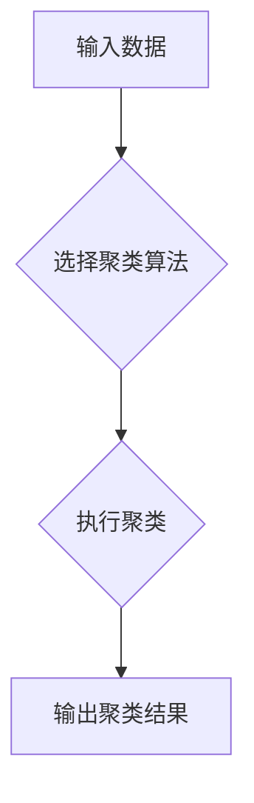

## 1. 背景介绍

### 1.1 什么是聚类？

聚类是一种无监督学习方法，它将数据集中的对象分组到称为聚类的集合中，使得同一聚类中的对象彼此相似，而不同聚类中的对象彼此不同。它是一种强大的数据分析技术，可以用于识别数据中的模式、结构和异常值。

### 1.2 聚类的应用

聚类在各个领域都有广泛的应用，包括：

* **市场营销**: 通过对客户进行细分，企业可以制定更有针对性的营销策略。
* **图像分割**: 将图像分割成不同的区域，例如前景和背景。
* **异常检测**: 识别数据中的异常值，例如信用卡欺诈。
* **生物信息学**: 对基因表达数据进行聚类，以识别不同的基因表达模式。

## 2. 核心概念与联系

### 2.1 相似性度量

聚类算法的核心是相似性度量，它用于量化两个对象之间的相似程度。常用的相似性度量包括：

* **欧几里得距离**: 两个点之间的直线距离。
* **曼哈顿距离**: 两个点之间沿坐标轴的距离之和。
* **余弦相似度**: 两个向量之间夹角的余弦值。

### 2.2 聚类准则

聚类算法的目标是找到最佳的聚类方案，这通常是通过优化某个聚类准则来实现的。常用的聚类准则包括：

* **最小化簇内距离**: 使得同一簇内对象之间的距离尽可能小。
* **最大化簇间距离**: 使得不同簇之间对象之间的距离尽可能大。

### 2.3 聚类算法分类

聚类算法可以分为以下几类：

* **划分聚类**: 将数据点划分为互斥的簇，例如 K-Means 算法。
* **层次聚类**: 构建一个树状结构，表示数据点之间的层次关系，例如凝聚层次聚类。
* **基于密度的聚类**: 根据数据点的密度进行聚类，例如 DBSCAN 算法。

## 3. 核心算法原理具体操作步骤

### 3.1 K-Means 算法

K-Means 算法是一种经典的划分聚类算法，其操作步骤如下：

1. **初始化**: 随机选择 K 个点作为初始簇中心。
2. **分配**: 将每个数据点分配到距离其最近的簇中心所在的簇。
3. **更新**: 重新计算每个簇的中心点，作为新的簇中心。
4. **重复**: 重复步骤 2 和 3，直到簇中心不再发生变化或达到最大迭代次数。

### 3.2 层次聚类

层次聚类算法构建一个树状结构，表示数据点之间的层次关系，其操作步骤如下：

1. **初始化**: 将每个数据点视为一个单独的簇。
2. **合并**: 找到距离最近的两个簇，并将它们合并成一个新的簇。
3. **重复**: 重复步骤 2，直到所有数据点都属于同一个簇。

### 3.3 DBSCAN 算法

DBSCAN 算法是一种基于密度的聚类算法，其操作步骤如下：

1. **找到核心点**: 对于每个数据点，计算其邻域内的数据点数量。如果数量大于等于指定的阈值，则该点被标记为核心点。
2. **连接核心点**: 将所有密度可达的核心点连接起来，形成一个簇。
3. **标记噪声点**: 不属于任何簇的数据点被标记为噪声点。

## 4. 数学模型和公式详细讲解举例说明

### 4.1 K-Means 算法的数学模型

K-Means 算法的目标是最小化簇内平方和 (WCSS)，其公式如下：

$$
WCSS = \sum_{k=1}^{K} \sum_{x_i \in C_k} ||x_i - \mu_k||^2
$$

其中：

* $K$ 是簇的数量。
* $C_k$ 是第 $k$ 个簇。
* $x_i$ 是属于 $C_k$ 的数据点。
* $\mu_k$ 是第 $k$ 个簇的中心点。

### 4.2 DBSCAN 算法的数学模型

DBSCAN 算法使用以下参数定义簇：

* **Eps**: 邻域半径。
* **MinPts**: 核心点的最小数据点数量。

一个数据点 $p$ 被认为是核心点，如果其 Eps 邻域内至少包含 MinPts 个数据点。

## 5. 项目实践：代码实例和详细解释说明

### 5.1 Python 代码实例

```python
import numpy as np
from sklearn.cluster import KMeans

# 生成示例数据
X = np.array([[1, 2], [1.5, 1.8], [5, 8], [8, 8], [1, 0.6], [9, 11]])

# 创建 KMeans 模型
kmeans = KMeans(n_clusters=2, random_state=0)

# 拟合模型
kmeans.fit(X)

# 获取簇标签
labels = kmeans.labels_

# 获取簇中心
centers = kmeans.cluster_centers_

# 打印结果
print("簇标签:", labels)
print("簇中心:", centers)
```

### 5.2 代码解释

* 首先，我们使用 `numpy` 库生成示例数据。
* 然后，我们使用 `sklearn.cluster` 模块中的 `KMeans` 类创建一个 KMeans 模型，并指定簇的数量 `n_clusters` 和随机种子 `random_state`。
* 接下来，我们使用 `fit` 方法将模型拟合到数据 `X`。
* 然后，我们可以使用 `labels_` 属性获取每个数据点的簇标签，并使用 `cluster_centers_` 属性获取簇中心。
* 最后，我们打印结果。

## 6. 实际应用场景

### 6.1 客户细分

在市场营销中，聚类可以用于对客户进行细分，以便企业可以制定更有针对性的营销策略。例如，一家在线零售商可以使用聚类根据客户的购买历史、浏览行为和人口统计信息对客户进行分组。

### 6.2 图像分割

在计算机视觉中，聚类可以用于将图像分割成不同的区域。例如，可以使用聚类算法将图像分割成前景和背景，或者将医学图像分割成不同的器官或组织。

### 6.3 异常检测

在数据挖掘中，聚类可以用于识别数据中的异常值。例如，可以使用聚类算法识别信用卡欺诈交易或网络入侵。

## 7. 工具和资源推荐

### 7.1 Scikit-learn

Scikit-learn 是一个流行的 Python 机器学习库，它提供了各种聚类算法的实现，包括 K-Means、层次聚类和 DBSCAN。

### 7.2 Weka

Weka 是一个开源的数据挖掘工具，它提供了各种机器学习算法的实现，包括聚类算法。

### 7.3 R

R 是一种统计编程语言，它提供了各种聚类算法的实现。

## 8. 总结：未来发展趋势与挑战

### 8.1 未来发展趋势

* **深度聚类**: 将深度学习技术应用于聚类，以提高聚类性能。
* **大规模聚类**: 开发高效的算法，用于处理大规模数据集的聚类。
* **多视图聚类**: 将来自多个数据源的信息集成到聚类过程中。

### 8.2 挑战

* **高维数据**: 聚类高维数据具有挑战性，因为数据点之间的距离在高维空间中变得 less meaningful。
* **噪声和异常值**: 噪声和异常值会影响聚类结果的质量。
* **可解释性**: 解释聚类结果并理解聚类背后的原因可能很困难。

## 9. 附录：常见问题与解答

### 9.1 如何选择最佳的聚类算法？

最佳的聚类算法取决于具体的数据集和应用场景。一些因素需要考虑，包括：

* 数据集的大小和维度。
* 数据集中的噪声和异常值的数量。
* 所需的聚类结果类型。

### 9.2 如何评估聚类结果的质量？

可以使用各种指标来评估聚类结果的质量，包括：

* **轮廓系数**: 度量数据点与其自身簇的相似程度，以及与其他簇的相似程度。
* **戴维森堡丁指数**: 度量簇内距离与簇间距离的比率。
* **Calinski-Harabasz 指数**: 度量簇间分散度与簇内分散度的比率。

### 9.3 如何处理高维数据？

可以使用降维技术来减少数据维度，例如主成分分析 (PCA) 或线性判别分析 (LDA)。

## 10. Mermaid流程图


