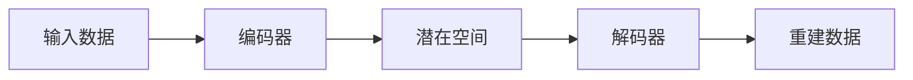

# 自编码器(Autoencoders) - 原理与代码实例讲解

作者：禅与计算机程序设计艺术

## 1. 背景介绍

### 1.1 无监督学习与特征提取

在机器学习领域，无监督学习的目标是从无标签数据中学习数据的内在结构和模式。特征提取是无监督学习的一个重要分支，旨在将原始数据转换为更低维度的表示，同时保留数据中的关键信息。自编码器 (Autoencoder) 是一种强大的特征提取技术，通过学习数据的压缩表示来实现降维和特征学习。

### 1.2 自编码器的历史与发展

自编码器的概念最早可以追溯到 20 世纪 80 年代，由 Hinton 和 Rumelhart 等人提出。随着深度学习的兴起，自编码器在近年来得到了广泛的关注和研究。各种新的自编码器架构，如变分自编码器 (VAE)、堆叠自编码器 (SAE) 和卷积自编码器 (CAE) 等，不断涌现，并在图像处理、自然语言处理和语音识别等领域取得了显著的成果。

## 2. 核心概念与联系

### 2.1 自编码器的基本结构

自编码器由编码器 (Encoder) 和解码器 (Decoder) 两部分组成。编码器将输入数据映射到一个低维度的潜在空间，解码器则将潜在空间的表示重建回原始数据的形式。



### 2.2 编码器与解码器的作用

编码器负责将输入数据压缩成一个低维度的表示，这个表示通常被称为“编码”或“潜在变量”。解码器则负责将编码解码回原始数据的形式。

### 2.3 损失函数与训练过程

自编码器的训练目标是最小化重建误差，即原始数据与重建数据之间的差异。常用的损失函数包括均方误差 (MSE) 和交叉熵 (Cross-Entropy)。训练过程中，编码器和解码器的参数通过反向传播算法进行更新，以最小化损失函数。

## 3. 核心算法原理具体操作步骤

### 3.1 前向传播

1. 将输入数据送入编码器，得到编码。
2. 将编码送入解码器，得到重建数据。

### 3.2 反向传播

1. 计算重建误差，即原始数据与重建数据之间的差异。
2. 根据损失函数计算梯度。
3. 利用反向传播算法更新编码器和解码器的参数。

## 4. 数学模型和公式详细讲解举例说明

### 4.1 均方误差 (MSE)

均方误差是最常用的自编码器损失函数之一，其计算公式如下：

$$
MSE = \frac{1}{n} \sum_{i=1}^{n} (x_i - \hat{x}_i)^2
$$

其中，$x_i$ 表示原始数据的第 $i$ 个样本，$\hat{x}_i$ 表示重建数据的第 $i$ 个样本，$n$ 表示样本数量。

### 4.2 交叉熵 (Cross-Entropy)

交叉熵常用于处理分类问题，其计算公式如下：

$$
Cross-Entropy = -\sum_{i=1}^{n} x_i \log(\hat{x}_i)
$$

其中，$x_i$ 表示原始数据的第 $i$ 个样本，$\hat{x}_i$ 表示重建数据的第 $i$ 个样本，$n$ 表示样本数量。

## 5. 项目实践：代码实例和详细解释说明

### 5.1 基于 Keras 的简单自编码器实现

```python
from keras.layers import Input, Dense
from keras.models import Model

# 定义输入维度
input_dim = 784

# 定义编码维度
encoding_dim = 32

# 定义输入层
input_layer = Input(shape=(input_dim,))

# 定义编码层
encoded = Dense(encoding_dim, activation='relu')(input_layer)

# 定义解码层
decoded = Dense(input_dim, activation='sigmoid')(encoded)

# 创建自编码器模型
autoencoder = Model(input_layer, decoded)

# 编译模型
autoencoder.compile(optimizer='adam', loss='mse')

# 加载 MNIST 数据集
from keras.datasets import mnist
(x_train, _), (x_test, _) = mnist.load_data()

# 数据预处理
x_train = x_train.astype('float32') / 255.
x_test = x_test.astype('float32') / 255.
x_train = x_train.reshape((len(x_train), np.prod(x_train.shape[1:])))
x_test = x_test.reshape((len(x_test), np.prod(x_test.shape[1:])))

# 训练自编码器
autoencoder.fit(x_train, x_train,
                epochs=50,
                batch_size=256,
                shuffle=True,
                validation_data=(x_test, x_test))

# 编码测试数据
encoded_imgs = autoencoder.predict(x_test)

# 解码编码后的数据
decoded_imgs = autoencoder.predict(encoded_imgs)

# 可视化结果
import matplotlib.pyplot as plt

n = 10  # 显示 10 张图片
plt.figure(figsize=(20, 4))
for i in range(n):
    # 显示原始图片
    ax = plt.subplot(2, n, i + 1)
    plt.imshow(x_test[i].reshape(28, 28))
    plt.gray()
    ax.get_xaxis().set_visible(False)
    ax.get_yaxis().set_visible(False)

    # 显示重建图片
    ax = plt.subplot(2, n, i + 1 + n)
    plt.imshow(decoded_imgs[i].reshape(28, 28))
    plt.gray()
    ax.get_xaxis().set_visible(False)
    ax.get_yaxis().set_visible(False)
plt.show()
```

### 5.2 代码解释

* 首先，我们定义了输入维度、编码维度和输入层。
* 然后，我们定义了编码层和解码层，并使用 ReLU 和 Sigmoid 激活函数。
* 接着，我们创建了自编码器模型，并使用 Adam 优化器和 MSE 损失函数编译模型。
* 然后，我们加载了 MNIST 数据集，并对数据进行了预处理。
* 最后，我们训练了自编码器，并使用训练好的模型对测试数据进行编码和解码，并将结果可视化。

## 6. 实际应用场景

### 6.1 降维与特征学习

自编码器可以用于将高维数据降维到低维空间，同时保留数据中的关键信息。这使得自编码器成为特征学习的强大工具，可用于各种机器学习任务，如分类、聚类和回归。

### 6.2 图像去噪

自编码器可以用于从噪声图像中恢复原始图像。通过训练自编码器学习噪声图像的表示，解码器可以重建出干净的图像。

### 6.3 异常检测

自编码器可以用于检测数据中的异常值。通过训练自编码器学习正常数据的表示，解码器可以重建出正常数据。如果输入数据与重建数据存在较大差异，则该数据可能是一个异常值。

## 7. 工具和资源推荐

### 7.1 Keras

Keras 是一个用户友好的深度学习库，提供高级 API 用于构建和训练自编码器。

### 7.2 TensorFlow

TensorFlow 是一个强大的深度学习框架，提供低级 API 用于构建和训练自编码器。

### 7.3 PyTorch

PyTorch 是另一个流行的深度学习框架，提供灵活的 API 用于构建和训练自编码器。

## 8. 总结：未来发展趋势与挑战

### 8.1 自监督学习

自监督学习是一种新的学习范式，旨在从无标签数据中学习数据的表示。自编码器可以作为自监督学习的一种有效工具，未来将会得到更广泛的应用。

### 8.2 生成式建模

生成式建模是近年来深度学习领域的热门研究方向，旨在学习数据的概率分布并生成新的数据样本。自编码器可以作为生成式建模的一种基础模型，未来将会在生成式建模领域发挥更大的作用。

### 8.3 可解释性

深度学习模型的可解释性是一个重要问题。自编码器作为一种深度学习模型，其可解释性也是一个挑战。未来需要发展新的方法来解释自编码器的学习过程和结果。

## 9. 附录：常见问题与解答

### 9.1 什么是自编码器？

自编码器是一种神经网络，旨在学习数据的压缩表示。它由编码器和解码器两部分组成，编码器将输入数据映射到一个低维度的潜在空间，解码器则将潜在空间的表示重建回原始数据的形式。

### 9.2 自编码器有哪些应用？

自编码器可以用于降维、特征学习、图像去噪、异常检测等。

### 9.3 如何选择自编码器的架构？

自编码器的架构取决于具体的应用场景。常见的自编码器架构包括：

* **欠完备自编码器 (Undercomplete Autoencoder)**：编码维度小于输入维度，用于降维和特征学习。
* **正则化自编码器 (Regularized Autoencoder)**：在损失函数中添加正则化项，用于防止过拟合。
* **变分自编码器 (Variational Autoencoder)**：学习数据的概率分布，用于生成式建模。
* **堆叠自编码器 (Stacked Autoencoder)**：将多个自编码器堆叠在一起，用于学习更复杂的特征表示。
* **卷积自编码器 (Convolutional Autoencoder)**：使用卷积层来处理图像数据，用于图像去噪和特征学习。

### 9.4 如何评估自编码器的性能？

评估自编码器性能的常用指标包括：

* **重建误差**：原始数据与重建数据之间的差异。
* **编码维度**：潜在空间的维度。
* **训练时间**：训练自编码器所需的时间。

### 9.5 自编码器的未来发展方向有哪些？

自编码器的未来发展方向包括：

* **自监督学习**
* **生成式建模**
* **可解释性**
