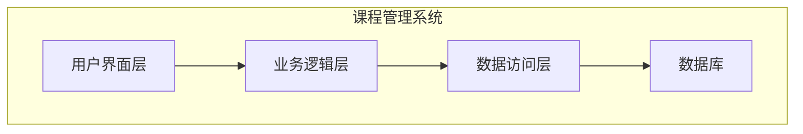

# 课程管理系统详细设计与具体代码实现

## 1. 背景介绍

### 1.1 课程管理系统概述

随着教育事业的不断发展,课程管理工作变得日益复杂。为了提高教学管理效率,实现信息化管理,课程管理系统(Course Management System, CMS)应运而生。CMS是一种基于Web的综合性教学管理平台,集成了课程安排、教师管理、学生管理、成绩管理等多种功能模块,为学校的教学管理工作提供了有力支持。

### 1.2 课程管理系统的重要性

课程管理系统在现代教育体系中扮演着至关重要的角色:

1. 提高教学管理效率,实现流程自动化
2. 实现教学资源共享,打破时空限制
3. 加强师生互动,优化教学体验
4. 提供数据分析,促进教学质量持续改进

### 1.3 系统开发挑战

开发一个功能完备、性能卓越的CMS系统并非易事,需要解决诸多技术挑战:

- 系统架构设计合理、模块划分清晰
- 数据存储高效,查询响应迅速  
- 用户界面设计人性化,操作体验友好
- 系统具备良好的可扩展性和可维护性

## 2. 核心概念与联系

### 2.1 系统核心概念

- 课程(Course): 教学活动的基本单元,包括课程名称、课程编号、任课教师、上课时间地点等信息。
- 教师(Teacher): 授课的执行者,负责课程内容的讲授和学生的学习指导。
- 学生(Student): 接受教育培养的对象,参与课程的学习和考核。
- 班级(Class): 由若干学生组成的教学组织单元,是课程的基本管理单位。
- 成绩(Score): 反映学生课程学习效果的评价指标。

### 2.2 概念关联关系

课程、教师、学生、班级和成绩之间存在着密切的关联关系:

- 一门课程可由一名或多名教师执教
- 一名教师可授多门课程
- 学生通过选课加入班级,参与课程学习
- 学生在课程结束后参加考核,获得相应成绩

这些概念关系的正确建模对于系统设计至关重要。我们将在后续章节详细探讨其中的实现细节。

## 3. 核心算法原理及具体操作步骤

### 3.1 课程排课算法

课程排课是CMS系统的核心功能之一,需要综合考虑多种约束因素,以确定每门课程的上课时间和教室安排。常见的排课算法包括:

1. **图着色算法**: 将课程视为图的节点,冲突关系视为边,通过为节点着色的方式实现排课。
2. **约束编程算法**: 建立一系列约束条件,利用求解器寻找满足所有约束的最优解。
3. **启发式搜索算法**: 借助遗传算法、模拟退火等启发式算法,在解空间中搜索满足条件的排课方案。

我们将以图着色算法为例,介绍其在课程排课中的具体应用。

#### 3.1.1 问题建模

首先需要将排课问题转化为图着色问题。我们定义:

- 节点表示课程
- 如果两门课程存在时间冲突,则在两个节点之间连接一条边

因此,原始的排课问题转化为了"在给定的图中,为每个节点着色,使得相邻节点颜色不同"的图着色问题。

#### 3.1.2 算法流程

1) 构建课程冲突图 $G(V, E)$
2) 计算图的最大度 $\Delta(G)$
3) 初始化颜色数为 $\Delta(G) + 1$
4) 采用回溯算法或其他图着色算法为图 G 着色
5) 将着色结果映射回排课方案

#### 3.1.3 算法复杂度分析

设课程数为 n, 最大度为 $\Delta$:
- 时间复杂度: $O(n^{\Delta+1})$  
- 空间复杂度: $O(n+e)$, 其中 e 为边数

由于 $\Delta$ 通常远小于 n,因此算法时间复杂度可以接受。但当课程数量较大或存在大量冲突时,该算法的效率会显著下降。

#### 3.1.4 算法优化策略

- 预处理阶段剪枝,减小搜索空间
- 选择合适的增量着色策略,提高搜索效率
- 结合其他算法形成混合算法,发挥各自优势

### 3.2 其他核心算法

除了排课算法外,CMS系统中还包含其他一些核心算法:

- 学生选课算法
- 自动阅卷算法
- 推荐系统算法
- ...

由于篇幅限制,本文暂不对这些算法展开讨论。读者可自行查阅相关资料,进一步了解其原理和实现细节。

## 4. 数学模型和公式详细讲解

在课程管理系统中,我们需要对一些关键问题建立数学模型,利用公式描述和求解。

### 4.1 排课问题建模

我们将排课问题形式化为一个整数规划(Integer Programming)问题:

**目标函数**:

$$\min\sum_{i=1}^{n}\sum_{j=1}^{m}c_{ij}x_{ij}$$

其中:
- $n$ 为课程数量
- $m$ 为可选时间段数量  
- $c_{ij}$ 为将第 $i$ 门课程安排在第 $j$ 个时间段的惩罚值(例如,违反教师或教室的时间约束)
- $x_{ij}$ 为决策变量,当第 $i$ 门课程安排在第 $j$ 个时间段时,取值为 1,否则为 0

**约束条件**:

1. 每门课程只能安排一个时间段:

$$\sum_{j=1}^{m}x_{ij}=1,\qquad \forall i\in\{1,\ldots,n\}$$

2. 同一时间段只能安排一门课程(假设所有课程都有相同的时长):

$$\sum_{i=1}^{n}x_{ij}\leq 1,\qquad \forall j\in\{1,\ldots,m\}$$

3. 课程之间的先后次序约束:

$$\sum_{j=1}^{m}jx_{ij}-\sum_{j=1}^{m}jx_{i'j}\geq d,\qquad \forall(i,i')\in P$$

其中 $P$ 表示所有存在先后约束的课程对 $(i, i')$, $d$ 为二者之间的最小时间间隔。

该模型旨在最小化总惩罚值,从而尽可能满足各种硬性和软性约束,得到最优的排课方案。

### 4.2 其他数学模型

除排课问题外,CMS系统中还存在其他需要数学建模的场景,例如:

- 自动阅卷中的分类模型
- 推荐系统中的协同过滤模型
- 教学质量评估中的回归模型
- ...

由于篇幅所限,本文不再赘述。读者可根据实际需求,自行建立相应的数学模型。

## 5. 项目实践:代码实例和详细解释

为了更好地理解CMS系统的实现细节,我们将基于Python Django框架,开发一个简化版的课程管理系统。

### 5.1 系统架构设计



如上图所示,我们采用经典的三层架构设计:

1. **用户界面层**: 负责与用户交互,接收请求并返回结果页面。
2. **业务逻辑层**: 处理具体的业务逻辑,如课程管理、教师管理等。
3. **数据访问层**: 负责与数据库进行交互,执行数据查询、插入等操作。

### 5.2 模型设计

根据系统的核心概念,我们在Django中创建以下模型类:

```python
from django.db import models

class Course(models.Model):
    name = models.CharField(max_length=100)
    code = models.CharField(max_length=10, unique=True)
    teacher = models.ForeignKey('Teacher', on_delete=models.CASCADE)
    # 其他字段...

class Teacher(models.Model):
    name = models.CharField(max_length=50)
    email = models.EmailField(unique=True)
    # 其他字段...

class Student(models.Model):
    name = models.CharField(max_length=50)
    student_id = models.CharField(max_length=20, unique=True)
    # 其他字段...

class Class(models.Model):
    name = models.CharField(max_length=50)
    course = models.ForeignKey(Course, on_delete=models.CASCADE)
    students = models.ManyToManyField(Student)
    # 其他字段...

class Score(models.Model):
    student = models.ForeignKey(Student, on_delete=models.CASCADE)
    course = models.ForeignKey(Course, on_delete=models.CASCADE)
    value = models.IntegerField()
    # 其他字段...
```

通过定义模型类及其关系,我们能够方便地在数据库中存储和查询相关数据。

### 5.3 视图函数实现

接下来,我们以学生选课功能为例,介绍视图函数的实现细节:

```python
from django.shortcuts import render, redirect, get_object_or_404
from .models import Course, Class, Student

def course_list(request):
    courses = Course.objects.all()
    return render(request, 'course_list.html', {'courses': courses})

def course_detail(request, course_id):
    course = get_object_or_404(Course, pk=course_id)
    classes = course.class_set.all()
    return render(request, 'course_detail.html', {'course': course, 'classes': classes})

def enroll(request, class_id):
    student = request.user.student
    course_class = get_object_or_404(Class, pk=class_id)
    course_class.students.add(student)
    return redirect('course_detail', course_id=course_class.course.id)
```

1. `course_list` 视图函数用于列出所有可选课程。
2. `course_detail` 视图函数显示指定课程的详细信息,包括开设的班级。
3. `enroll` 视图函数允许学生选择并加入指定的班级。

通过 Django 的模型查询 API 和模板渲染机制,我们能够快速构建动态网页,实现各种业务逻辑。

### 5.4 前端设计

为了提供友好的用户体验,我们需要设计良好的前端界面。以学生选课页面为例:

```html



<h1>{{ course.name }}</h1>
<p>{{ course.description }}</p>

<h2>开设班级</h2>
<ul>
    
    <li>
        <h3>{{ class.name }}</h3>
        <p>教师: {{ class.course.teacher.name }}</p>
        <p>已选学生数: {{ class.students.count }}</p>
        <a href="">加入班级</a>
    </li>
    
</ul>

```

该模板页面展示了课程的基本信息,以及开设的所有班级。学生可以点击"加入班级"按钮,完成选课操作。

通过合理的前端设计,我们能够为用户提供直观、易用的操作界面,提升整体使用体验。

## 6. 实际应用场景

课程管理系统在教育领域有着广泛的应用,可以为不同类型的教育机构提供强有力的支持:

- **大学**: 管理本科生、研究生的课程安排、选课、成绩等。
- **中小学**: 实现学生课程报名、教师课程分配、家长查看成绩等功能。
- **培训机构**: 统一管理各类培训课程,提高运营效率。
- **在线教育平台**: 为海量在线课程提供系统化的管理。

除教育领域外,CMS系统的理念和技术也可以扩展应用于其他领域,例如:

- **企业培训系统**: 管理企业内部的培训课程。
- **会议管理系统**: 安排会议日程、发布通知等。
- **项目管理系统**: 跟踪项目进度,分配任务等。

可见,课程管理系统不仅在教育领域发挥着重要作用,也为其他领域的管理工作提供了有力支持。

## 7. 工具和资源推荐

在课程管理系统的开发过程中,我们可以借助一些优秀的工具和资源,以提高开发效率