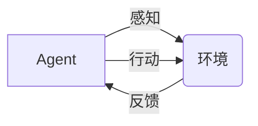

## 1. 背景介绍

### 1.1  AI发展历程：从感知到决策

人工智能（AI）的发展经历了漫长的历程，从早期的符号主义AI，到连接主义的兴起，再到如今深度学习的蓬勃发展，AI的能力不断提升。然而，传统的AI系统大多局限于**感知**层面，例如图像识别、语音识别等，缺乏自主**行动**的能力。近年来，随着强化学习、深度学习等技术的进步，AI Agent的概念应运而生，它标志着AI从感知走向行动的重大转变。

### 1.2 AI Agent的定义与特征

AI Agent可以被定义为一个能够感知环境、进行决策并采取行动的自主系统。它具有以下几个关键特征：

* **自主性:** AI Agent能够自主地做出决策并执行行动，无需人工干预。
* **目标导向:** AI Agent的行为由预先设定的目标驱动，它会根据环境信息和目标来选择最佳行动。
* **适应性:** AI Agent能够适应不断变化的环境，并根据新的信息调整其行为。
* **学习能力:** AI Agent可以通过与环境交互来学习和改进其行为策略。

### 1.3 AI Agent的意义与价值

AI Agent的出现为人工智能带来了新的可能性，它将AI的能力从感知扩展到行动，使得AI能够在更广泛的领域发挥作用。例如：

* **自动化:** AI Agent可以自动化各种任务，例如客户服务、数据分析、生产制造等。
* **个性化:** AI Agent可以根据用户的需求和偏好提供个性化的服务。
* **智能化:** AI Agent可以实现更高效、更智能的决策和行动。

## 2. 核心概念与联系

### 2.1 Agent与环境的交互

AI Agent与环境的交互是其核心机制。Agent通过**传感器**感知环境信息，例如图像、声音、文本等，然后通过**执行器**对环境施加影响，例如移动、操作物体、发送信息等。Agent与环境的交互是一个循环往复的过程，Agent的行为会改变环境，环境的变化又会反过来影响Agent的决策。



### 2.2  强化学习：Agent学习的核心机制

强化学习是AI Agent学习的核心机制。它是一种通过试错来学习最佳行为策略的机器学习方法。在强化学习中，Agent通过与环境交互来获得**奖励**或**惩罚**，并根据奖励信号来调整其行为策略，以最大化累积奖励。

### 2.3  深度学习：赋能Agent感知与决策

深度学习是近年来人工智能领域的重大突破，它为AI Agent的感知和决策能力提供了强大的支持。深度神经网络可以用于处理复杂的感知信息，例如图像、语音、文本等，并从中提取有用的特征。这些特征可以用于构建Agent的决策模型，例如深度强化学习模型。

## 3. 核心算法原理具体操作步骤

### 3.1  基于规则的Agent

基于规则的Agent是最简单的AI Agent类型之一。它根据预先定义的规则来做出决策。例如，一个基于规则的聊天机器人可以根据用户输入的关键词来选择预设的回复。

**操作步骤:**

1. 定义规则库：根据领域知识和专家经验，定义一系列规则，用于描述Agent在不同情况下应该采取的行动。
2. 匹配规则：根据当前环境信息，匹配相应的规则。
3. 执行行动：根据匹配的规则，执行相应的行动。

### 3.2  基于模型的Agent

基于模型的Agent使用环境模型来预测未来状态，并根据预测结果来选择最佳行动。例如，一个基于模型的自动驾驶汽车可以使用道路地图和交通状况来预测未来的行驶路径，并据此规划行驶路线。

**操作步骤:**

1. 构建环境模型：使用历史数据或模拟环境来构建环境模型，用于预测未来状态。
2. 规划行动：根据当前状态和环境模型，规划最佳行动序列。
3. 执行行动：根据规划的行动序列，执行相应的行动。

### 3.3  基于学习的Agent

基于学习的Agent通过与环境交互来学习最佳行为策略。强化学习是基于学习的Agent的核心算法。

**操作步骤:**

1. 初始化策略：随机初始化Agent的行为策略。
2. 与环境交互：Agent根据当前策略选择行动，并观察环境的反馈。
3. 更新策略：根据环境反馈，更新Agent的行为策略，以最大化累积奖励。
4. 重复步骤2-3，直到策略收敛。

## 4. 数学模型和公式详细讲解举例说明

### 4.1  马尔可夫决策过程 (MDP)

马尔可夫决策过程 (MDP) 是强化学习的数学基础。它描述了Agent与环境交互的动态过程。

**要素:**

* **状态空间 (S):** 所有可能的环境状态的集合。
* **行动空间 (A):** Agent所有可能的行动的集合。
* **状态转移函数 (P):** 描述在当前状态 s 下执行行动 a 后，转移到下一个状态 s' 的概率。
* **奖励函数 (R):** 描述在状态 s 下执行行动 a 后，获得的奖励。
* **折扣因子 (γ):** 用于权衡未来奖励和当前奖励的权重。

**目标:**

找到一个最优策略 π，使得Agent在任意初始状态 s 下，能够获得最大化的累积奖励。

**公式:**

$$
V^*(s) = \max_{a \in A} \left[ R(s,a) + \gamma \sum_{s' \in S} P(s'|s,a) V^*(s') \right]
$$

其中，V*(s) 表示在状态 s 下的最优值函数，它表示从状态 s 开始，按照最优策略 π 行动所能获得的最大化累积奖励。

**举例说明:**

假设一个机器人要在一个迷宫中找到出口。

* 状态空间：迷宫中所有可能的格子位置。
* 行动空间：机器人可以向上下左右四个方向移动。
* 状态转移函数：描述机器人从一个格子移动到另一个格子的概率。
* 奖励函数：如果机器人找到出口，则获得正奖励；如果撞到墙壁，则获得负奖励。
* 折扣因子：用于权衡未来找到出口的奖励和当前移动的成本。

### 4.2  Q-learning 算法

Q-learning 是一种常用的强化学习算法。它使用 Q 值函数来评估在状态 s 下执行行动 a 的价值。

**Q 值函数:**

$$
Q(s, a) = R(s, a) + \gamma \max_{a'} Q(s', a')
$$

其中，s' 表示在状态 s 下执行行动 a 后，转移到的下一个状态。

**算法步骤:**

1. 初始化 Q 值函数：将所有 Q 值初始化为 0。
2. 重复以下步骤，直到 Q 值函数收敛：
    * 观察当前状态 s。
    * 选择行动 a：可以使用 ε-greedy 策略，以 ε 的概率随机选择一个行动，以 1-ε 的概率选择 Q 值最大的行动。
    * 执行行动 a，并观察下一个状态 s' 和奖励 r。
    * 更新 Q 值函数：
        $$
        Q(s, a) \leftarrow Q(s, a) + \alpha [r + \gamma \max_{a'} Q(s', a') - Q(s, a)]
        $$
        其中，α 是学习率，用于控制 Q 值更新的速度。

**举例说明:**

假设一个机器人要学习玩一个游戏。

* 状态空间：游戏的所有可能状态。
* 行动空间：机器人可以采取的所有游戏操作。
* 奖励函数：如果机器人赢得游戏，则获得正奖励；如果输掉游戏，则获得负奖励。

机器人可以通过 Q-learning 算法来学习最佳的游戏策略，以最大化其赢得游戏的概率。

## 5. 项目实践：代码实例和详细解释说明

### 5.1  CartPole 游戏

CartPole 是一个经典的控制问题，目标是控制一个倒立摆的平衡。

**环境描述:**

* 一个倒立摆连接在一个小车上，小车可以在水平轨道上移动。
* 目标是通过控制小车的移动来保持倒立摆的平衡。

**代码实例:**

```python
import gym

# 创建 CartPole 环境
env = gym.make('CartPole-v1')

# 初始化 Q 值函数
Q = {}

# 设置参数
alpha = 0.1
gamma = 0.9
epsilon = 0.1
num_episodes = 1000

# Q-learning 算法
for episode in range(num_episodes):
    # 初始化状态
    state = env.reset()

    # 循环直到游戏结束
    done = False
    while not done:
        # 选择行动
        if random.uniform(0, 1) < epsilon:
            action = env.action_space.sample()
        else:
            action = max(Q.get(state, {}).items(), key=lambda x: x[1])[0]

        # 执行行动
        next_state, reward, done, info = env.step(action)

        # 更新 Q 值函数
        Q[state] = Q.get(state, {})
        Q[state][action] = Q[state].get(action, 0) + alpha * (
            reward + gamma * max(Q.get(next_state, {}).values(), default=0) - Q[state].get(action, 0)
        )

        # 更新状态
        state = next_state

# 测试学习到的策略
state = env.reset()
done = False
while not done:
    # 选择 Q 值最大的行动
    action = max(Q.get(state, {}).items(), key=lambda x: x[1])[0]

    # 执行行动
    next_state, reward, done, info = env.step(action)

    # 更新状态
    state = next_state

    # 渲染环境
    env.render()

# 关闭环境
env.close()
```

**代码解释:**

* 首先，我们使用 `gym` 库创建 CartPole 环境。
* 然后，我们初始化 Q 值函数，并将参数设置为合适的数值。
* 接下来，我们使用 Q-learning 算法来学习最佳的控制策略。
* 最后，我们测试学习到的策略，并渲染环境以可视化结果。

## 6. 实际应用场景

### 6.1  游戏AI

AI Agent在游戏领域有着广泛的应用，例如：

* **游戏角色控制:** AI Agent可以控制游戏角色的行为，例如移动、攻击、防御等。
* **游戏关卡生成:** AI Agent可以生成游戏关卡，例如地图、敌人、道具等。
* **游戏难度调整:** AI Agent可以根据玩家的表现来动态调整游戏难度。

### 6.2  机器人控制

AI Agent可以用于控制机器人的行为，例如：

* **导航:** AI Agent可以控制机器人在复杂环境中导航，例如避障、路径规划等。
* **操作:** AI Agent可以控制机器人操作物体，例如抓取、搬运等。
* **交互:** AI Agent可以控制机器人与人类进行交互，例如语音识别、自然语言处理等。

### 6.3  智能助理

AI Agent可以作为智能助理，为用户提供各种服务，例如：

* **日程管理:** AI Agent可以帮助用户管理日程安排，例如提醒、预约等。
* **信息查询:** AI Agent可以帮助用户查询信息，例如天气、新闻等。
* **客户服务:** AI Agent可以作为客服代表，为用户提供咨询和解答。

## 7. 工具和资源推荐

### 7.1  强化学习库

* **TensorFlow Agents:** TensorFlow 的强化学习库，提供了各种强化学习算法的实现。
* **Stable Baselines3:** 基于 PyTorch 的强化学习库，提供了各种强化学习算法的稳定实现。
* **Dopamine:** Google AI 的强化学习框架，专注于研究和实验。

### 7.2  仿真环境

* **OpenAI Gym:** 提供各种强化学习环境，例如 Atari 游戏、控制问题等。
* **MuJoCo:** 用于机器人仿真的物理引擎。
* **Gazebo:** 用于机器人仿真的 3D 模拟器。

### 7.3  学习资源

* **Reinforcement Learning: An Introduction (Sutton & Barto):** 强化学习领域的经典教材。
* **Deep Reinforcement Learning (Spinning Up in Deep RL):** OpenAI 的深度强化学习教程。
* **Coursera: Reinforcement Learning Specialization:** 由 Alberta 大学提供的强化学习在线课程。

## 8. 总结：未来发展趋势与挑战

### 8.1  未来发展趋势

* **更强大的感知能力:** 随着深度学习技术的进步，AI Agent的感知能力将不断提升，能够处理更复杂的环境信息。
* **更智能的决策能力:** 随着强化学习算法的改进，AI Agent的决策能力将更加智能，能够适应更复杂的环境变化。
* **更广泛的应用领域:** AI Agent的应用领域将不断扩展，从游戏、机器人控制到智能助理，甚至更广泛的领域。

### 8.2  挑战

* **安全性:** 如何确保 AI Agent 的行为安全可靠，避免造成意外伤害。
* **可解释性:** 如何理解 AI Agent 的决策过程，确保其行为符合人类的预期。
* **伦理问题:** 如何解决 AI Agent 发展带来的伦理问题，例如隐私、公平等。


## 9. 附录：常见问题与解答

### 9.1  什么是 AI Agent？

AI Agent 是一个能够感知环境、进行决策并采取行动的自主系统。它具有自主性、目标导向、适应性和学习能力等特征。

### 9.2  强化学习是什么？

强化学习是一种通过试错来学习最佳行为策略的机器学习方法。在强化学习中，Agent 通过与环境交互来获得奖励或惩罚，并根据奖励信号来调整其行为策略，以最大化累积奖励。

### 9.3  AI Agent 的应用场景有哪些？

AI Agent 的应用场景非常广泛，例如游戏 AI、机器人控制、智能助理等。

### 9.4  AI Agent 的未来发展趋势是什么？

AI Agent 的未来发展趋势包括更强大的感知能力、更智能的决策能力以及更广泛的应用领域。

### 9.5  AI Agent 的挑战有哪些？

AI Agent 的挑战包括安全性、可解释性和伦理问题。 
