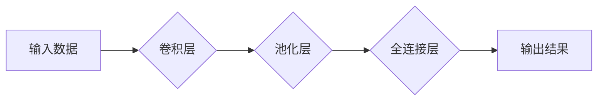

## 1. 背景介绍

### 1.1.  产业机器人发展现状

近年来，随着人工智能技术的飞速发展，产业机器人技术也得到了极大的提升。传统的工业机器人主要依赖预先编程的指令来执行重复性的任务，而新一代的产业机器人则可以通过深度学习算法实现自主学习和决策，从而更好地适应复杂多变的生产环境。

### 1.2.  深度学习在产业机器人中的应用优势

深度学习算法的引入为产业机器人带来了诸多优势，包括：

* **提高生产效率:** 深度学习算法可以帮助机器人自主学习最佳操作路径和参数，从而提高生产效率和产品质量。
* **增强环境适应性:** 深度学习算法可以使机器人感知周围环境并做出相应的调整，从而更好地适应复杂多变的生产环境。
* **降低人力成本:** 深度学习算法可以使机器人自主完成一些原本需要人工操作的任务，从而降低人力成本。
* **提升安全性:** 深度学习算法可以使机器人识别潜在的危险并采取相应的措施，从而提升生产安全性。

## 2. 核心概念与联系

### 2.1.  人工智能、机器学习与深度学习

* **人工智能 (AI):**  人工智能是指计算机科学的一个分支，致力于研究、开发用于模拟、延伸和扩展人的智能的理论、方法、技术及应用系统。
* **机器学习 (ML):**  机器学习是人工智能的一个子领域，其核心是让计算机能够自动地从数据中学习和改进，而无需进行明确的编程。
* **深度学习 (DL):**  深度学习是机器学习的一个子领域，其特点是使用多层神经网络来学习数据中的复杂模式。

### 2.2.  深度学习算法

深度学习算法种类繁多，在产业机器人中常用的算法包括：

* **卷积神经网络 (CNN):**  主要用于图像识别、目标检测等任务。
* **循环神经网络 (RNN):**  主要用于处理序列数据，例如语音识别、自然语言处理等。
* **强化学习 (RL):**  主要用于训练机器人自主学习和决策，例如路径规划、任务调度等。

## 3. 核心算法原理具体操作步骤

### 3.1.  卷积神经网络 (CNN)

#### 3.1.1.  卷积层

卷积层是 CNN 的核心组成部分，其作用是提取输入数据的特征。卷积层通过卷积核对输入数据进行卷积操作，从而生成特征图。

#### 3.1.2.  池化层

池化层的作用是降低特征图的维度，从而减少计算量和参数数量。常见的池化操作包括最大池化和平均池化。

#### 3.1.3.  全连接层

全连接层将所有特征图的输出连接到一个向量，用于最终的分类或回归任务。

### 3.2.  循环神经网络 (RNN)

#### 3.2.1.  循环单元

循环单元是 RNN 的基本组成部分，其特点是具有记忆功能，可以存储历史信息。

#### 3.2.2.  长短期记忆网络 (LSTM)

LSTM 是一种特殊的 RNN，其特点是能够更好地处理长期依赖关系。

### 3.3.  强化学习 (RL)

#### 3.3.1.  状态、动作和奖励

强化学习的基本要素包括状态、动作和奖励。机器人根据当前状态选择动作，并根据动作的结果获得奖励。

#### 3.3.2.  Q-learning

Q-learning 是一种常用的强化学习算法，其目标是学习一个 Q 函数，该函数可以预测在特定状态下执行特定动作的预期回报。

## 4. 数学模型和公式详细讲解举例说明

### 4.1.  卷积操作

卷积操作的数学公式如下：

$$
y_{i,j} = \sum_{m=1}^{M} \sum_{n=1}^{N} w_{m,n} x_{i+m-1, j+n-1}
$$

其中，$x$ 表示输入数据，$w$ 表示卷积核，$y$ 表示输出特征图。

### 4.2.  Sigmoid 函数

Sigmoid 函数是一种常用的激活函数，其数学公式如下：

$$
\sigma(x) = \frac{1}{1 + e^{-x}}
$$

### 4.3.  Q-learning 更新规则

Q-learning 的更新规则如下：

$$
Q(s,a) \leftarrow Q(s,a) + \alpha (r + \gamma \max_{a'} Q(s',a') - Q(s,a))
$$

其中，$s$ 表示当前状态，$a$ 表示当前动作，$r$ 表示奖励，$s'$ 表示下一个状态，$a'$ 表示下一个动作，$\alpha$ 表示学习率，$\gamma$ 表示折扣因子。

## 5. 项目实践：代码实例和详细解释说明

### 5.1.  基于 CNN 的目标检测

```python
import tensorflow as tf

# 定义模型
model = tf.keras.models.Sequential([
  tf.keras.layers.Conv2D(32, (3, 3), activation='relu', input_shape=(28, 28, 1)),
  tf.keras.layers.MaxPooling2D((2, 2)),
  tf.keras.layers.Conv2D(64, (3, 3), activation='relu'),
  tf.keras.layers.MaxPooling2D((2, 2)),
  tf.keras.layers.Flatten(),
  tf.keras.layers.Dense(10, activation='softmax')
])

# 编译模型
model.compile(optimizer='adam',
              loss='sparse_categorical_crossentropy',
              metrics=['accuracy'])

# 训练模型
model.fit(x_train, y_train, epochs=10)

# 评估模型
model.evaluate(x_test,  y_test, verbose=2)
```

### 5.2.  基于 RNN 的语音识别

```python
import tensorflow as tf

# 定义模型
model = tf.keras.models.Sequential([
  tf.keras.layers.LSTM(128, return_sequences=True, input_shape=(timesteps, features)),
  tf.keras.layers.LSTM(128),
  tf.keras.layers.Dense(num_classes, activation='softmax')
])

# 编译模型
model.compile(optimizer='adam',
              loss='categorical_crossentropy',
              metrics=['accuracy'])

# 训练模型
model.fit(x_train, y_train, epochs=10)

# 评估模型
model.evaluate(x_test,  y_test, verbose=2)
```

### 5.3.  基于 RL 的机器人路径规划

```python
import gym

# 创建环境
env = gym.make('CartPole-v0')

# 定义 Q 函数
q_table = {}

# 设置参数
alpha = 0.1
gamma = 0.9
epsilon = 0.1

# 训练循环
for episode in range(1000):
  # 初始化状态
  state = env.reset()

  # 循环直到游戏结束
  done = False
  while not done:
    # 选择动作
    if random.uniform(0, 1) < epsilon:
      action = env.action_space.sample()
    else:
      action = max(q_table[state], key=q_table[state].get)

    # 执行动作
    next_state, reward, done, info = env.step(action)

    # 更新 Q 函数
    if state not in q_table:
      q_table[state] = {}
    if action not in q_table[state]:
      q_table[state][action] = 0
    q_table[state][action] += alpha * (reward + gamma * max(q_table[next_state], key=q_table[next_state].get) - q_table[state][action])

    # 更新状态
    state = next_state

# 测试模型
state = env.reset()
done = False
while not done:
  action = max(q_table[state], key=q_table[state].get)
  next_state, reward, done, info = env.step(action)
  state = next_state
  env.render()
```

## 6. 实际应用场景

### 6.1.  智能制造

深度学习算法可以用于优化生产流程、提高产品质量、降低生产成本等。例如，深度学习算法可以用于：

* **缺陷检测:** 自动识别产品缺陷，提高产品质量。
* **预测性维护:** 预测设备故障，减少停机时间。
* **生产调度:** 优化生产计划，提高生产效率。

### 6.2.  物流仓储

深度学习算法可以用于提高物流效率、降低仓储成本等。例如，深度学习算法可以用于：

* **自动分拣:** 自动识别包裹并进行分拣，提高分拣效率。
* **库存管理:** 预测库存需求，优化库存管理。
* **路径规划:** 规划最佳配送路径，降低配送成本。

### 6.3.  服务机器人

深度学习算法可以用于提升服务机器人的智能化水平，使其更好地服务于人类。例如，深度学习算法可以用于：

* **人机交互:** 使机器人能够理解人类语言并进行自然对话。
* **环境感知:** 使机器人能够感知周围环境并进行自主导航。
* **情感识别:** 使机器人能够识别人类情感并做出相应的反应。

## 7. 工具和资源推荐

### 7.1.  深度学习框架

* **TensorFlow:** 由 Google 开发的开源深度学习框架，支持多种深度学习算法。
* **PyTorch:** 由 Facebook 开发的开源深度学习框架，以其灵活性和易用性而著称。
* **Keras:**  高级神经网络 API，可在 TensorFlow、CNTK 和 Theano 之上运行。

### 7.2.  数据集

* **ImageNet:**  大型图像数据集，包含超过 1400 万张图片。
* **CIFAR-10:**  包含 10 个类别的 60000 张彩色图像数据集。
* **MNIST:**  包含 70000 张手写数字图像数据集。

### 7.3.  学习资源

* **斯坦福大学深度学习课程:**  由吴恩达教授主讲的深度学习入门课程。
* **深度学习书籍:**  例如《深度学习》（Goodfellow 等人）和《Python 深度学习》（弗朗索瓦·肖莱）。

## 8. 总结：未来发展趋势与挑战

### 8.1.  未来发展趋势

* **更强大的算法:**  随着深度学习技术的不断发展，将会出现更加强大的算法，能够更好地解决复杂问题。
* **更广泛的应用:**  深度学习算法将会应用于更广泛的领域，例如医疗、金融、教育等。
* **更智能的机器人:**  深度学习算法将会使机器人更加智能化，能够更好地与人类协作。

### 8.2.  挑战

* **数据需求:**  深度学习算法需要大量的训练数据，这对于一些数据匮乏的领域来说是一个挑战。
* **计算能力:**  深度学习算法需要强大的计算能力，这对于一些资源有限的企业来说是一个挑战。
* **安全性:**  深度学习算法的安全性是一个重要问题，需要采取措施来防止恶意攻击。

## 9. 附录：常见问题与解答

### 9.1.  什么是过拟合？如何避免过拟合？

过拟合是指模型在训练数据上表现良好，但在测试数据上表现较差的现象。避免过拟合的方法包括：

* **增加训练数据:**  更多的训练数据可以帮助模型更好地泛化到 unseen 数据。
* **正则化:**  正则化技术可以惩罚模型的复杂度，从而降低过拟合的风险。
* **Dropout:**  Dropout 技术可以随机丢弃一些神经元，从而降低模型的复杂度。

### 9.2.  什么是梯度消失？如何解决梯度消失？

梯度消失是指在训练神经网络时，梯度随着层数的增加而逐渐减小，导致模型难以训练的现象。解决梯度消失的方法包括：

* **使用 ReLU 激活函数:**  ReLU 激活函数可以避免梯度饱和问题。
* **使用残差网络:**  残差网络可以使梯度更容易地传播到更深的层。
* **使用梯度裁剪:**  梯度裁剪可以限制梯度的最大值，从而防止梯度爆炸。


## 10.  核心概念原理和架构的 Mermaid流程图


