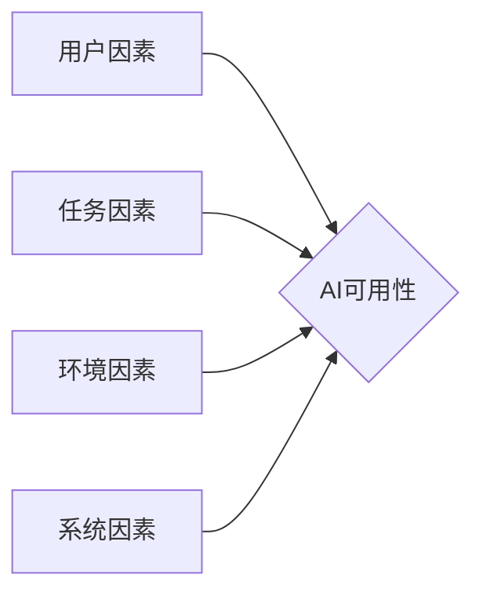

## 1. 背景介绍

### 1.1 人工智能的普及与挑战

近年来，人工智能（AI）技术取得了长足进步，并在各个领域得到了广泛应用。从智能手机上的语音助手到自动驾驶汽车，AI正在改变我们的生活方式。然而，随着AI应用的普及，可用性问题也日益凸显。许多AI系统在实际应用中表现出不稳定、不可靠、难以理解等问题，这限制了AI技术的进一步发展和应用。

### 1.2 AI可用性的重要性

AI可用性是指AI系统在特定环境下为特定用户完成特定任务的有效性、效率和满意度。AI系统的可用性直接影响用户体验，进而影响用户对AI技术的接受程度和信任度。高可用性的AI系统能够提高用户工作效率、降低用户学习成本、增强用户对AI技术的信心。

### 1.3 本文目的

本文旨在探讨AI可用性的理论和实践，分析影响AI可用性的因素，并介绍提高AI可用性的方法和技术。本文将从以下几个方面展开讨论：

* AI可用性的核心概念和联系
* 影响AI可用性的因素
* 评估AI可用性的方法
* 提高AI可用性的技术和策略
* AI可用性的未来发展趋势

## 2. 核心概念与联系

### 2.1 可用性

可用性是指产品在特定环境下为特定用户完成特定任务的有效性、效率和满意度。ISO 9241-11标准将可用性定义为：

> “特定用户在特定环境下使用产品达成特定目标的有效性、效率和满意度。”

### 2.2 AI可用性

AI可用性是指AI系统在特定环境下为特定用户完成特定任务的有效性、效率和满意度。AI可用性是可用性在AI领域的延伸，它考虑了AI系统自身的特点，例如：

* AI系统的复杂性：AI系统通常涉及复杂的算法和模型，这使得用户难以理解其工作原理。
* AI系统的不确定性：AI系统的输出往往具有不确定性，这使得用户难以预测其行为。
* AI系统的交互性：AI系统通常需要与用户进行交互，这使得用户体验更加重要。

### 2.3 影响AI可用性的因素

影响AI可用性的因素有很多，主要包括：

* **用户因素:**  用户的认知能力、技能水平、使用习惯等都会影响AI系统的可用性。
* **任务因素:**  任务的复杂程度、信息量、时间限制等都会影响AI系统的可用性。
* **环境因素:**  环境的噪音、光线、温度等都会影响AI系统的可用性。
* **系统因素:**  AI系统的算法、模型、界面设计、交互方式等都会影响AI系统的可用性。

### 2.4 核心概念联系图



## 3. 核心算法原理具体操作步骤

### 3.1 用户研究

用户研究是提高AI可用性的基础，它可以帮助我们了解用户的需求、行为和痛点。常用的用户研究方法包括：

* **用户访谈:**  与用户进行面对面或远程交流，了解他们的需求、目标和期望。
* **问卷调查:**  设计问卷，收集用户的反馈和意见。
* **可用性测试:**  观察用户使用AI系统的过程，记录他们的行为和遇到的问题。

### 3.2 界面设计

AI系统的界面设计应该简洁、直观、易于理解。设计AI系统界面时，需要考虑以下因素：

* **信息架构:**  合理组织信息，使用户能够快速找到所需的信息。
* **交互设计:**  设计符合用户习惯的交互方式，例如语音交互、手势交互等。
* **视觉设计:**  使用清晰的图标、颜色和字体，提高界面的可读性和美观度。

### 3.3 可解释性

AI系统的可解释性是指用户能够理解AI系统做出决策的原因。提高AI系统的可解释性可以增强用户对AI系统的信任度，并帮助用户更好地使用AI系统。常用的可解释性技术包括：

* **特征重要性分析:**  识别对模型预测结果影响最大的特征。
* **局部解释:**  解释模型对特定样本的预测结果。
* **规则提取:**  从模型中提取可理解的规则。

### 3.4 反馈机制

AI系统需要提供有效的反馈机制，让用户了解系统的状态和行为。反馈机制可以帮助用户及时发现问题，并采取相应的措施。常用的反馈机制包括：

* **进度条:**  显示任务的进度。
* **错误信息:**  提示用户操作错误的原因。
* **确认对话框:**  确认用户的操作意图。

## 4. 数学模型和公式详细讲解举例说明

### 4.1 评估AI可用性的指标

评估AI可用性的指标有很多，常用的指标包括：

* **完成率:**  用户成功完成任务的比例。
* **错误率:**  用户在完成任务过程中犯错的比例。
* **任务完成时间:**  用户完成任务所需的时间。
* **用户满意度:**  用户对AI系统的主观评价。

### 4.2 计算完成率的公式

$$ 完成率 = \frac{成功完成任务的用户数}{总用户数} $$

### 4.3 举例说明

假设有100个用户使用某个AI系统完成任务A，其中80个用户成功完成了任务，则该AI系统完成任务A的完成率为：

$$ 完成率 = \frac{80}{100} = 80\% $$

## 5. 项目实践：代码实例和详细解释说明

### 5.1 代码实例

```python
import sklearn.metrics as metrics

# 真实标签
y_true = [0, 1, 0, 1, 1]

# 预测标签
y_pred = [0, 1, 1, 0, 1]

# 计算准确率
accuracy = metrics.accuracy_score(y_true, y_pred)

# 打印准确率
print(f"Accuracy: {accuracy}")
```

### 5.2 代码解释

这段代码使用 `sklearn.metrics` 模块中的 `accuracy_score()` 函数计算模型的准确率。准确率是指模型预测正确的样本数占总样本数的比例。

* `y_true` 变量存储真实标签。
* `y_pred` 变量存储模型预测的标签。
* `accuracy` 变量存储计算得到的准确率。

## 6. 实际应用场景

### 6.1 智能客服

智能客服可以使用AI技术自动回答用户的问题，提高客服效率和用户满意度。为了提高智能客服的可用性，可以采用以下措施：

* 使用自然语言处理技术，使智能客服能够理解用户的自然语言输入。
* 提供多种交互方式，例如语音交互、文字交互等。
* 设计简洁直观的界面，方便用户使用。

### 6.2 自动驾驶

自动驾驶技术可以使用AI技术控制车辆，提高驾驶安全性和效率。为了提高自动驾驶系统的可用性，可以采用以下措施：

* 使用多传感器融合技术，提高感知系统的可靠性。
* 设计安全的决策算法，确保车辆在各种情况下都能做出正确的决策。
* 提供人性化的交互界面，让用户能够方便地与自动驾驶系统进行交互。

### 6.3 医疗诊断

AI技术可以辅助医生进行医疗诊断，提高诊断准确率和效率。为了提高AI医疗诊断系统的可用性，可以采用以下措施：

* 使用高质量的医疗数据训练模型，提高模型的准确率。
* 提供可解释的诊断结果，帮助医生理解AI系统的决策过程。
* 设计易于使用的界面，方便医生操作。

## 7. 工具和资源推荐

### 7.1 用户研究工具

* **UserTesting:**  提供远程用户测试服务。
* **Optimal Workshop:**  提供在线用户研究工具，例如卡片分类、树形测试等。

### 7.2 界面设计工具

* **Figma:**  一款协作式界面设计工具。
* **Sketch:**  一款矢量图形编辑器，常用于界面设计。

### 7.3 可解释性工具

* **LIME:**  一种局部解释技术。
* **SHAP:**  一种基于博弈论的可解释性技术。

## 8. 总结：未来发展趋势与挑战

### 8.1 未来发展趋势

* **个性化AI:**  AI系统将更加注重个性化，根据用户的需求和偏好提供定制化的服务。
* **人机协同:**  AI系统将更加注重人机协同，将人类的智慧和AI的能力结合起来，共同完成任务。
* **可信赖AI:**  AI系统将更加注重可信赖性，提高系统的透明度、可解释性和可靠性。

### 8.2 面临的挑战

* **数据偏差:**  AI系统容易受到数据偏差的影响，导致系统做出不公平或不准确的决策。
* **隐私安全:**  AI系统收集和使用大量用户数据，存在隐私泄露的风险。
* **伦理道德:**  AI技术的应用引发了伦理道德方面的担忧，例如算法歧视、工作替代等。

## 9. 附录：常见问题与解答

### 9.1 如何评估AI系统的可用性？

评估AI系统的可用性可以使用多种方法，例如用户访谈、问卷调查、可用性测试等。常用的评估指标包括完成率、错误率、任务完成时间、用户满意度等。

### 9.2 如何提高AI系统的可解释性？

提高AI系统的可解释性可以使用多种技术，例如特征重要性分析、局部解释、规则提取等。

### 9.3 如何解决AI系统的数据偏差问题？

解决AI系统的数据偏差问题可以采取多种措施，例如使用更加多样化的数据集、设计公平的算法等。
