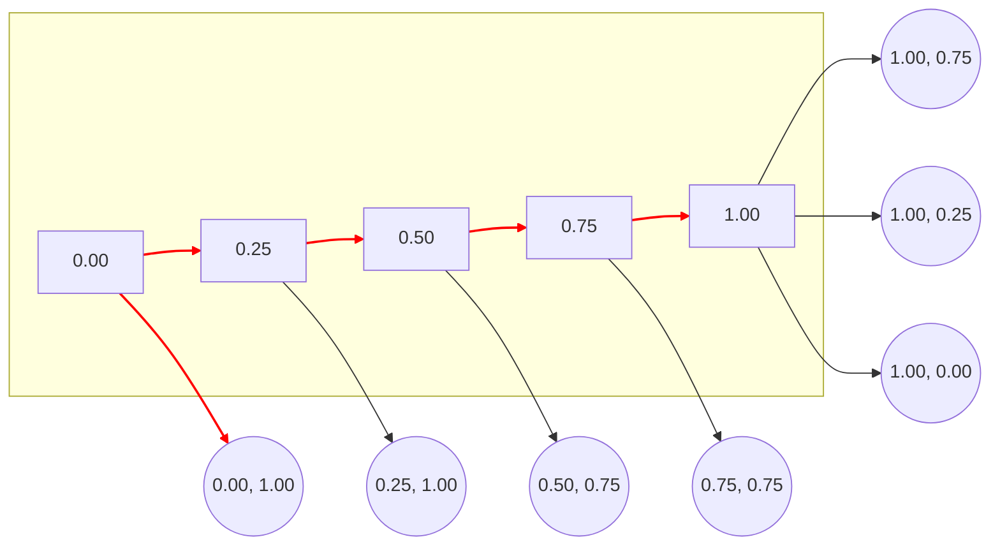

## 1. 背景介绍

### 1.1 机器学习模型的性能衰减

机器学习模型在部署到生产环境后，其性能可能会随着时间的推移而下降。这可能是由于多种因素造成的，例如：

* **数据漂移:** 生产环境中的数据分布可能与训练数据不同，导致模型预测精度下降。
* **概念漂移:**  目标变量与特征之间的关系可能发生变化，导致模型不再适用。
* **软件和硬件故障:** 软件或硬件故障可能导致模型无法正常工作。

### 1.2 模型监控的必要性

为了确保机器学习模型在生产环境中持续提供高质量的服务，我们需要对其性能进行持续监控。模型监控可以帮助我们：

* **尽早发现性能下降:**  通过监控模型的性能指标，我们可以及时发现性能下降的趋势。
* **诊断性能下降的原因:** 模型监控可以帮助我们确定性能下降的原因，例如数据漂移或概念漂移。
* **触发模型重新训练:** 当模型性能下降到一定程度时，我们可以触发模型重新训练，以提高其性能。

## 2. 核心概念与联系

### 2.1 AUC (Area Under the Curve)

AUC (Area Under the Curve) 是评估分类模型性能的常用指标。它表示ROC曲线下方的面积，ROC曲线 (Receiver Operating Characteristic Curve) 是一种以假正例率 (False Positive Rate) 为横坐标，真正例率 (True Positive Rate) 为纵坐标绘制的曲线。AUC的值介于0和1之间，AUC值越高，说明模型的分类性能越好。

### 2.2 模型监控

模型监控是指对机器学习模型在生产环境中的性能进行持续跟踪和评估。它通常包括以下步骤：

1. **收集模型预测结果和真实标签。**
2. **计算模型性能指标，例如 AUC、精确率、召回率等。**
3. **将性能指标与预定义的阈值进行比较。**
4. **如果性能指标低于阈值，则触发警报或采取其他措施，例如重新训练模型。**

### 2.3 AUC 与模型监控的关系

AUC 是模型监控中常用的性能指标之一。通过监控 AUC 的变化趋势，我们可以判断模型的性能是否下降。如果 AUC 下降，则说明模型的分类性能下降，需要采取措施来提高模型性能。

## 3. 核心算法原理具体操作步骤

### 3.1 计算 AUC

计算 AUC 的步骤如下：

1. **根据模型预测结果对样本进行排序。**
2. **遍历所有样本，计算每个样本的真正例率和假正例率。**
3. **绘制 ROC 曲线。**
4. **计算 ROC 曲线下方的面积，即 AUC。**

### 3.2 设置监控阈值

为了判断模型性能是否下降，我们需要设置监控阈值。阈值可以根据模型的预期性能和业务需求来确定。

### 3.3 触发警报

当 AUC 低于预定义的阈值时，模型监控系统会触发警报。警报可以发送给相关人员，例如数据科学家或机器学习工程师。

## 4. 数学模型和公式详细讲解举例说明

### 4.1 ROC 曲线

ROC 曲线以假正例率 (FPR) 为横坐标，真正例率 (TPR) 为纵坐标绘制的曲线。FPR 和 TPR 的计算公式如下：

$$
\text{FPR} = \frac{FP}{FP + TN}
$$

$$
\text{TPR} = \frac{TP}{TP + FN}
$$

其中：

* TP (True Positive):  将正例预测为正例的样本数。
* FP (False Positive): 将负例预测为正例的样本数。
* TN (True Negative): 将负例预测为负例的样本数。
* FN (False Negative): 将正例预测为负例的样本数。

### 4.2 AUC

AUC 是 ROC 曲线下方的面积。可以使用梯形法计算 AUC：

$$
\text{AUC} = \frac{1}{2} \sum_{i=1}^{n-1} (FPR_{i+1} - FPR_i) \cdot (TPR_{i+1} + TPR_i)
$$

其中：

* $n$ 是样本数量。
* $FPR_i$ 是第 $i$ 个样本的假正例率。
* $TPR_i$ 是第 $i$ 个样本的真正例率。

### 4.3 举例说明

假设我们有一个二分类模型，用于预测用户是否会点击广告。模型对 10 个样本进行了预测，预测结果和真实标签如下表所示：

| 样本 | 预测概率 | 真实标签 |
|---|---|---|
| 1 | 0.9 | 1 |
| 2 | 0.8 | 1 |
| 3 | 0.7 | 0 |
| 4 | 0.6 | 1 |
| 5 | 0.5 | 0 |
| 6 | 0.4 | 0 |
| 7 | 0.3 | 1 |
| 8 | 0.2 | 0 |
| 9 | 0.1 | 0 |
| 10 | 0.0 | 0 |

我们可以按照预测概率对样本进行排序，然后计算每个样本的 FPR 和 TPR，如下表所示：

| 样本 | 预测概率 | 真实标签 | FPR | TPR |
|---|---|---|---|---|
| 1 | 0.9 | 1 | 0.00 | 1.00 |
| 2 | 0.8 | 1 | 0.00 | 1.00 |
| 4 | 0.6 | 1 | 0.00 | 1.00 |
| 7 | 0.3 | 1 | 0.25 | 1.00 |
| 3 | 0.7 | 0 | 0.25 | 0.75 |
| 5 | 0.5 | 0 | 0.50 | 0.75 |
| 6 | 0.4 | 0 | 0.75 | 0.75 |
| 8 | 0.2 | 0 | 1.00 | 0.75 |
| 9 | 0.1 | 0 | 1.00 | 0.25 |
| 10 | 0.0 | 0 | 1.00 | 0.00 |

根据 FPR 和 TPR 可以绘制 ROC 曲线，如下图所示：



可以使用梯形法计算 AUC：

$$
\begin{aligned}
\text{AUC} &= \frac{1}{2} [(0.25 - 0.00) \cdot (1.00 + 1.00) + (0.50 - 0.25) \cdot (0.75 + 1.00) + (0.75 - 0.50) \cdot (0.75 + 0.75) + (1.00 - 0.75) \cdot (0.75 + 0.75) + (1.00 - 1.00) \cdot (0.25 + 0.75)] \\
&= 0.8125
\end{aligned}
$$

因此，该模型的 AUC 为 0.8125，说明其分类性能较好。

## 5. 项目实践：代码实例和详细解释说明

### 5.1 Python 代码实例

```python
import pandas as pd
from sklearn.metrics import roc_auc_score

# 加载数据
data = pd.read_csv('data.csv')

# 提取特征和标签
X = data.drop('label', axis=1)
y = data['label']

# 训练模型
model = LogisticRegression()
model.fit(X, y)

# 预测概率
y_pred_proba = model.predict_proba(X)[:, 1]

# 计算 AUC
auc = roc_auc_score(y, y_pred_proba)

# 打印 AUC
print('AUC:', auc)
```

### 5.2 代码解释

* **`pandas`** 库用于加载和处理数据。
* **`sklearn.metrics`** 模块提供了计算 AUC 的函数 **`roc_auc_score`**。
* **`LogisticRegression`** 是一个用于二分类的逻辑回归模型。
* **`model.predict_proba(X)`** 返回每个样本的预测概率，**`[:, 1]`** 选择正例的预测概率。
* **`roc_auc_score(y, y_pred_proba)`** 计算 AUC。

## 6. 实际应用场景

### 6.1 金融风控

在金融风控领域，AUC 常用于评估信用评分模型的性能。通过监控 AUC 的变化趋势，可以及时发现模型性能下降，并采取措施来降低风险。

### 6.2 医疗诊断

在医疗诊断领域，AUC 常用于评估疾病预测模型的性能。通过监控 AUC 的变化趋势，可以及时发现模型性能下降，并采取措施来提高诊断准确率。

### 6.3 电商推荐

在电商推荐领域，AUC 常用于评估推荐模型的性能。通过监控 AUC 的变化趋势，可以及时发现模型性能下降，并采取措施来提高推荐效果。

## 7. 工具和资源推荐

### 7.1  Amazon SageMaker Model Monitor

Amazon SageMaker Model Monitor 是一项完全托管的服务，可以帮助您持续监控机器学习模型的性能。它可以自动检测数据漂移和概念漂移，并提供可视化工具来分析模型性能。

### 7.2  MLflow

MLflow 是一个开源的机器学习平台，提供模型跟踪、项目打包和模型部署等功能。它可以帮助您监控模型性能，并提供可视化工具来分析模型性能。

### 7.3  TensorBoard

TensorBoard 是 TensorFlow 的可视化工具，可以帮助您监控模型训练过程和模型性能。它可以显示 AUC 等性能指标的变化趋势，并提供可视化工具来分析模型性能。

## 8. 总结：未来发展趋势与挑战

### 8.1  未来发展趋势

* **自动化模型监控:**  未来，模型监控将会更加自动化，减少人工干预的需求。
* **实时模型监控:**  实时模型监控可以帮助我们更快地发现性能下降，并采取措施来提高模型性能。
* **可解释模型监控:**  可解释模型监控可以帮助我们更好地理解模型性能下降的原因，并采取更有针对性的措施。

### 8.2  挑战

* **数据漂移和概念漂移的检测:**  数据漂移和概念漂移的检测仍然是一个挑战，需要开发更有效的算法来解决这个问题。
* **模型可解释性:**  模型可解释性对于理解模型性能下降的原因至关重要，需要开发更易于解释的模型。
* **模型监控的成本:**  模型监控需要一定的成本，需要权衡成本和效益。

## 9. 附录：常见问题与解答

### 9.1  AUC 的取值范围是什么？

AUC 的取值范围是 0 到 1。

### 9.2  AUC 越高，模型的分类性能就一定越好吗？

不一定。AUC 只是一个评估指标，不能完全代表模型的分类性能。

### 9.3  如何设置模型监控的阈值？

阈值可以根据模型的预期性能和业务需求来确定。

### 9.4  如何处理模型性能下降？

可以采取多种措施来提高模型性能，例如重新训练模型、调整模型参数、收集更多数据等。

### 9.5  有哪些模型监控工具？

常用的模型监控工具包括 Amazon SageMaker Model Monitor、MLflow 和 TensorBoard 等。
