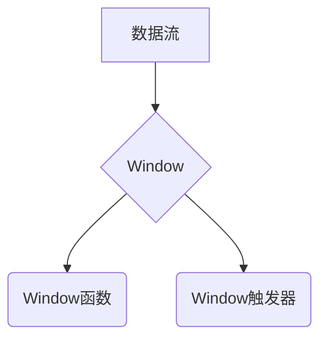

## 1. 背景介绍

### 1.1. 流式计算的兴起与挑战

近年来，随着大数据技术的快速发展，流式计算逐渐成为处理实时数据的关键技术。与传统的批处理不同，流式计算需要实时地处理持续不断的数据流，并及时地输出计算结果。这种实时性需求对计算框架提出了更高的要求，需要框架能够高效地处理海量数据、灵活地应对数据流的变化，并保证计算结果的准确性和一致性。

### 1.2. Flink：新一代流式计算引擎

Apache Flink 是一个开源的分布式流式计算引擎，它具有高吞吐、低延迟、容错性强等特点，能够很好地满足流式计算的需求。Flink 提供了丰富的 API 和工具，支持多种编程语言，并且能够与其他大数据生态系统组件无缝集成，例如 Kafka、Hadoop、Elasticsearch 等。

### 1.3. Window：流式计算的核心概念

在流式计算中，数据是持续不断地流动的，为了能够对数据进行分析和处理，需要将无限的数据流划分为有限的窗口。窗口是一种将数据流切分成有限数据集的机制，它可以根据时间、计数或其他条件进行划分。通过窗口，可以对数据进行聚合、统计、分析等操作，从而提取有价值的信息。

## 2. 核心概念与联系

### 2.1. Window类型

Flink 支持多种类型的窗口，包括：

* **时间窗口（Time Window）：**根据时间间隔对数据流进行划分，例如每 5 秒钟划分一个窗口。时间窗口又分为滚动时间窗口（Tumbling Time Window）和滑动时间窗口（Sliding Time Window）。
    * **滚动时间窗口：**窗口之间没有重叠，每个数据点只属于一个窗口。
    * **滑动时间窗口：**窗口之间有重叠，每个数据点可能属于多个窗口。
* **计数窗口（Count Window）：**根据数据点的数量对数据流进行划分，例如每 100 个数据点划分一个窗口。计数窗口也分为滚动计数窗口（Tumbling Count Window）和滑动计数窗口（Sliding Count Window）。
* **会话窗口（Session Window）：**根据数据流中的间隔时间对数据流进行划分，例如用户连续操作之间的间隔时间超过 30 分钟，则划分一个新的会话窗口。

### 2.2. Window函数

窗口函数是用于对窗口内数据进行计算的函数，Flink 提供了丰富的窗口函数，包括：

* **聚合函数：**例如 sum、min、max、avg 等，用于计算窗口内数据的统计值。
* **转换函数：**例如 reduce、fold、aggregate 等，用于对窗口内数据进行转换操作。
* **其他函数：**例如 process、apply 等，用于对窗口内数据进行自定义处理。

### 2.3. Window触发器

窗口触发器决定了何时触发窗口函数的计算，Flink 提供了多种触发器，包括：

* **事件时间触发器：**根据数据本身的时间戳触发窗口计算，例如每 5 秒钟触发一次计算。
* **处理时间触发器：**根据 Flink 系统的处理时间触发窗口计算，例如每 1 分钟触发一次计算。
* **计数触发器：**根据窗口内数据点的数量触发窗口计算，例如每 100 个数据点触发一次计算。
* **自定义触发器：**用户可以自定义触发器，根据特定的条件触发窗口计算。

### 2.4. 核心概念联系图



## 3. 核心算法原理具体操作步骤

### 3.1. 时间窗口

时间窗口是根据时间间隔对数据流进行划分的窗口，它可以是滚动时间窗口或滑动时间窗口。

#### 3.1.1. 滚动时间窗口

滚动时间窗口的原理是将数据流按照固定的时间间隔进行划分，每个时间间隔内的数据构成一个窗口。例如，如果时间窗口大小为 5 秒，则数据流会被划分为 5 秒一个的窗口，每个窗口包含 5 秒内到达的所有数据点。

**操作步骤：**

1. 确定时间窗口大小，例如 5 秒。
2. 将数据流按照时间戳排序。
3. 将数据流按照时间窗口大小进行划分，每个窗口包含 5 秒内到达的所有数据点。
4. 对每个窗口应用窗口函数，计算窗口内数据的统计值或进行其他操作。

#### 3.1.2. 滑动时间窗口

滑动时间窗口的原理是在滚动时间窗口的基础上，设置一个滑动步长，每隔滑动步长创建一个新的窗口。例如，如果时间窗口大小为 10 秒，滑动步长为 5 秒，则数据流会被划分为 10 秒一个的窗口，每隔 5 秒创建一个新的窗口。

**操作步骤：**

1. 确定时间窗口大小，例如 10 秒。
2. 确定滑动步长，例如 5 秒。
3. 将数据流按照时间戳排序。
4. 将数据流按照时间窗口大小进行划分，每个窗口包含 10 秒内到达的所有数据点。
5. 每隔滑动步长创建一个新的窗口，新窗口包含前一个窗口的一部分数据和新到达的一部分数据。
6. 对每个窗口应用窗口函数，计算窗口内数据的统计值或进行其他操作。

### 3.2. 计数窗口

计数窗口是根据数据点的数量对数据流进行划分的窗口，它可以是滚动计数窗口或滑动计数窗口。

#### 3.2.1. 滚动计数窗口

滚动计数窗口的原理是将数据流按照固定的数据点数量进行划分，每个数量范围内的数据构成一个窗口。例如，如果计数窗口大小为 100，则数据流会被划分为 100 个数据点一个的窗口，每个窗口包含 100 个数据点。

**操作步骤：**

1. 确定计数窗口大小，例如 100。
2. 将数据流按照到达顺序排序。
3. 将数据流按照计数窗口大小进行划分，每个窗口包含 100 个数据点。
4. 对每个窗口应用窗口函数，计算窗口内数据的统计值或进行其他操作。

#### 3.2.2. 滑动计数窗口

滑动计数窗口的原理是在滚动计数窗口的基础上，设置一个滑动步长，每隔滑动步长创建一个新的窗口。例如，如果计数窗口大小为 100，滑动步长为 50，则数据流会被划分为 100 个数据点一个的窗口，每隔 50 个数据点创建一个新的窗口。

**操作步骤：**

1. 确定计数窗口大小，例如 100。
2. 确定滑动步长，例如 50。
3. 将数据流按照到达顺序排序。
4. 将数据流按照计数窗口大小进行划分，每个窗口包含 100 个数据点。
5. 每隔滑动步长创建一个新的窗口，新窗口包含前一个窗口的一部分数据和新到达的一部分数据。
6. 对每个窗口应用窗口函数，计算窗口内数据的统计值或进行其他操作。

### 3.3. 会话窗口

会话窗口的原理是根据数据流中的间隔时间对数据流进行划分，例如用户连续操作之间的间隔时间超过 30 分钟，则划分一个新的会话窗口。

**操作步骤：**

1. 确定会话间隔时间，例如 30 分钟。
2. 将数据流按照时间戳排序。
3. 遍历数据流，如果两个相邻数据点之间的时间间隔超过会话间隔时间，则划分一个新的会话窗口。
4. 对每个会话窗口应用窗口函数，计算窗口内数据的统计值或进行其他操作。

## 4. 数学模型和公式详细讲解举例说明

### 4.1. 时间窗口

#### 4.1.1. 滚动时间窗口

滚动时间窗口的数学模型可以表示为：

$$W_i = \{x | t_i \leq x < t_i + T\}$$

其中：

* $W_i$ 表示第 $i$ 个时间窗口。
* $x$ 表示数据流中的数据点。
* $t_i$ 表示第 $i$ 个时间窗口的起始时间。
* $T$ 表示时间窗口大小。

**举例说明：**

假设时间窗口大小为 5 秒，当前时间为 10:00:00，则第一个时间窗口为：

$$W_1 = \{x | 10:00:00 \leq x < 10:00:05\}$$

第二个时间窗口为：

$$W_2 = \{x | 10:00:05 \leq x < 10:00:10\}$$

以此类推。

#### 4.1.2. 滑动时间窗口

滑动时间窗口的数学模型可以表示为：

$$W_i = \{x | t_i \leq x < t_i + T\}$$

其中：

* $W_i$ 表示第 $i$ 个时间窗口。
* $x$ 表示数据流中的数据点。
* $t_i = t_0 + i \cdot S$，表示第 $i$ 个时间窗口的起始时间。
* $t_0$ 表示第一个时间窗口的起始时间。
* $S$ 表示滑动步长。
* $T$ 表示时间窗口大小。

**举例说明：**

假设时间窗口大小为 10 秒，滑动步长为 5 秒，当前时间为 10:00:00，则第一个时间窗口为：

$$W_1 = \{x | 10:00:00 \leq x < 10:00:10\}$$

第二个时间窗口为：

$$W_2 = \{x | 10:00:05 \leq x < 10:00:15\}$$

以此类推。

### 4.2. 计数窗口

#### 4.2.1. 滚动计数窗口

滚动计数窗口的数学模型可以表示为：

$$W_i = \{x_{i \cdot N}, x_{i \cdot N + 1}, ..., x_{(i + 1) \cdot N - 1}\}$$

其中：

* $W_i$ 表示第 $i$ 个计数窗口。
* $x_j$ 表示数据流中的第 $j$ 个数据点。
* $N$ 表示计数窗口大小。

**举例说明：**

假设计数窗口大小为 100，则第一个计数窗口为：

$$W_1 = \{x_0, x_1, ..., x_{99}\}$$

第二个计数窗口为：

$$W_2 = \{x_{100}, x_{101}, ..., x_{199}\}$$

以此类推。

#### 4.2.2. 滑动计数窗口

滑动计数窗口的数学模型可以表示为：

$$W_i = \{x_{i \cdot S}, x_{i \cdot S + 1}, ..., x_{i \cdot S + N - 1}\}$$

其中：

* $W_i$ 表示第 $i$ 个计数窗口。
* $x_j$ 表示数据流中的第 $j$ 个数据点。
* $S$ 表示滑动步长。
* $N$ 表示计数窗口大小。

**举例说明：**

假设计数窗口大小为 100，滑动步长为 50，则第一个计数窗口为：

$$W_1 = \{x_0, x_1, ..., x_{99}\}$$

第二个计数窗口为：

$$W_2 = \{x_{50}, x_{51}, ..., x_{149}\}$$

以此类推。

### 4.3. 会话窗口

会话窗口的数学模型比较复杂，因为它需要考虑数据流中的间隔时间。

## 5. 项目实践：代码实例和详细解释说明

### 5.1. 滚动时间窗口

```java
// 读取数据流
DataStream<Tuple2<String, Integer>> dataStream = env.addSource(...);

// 设置滚动时间窗口大小为 5 秒
DataStream<Tuple2<String, Integer>> windowedStream = dataStream
    .keyBy(0) // 按照第一个字段分组
    .window(TumblingEventTimeWindows.of(Time.seconds(5))) // 设置滚动时间窗口
    .sum(1); // 对第二个字段求和

// 输出结果
windowedStream.print();
```

**代码解释：**

1. `keyBy(0)`：按照数据流中第一个字段进行分组，例如按照用户 ID 分组。
2. `window(TumblingEventTimeWindows.of(Time.seconds(5)))`：设置滚动时间窗口大小为 5 秒。
3. `sum(1)`：对第二个字段求和，例如计算每个用户 5 秒内的访问次数。

### 5.2. 滑动时间窗口

```java
// 读取数据流
DataStream<Tuple2<String, Integer>> dataStream = env.addSource(...);

// 设置滑动时间窗口大小为 10 秒，滑动步长为 5 秒
DataStream<Tuple2<String, Integer>> windowedStream = dataStream
    .keyBy(0) // 按照第一个字段分组
    .window(SlidingEventTimeWindows.of(Time.seconds(10), Time.seconds(5))) // 设置滑动时间窗口
    .sum(1); // 对第二个字段求和

// 输出结果
windowedStream.print();
```

**代码解释：**

1. `keyBy(0)`：按照数据流中第一个字段进行分组，例如按照用户 ID 分组。
2. `window(SlidingEventTimeWindows.of(Time.seconds(10), Time.seconds(5)))`：设置滑动时间窗口大小为 10 秒，滑动步长为 5 秒。
3. `sum(1)`：对第二个字段求和，例如计算每个用户 10 秒内的访问次数，每 5 秒更新一次结果。

### 5.3. 计数窗口

```java
// 读取数据流
DataStream<Tuple2<String, Integer>> dataStream = env.addSource(...);

// 设置滚动计数窗口大小为 100
DataStream<Tuple2<String, Integer>> windowedStream = dataStream
    .keyBy(0) // 按照第一个字段分组
    .countWindow(100) // 设置滚动计数窗口
    .sum(1); // 对第二个字段求和

// 输出结果
windowedStream.print();
```

**代码解释：**

1. `keyBy(0)`：按照数据流中第一个字段进行分组，例如按照用户 ID 分组。
2. `countWindow(100)`：设置滚动计数窗口大小为 100。
3. `sum(1)`：对第二个字段求和，例如计算每个用户 100 次访问的总次数。

### 5.4. 会话窗口

```java
// 读取数据流
DataStream<Tuple2<String, Integer>> dataStream = env.addSource(...);

// 设置会话间隔时间为 30 分钟
DataStream<Tuple2<String, Integer>> windowedStream = dataStream
    .keyBy(0) // 按照第一个字段分组
    .window(EventTimeSessionWindows.withGap(Time.minutes(30))) // 设置会话窗口
    .sum(1); // 对第二个字段求和

// 输出结果
windowedStream.print();
```

**代码解释：**

1. `keyBy(0)`：按照数据流中第一个字段进行分组，例如按照用户 ID 分组。
2. `window(EventTimeSessionWindows.withGap(Time.minutes(30)))`：设置会话间隔时间为 30 分钟。
3. `sum(1)`：对第二个字段求和，例如计算每个用户会话期间的访问次数。

## 6. 实际应用场景

### 6.1. 实时用户行为分析

在电商、社交、游戏等领域，实时用户行为分析是一项非常重要的应用。通过 Flink Window，可以对用户行为数据进行实时分析，例如：

* 统计每个用户 5 分钟内的访问次数、购买金额等。
* 识别用户行为模式，例如用户经常访问哪些页面、购买哪些商品。
* 实时推荐商品或服务，例如根据用户最近的访问记录推荐相关商品。

### 6.2. 物联网数据处理

在物联网领域，传感器会产生大量的实时数据，例如温度、湿度、压力等。通过 Flink Window，可以对这些数据进行实时处理，例如：

* 统计每个传感器 1 小时内的平均温度、最高温度等。
* 监测传感器数据的异常情况，例如温度突然升高或降低。
* 预测设备故障，例如根据传感器数据预测设备的剩余寿命。

### 6.3. 金融风险控制

在金融领域，实时风险控制非常重要。通过 Flink Window，可以对交易数据进行实时分析，例如：

* 监测账户的异常交易行为，例如短时间内频繁交易或大额交易。
* 识别欺诈交易，例如盗刷信用卡或洗钱。
* 实时调整风险控制策略，例如根据交易风险等级动态调整授信额度。

## 7. 工具和资源推荐

### 7.1. Apache Flink 官网

Apache Flink 官网提供了丰富的文档、教程、示例代码等资源，是学习 Flink 的最佳途径。

### 7.2. Flink 社区

Flink 社区非常活跃，用户可以在社区论坛、邮件列表等平台交流经验、寻求帮助。

### 7.3. Flink 相关书籍

市面上有很多关于 Flink 的书籍，可以帮助用户更深入地了解 Flink 的原理和应用。

## 8. 总结：未来发展趋势与挑战

### 8.1. 未来发展趋势

* **更强大的流式 SQL 支持：**Flink 将继续增强其流式 SQL 支持，提供更丰富的语法和函数，