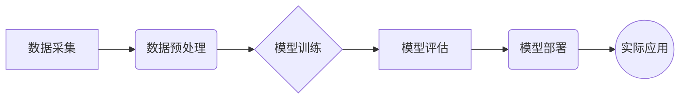

## 1. 背景介绍

### 1.1 大数据时代的预测需求
在当今大数据时代，各行各业都积累了海量的数据，如何从这些数据中挖掘有价值的信息并预测未来趋势成为了至关重要的课题。机器学习作为一种强大的数据分析工具，能够帮助我们从海量数据中提取模式，建立预测模型，并应用于各种实际场景。

### 1.2 Hive在大数据生态系统中的角色
Hive是一个建立在Hadoop之上的数据仓库工具，它提供了一种类似SQL的查询语言(HiveQL)，使得用户能够方便地进行数据分析和处理。Hive具有良好的可扩展性和容错性，能够处理PB级的数据，因此被广泛应用于大数据领域。

### 1.3 Hive与机器学习的结合
Hive本身并不提供机器学习算法的实现，但它可以与其他机器学习框架，如Spark MLlib、Mahout等进行集成，从而实现大规模数据的机器学习任务。通过将数据存储在Hive中，并使用HiveQL进行数据预处理和特征提取，然后将处理后的数据传递给机器学习框架进行模型训练和预测，可以有效地提高机器学习的效率和可扩展性。

## 2. 核心概念与联系

### 2.1 机器学习基本概念
* **监督学习:** 从已知标签的数据中学习，构建能够预测未知数据标签的模型，例如分类和回归问题。
* **无监督学习:** 从无标签数据中学习，发现数据中的模式和结构，例如聚类和降维问题。
* **特征工程:** 将原始数据转化为机器学习算法能够理解的特征向量，例如数值化、归一化、离散化等操作。
* **模型训练:** 使用训练数据对模型进行参数调整，使其能够更好地拟合数据。
* **模型评估:** 使用测试数据评估模型的性能，例如准确率、召回率、F1值等指标。

### 2.2 Hive中的机器学习相关组件
* **HiveQL:** 用于数据预处理和特征提取的查询语言。
* **UDF:** 用户自定义函数，可以扩展HiveQL的功能，例如实现自定义的特征提取逻辑。
* **SerDe:** 序列化/反序列化器，用于将Hive中的数据转换为机器学习框架能够处理的格式。

### 2.3 Hive与机器学习框架的集成
* **Spark MLlib:** Spark的机器学习库，提供丰富的机器学习算法和工具。
* **Mahout:** 基于Hadoop的机器学习库，提供可扩展的机器学习算法实现。
* **其他框架:** Hive还可以与其他机器学习框架，如TensorFlow、PyTorch等进行集成，以满足不同的需求。

## 3. 核心算法原理具体操作步骤

### 3.1 数据预处理
* **数据清洗:** 处理缺失值、异常值、重复值等。
* **数据转换:** 将数据转换为合适的格式，例如数值化、归一化、离散化等。
* **特征选择:** 选择与目标变量相关的特征。

#### 3.1.1 HiveQL数据清洗示例
```sql
-- 处理缺失值
SELECT * FROM table WHERE column IS NOT NULL;

-- 处理异常值
SELECT * FROM table WHERE column BETWEEN lower_bound AND upper_bound;

-- 处理重复值
SELECT DISTINCT * FROM table;
```

#### 3.1.2 HiveQL数据转换示例
```sql
-- 数值化
SELECT CAST(column AS DOUBLE) FROM table;

-- 归一化
SELECT (column - MIN(column)) / (MAX(column) - MIN(column)) FROM table;

-- 离散化
SELECT CASE WHEN column < threshold THEN 'low' ELSE 'high' END FROM table;
```

#### 3.1.3 HiveQL特征选择示例
```sql
-- 使用相关系数选择特征
SELECT corr(column1, target_variable), corr(column2, target_variable), ... FROM table;
```

### 3.2 模型训练

* **选择合适的机器学习算法:** 根据问题的类型和数据的特点选择合适的算法，例如分类问题可以使用逻辑回归、决策树、支持向量机等算法，回归问题可以使用线性回归、随机森林等算法。
* **设置算法参数:** 根据经验或网格搜索等方法调整算法参数，以获得最佳性能。
* **训练模型:** 使用训练数据对模型进行参数调整，使其能够更好地拟合数据。

#### 3.2.1 Spark MLlib模型训练示例
```python
from pyspark.ml.classification import LogisticRegression

# 加载数据
data = spark.read.csv("data.csv", header=True, inferSchema=True)

# 创建逻辑回归模型
lr = LogisticRegression(featuresCol="features", labelCol="label")

# 训练模型
model = lr.fit(data)
```

### 3.3 模型评估
* **使用测试数据评估模型性能:** 使用测试数据评估模型的性能，例如准确率、召回率、F1值等指标。
* **选择最佳模型:** 根据评估结果选择性能最佳的模型。

#### 3.3.1 Spark MLlib模型评估示例
```python
from pyspark.ml.evaluation import BinaryClassificationEvaluator

# 加载测试数据
test_data = spark.read.csv("test_data.csv", header=True, inferSchema=True)

# 使用模型进行预测
predictions = model.transform(test_data)

# 评估模型性能
evaluator = BinaryClassificationEvaluator(rawPredictionCol="rawPrediction", labelCol="label")
auc = evaluator.evaluate(predictions)

print("AUC:", auc)
```

## 4. 数学模型和公式详细讲解举例说明

### 4.1 线性回归
线性回归是一种用于建立自变量和因变量之间线性关系的模型。它的数学模型如下：

$$y = \beta_0 + \beta_1 x_1 + \beta_2 x_2 + ... + \beta_n x_n + \epsilon$$

其中，$y$ 是因变量，$x_1, x_2, ..., x_n$ 是自变量，$\beta_0, \beta_1, \beta_2, ..., \beta_n$ 是回归系数，$\epsilon$ 是误差项。

#### 4.1.1 线性回归示例
假设我们要预测房价，我们可以使用房屋面积、卧室数量、浴室数量等作为自变量，房价作为因变量，建立一个线性回归模型。

### 4.2 逻辑回归
逻辑回归是一种用于预测二元变量的模型。它的数学模型如下：

$$p = \frac{1}{1 + e^{-(\beta_0 + \beta_1 x_1 + \beta_2 x_2 + ... + \beta_n x_n)}}$$

其中，$p$ 是事件发生的概率，$x_1, x_2, ..., x_n$ 是自变量，$\beta_0, \beta_1, \beta_2, ..., \beta_n$ 是回归系数。

#### 4.2.1 逻辑回归示例
假设我们要预测用户是否会点击广告，我们可以使用用户的年龄、性别、浏览历史等作为自变量，用户是否点击广告作为因变量，建立一个逻辑回归模型。

## 5. 项目实践：代码实例和详细解释说明

### 5.1 数据集介绍
本项目使用UCI机器学习库中的Adult数据集进行演示。该数据集包含48842条记录，每条记录包含15个属性，例如年龄、工作类别、教育程度、婚姻状况、种族、性别等，目标变量是收入水平，分为“>50K”和“<=50K”两类。

### 5.2 HiveQL数据预处理
```sql
-- 创建Hive表
CREATE TABLE adult (
  age INT,
  workclass STRING,
  fnlwgt INT,
  education STRING,
  education_num INT,
  marital_status STRING,
  occupation STRING,
  relationship STRING,
  race STRING,
  sex STRING,
  capital_gain INT,
  capital_loss INT,
  hours_per_week INT,
  native_country STRING,
  income STRING
)
ROW FORMAT DELIMITED
FIELDS TERMINATED BY ','
STORED AS TEXTFILE;

-- 加载数据
LOAD DATA LOCAL INPATH 'adult.data' INTO TABLE adult;

-- 数据清洗
SELECT * FROM adult WHERE age IS NOT NULL AND workclass != '?' AND education != '?' AND marital_status != '?' AND occupation != '?' AND relationship != '?' AND race != '?' AND sex != '?' AND capital_gain IS NOT NULL AND capital_loss IS NOT NULL AND hours_per_week IS NOT NULL AND native_country != '?' AND income != '?';

-- 数据转换
SELECT
  age,
  CASE workclass
    WHEN 'Federal-gov' THEN 1
    WHEN 'Local-gov' THEN 2
    WHEN 'Never-worked' THEN 3
    WHEN 'Private' THEN 4
    WHEN 'Self-emp-inc' THEN 5
    WHEN 'Self-emp-not-inc' THEN 6
    WHEN 'State-gov' THEN 7
    WHEN 'Without-pay' THEN 8
  END AS workclass,
  education_num,
  CASE marital_status
    WHEN 'Divorced' THEN 1
    WHEN 'Married-AF-spouse' THEN 2
    WHEN 'Married-civ-spouse' THEN 3
    WHEN 'Married-spouse-absent' THEN 4
    WHEN 'Never-married' THEN 5
    WHEN 'Separated' THEN 6
    WHEN 'Widowed' THEN 7
  END AS marital_status,
  CASE occupation
    WHEN 'Adm-clerical' THEN 1
    WHEN 'Armed-Forces' THEN 2
    WHEN 'Craft-repair' THEN 3
    WHEN 'Exec-managerial' THEN 4
    WHEN 'Farming-fishing' THEN 5
    WHEN 'Handlers-cleaners' THEN 6
    WHEN 'Machine-op-inspct' THEN 7
    WHEN 'Other-service' THEN 8
    WHEN 'Priv-house-serv' THEN 9
    WHEN 'Prof-specialty' THEN 10
    WHEN 'Protective-serv' THEN 11
    WHEN 'Sales' THEN 12
    WHEN 'Tech-support' THEN 13
    WHEN 'Transport-moving' THEN 14
  END AS occupation,
  CASE relationship
    WHEN 'Husband' THEN 1
    WHEN 'Not-in-family' THEN 2
    WHEN 'Other-relative' THEN 3
    WHEN 'Own-child' THEN 4
    WHEN 'Unmarried' THEN 5
    WHEN 'Wife' THEN 6
  END AS relationship,
  CASE race
    WHEN 'Amer-Indian-Eskimo' THEN 1
    WHEN 'Asian-Pac-Islander' THEN 2
    WHEN 'Black' THEN 3
    WHEN 'Other' THEN 4
    WHEN 'White' THEN 5
  END AS race,
  CASE sex
    WHEN 'Female' THEN 0
    WHEN 'Male' THEN 1
  END AS sex,
  capital_gain,
  capital_loss,
  hours_per_week,
  CASE income
    WHEN '<=50K' THEN 0
    WHEN '>50K' THEN 1
  END AS income
FROM adult;
```

### 5.3 Spark MLlib模型训练和评估
```python
from pyspark.ml.classification import LogisticRegression
from pyspark.ml.evaluation import BinaryClassificationEvaluator

# 加载数据
data = spark.read.csv("adult_processed.csv", header=True, inferSchema=True)

# 将数据拆分为训练集和测试集
train_data, test_data = data.randomSplit([0.7, 0.3], seed=123)

# 创建逻辑回归模型
lr = LogisticRegression(featuresCol="features", labelCol="income")

# 训练模型
model = lr.fit(train_data)

# 使用模型进行预测
predictions = model.transform(test_data)

# 评估模型性能
evaluator = BinaryClassificationEvaluator(rawPredictionCol="rawPrediction", labelCol="income")
auc = evaluator.evaluate(predictions)

print("AUC:", auc)
```

## 6. 实际应用场景

### 6.1 金融风控
利用机器学习技术可以分析用户的信用历史、消费记录、社交关系等数据，预测用户违约风险，帮助金融机构进行风险控制。

### 6.2 电商推荐
利用机器学习技术可以分析用户的购买历史、浏览记录、搜索关键词等数据，预测用户感兴趣的商品，向用户推荐个性化的商品，提高电商平台的销售额。

### 6.3 医疗诊断
利用机器学习技术可以分析患者的病历、影像学检查结果、基因数据等数据，预测患者患病风险，辅助医生进行疾病诊断和治疗方案制定。

## 7. 工具和资源推荐

### 7.1 Apache Hive
* 官方网站: https://hive.apache.org/
* 文档: https://cwiki.apache.org/confluence/display/Hive/Home

### 7.2 Apache Spark
* 官方网站: https://spark.apache.org/
* 文档: https://spark.apache.org/docs/latest/

### 7.3 Spark MLlib
* 官方网站: https://spark.apache.org/mllib/
* 文档: https://spark.apache.org/docs/latest/ml-guide.html

## 8. 总结：未来发展趋势与挑战

### 8.1 未来发展趋势
* **深度学习与Hive的结合:** 深度学习作为一种强大的机器学习技术，在图像识别、语音识别、自然语言处理等领域取得了显著成果。将深度学习与Hive结合，可以实现更大规模、更复杂的数据分析和预测任务。
* **自动化机器学习:** 自动化机器学习旨在简化机器学习流程，降低机器学习的门槛，让更多人能够使用机器学习技术。
* **实时机器学习:** 实时机器学习是指在数据产生时就进行模型训练和预测，以应对快速变化的数据环境。

### 8.2 挑战
* **数据质量:** 机器学习模型的性能依赖于数据的质量，因此数据清洗、转换、特征选择等工作至关重要。
* **模型解释性:** 许多机器学习模型的内部机制难以理解，这给模型的应用带来了一定的风险。
* **数据隐私和安全:** 机器学习模型的训练和应用需要访问大量数据，因此数据隐私和安全问题需要得到重视。


## 9. 附录：常见问题与解答

### 9.1 HiveQL如何实现数据清洗？
HiveQL提供了一系列函数和操作符，可以用于数据清洗，例如：
* **IS NULL:** 判断字段是否为空值。
* **IS NOT NULL:** 判断字段是否非空值。
* **BETWEEN:** 判断字段是否在指定范围内。
* **DISTINCT:** 去除重复值。

### 9.2 如何选择合适的机器学习算法？
选择合适的机器学习算法需要考虑以下因素：
* **问题的类型:** 分类问题、回归问题、聚类问题等。
* **数据的特点:** 数据规模、数据维度、数据分布等。
* **算法的性能:** 准确率、召回率、F1值等。

### 9.3 如何评估机器学习模型的性能？
评估机器学习模型的性能可以使用以下指标：
* **准确率:** 正确预测的样本数占总样本数的比例。
* **召回率:** 正确预测的正样本数占实际正样本数的比例。
* **F1值:** 准确率和召回率的调和平均值。


## 10.  Mermaid流程图


